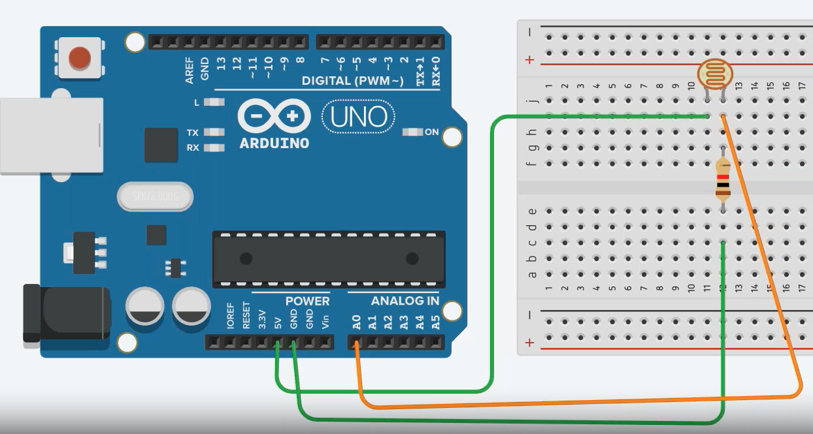

# LDR

Light Dependent Resistor

Output $\in [0, 1023]$
$$
\begin{aligned}
R &\propto \dfrac{1}{L_V} \\
\implies I &\propto L_V
\end{aligned}
$$
where

- $R =$ Resistance
- $L_V =$ Intensity of incident light
- $I =$ Current

## Applications

- Smart street lights
- Auto-brightness on Phone

No polarity, as resistors don’t have any polarity

## Connection




## Code

```cpp
int reading;

void setup(){
  pinMode(A0, INPUT); // LDR
  pinMode(D2, OUTPUT); // LED
  
  
  Serial.begin(9600);
}
void loop(){
  reading = analogRead(A0);
  
  Serial.println(reading);
  
  // if incident light too low -> environment too dark
  // then turn on output light
  if (reading < 50){
    digitalWrite(D2, HIGH);
  }
  else {
    digitalWrite(D2, LOW);
  }
  
  delay(500);
}
```


