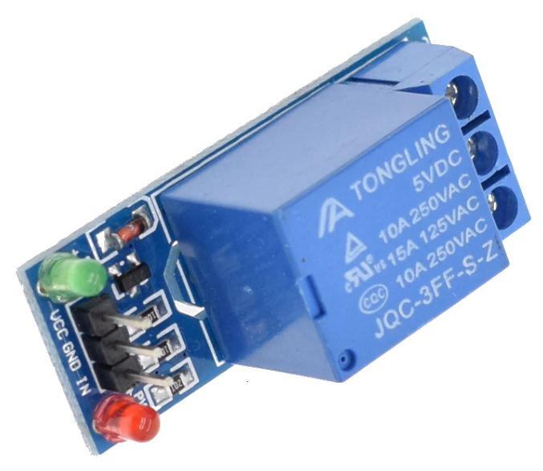
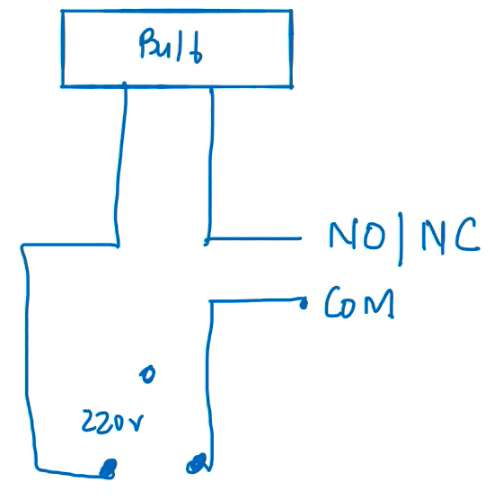

# Relay

Electromagnetic switch

Working principle: Electromagnetic induction

Be careful when working with relays, as they may short-circuit. Don’t touch the back side and don’t keep it near other conductors and electronics

## Pins

- VCC: +5v
- GND
- IN: Input (D2)
- NC: Normally-closed/connected
- NO: Normally-open
- COM: Common

Internal connections

- NC & COM with spring
- NO & IN

| IN   | NO                    | NC - COM                              | NO - COM  |
| ---- | --------------------- | ------------------------------------- | --------- |
| On   | Behaves like a magnet | Break                                 | Attracted |
| Off  | No effect             | Revert Makes a ‘tick-tick’ sound | Break     |

If there is no ‘tick-tick’ sound, then the relay isn’t getting sufficient voltage