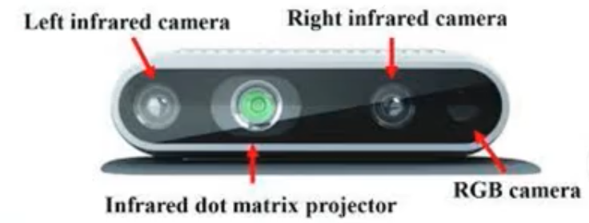

# Stereo Cameras

Single camera/ordinary multi-camera system can only help in basic obstacle detection/surround view. However, in order to measure depth to infer and analyze distance between objects, cameras ned to act as a stereo pair

Usually contain 2 cameras placed horizontally next to each other. It helps cameras to view the same area and assess the depth and distance of the object using pixel disparity technique.

They are often paired with LiDar sensor to improve reliability and accuracy.

