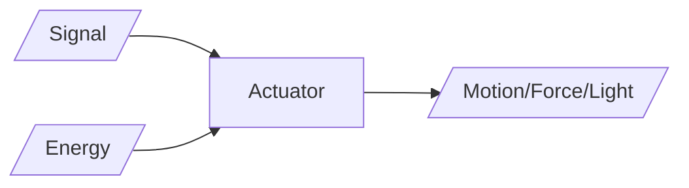

# Devices

## Sensors (Input)

Devices that
- detect the state of a physical environment
- quantitatively provide a corresponding output as an electrical/optical signal

## Characteristics of Sensors

|         | Meaning                                                                                                |                     |                                                                                                    |
| ------- | ------------------------------------------------------------------------------------------------------ | ------------------- | -------------------------------------------------------------------------------------------------- |
| Static  | After steady state condition, how the output of a sensor change in response to input change            | Range               | Highest and lowest value that can be sensed                                                        |
|         |                                                                                                        | Resolution          | Smallest change in input that can be sensed                                                        |
|         |                                                                                                        | Sensitivity         | Ratio of incremental change in response of system wrt incremental change in input                  |
|         |                                                                                                        | Error               | Difference between true and measured value  $u = y_m-y$                                      |
|         |                                                                                                        | Accuracy            | $1-E[u]$                                                                                           |
|         |                                                                                                        | Precision           | $\sigma(u)$                                                                                        |
|         |                                                                                                        | Linearity           | Deviation of sensor curve from particular straight line                                            |
|         |                                                                                                        | Drift               | Difference in measurements from a specific reading when kept at that value for long period of time |
|         |                                                                                                        | Repeatability       | Deviation between measurements in a sequence under same conditions                                 |
| Dynamic | Properties of system's transient response to input  How well sensor responds to changes in input | Zero-order system   | Output shows a response to input signal with no delay                                              |
|         |                                                                                                        | First-order system  | Output approaches final value gradually                                                            |
|         |                                                                                                        | Second-order system | Output response oscillates before steady state                                                     |

## Classification

| Aspect                | Class   | Meaning                          | Example                                                      |
| --------------------- | ------- | -------------------------------- | ------------------------------------------------------------ |
| Activity              | Passive | Cannot independently sense input | Accelerometer Temperature Water-level Soil moisture |
|                       | Active  | Can independently sense input    | Radar Sounder Laser altimeter                          |
| Signal Type           | Analog  |                                  |                                                              |
|                       | Digital |                                  |                                                              |
| Direction of Quantity | Scalar  | Only magnitude                   | Speedometer                                                  |
|                       | Vector  | Magnitude and direction          | Accelerometer Gyroscope                                   |

### Sensor Fusion

Combining measurements of the same quantity from multiple sensors, to obtain a combined information with lower uncertainty than any of the individual sensors. Using multiple sensors for the quantity also allows us to verify each sensor wrt others.

If we have $s$ sensors,
$$
\begin{aligned}
\mu_\text{S} &=
\left( \sum \limits_s^S \dfrac{\mu_s}{\sigma^2_s} \right) \sigma^2_{S} \\
\sigma^2_\text{S} &=
\dfrac{1}{\sum \limits_s^S \dfrac{1}{\sigma^2_s} }
\end{aligned}
$$
where $S$ refers to the combination of all the sensors

## Effectors (Output)

Devices that perform some action such as emitting light, sound, motor, etc

## Sensors
- Motion
	- Gyroscope
	- Radar
	- Magnetometer
	- Accelerometer
- Acoustic
	- Ultrasonic
	- Microphones
	- Geophones
	- Vibrometers
- Environmental
	- Temperature
	- Humidity
	- Pressure
	- Infrared
- Touch sensors
	- Capacitive
	- Infrared
- Image Sensors
	- Thermal
	- Camera
- Biometric
	- Fingerprint
	- Heart rate
	- Face recognition
- Force sensors
	- Pressure
	- Strain
- Rotation sensors
	- Encoders

## Actuator

- Motor
- Valve controller
- LED light

### Classification

| Class       | Subclass | Example                      |
| ----------- | -------- | ---------------------------- |
| Electric    | Linear   | Electric Bell                |
|             | Rotatory | Motor                        |
| Fluid Power | Linear   | Cylinder, Piston             |
|             | Rotary   | Cylinder, Piston             |
| Chain       | Linear   | Sprockets, sections of chain |
| Manual      | Linear   | Gearboxes Wheels          |
|             | Rotatory | Levers Handwheels         |
