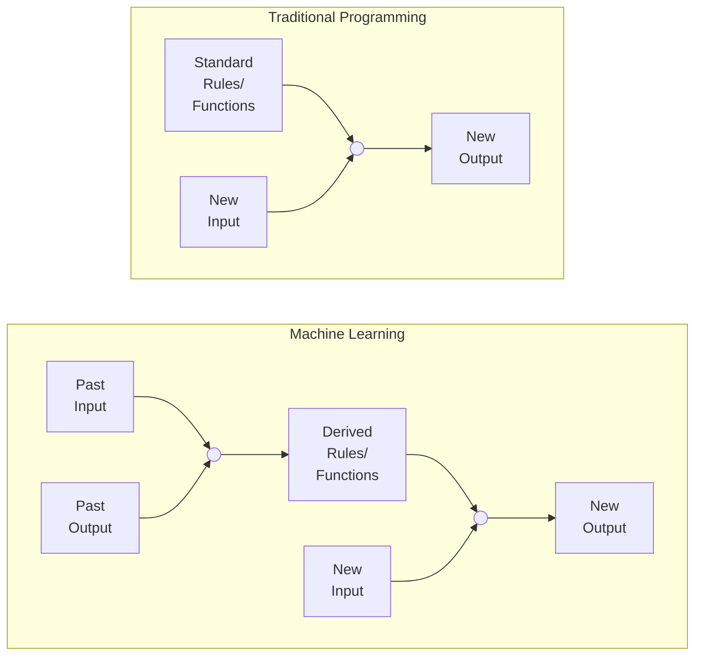
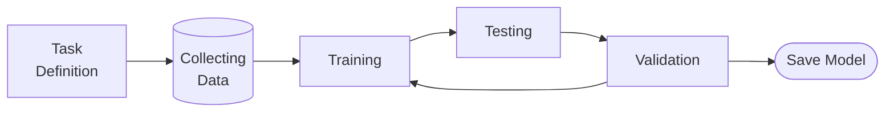

This introductory page is a big long, but that's because all the below concepts are common to every upcoming topic.

## Machine Learning

Subfield of pattern recognition and computational learning theory in artificial intelligence.

> Field of study that gives the computer the ability to learn without being explicitly programmed
>
> ~ Arthur Samuel

> Computer program is said to learn from experience E with respect to some class of tasks T and performance measure P, if its performance at tasks T, as measured by P, improves with experience E.
>
> ~ Tom Mitchell

> Machine Learning is programming computers to optimize a performance criterion using example data or past experience.
>
> ~ Ethem Alpyadin

## Why do we need ML?

To perform tasks which are easy for humans, but difficult to generate a computer program for it.

## Stages of ML

## Open-source Tools

|              |      |
| ------------ | ---- |
| Scikit-Learn |      |
| TensorFLow   |      |
| Keras        |      |
| PyTorch      |      |
| MXNet        |      |
| CNTK         |      |
| Caffe        |      |
| PaddlePaddle |      |
| Weka         |      |

