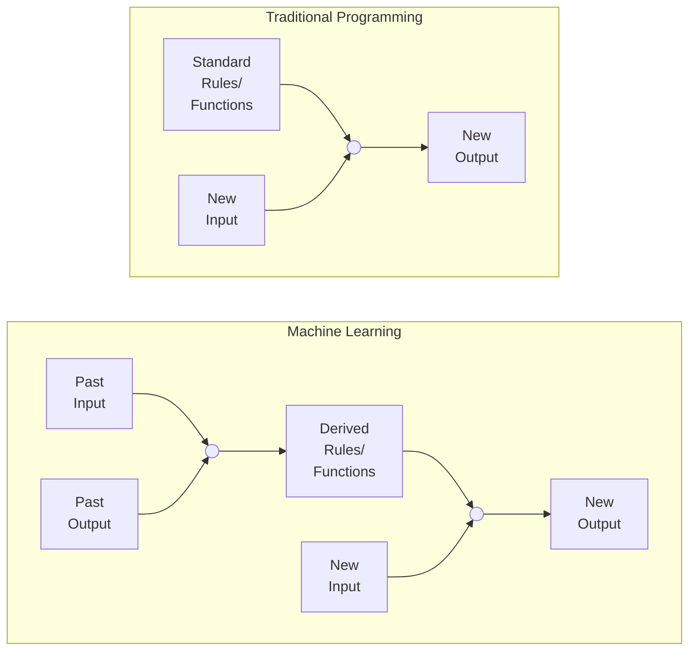
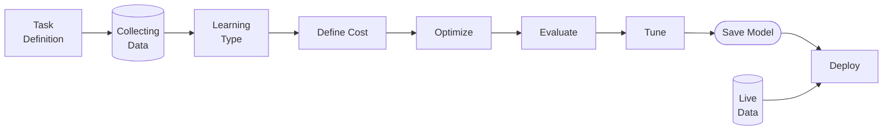

# Introduction

This introductory page is a big long, but that's because all the below concepts are common to every upcoming topic.

## Machine Learning

Field of study that enables computers to learn without being explicitly programmed; machine learns how to perform task $T$ from experience $E$ with performance measure $P$.

Machine learning is necessary when it is not possible for us to make rules, ie, easier for the machine to learn the rules on its own

## Why do we need ML?

To perform tasks which are easy for humans, but difficult to generate a computer program for it.

## Stages of ML

## Open-source Tools

|              |      |
| ------------ | ---- |
| Scikit-Learn |      |
| TensorFLow   |      |
| Keras        |      |
| PyTorch      |      |
| MXNet        |      |
| CNTK         |      |
| Caffe        |      |
| PaddlePaddle |      |
| Weka         |      |

