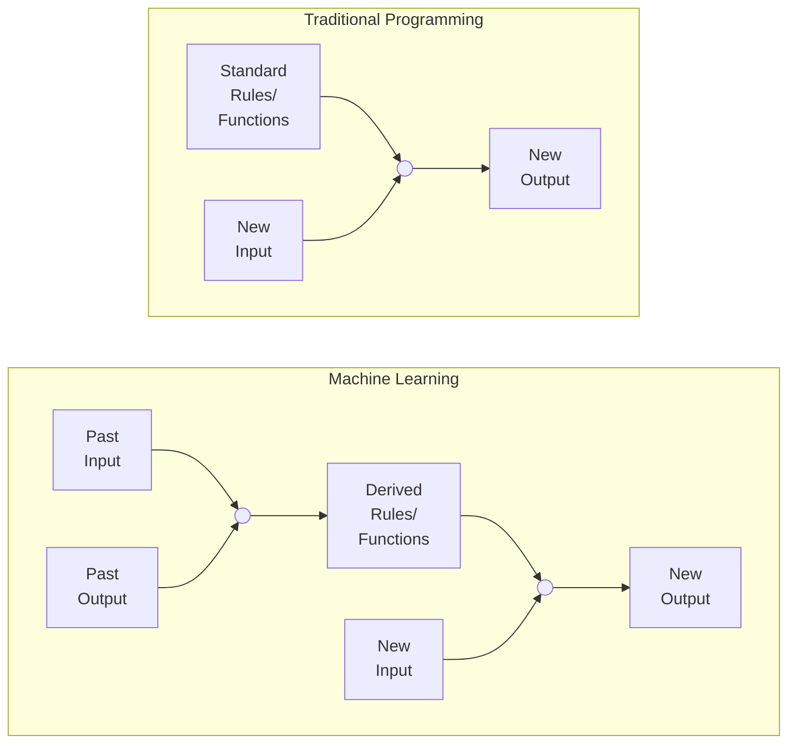

This introductory page is a big long, but that's because all the below concepts are common to every upcoming topic.

## Machine Learning

Subfield of pattern recognition and computational learning theory in artificial intelligence.

> Field of study that gives the computer the ability to learn without being explicitly programmed
>
> ~ Arthur Samuel

> Computer program is said to learn from experience E with respect to some class of tasks T and performance measure P, if its performance at tasks T, as measured by P, improves with experience E.
>
> ~ Tom Mitchell

> Machine Learning is programming computers to optimize a performance criterion using example data or past experience.
>
> ~ Ethem Alpyadin

## Why do we need ML?

To perform tasks which are easy for humans, but difficult to generate a computer program for it.

## Stages of ML

## Task $T$

Process of learning itself is not the task; learning is the means of attaining ability to perform the task

Usually described in terms of how the machine
learning system should process an instance (collection of features), which is usually represented as a vector.

|                                  |                                                              | Function Mapping           | Example                                                      |
| -------------------------------- | ------------------------------------------------------------ | -------------------------- | ------------------------------------------------------------ |
| Regression                       | Predicting a continuous numerical output                     | $R^n \to R$                | Stock value prediction                                       |
| Classification                   | Categorizing input into a discrete output or outputing a probability dist over classes Derived from regression | $R^n \to \{1, \dots, k \}$ | Categorizing images Fraud detection                     |
| Classification w/ missing inputs | Learn distribution over all variables, solve by marginalizing over missing variables | $R^n \to \{1, \dots, k \}$ |                                                              |
| Clustering                       | Grouping inputs into clusters                                |                            | Grouping similar images                                      |
| Transcription                    | Convert unstructured data intro discrete textual form        |                            | OCR Speech Recognition                                  |
| Machine Translation              | Convert it into a sequence of symbols into another language |                            | Natural Language Translation                                 |
| Structured Output                | Output data structure has relationships between elements |                            | Parsing Image segmentation Image captioning        |
| Anomaly Detection                | Identify abnormal events                                     |                            | Fraud detection                                              |
| Synthesis & Sampling             | Generate new samples similar to those in training data   |                            | Texture generation Speech synthesis Supersampling images |
| Data Imputation                  | Predict values of missing entries                            |                            |                                                              |
| Denoising                        | Predict clean output from corrupt input                      |                            | Image/Video denoising                                        |
| Density Estimation               | Identify underlying probability distribution of set of inputs |                            |                                                              |

## Learning Experience $E$

Training

### Data

Data can be structured/unstructured

Usually represented as a design matrix

- Each column = feature
- Each row = instance

Train-Test Split is usually 80-20

#### Multi-Dimensional Data

can be hard to work with as

- requires more computing power
- harder to interpret
- harder to visualize

#### Feature Selection

#### Dimension Reduction

Using Principal Component Analysis

Deriving simplified features from existing features

Easy example: using area instead of length and breadth.

### Model

A functional mapping between input and output

|         | Parametric                                                   | Non-Parametric                              |
| ------- | ------------------------------------------------------------ | ------------------------------------------- |
|         | Learn a function described by a parameter whose size is finite & fixed before data is observed | Complexity is function of training set size |
| Example | Linear Regression                                            | Nearest Neighbor                            |

### Learning Types

|                        |                                                              | Application  |
| ---------------------- | ------------------------------------------------------------ | ------------ |
| Supervised             | Uses labelled data, to derive a mapping between input examples and target variable. |              |
| Unsupervised           | Learning from unlabelled data                                |              |
| Semi-Supervised        | There exists some amount of labelled data and large amount of unlabelled data. We can label the unlabelled data using the labelled data.  For example, **love** is labelled as emotion, but **lovely** isn’t  Cotraining, Semi-Supervised SVM |              |
| Lazy/Instance-Based    | Store the training examples instead of training explicit description of the target function.  Output of the learning algorithm for a new instance not only depends on it, but also on its neighbors.  The best algorithm is KNN (K-Nearest Neighbor) Algorithm.  Useful for recommender system. |              |
| Active                 | Learning system is allowed to choose the data from which it learns. There exists a human annotator.  Useful for gene expression/cancer classification |              |
| Multiple Instance      | Weakly supervised learning where training instances are arranged in sets. Each set has a label, but the instances don’t |              |
| Transfer               | Reuse a pre-trained model as the starting point for a model on a new related task |              |
| Reinforcement Learning | Learning in realtime, from experience of interacting in the environment, without any fixed input dataset. It is similar to a kid learning from experience.  Best algorithm is **Q-Learning algorithm**. | Game playing |
| Bayesian Learning      | Conditional-probabilistic learning tool, where each observed training expmle can incrementally inc/dec the estimated probability that a hypothesis is correct.  Useful when there is chance of false positive. For eg: Covid +ve |              |
| Deep Learning          |                                                              |              |

## Performance Measure $P$

Testing

- Accuracy
- Precision
- Recall
- F1-Score

|            | Meaning               |
| ---------- | --------------------- |
| Evaluation | In sample testing     |
| Validation | Out of Sample Testing |

### Error Evaluation Metrics

Cost Functions/Loss Functions

Helps measuring accuracy, which depends on amount of prediction errors.

|       Metric       | Full Form                    |                           Formula                            | Preferred Value |
| :----------------: | ---------------------------- | :----------------------------------------------------------: | :-------------: |
|        MAE         | Mean Absolute Error          |       $\frac{1}{n} \sum_{i=1}^n \| \hat y_i - y_i \|$        |  $\downarrow$   |
|        MSE         | Mean Squared Error           |        $\frac{1}{n} \sum_{i=1}^n (\hat y_i - y_i)^2$         |  $\downarrow$   |
|        RMSE        | Root Mean Square Error       |     $\sqrt{\frac{1}{n} \sum_{i=1}^n (\hat y_i - y_i)^2}$     |  $\downarrow$   |
|        RAE         | Relative Absolute Error      | $\dfrac{\sum_{i=1}^n \| \hat y_i - y_i \|}{\sum_{i=1}^n \| \bar y - y_i \|}$ |  $\downarrow$   |
|        RSS         | Residual Sum of Squares      | $\sum_{i=1}^n \left( y_i - \left( \beta_0 + \sum_{j=1}^m \beta_j x_{ij} \right) \right)^2$ |                 |
|        RSE         | Relative Square Error        | $\dfrac{\sum_{i=1}^n  (\hat y_i - y_i)^2 }{\sum_{i=1}^n (\bar y - y_i)^2 }$ |                 |
|       $R^2$        | Coefficient of Determination |                       $1 - \text{RSE}$                       |   $\uparrow$    |
| Cross Entropy |                              |        $-\sum\limits_{x \in X} P(x) \cdot \log Q(x)$         |  $\downarrow$   |
|       Bayes        |                              |               Error incurred by an ideal model               |  $\downarrow$   |
|        SEE         | Standard Error of Estimate   |          $\sqrt{\dfrac{ \sum(\hat y - y)^2}{n-2}}$           |  $\downarrow$   |

Ideal model is one that making predictions from true distribution $P(x,y)$; even such a model incurs some error due to noise/overlap in the distributions

### Bias & Variance

We want **low value** of both

|         |              Bias               |                       Variance                        |
| :-----: | :-----------------------------: | :---------------------------------------------------: |
| Meaning | Error rate of the training data |            Error rate of the testing data             |
| Formula |         $E[\hat y] - y$         | $E \Bigg[ \ \Big(\hat y - E[\hat y] \ \Big)^2 \Bigg]$ |

$$
\text{MSE} = \text{Bias}^2 + \text{Variance} + \text{Bayes Error}
$$

### Generalization

The ability of trained model to be able to perform well on unseen inputs. Better validation result $\implies$ Better generalization

#### Generalization & Training Size

Generalization improves with size of training set, until a saturation point, after which it stops improving.

|                | More data $\implies$                                        |
| -------------- | ----------------------------------------------------------- |
| Parametric     | asymptote to an error value exceeding Bayes error           |
| Non-Parametric | better generalization until best possible error is achieved |

### Fitting & Capacity

We can control the fitting of a model, by changing hypothesis space, and hence changing its capacity

|                       | Under-fitting                                                | Appropriate-Fitting | Over-Fitting                                                 |
| --------------------- | ------------------------------------------------------------ | ------------------- | ------------------------------------------------------------ |
| Capacity              | Low                                                          | Appropriate         | Low                                                          |
| Bias                  | ⬆️                                                            | ⬇️                   | ⬇️                                                            |
| Variance              | ⬇️                                                            | ⬇️                   | ⬆️                                                            |
| Steps to address | Increase model complexity Increase training data Remove noise from data Inc no of features |                     | Cross-Validation More training data Feature Reduction Early Stopping Regularization |

The capacity of a model increases with increased [degree of polynomial](#degree of polynomial)

### Techniques to address fitting

#### Regularization

Reduce errors by fitting the function appropriately on the given training set, to help reduce variance, and hence avoid overfitting, while not affecting bias.

This is done by adding a penalty term in the error function.

|                |                   $L_1$                   |                    $L_2$                    | $L_3$                                                        |
| -------------- | :---------------------------------------: | :-----------------------------------------: | ------------------------------------------------------------ |
| Common Name    |                   Lasso                   |                    Rigde                    | Lasso-Ridge                                                  |
|                |     Eliminates feature(s) completely      | Reduce/Normalize the effect of each feature |                                                              |
|                |        Helps in feature selection         |         Scale down the coefficients         |                                                              |
| Error Function | $RSS + \lambda \sum_{j=1}^m \|\beta_i \|$ |   $RSS + \lambda \sum_{j=1}^m \beta_i ^2$   | $RSS + \lambda_1 \sum_{j=1}^m  + \lambda_2 \sum_{j=1}^m \beta_i ^2$ |

#### Bias-Variance Tradeoff

#### Inc/Dec Capacity

Relationship between error & capacity is usually U-Shaped

## Theories

### Statistical Learning Theory

Helps understand performance when we observe only the training set, through assumptions about training and test sets

- Training/test data arise from same process
- i.i.d
  - Examples in each data set are independent
  - Training set and testing set are identically distributed
- We call the shared distribution, the data generating distribution $p_\text{data}$

But rarely used in practice with deep learning, as

- bounds are loose
- difficult to determine capacity of deep learning algorithms

### Probably Approximately Correct

[SLT](#Statistical Learning Theory) contradicts basic principles of logic, as according to logic

> To infer a rule describing every member of a set, one
> must have information about every member of the set

ML avoids this problem with probabilistic rules, by finding rules that are probably correct about most members of concerned set

### No-Free Lunch

[PAC](#Probably Approximately Correct) does not entirely resolve contradiction of logic.

No free lunch theorem states

> Averaged over all distributions, every algo has same error classifying unobserved points, ie no ML algo universally better than any other.

## Misc

### Degree of Polynomial

| Degree  | $\hat y =$                    |
| :-----: | ----------------------------- |
|    1    | $w_0 + w_1 x$                 |
|    2    | $w_0 + w_1 x + w_2 x^2$       |
| $\dots$ |                               |
|   $n$   | $\sum\limits_{i=0}^n w_i x^i$ |

### Nom

$| |$ is called as ‘nom’?

$$
||w^2|| = \sum |w^2|
$$

## Hyperparameters

Parameters that affect the prediction of a model.