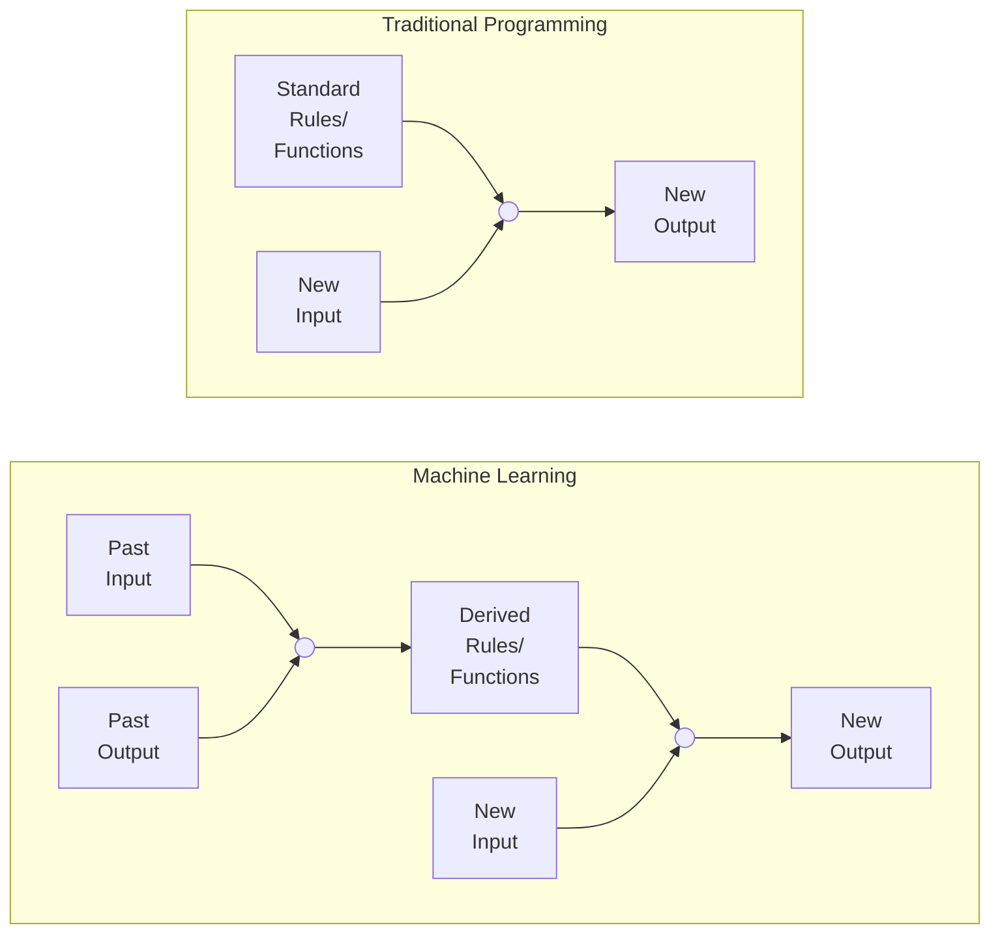
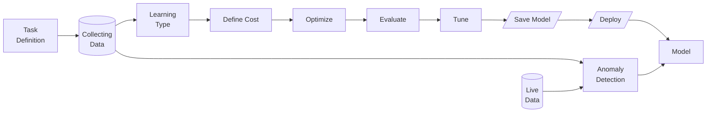

# Introduction

This introductory page is a big long, but that's because all the below concepts are common to every upcoming topic.

## Machine Learning

> Field of study that enables computers to learn without being explicitly programmed; machine learns how to perform task $T$ from experience $E$ with performance measure $P$.

Machine learning is necessary when it is not possible for us to make rules, ie, easier for the machine to learn the rules on its own

## Why do we need ML?

To perform tasks which are easy for humans, but difficult to generate a computer program for it

## Requirements

1. $\exists$ pattern
   - If $\not \exists$ pattern and its just noise, it is impossible to model it
2. We cannot quantify pattern mathematically
3. $\exists$ data

## Guiding Principles

| Principle                     | Questions                                                    |
| ----------------------------- | ------------------------------------------------------------ |
| Relevance                     | Is the use of ML in a given context solving an appropriate problem |
| Representativeness            | Is the training data appropriately selected                  |
| Value                         | - Do the predictions inform human decisions in a meaningful way - Does the machine learning model produce more accurate predictions than alternative methods - Does it explain variation more completely than alternative methods |
| Explainability                | - Data selection, Model selection, (un)intended consequences - How effectively is use of ML communicated |
| Auditability                  | Can the model's decision process be queried/monitored by external actors |
| Equity                        | The model should benefit/harm one group disproportionately   |
| Accountability/Responsibility | Are there mechanisms in place to ensure that someone will be responsible for responding to feedback and redressing harms, if necessary? |

## Learning Problem

Given training examples and hypothesis set of candidate models, generate a hypothesis function using a learning algorithm to estimate an unknown target function

$P(x)$ quantifies relative importance of $x$

Learning model

- Learning algorithm
- Hypothesis set

## Stages of Machine Learning

## 3 Dimensions of Prediction

- Point estimate
- Time
- Probabilistic
  - Intervals
  - Density
  - Trajectories/Scenarios

## Good Prediction Characteristics

- Forecast/Prediction consistency: Forecasts/Predictions should correspond to forecaster’s best judgement on future events, based on the knowledge available at the time of issuing the Forecasts/Predictions
- Forecast/Prediction quality (accuracy): Forecasts/Predictions should describe future events as good as possible, regardless of what these Forecasts/Predictions may be used for
- Forecast/Prediction value: Forecasts/Predictions should bring additional benefits (monetary/others) when used as input to decision-making

Hence, sometimes you may choose the Forecast/Prediction with the better value even if its quality is not the best

## Performance vs Parsimony

- Parsimonious models are more explainable
- Parsimonious models generalize better
  - Small gains with deep models may disappear with dataset shift/non-stationary

## Aspects

| Aspect       | Equivalent in Marco Polo game |
| ------------ | ----------------------------- |
| Loss         | Goal                          |
| Model Class  | Map                           |
| Optimization | Search                        |
| Data         | Sound                         |

## Open-source Tools

|              |      |
| ------------ | ---- |
| Scikit-Learn |      |
| TensorFLow   |      |
| Keras        |      |
| PyTorch      |      |
| MXNet        |      |
| CNTK         |      |
| Caffe        |      |
| PaddlePaddle |      |
| Weka         |      |

## Doesn’t do well for Forecasting

Machine Learning cannot provide *reliable* time-series forecasting, without causal reasoning. This is why AI/ML cannot be blindly trusted for stock price prediction.

Related topics

- Model ends up being a Naive forecaster: just blindly predicts $\hat y_{t+h} = y_t$
- Counter-factual simulation: Never-before-seen events, such as
  - declining house prices
  - Negative oil prices
- Distribution drift
- Turkey problem

In the face of external factors that is not factored into the model, human intervention is required
