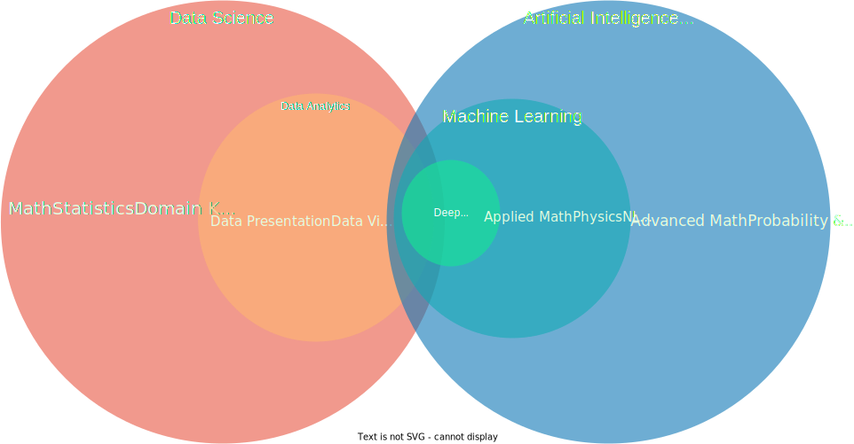
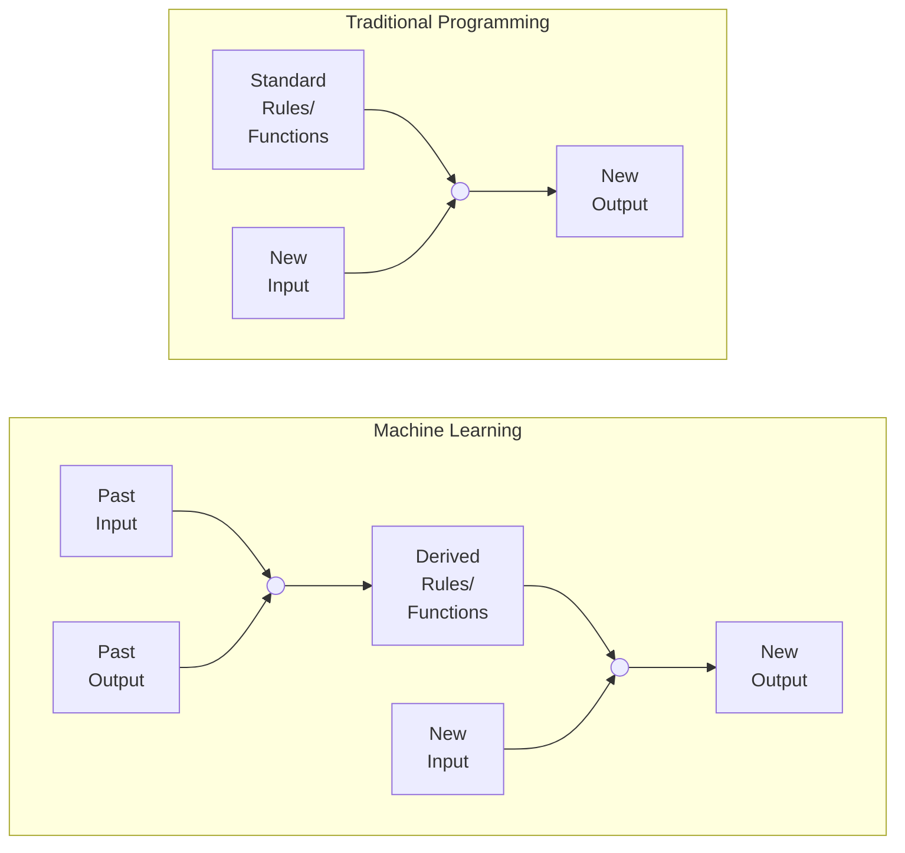
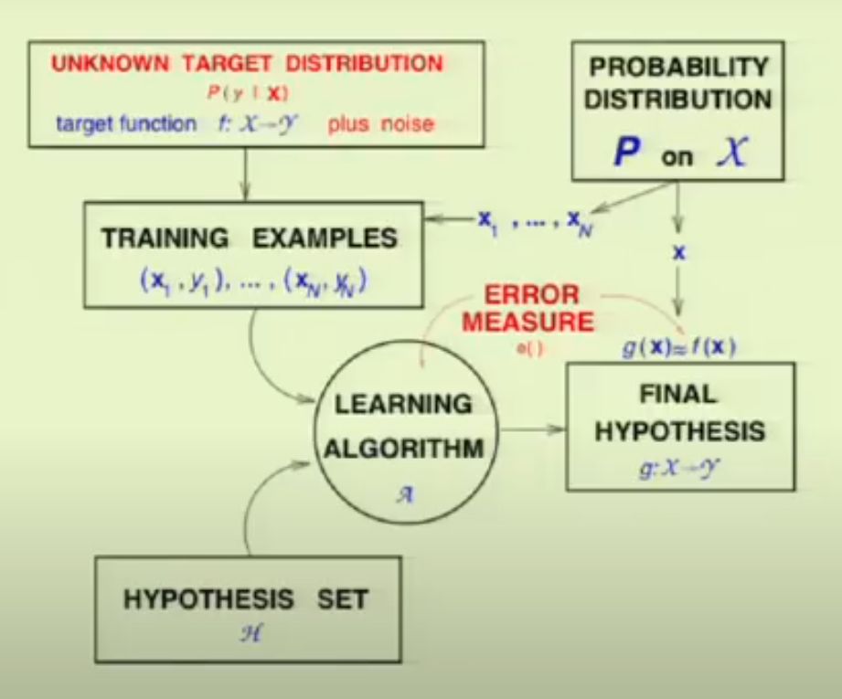
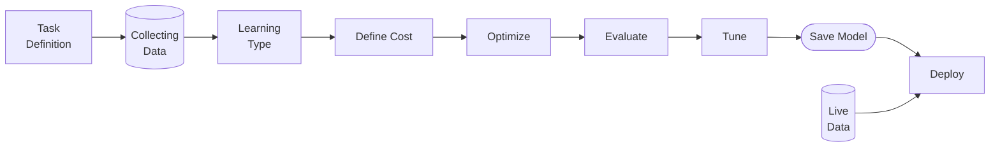

# Introduction

This introductory page is a big long, but that's because all the below concepts are common to every upcoming topic.

## Machine Learning

Field of study that enables computers to learn without being explicitly programmed; machine learns how to perform task $T$ from experience $E$ with performance measure $P$.

Machine learning is necessary when it is not possible for us to make rules, ie, easier for the machine to learn the rules on its own

```mermaid
flowchart LR

subgraph Machine Learning
	direction LR
	i2[Past<br/>Input] & o2[Past<br/>Output] -->
	a(( )) -->
	r2[Derived<br/>Rules/<br/>Functions]
	
	r2 & ni[New<br/>Input] -->
	c(( )) -->
	no[New<br/>Output]
end

subgraph Traditional Programming
	direction LR
	r1[Standard<br/>Rules/<br/>Functions] & i1[New<br/>Input] -->
	b(( )) -->
	o1[New<br/>Output]
end
```

## Why do we need ML?

To perform tasks which are easy for humans, but difficult to generate a computer program for it

## Requirements

1. $\exists$ pattern
   - If $\not \exists$ pattern and its just noise, it is impossible to model it
2. We cannot quantify pattern mathematically
3. $\exists$ data

## Learning Problem

Given training examples and hypothesis set of candidate models, generate a hypothesis function using a learning algorithm to estimate an unknown target function

$P(x)$ quantifies relative importance of $x$

Learning model

- Learning algorithm
- Hypothesis set

## Stages of Machine Learning

```mermaid
flowchart LR
td[Task<br/>Definition] -->
cd[(Collecting<br/>Data)] -->
l[Learning<br/>Type] -->
c[Define Cost] -->
Optimize -->
Evaluate -->
Tune -->
save([Save Model]) -->
Deploy

ld[(Live <br/>Data)] --> Deploy
```

## 3 Dimensions of Prediction

- Point estimate
- Time
- Probabilistic
  - Intervals
  - Density
  - Trajectories/Scenarios

## Good Prediction Characteristics

- Forecast/Prediction consistency: Forecasts/Predictions should correspond to forecaster’s best judgement on future events, based on the knowledge available at the time of issuing the Forecasts/Predictions
- Forecast/Prediction quality (accuracy): Forecasts/Predictions should describe future events as good as possible, regardless of what these Forecasts/Predictions may be used for
- Forecast/Prediction value: Forecasts/Predictions should bring additional benefits (monetary/others) when used as input to decision-making

Hence, sometimes you may choose the Forecast/Prediction with the better value even if its quality is not the best

## Performance vs Parsimony

- Parsimonious models are more explainable
- Parsimonious models generalize better
  - Small gains with deep models may disappear with dataset shift/non-stationary

## Aspects

| Aspect       | Equivalent in Marco Polo game |
| ------------ | ----------------------------- |
| Loss         | Goal                          |
| Algorithm    | Map                           |
| Optimization | Search                        |
| Data         | Sound                         |

## Open-source Tools

|              |      |
| ------------ | ---- |
| Scikit-Learn |      |
| TensorFLow   |      |
| Keras        |      |
| PyTorch      |      |
| MXNet        |      |
| CNTK         |      |
| Caffe        |      |
| PaddlePaddle |      |
| Weka         |      |

## Entropy

> Entropy, as it relates to machine learning, is **a measure of the randomness in the information being processed**. The higher the entropy, the harder it is to draw any conclusions from that information. 
