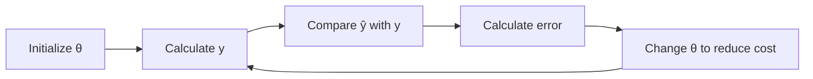
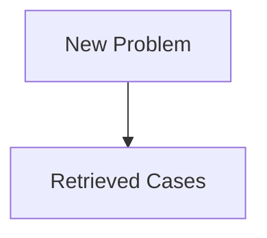

## Classification

deals with categorical data

### Step Function

$$
\hat y =
\begin{cases}
0, & \hat y < 0.5 \\1, & \hat y \ge 0.5
\end{cases}
$$

### Logistic Regression

Using Sigmoid Function

$$
\begin{align}
\hat y
&= \sigma(\theta^T x) \\&= \frac{1}{1 + e^{(\theta^T x)}} \\&= P(y=1|x)
\end{align}
$$

#### Cases to use

1. For 2 classes
     - 0/1
     - Yes/No
     - +ve/-ve
2. Probability of prediction is required
3. Data is linearly-seperable
4. Understand impact of factor?

## Training Process



## Gradient Descent

using derivative of cost function

$$
\theta_{\text{new}} =
\theta_{\text{prv}} -
\eta \ 
{\nabla J}
$$

|                       | Meaning                         |
| --------------------- | ------------------------------- |
| $\theta_{\text{new}}$ |                                 |
| $\theta_{\text{old}}$ |                                 |
| $\eta$                | Learning Rate                   |
| $\nabla J$            | Gradient vector of $J (\theta)$ |

$$
\frac{
\partial J(\theta)
}{
\partial Q
} =
\frac{1}{m}
\sum (\hat y - y) x
\label{idk1}
$$

$$
\begin{align}
\nabla J(\theta)
& \approx 1 \\
\begin{bmatrix}
\frac{ \partial J(\theta) }{\partial \theta_1} \\
\frac{ \partial J(\theta) }{\partial \theta_2} \\
\textcolor{orange}{
  \frac{ \partial J(\theta) }{\partial \theta_0}
}
\end{bmatrix}
&\approx 1
\end{align}
\label{idk2}
$$

Using $\eqref{idk1}$ and $\eqref{idk2}$

$$
\nabla J(\theta) =
\begin{bmatrix}
\Big(\sigma(\theta^T x) - y \Big) x_1 \\
\Big(\sigma(\theta^T x) - y \Big) x_2 \\
\Big(\sigma(\theta^T x) - y \Big)
\end{bmatrix}
$$

$$
\sigma(\theta^T x) = \sigma(\theta_1 x_1 + \theta_2 x_2 + \theta_0)
$$

Constant is at the end

## Learning Rate $\eta$

$0 < \eta < 1$

- Large value may lead to underfitting/overfitting
- Small value will lead to more time taken

## Cross-Entropy Error Function

Related to information theory

Entropy: How much information gain we have

Information Gain $\propto \frac{1}{\text{Entropy}}$

$$
\begin{align}
C(\hat y, y)
&=
\frac{1}{2}
(\hat y - y) ^2 \\
J(\theta)
&= \frac{1}{m}
\sum_{i=1}^m
\text{Cost}(\hat y, y)
\end{align}
$$

$$
\begin{align}
C(\hat y, y)
&= \begin{cases}
- \log \| 1 - \hat y \|, & y=0 \\- \log \| \hat y \|, & y=1
\end{cases} \\J(\theta)
&= \frac{-1}{m}
\sum
\end{align}
$$

## Adam Optimizer

Improved version on gradient descent

Type of ‘Accelerated something’

## Decision Boundary/Surface

The boundary/surface that separates different classes

Generated using decision function

If we have $d$ dimensional data, our decision boundary will have $(d-1)$ dimensions

## Linearly Separable Class

Classes that can be separated using a linear decision surface, using a non-linear activation function

$$
f(u) = \begin{cases}
1, & u \ge 0 \\0, & \text{otherwise}
\end{cases}
$$

## Discrimant Function

Functions which takes an input vector $x$ and assignts it to one of the $k$ classes

## 2-Class Classification

Consider $y(x) = w^T x + w_0$

$\perp$ Distance of $x$ in $w$ direction $= \frac{w^T x}{||w||}$

Something $= \frac{- w_0}{||w||}$

## Multi-Class Classification

|                   | One-vs-Rest                                            | One-vs-One                               |
| ----------------- | ------------------------------------------------------ | ---------------------------------------- |
| No of classifiers | $k-1$                                                  | $\frac{k(k-1)}{2}$                       |
| Limitation        | Some point may have multiple classes/no classes at all | Multiple classes assigned to some points |

### Logistic Regression

$$
y_k(x) = {w_k}^T x + {w_k}_0
$$

$$
y_k(x) =
(
\underset{\text{Classes}}{w_k}
-
\underset{\text{Features}}{w_j}
)^T x + ({w_k}_0 - {w_j}_0)
$$

Decision of such a discriminant function is always singly-connected and convex.

### LDA

Linear Discriminant Analysis, using Fisher Linear Discriminant

Maximizes separation using multiple classes, by seeking a projection that best **discriminates** the data

It is also used a pre-processing step for ML application

#### Goals

- Find directions along which the classes are best-separated (ie, increase discriminatory information)
    - Maximize inter-class distance
    - Minimize intra-class distance
- It takes into consideration the scatter(variance) **within-classes** and **between-classes**

#### Steps

1. Find within-class Scatter/Covariance matrix

    $S_w = S_1 + S_2$

    - $S_1 \to$ Covariance matrix for class 1
    - $S_2 \to$ Covariance matrix for class 2
   
$$
S_1 = \begin{bmatrix}
\text{cov}(x_1, x_1) & \text{cov}(x_1, x_2) \\   \text{cov}(x_2, x_1) & \text{cov}(x_2, x_2)
\end{bmatrix}
$$

$$
\begin{align}
\text{Cov}(x_j, x_k) &= \frac{1}{n_j - 1} \sum_{i=1, x \in C_j}^{n_1} (x_i - \mu_1)(x_i - \mu_1) \\   
\text{Cov}(x_1, x_1) &= \frac{1}{n_1 - 1} \sum_{i=1, x \in C_1}^{n_1} (x_i - \mu_1)^2
\end{align}
$$

2. Find between-class scatter matrix
   
$$
S_B =
(\mu_1 - \mu_2)
(\mu_1 - \mu_2)^T
$$

3. Find [Eigen Value](#Eigen Value)

4. Find [Eigen Vector](#Eigen Vector)

5. Generate LDA Projection [Normalized Eigen Vector](#Normalized Eigen Vector)

6. Generate LDA score (projected value) in reduced dimensions
    
$$
\text{LDA Score} = x_1 v_1 + x_2 v_2
$$

### Eigen Value

$$
| A - \lambda I | = 0 \\
|S_w^{-1} S_B - \lambda I| = 0
$$

- $\lambda =$ Eigen Value(s)
    - If we get multiple eigen values, we only take the highest eigen value
    - It helps preserve more information. How??
- $I =$ Identity Matrix

We are taking $A=S_w^{-1} S_B$ because taking $S_w^{-1}$ helps us maximize $\frac{1}{x}, x \in S_w$

- Hence $x$ is minimized
- Thereby, within-class distance is minimized

### Eigen Vector

$$
(S_w^{-1} S_B - \lambda I) 
\textcolor{hotpink}{V}
= 0
$$

- $\lambda =$ Highest eigen value
- $V =$ Eigen Vector

### Normalized Eigen Vector

$$
V_\text{norm} =
\begin{bmatrix}
\frac{v_1}{\sqrt{v_1^2 + v_2^2}} \\
\frac{v_2}{\sqrt{v_1^2 + v_2^2}}
\end{bmatrix}
$$

## Least Squares vs Logistic Regression

Least Squares method is sensitive to outliers, due to large deviation and high cost function

Hence, logistic regression using sigmoid function is better for classification

## Types of Models

### Discrimative Model

Depend on simple conditional probabilities

- Logistic Regression
- Decision Tree
- Random Forest

### Generative Model

- Bayesian Classifier
- Gaussian Classifier

## Bayesian Classifier

Called as ‘Naive’ classifier, due to following assumptions

- Empirically-proven
- Scales very well

## Bayesian Rule

$$
P(C | X) = \frac{
P(X|C) \times P(C)
}{
P(X)
}
$$

Posterior depends on

- Likelihood
- Prior

$$
\text{Posterior} =
\frac{
something
}{
something
}
$$

### MAP Rule

**M**aximum **A** **P**osterior

Helps us decide the class during test phase

Assign $x$ to $c^*$ if $P(C=c^* | X=x) > P(C=c|X=x)$

## Naive Bayes Classification

Calculate posterior probability, based on assumption that all input attributes are conditionally-independent

### Drawbacks

1. Doesn’t work for continuous independent variable
   1. We need to use Gaussian Classifier
2. Violation of Independence Assumption
3. Zero outlook

## Gaussian Classifier

Used for classifying continuous data

$$
\begin{align}
P(C|x)
& \propto P(x|C) \times P(C) \\& \propto N(x; \mu_c, \sigma^2_c) P(C) \\
\underbrace{P(C)}_{\text{Posterior}}
& \propto
\underbrace{
\frac{1}{\sqrt{2\pi \sigma^2_c}}
\ \exp \left(
\frac{-(x-\mu_c)^2}{2\sigma^2_c}
\right)
}_{\text{Likelihood}}
\underbrace{P(C)|x}_{\text{Prior}}
\end{align}
\label{gc}
$$

However $\eqref{gc}$ is not used as it is; we take $\log$ on both sides and find **log likehood**

$$
\begin{align}
\text{LL}(x|C)
&= \text{LL}(x|\mu_c, \sigma_c^2) \\&= \ln P(x | \mu_c, \sigma_c^2) \\&= \ln \left[
\frac{1}{\sqrt{2 \pi \sigma_c^2}}
\right]
 \ \exp somethign
\end{align}
$$

$$
\text{LL} \underbrace{(C|x)}_\text{Posterior} =
\text{LL} \underbrace{(x|C)}_\text{Likelihood} +
\text{LR} \underbrace{(C)}_\text{Posterior}
$$

### 2 Classes

$$
\begin{align}
\ln \frac{P(C_1 | x)}{P(C_2 | x)}
&= \ln P(C_1 | x) - \ln P(C_2 | x) \\&= \frac{-1}{2} ()
\end{align}
$$

- If log ratio $\ge 0$, assign to $C_1$
- If log ratio $<0$, assign to $C_2$

We need to ensure that we have equal sample of both classes, so that the prior probabilities of both the classes in the formula is the same.

## Confusion Matrix

Diagonal elements are True Positive

- 0.97777778
- 0.97777778
- 0.98
- 0.98518519

- 1
- 1
- 1
- 1

## Classifcation Accuracy Measures

### Jacquard Index

$$
\begin{align}
J(y, \hat y)
&= \frac{|y \cap \hat y|}{|y \cup \hat y|} \\&= \frac{|y \cap \hat y|}{|y| + |\hat y| - |y \cap \hat y|}
\end{align}
$$

### F1 Score

Same as Data Mining

[Classification Accuracy Metrics](07 Supervised_Learning.md#Classification Accuracy Metrics)

### Classification Report

```python
classfication_report(y_test, predictions)
```

#### Macro Average

$$
\begin{align}
\text{Total Macro Average (Recall)}
&= \frac{\sum \text{Recall of each class}}{\text{No of classes}} \\
\text{Macro Average of each class (Recall)}
&= \text{Recall of that class}
\end{align}
$$

$$
\begin{align}
\text{Total Macro Average (Precision)}
&= \frac{\sum \text{Precision of each class}}{\text{No of classes}} \\
\text{Macro Average of each class (Precision)}
&= \text{Precision of that class}
\end{align}
$$

$$
\begin{align}
\text{Total Macro Average (F1 Score)}
&= \frac{\sum \text{F1 Score of each class}}{\text{No of classes}} \\
\text{Macro Average of each class (F1 Score)}
&= \text{F1 Score of that class}
\end{align}
$$

#### Weighted Average

$$
\begin{align}
&\text{Weighted Average (Recall)} \\&= \frac{
\sum \Big( \text{Recall of each class} \times \text{Support of each class} \Big)
}{\text{Size of sample}}
\end{align}
$$

$$
\begin{align}
&\text{Weighted Average (Precision)} \\&= \frac{
\sum \Big( \text{Precision of each class} \times \text{Support of each class} \Big)
}{\text{Size of sample}}
\end{align}
$$

$$
\begin{align}
&\text{Weighted Average (F1 Score)} \\&= \frac{
\sum \Big( \text{F1 Score of each class} \times \text{Support of each class} \Big)
}{\text{Size of sample}}
\end{align}
$$

### Log Loss/Cross-Entropy Error Function

Performance of a classifier where the predicted output is a probability value between 0 and 1.

$$
\text{Log Loss} =
\frac{-1}{n} \sum \Big[
y \log(\hat y) + (1-y) \log (1 - \hat y)
\Big]
$$

## Decision Trees

> Entropy, as it relates to machine learning, is **a measure of the randomness in the information being processed**. The higher the entropy, the harder it is to draw any conclusions from that information. 

### Steps

1. Pick an independent variable

2. Find Entropy of all classes of that independent variable

$$
H(C_i) =
-P_\text{Pos} \log_2 (P_\text{Pos})
-P_\text{Neg} \log_2 (P_\text{Neg})
$$

3. Calculate gain of each independent variable for current set/subset of data

$$
\begin{align}
&\text{Gain}\Big(
\text{Value}(C_1), C_2
\Big) \\   
=& H \Big(\text{Value}(C_1) \Big) \\   & - \left[
\sum_{i=1}
\frac{n (C_2=\text{Value}_i)}{n \Big(\text{Value}(C_1) \Big)}
\times
H(C_2=\text{Value}_i)
\right]
\end{align}
$$

4. Pick the independent variable with the highest gain

5. Recursively repeat for each independent variable

### Advantage

✅ Decision tree traversal only checks the minimal subset of attributes that are required. Hence, in many situations, it skips checking a lot of attributes.

## KNN CLassifier

$k$-nearest neighbor

- Pick a value of $k$
- Calculate distance between unknown item from all other items
- Seect $k$ observations in the training data are nearest to the unknown data point
- Predict the response of the unknown data point using the most popular response value from $k$ nearest neighbors

Lazy Learning: It does not build models explicitly
KNN builds a model for each test element

### Value of $k$

|      | $k$ too Small      | $k$ too Large                                   |
| ---- | ------------------ | ----------------------------------------------- |
|      | Sensitive to noise | Neighborhood includes points from other classes |

### Distances

- Manhattan distance
- Euclidian distance
- Makowski distance

Refer to data mining distances

### Advantages

- No training period
- Easy to implement
- NEw data can be added any time
- Multi-class, not just binary classification

### Disadvantages

- We have to calculate the distance for all testing dataset, wrt all records of the training dataset
    - Does not work well with large dataset
    - Does not work well with high dimensional dataset
- Sensitive to noisy and mssing data
- Attributes need to scaled to prevent distance measures from being dominated by one of the attributes

## Case-Based Reasoning

==Different from re-inforcement learning==



