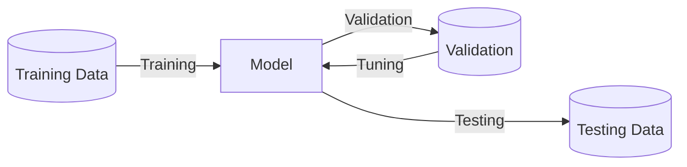

Deals with how we train the model

## Data

Data can be structured/unstructured

- Each column = feature
- Each row = instance

### Train-Validation-Test Split

- Split is usually 60:20:20
- Split should be mutually-exclusive, to ensure good out-of-sample accuracy

The size of test set is important; small test set implies statistical uncertainty around the estimated average test error, and hence cannot claim algo A is better than algo B for given task.

Random split is the best. However, random split will not work well all the time, where there is auto-correlation, for eg: time-series data

### Multi-Dimensional Data

can be hard to work with as

- requires more computing power
- harder to interpret
- harder to visualize

### Feature Selection

### Dimension Reduction

Using Principal Component Analysis

Deriving simplified features from existing features

Easy example: using area instead of length and breadth.

## Model

A functional mapping between input and output

|          | Parametric                                                   | Non-Parametric                              |
| -------- | ------------------------------------------------------------ | ------------------------------------------- |
|          | Learn a function described by a parameter whose size is finite & fixed before data is observed | Complexity is function of training set size |
| Examples | Linear Regression                                            | Nearest Neighbor                            |

## Learning Types

| Type                   | Meaning                                                      | Application  |
| ---------------------- | ------------------------------------------------------------ | ------------ |
| Supervised             | Uses labelled data, to derive a mapping between input examples and target variable. |              |
| Unsupervised           | Learning from unlabelled data                                |              |
| Semi-Supervised        | $\exists$ labelled data and large amount of unlabelled data. Label the unlabelled data using the labelled data.  For example, **love** is labelled as emotion, but **lovely** isn’t  Cotraining, Semi-Supervised SVM |              |
| Lazy/Instance-Based    | Store the training examples instead of training explicit description of the target function.  Output of the learning algorithm for a new instance not only depends on it, but also on its neighbors.  The best algorithm is KNN (K-Nearest Neighbor) Algorithm.  Useful for recommender system. |              |
| Active                 | Learning system is allowed to choose the data from which it learns. There exists a human annotator.  Useful for gene expression/cancer classification |              |
| Multiple Instance      | Weakly supervised learning where training instances are arranged in sets. Each set has a label, but the instances don’t |              |
| Transfer               | Reuse a pre-trained model as the starting point for a model on a new related task |              |
| Reinforcement Learning | Learning in realtime, from experience of interacting in the environment, without any fixed input dataset. It is similar to a kid learning from experience.  Best algorithm is **Q-Learning algorithm**. | Game playing |
| Bayesian Learning      | Conditional-probabilistic learning tool Each observed training expmle can incrementally inc/dec the estimated probability that a hypothesis is correct.  Useful when there is chance of false positive. For eg: Covid +ve |              |
| Deep Learning          |                                                              |              |

## Hyperparameters

Parameters that affect the prediction of a model.

They are not adapted by the ML algo itself, but we can use nested learning, where other algorithms optimize the hyperparameter for the ML algo.
