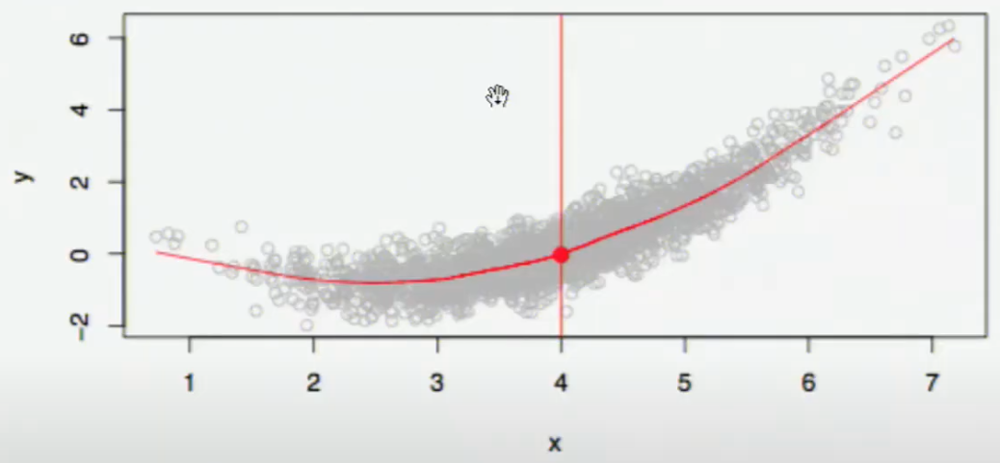

# Model

$$
\hat y = \hat f(x) + u \\ 
\hat f(x) = E[y \vert x]
$$

where

| Denotation     | Term                                                    | Comment                                                      |
| -------------- | ------------------------------------------------------- | ------------------------------------------------------------ |
| $x$            | input; feature; predictor                               |                                                              |
| $y$            | output; target; response                                |                                                              |
| $\hat y$       | prediction                                              |                                                              |
| $E[y \vert x]$ | CEF (Conditional Expectation Function)                  |                                                              |
| $\hat f$       | Target function Hypothesis Model              | Gives mapping b/w $x$ and $y$ to obtain CEF                  |
| $p(y \vert x)$ | Target distribution/ Posterior distribution of $y$ | Gives mapping b/w $x$ and $y$ to obtain Conditional Distribution |
| $u$            | Random component                                        |                                                              |

## Model Types

|                            | Ideal                                                        | Non-Parametric (Nearest Neighbor)                       | Semi-Parametric | Parametric                                                   |
| -------------------------- | ------------------------------------------------------------ | ------------------------------------------------------------ | --------------- | ------------------------------------------------------------ |
| $\hat y$                   | $\text{Mean}(y \vert x)$                                     | $\text{Mean} \Big(y \vert x_i \in N(x) \Big)$ $N(x)$ is neighborhood of $x$ |                 | $f(x)$                                                       |
| Functional Form assumption | None                                                         | None                                                         |                 | Assumes functional form with a finite & fixed number of parameters, before data is observed |
| Advantages                 |                                                              | - learns complex patterns - in a high-dimensional space - without being specifically directed - learns interactions |                 |                                                              |
| Limitation                 | Suffers from curse of dimensionality: Requires large dataset, especially when $k$ is large | Suffers from curse of dimensionality: Requires large dataset, especially when $k$ is large  Black box: Lacks interpretability Large storage cost: Stores all training records Computationally-expensive |                 |                                                              |
| Visualization              |  |  |                 |                                                              |
| Complexity                 |                                                              | Function of training set size                                |                 |                                                              |
| Example                    |                                                              | Nearest Neighbor averaging                                   | Spline          | Linear Regression                                            |

Fundamentally, a parametric model can be though of data compression

## Modelling Types

|                        | Discriminative/ Reduced Form                            | Generative/ Structural                                  | Hybrid                                     |
| ---------------------- | ------------------------------------------------------------ | ------------------------------------------------------------ | ------------------------------------------ |
| Characteristic         | Mathematical/Statistical                                     | Theoretical (Scientific/Economic)                       | Mix of first principles & machine learning |
| Goal                   | 1. $\hat p(y \vert x)$ 2. $\hat y = \hat E(y \vert x)$  | 1. $\hat p(x, y)$ 2. $\hat p(y \vert x)$ 3. $\hat y = \hat E(y \vert x)$ | $\hat y = \text{g}(x) + d(x)$              |
| Includes Causal Theory | ❌                                                            | ✅                                                            | Same as Structural                         |
| Preferred for          | Interpolation                                                | Extrapolation Counter-factual simulation Synthetic data generation | Same as Structural                         |
| Out-of-Sample Accuracy | Low                                                          | High (only for good theoretical model)                  | Same as Structural                         |
| Limitations            | Unstable for equilibrium effects                             |                                                              |                                            |
| Derivation Time        | 0                                                            | High                                                         | Same as Structural                         |
| Example models         | Non-Probabilistic classifiers                                | Probabilistic classifiers (Bayesian/Gaussian)                |                                            |
| Example                | 1. Mars position wrt Earth, assuming that Mars revolves around the Earth  2. Relationship of wage vs college education directly | 1. Mars position wrt Earth, assuming that Mars & Earth revolve around the Sun  2. Relationship of wage vs college education, with understanding of effects of supply of college educated students in the market |                                            |
| Example 2              | Linear regression of wage wrt education                      | Wage & education using supply-demand curve                   |                                            |
| Comment                | The shortcoming of reduced form was seen in the 2008 Recession The prediction model for defaults was only for the case that housing prices go up, as there was data only for that. Hence, the model was not good for when the prices started going down. | Learning $p(x, y)$ can help understand $p(u, v)$ if $\{x, y \}$ and $\{ u, v \}$ share a common underlying causal mechanism  For eg: Apples falling down trees and the earth orbiting around the sun both inform us of the gravitational constant. |                                            |

Given a structural model $g (x, y) = 0$ 

If $y$ is solved as a function of $x$, i.e. $y = f(x)$, then $f$ is referred to as the reduced form of $g$

Structural model vs Reduced form

## Number of Variables

|          | Univariate Regression   | Multi-Variate                     |
| -------- | ----------------------- | --------------------------------- |
| $\hat y$ | $f(X_1)$                | $f(X_1, X_2, \dots, X_n)$         |
| Equation | $\beta_0 + \beta_1 X_1$ | $\sum\limits_{i=0}^n \beta_i X_i$ |
| Best Fit | Straight line           | Place                             |

## Degree of Model

|          | Simple Linear Regression              | Curve-Fitting Polynomial Linear Regression              | Curve-Fitting/ Non-Linear Regression                    |
| -------- | ------------------------------------- | ------------------------------------------------------------ | ------------------------------------------------------------ |
| Equation | $\sum\limits_{j=0}^k \beta_j X_j$     | $\sum \limits_{j=0}^k \sum\limits_{i=0}^n \beta_{ij} (X_j)^i$ | Any of the $\beta$ is not linear                             |
| Example  | $\beta_0 + \beta_1 X_1 + \beta_1 X_2$ | $\beta_0 + \beta_1 X_1 + \beta_1 X_1^2 + \beta_1 X_2^{10}$   | $\beta_0 + e^{\textcolor{hotpink}{\beta_1} X_1}$             |
| Best Fit | Straight line                         | Curve                                                        | Curve                                                        |
|          |                                       |                                                              | You can alternatively perform transformation to make your regression linear, but this isn’t best 1. Your regression will minimize transformed errors, not your back-transformed errors (what actually matters). So the weights of errors will not be what is expected 2. Transformed errors will be random, but your back-transformed errors (what actually matters) won’t be a random process |

The term linear refers to the linearity in the coefficients $\beta$s, not the predictors

### Jensen’s Inequality

$$
E[\log y] < \log (E[y])
$$

Therefore
$$
\hat y = \exp(\beta_0 + \beta_1 x) + u_i \\
E[y \vert x] \ne E[\exp(\beta_0 + \beta_1 x)]
$$
However, if you assume that $u \sim N(0, \sigma^2)$
$$
E[y \vert x] = \exp(\beta_0 + \beta_1 x + \dfrac{\sigma^2}{2})
$$

## Generalized Linear Models

Models response variable $y$ from a known exponential family with mean $\mu$ and link function $g$
$$
g(\mu) = x' \beta
$$
where $g$ is a monotic function

|               | $y$                     | $x' \beta$                              |
| ------------- | ----------------------- | --------------------------------------- |
| Normal Linear | $N(\mu, \sigma^2)$      | $\mu$                                   |
| Logistic      | $\text{Binomial}(n, p)$ | $\log \left(\dfrac{\pi}{1-\pi} \right)$ |
| Poisson       | $\text{Poisson}(\mu)$   | $\log \mu$                              |

