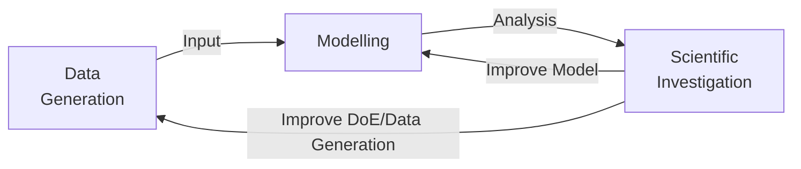
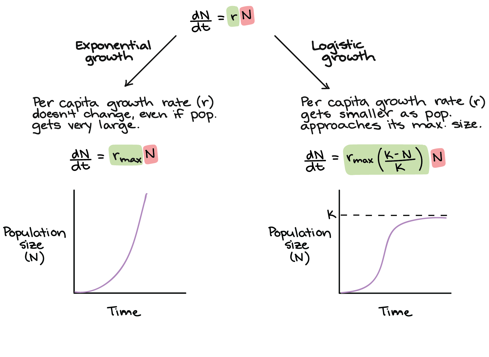
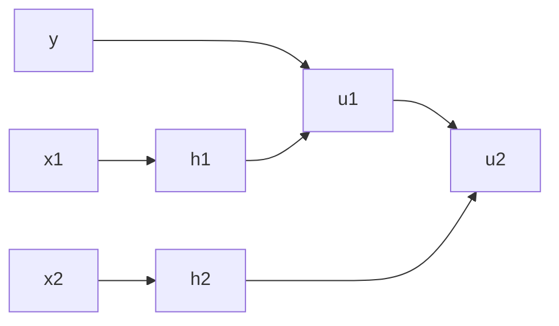

# Model

## IDK

### True

$$
\begin{aligned}
y &= f(X) && \text{True Relationship}
\end{aligned}
$$
### Observed

$$
\begin{aligned}
\tilde X &= X + \delta && \text{Observed Input} \\
\tilde y &= y + \epsilon && \text{Observed Output} \\
\\
\implies \tilde y &= \tilde f(\tilde X) && \text{Observed Relationship} \\
&= f(\tilde X) + \epsilon
\end{aligned}
$$
### Estimated
$$
\begin{aligned}
\hat y &= \hat f_{\small L, C, D, A, O}(\tilde X; \theta) + u \\
\text{where }
L &= &&\text{Loss - Functional Form, Weights} \\
C &= &&\text{Constraints} \\
D &= \{ \tilde X, \tilde y \} && \text{Train data used (Observed, Noisy)} \\
A &= &&\text{Learning Algorithm - Functional Form, Hyperparameters, Randomness} \\
O &= &&\text{Optimization - Algorithm, Hyperparameters, Randomness}
\end{aligned}
$$

where

| Denotation          | Term                                                        | Comment                                                          |
| ------------------- | ----------------------------------------------------------- | ---------------------------------------------------------------- |
| $x$                 | input explanatory feature predictor independent |                                                                  |
| $y$                 | output outcome target response dependent        |                                                                  |
| $\hat y$            | prediction                                                  |                                                                  |
| $E[y \vert x]$      | CEF (Conditional Expectation Function)                      |                                                                  |
| $f$                 | Target function                                             | True relationship between $y$ and $x$                            |
| $\hat f$            | Hypothesis function Model                              | Gives mapping b/w $x$ and $y$ to obtain CEF                      |
| $p(y \vert x)$      | Target distribution/ Posterior distribution of $y$     | True data-generating process                                     |
| $\hat p(y \vert x)$ | Hypothesis distribution                                     | Gives mapping b/w $x$ and $y$ to obtain Conditional Distribution |
| $u$                 | Random component                                            |                                                                  |

## IDK

## Desired Properties

- Unbiased: Mean of residuals = 0
- Efficient: Variance of residuals and learnt parameters is min
- Maximum likelihood $P(D, \theta)$
- Robust
- Consistent: $n \to \infty \implies E[u_i] \to 0$

Attributes of probabilistic forecast quality

1. Reliable: probabilistic calibration
   1. For quantile forecasts with level $\alpha$, observations $y_{t+k}$ should be less than $\hat y_{t+k}$ $\alpha$ times
   2. For interval forecasts with coverage $p$, observations $y_{t+k}$ should be within the interval $p$ times
   3. For predictive densities composed of $m+1$ quantile forecasts with nominal levels $\alpha_0, \alpha_1, \dots, \alpha_m$, all these quantile forecasts are evaluated individually using the above
   4. Q-Q Plots
2. Sharp: informative
   1. Concentration of probability: how tight the predictive densities are
   2. Perfect probabilistic forecast gives a probability of 100% on a single value
   4. CRPS
      1. Average of each predictive density and corresponding observation
      2. $\text{CRPS}_{t, h} = \int_y \ \Big( \hat F_{t+h \vert t} - 1(y_{t+h} \le y) \Big)^2 \ \cdot dy$
      3. $\text{CRPS}_h = \text{avg}(\text{CRPS}_{t, h})$
3. Skilled
4. High resolution

## Scope

Every model is only limited to its ‘scope’, which should be clearly documented

- Assumptions
- Domain: Set of $x$
- Range: Set of $y$
- ⁠Density: total no of points, no of points in leaves

## IDK

- > "If you understand your solution better than the problem, then you are doing something wrong" ~ Vincent Warmerdam
- Think more about system design rather than just machine learning
- Simple linear models work. Most of the times non-linear/ensembles/deep learning models are not required

## Model Types

|                                 | Ideal                                                        | Non-Parametric (Nearest Neighbor)                       | Semi-Parametric               | Parametric                                                   |
| ------------------------------- | ------------------------------------------------------------ | ------------------------------------------------------------ | ----------------------------- | ------------------------------------------------------------ |
| $\hat y$                        | $\text{Mean}(y \vert x)$                                     | $\text{Mean} \Big(y \vert x_i \in N(x) \Big)$ $N(x)$ is neighborhood of $x$ |                               | $f(x)$                                                       |
| Functional Form assumption      | None                                                         | None                                                         |                               | Assumes functional form with a finite & fixed number of parameters, before data is observed |
| Advantages                      | Perfect accuracy                                             | - learns complex patterns - in a high-dimensional space - without being specifically directed - learns interactions |                               | Compression of model into a single function                  |
| Limitation                      | Not possible to obtain                                       | Suffers from curse of dimensionality: Requires large dataset, especially when $k$ is large  Black box: Lacks interpretability Large storage cost: Stores all training records Computationally-expensive |                               | Lost information?                                            |
| Visualization                   |  |  |                               |                                                              |
| Space Complexity is function of |                                                              | Training set size                                            | Number of function parameters | Number of function parameters                                |
| Example                         |                                                              | Nearest Neighbor averaging                                   | Spline                        | Linear Regression                                            |

Fundamentally, a parametric model can be though of data compression

## Modelling Types

|                                                                                                                   | Discriminative/ Reduced Form                                                                                                                                                                                                                            | Generative/ Structural/ First-Principles                                                                                                                                                                                                                                                          | Hybrid/ Discrepancy                   |
| ----------------------------------------------------------------------------------------------------------------- | ------------------------------------------------------------------------------------------------------------------------------------------------------------------------------------------------------------------------------------------------------------ | ----------------------------------------------------------------------------------------------------------------------------------------------------------------------------------------------------------------------------------------------------------------------------------------------------------- | ------------------------------------------ |
| Characteristic                                                                                                    | Mathematical/Statistical                                                                                                                                                                                                                                     | Theoretical (Scientific/Economic)                                                                                                                                                                                                                                                                      | Mix of first principles & machine learning |
| Effect Modifiers [Read more](../../Economics/Causal_Inference/08_Causal_Graphical_Model.md#Effect-Modifiers) | Assumes that effect modifiers will remain same as during learning                                                                                                                                                                                            | Incorporates effect modifiers                                                                                                                                                                                                                                                                               |                                            |
| Goal                                                                                                              |   1. $\hat p(y \vert x)$ 2. $\hat y = \hat E(y \vert x)$                                                                                                                                                                                      | 1. $\hat p(x \vert y)$ 2. $\hat p(x, y)$ 3. $\hat p(y \vert x)$ 4. $\hat y = \hat E(y \vert x)$                                                                                                                                                                                              | $\hat y = \text{g}(x) + d(x)$              |
|                                                                                                                   |                                                                                                                                                                                                                                                              | This model defines a “story” for how the data was generated. To obtain a data point  1. Sample class $y \sim \text{Categorical}(p_1, p_2, \dots, p_C)$ with class proportions given by $p_c$ 2. Then, we sample $x$ from the gaussian distribution $\mathcal N(\mu_c, \Sigma_c)$ for each class |                                            |
| Includes Causal Theory                                                                                            | ❌                                                                                                                                                                                                                                                            | ✅                                                                                                                                                                                                                                                                                                           | Same as Structural                         |
| Intrapolation?                                                                                                    | ✅                                                                                                                                                                                                                                                            | ✅                                                                                                                                                                                                                                                                                                           | ✅                                          |
| Interpolation                                                                                                     | ⚠️                                                                                                                                                                                                                                                           | ✅                                                                                                                                                                                                                                                                                                           | ⚠️                                         |
| Extrapolation                                                                                                     | ❌                                                                                                                                                                                                                                                            | ✅                                                                                                                                                                                                                                                                                                           | ❌                                          |
| Counter-factual simulation                                                                                        | ❌                                                                                                                                                                                                                                                            | ✅                                                                                                                                                                                                                                                                                                           | ❌                                          |
| Can adapt to data drift                                                                                           | ❌                                                                                                                                                                                                                                                            | ✅                                                                                                                                                                                                                                                                                                           | ⚠️                                         |
| Stable for Equilibrium effects                                                                                    | ❌                                                                                                                                                                                                                                                            | ✅                                                                                                                                                                                                                                                                                                           | ⚠️                                         |
| Synthetic data generation                                                                                         | ❌                                                                                                                                                                                                                                                            | ✅                                                                                                                                                                                                                                                                                                           | ❌                                          |
| Out-of-Sample Accuracy                                                                                            | Low                                                                                                                                                                                                                                                          | High (only for good theoretical model)                                                                                                                                                                                                                                                                 | Same as Structural                         |
| Derivation Time                                                                                                   | 0                                                                                                                                                                                                                                                            | High                                                                                                                                                                                                                                                                                                        | Same as Structural                         |
| Example models                                                                                                    | Non-Probabilistic classifiers Logistic regression                                                                                                                                                                                                       | Probabilistic classifiers (Bayesian/Gaussian)                                                                                                                                                                                                                                                               |                                            |
| Comment                                                                                                           | The shortcoming of reduced form was seen in the 2008 Recession The prediction model for defaults was only for the case that housing prices go up, as there was data only for that. Hence, the model was not good for when the prices started going down. | Learning $p(x, y)$ can help understand $p(u, v)$ if $\{x, y \}$ and $\{ u, v \}$ share a common underlying causal mechanism  For eg: Apples falling down trees and the earth orbiting around the sun both inform us of the gravitational constant.                                                |                                            |
| Example 1: General                                                                                                | $f=\sigma(kx), \hat f = e^{kx}$ $f = x^2, \hat f = x$ $f=e^x, \hat f=x^2$                                                                                                                                                                           | $f = x^2, \hat f = x^2$                                                                                                                                                                                                                                                                                     |                                            |
| Example 2: Chemical Kinetics                                                                                      | Fit curve to given data                                                                                                                                                                                                                                      | Solve the rate law equation for the given data                                                                                                                                                                                                                                                              |                                            |
| Example 3: Astronomy                                                                                              | Mars position wrt Earth, assuming that Mars revolves around the Earth                                                                                                                                                                                        | Mars position wrt Earth, assuming that Mars & Earth revolve around the Sun                                                                                                                                                                                                                                  |                                            |
| Example 4: Wage vs Education                                                                                      | Relationship of wage vs education directly                                                                                                                                                                                                                   | Relationship of wage vs education, with understanding of demand-supply curve (ie, effects of supply of college educated students in the market)  eg: Kerala                                                                                                                                       |                                            |
| Example 5: Time-Series Forecasting                                                                                | Univariate model with lags and trends                                                                                                                                                                                                                        | Multi-variate model with lags of $y$ and $x$                                                                                                                                                                                                                                                                |                                            |

Good compromise
- Model response with causal factors
- Model causal residuals with statistical factors

### Structural vs Reduced-Form

## Number of Variables

|          | Univariate Regression   | Multi-Variate                     |
| -------- | ----------------------- | --------------------------------- |
| $\hat y$ | $f(X_1)$                | $f(X_1, X_2, \dots, X_n)$         |
| Equation | $\beta_0 + \beta_1 X_1$ | $\sum\limits_{i=0}^n \beta_i X_i$ |
| Best Fit | Straight line           | Place                             |

## Degree of Model

|                         | Simple Linear Regression              | Polynomial Linear Regression                                  | Non-Linear Regression                                                                                                                                                                                                                                                                                                                                                                          |
| ----------------------- | ------------------------------------- | ------------------------------------------------------------- | ---------------------------------------------------------------------------------------------------------------------------------------------------------------------------------------------------------------------------------------------------------------------------------------------------------------------------------------------------------------------------------------------- |
| Equation                | $\sum\limits_{j=0}^k \beta_j X_j$     | $\sum \limits_{j=0}^k \sum\limits_{i=0}^n \beta_{ij} (X_j)^i$ | Any of the $\beta$ is not linear                                                                                                                                                                                                                                                                                                                                                               |
| Example                 | $\beta_0 + \beta_1 X_1 + \beta_1 X_2$ | $\beta_0 + \beta_1 X_1 + \beta_1 X_1^2 + \beta_1 X_2^{10}$    | $\beta_0 + e^{\textcolor{hotpink}{\beta_1} X_1}$                                                                                                                                                                                                                                                                                                                                               |
| Best Fit                | Straight line                         | Curve                                                         | Curve                                                                                                                                                                                                                                                                                                                                                                                          |
| Solving method possible | Closed-Form Iterative            | Closed-Form Iterative                                    | Iterative                                                                                                                                                                                                                                                                                                                                                                                      |
| Limitations             |                                       |                                                               | 1. Convergence may be slow 2. Convergence to local minima vs global minima 3. Solution may depend heavily on initial guess                                                                                                                                                                                                                                                           |
| Comment                 |                                       |                                                               | You can alternatively perform transformation to make your regression linear, but this isn’t best 1. Your regression will minimize transformed errors, not your back-transformed errors (what actually matters). So the weights of errors will not be what is expected 2. Transformed errors will be normal, but your back-transformed errors (what actually matters) won’t be a normal |

The term linear refers to the linearity in the coefficients $\beta$s, not the predictors

### Jensen’s Inequality

$$
E[\log y] < \log (E[y])
$$

Therefore
$$
\hat y = \exp(\beta_0 + \beta_1 x) + u_i \\
E[y \vert x] \ne E[\exp(\beta_0 + \beta_1 x)]
$$
However, if you assume that $u \sim N(0, \sigma^2)$
$$
E[y \vert x] = \exp(\beta_0 + \beta_1 x + \dfrac{\sigma^2}{2})
$$

## Boosted Hybrid Model

Multi-Level Model

Boosting with different function and/or model class for each component of $f(x)$
$$
\hat f(x) = \sum_{j=1}^k \hat f_j(x_j) \\
\hat f: x_j \to u_{j-1} \\
u_0 = y
$$

Model in the following order to avoid fitting the noise:

| Step | Model Capacity | Component Frequency |
| ---- | -------------- | ------------------- |
| 1    | Low            | High                |
| 2    | Low            | Low                 |
| 3    | High           | High                |
| 4    | Low            | Low                 |

For eg: Time Series modelling

- Trend with LR: $\hat f(t)$
- Seasonality with KNN
- Holidays with Decision Tree
- Residuals with XGBoost

## Categorial Inputs

### Binary

$$
\begin{aligned}
\hat y &= \beta_0 + \beta_1 x + \beta_2 T + + \beta_3 x T + u \\
\\
T = 0 \implies \hat y &= \beta_0 + \beta_1 x + u \\
T = 1 \implies \hat y &= (\beta_0 + \beta_2) + (\beta_1+\beta_3) x + u
\end{aligned}
$$

where $T=$ treatment/binary var

### Discrete Var

Dummy variable trap

- For $C$ possible values of discrete var, If you have intercept/constant term and $C$ dummy vars, you will have perfect multi-collinearity (dangerous), as all zeros is also a scenario

Solution
- $C$ dummy variables, but no intercept
- $C-1$ dummy variables with intercept

## Model Constraints/Hints

Known properties of $f$ that can be used to improve $\hat f$, especially with small datasets

- Monotonic constraints
	- Warning: does the constraint really makes sense for all possible values of other features?
		- If your house price model uses the features “number of rooms” and “living area”
			- then a monotonic constraint on “living area” might make sense (given any number of rooms)
			- such constraint would be non-sensical for the number of rooms
				- Because having six rooms in a 1200 square feet home is not necessarily better than having just five rooms in an equally sized home
- Interaction constraints: prevent non-sensical interactions
	- Let's say that the causal structure is $E = f(A, B), F = f(C, D), G = g(E, F)$
	- If this is a hassle to model each independently, then have interactions constraints: $G = f(\{A, B\}, \{C, D\})$
- Reflexivity
- Symmetry
- Rotational invariance
- Translational invariance

Can be enforced through

- Modifying features
  - Eg: using $\vert x \vert$ instead of $x$ for symmetry
- [Regularization Penalty](14_Model_Tuning.md#Weight-Decay)
- Data augmentation

## Latent Variable Models

### Examples

1. Image classification

   - Contains variability due to gender, eye color, hair color, pose, etc

   - Unless these images are annotated, these factors of variation are not explicitly available

2. Classification

   1. Gaussian mixture models

### Limitations

- Computationally-expensive: requires approximations

## General Techniques

Not necessarily for least squares regression

- [Hierarchical](#Hierarchical)
- Ensembling: Reduce variance
- Bootstrapping: Robustness, confidence intervals
- RANSAC (RANdom Sample Consensus): Robustness
	- Disadvantage: Requires hyper-parameter tuning
- Weighted
- Localized/Locally-Weighted
	- Query similar records, either by no of records or by KNN distance
- Randomness aggregation: average models across multiple randomness-inducing hyperparameters
	- Random seed
	- Random samples
	- Learning rate
- Iteratively ReWeighted
- Online learning
- Rolling
	- rolling apply function
	- ⁠ function returns coefs
	- ⁠ split coef into different cols

## Hierarchical

If there are multiple independent hierarchies, then run a model for each hierarchy
- simple model for each hierarchy is better than one complex model for each group
- especially useful for imbalanced hierarchies

Complexity of atomic model for each hierarchy should be based on the amount of data available for that hierarchy
- create a meta-estimator to conditionally apply a model

## Classification Threshold

$$
p_\text{threshold} =
\dfrac{
c(\text{FP}) - c(\text{TN})
}{
\Bigg( c(\text{FN}) + c(\text{FP}) \Bigg) - \Bigg(c(\text{TN}) + c(\text{TP}) \Bigg)
}
$$
