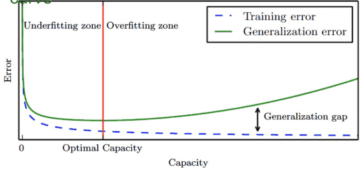

# Performance Measure $P$

## Baseline

Always establish a baseline

- Basic/Naive/Dummy predictions
- Human Level Performance
- Literature Review
- Performance of older system

## Error Metrics

Cost/Loss Functions

### Regression

$u_i = \hat y_i - y_i$

|                        Metric                        |                           Formula                            |                       Preferred Value                        |    Unit     |        Range        | Advantages ✅                                       | Disadvantages ❌                                         | Comment                                                      |
| :--------------------------------------------------: | :----------------------------------------------------------: | :----------------------------------------------------------: | :---------: | :-----------------: | ------------------------------------------------------- | ------------------------------------------------------------ | :----------------------------------------------------------- |
|                 ME (Mean Error)                 |              $\dfrac{1}{n} \sum_{i=1}^n (u_i)$               | 0 for unbiased-prep <0 for under-pred >0 for overpred | Unit of $y$ | $(-\infty, \infty)$ | Shows direction of bias                                 | Does not show magnitude of deviations                        |                                                              |
|        SEE (Standard Error of Estimate)         |            $\sqrt{\dfrac{ \sum(u_i)^2}{n-k - 1}}$            |                            $<= 1$                            | Unit of $y$ | $(-\infty, \infty)$ | Shows magnitude of deviations                           | Does not show direction of bias                              |                                                              |
|            MAE (Mean Absolute Error)            |        $\dfrac{1}{n} \sum_{i=1}^n \vert  u_i  \vert$         |                         $\downarrow$                         | Unit of $y$ |    $[0, \infty)$    | Insensitive to outliers                                 | Does not penalize large deviations                           |                                                              |
|            MSE (Mean Squared Error)             |             $\dfrac{1}{n} \sum_{i=1}^n (u_i)^2$              |                         $\downarrow$                         | Unit of $y$ |    $[0, \infty)$    | Penalizes large deviations                              | Sensitive to outliers                                        |                                                              |
|          RMSE (Root Mean Square Error)          |                     $\sqrt{\text{MSE}}$                      |                         $\downarrow$                         | Unit of $y$ |    $[0, \infty)$    | Same as MSE                                             | Same as MSE                                                  |                                                              |
|      MAPE (Mean Absolute Percentage Error)      | $\dfrac{1}{n} \sum_{i=1}^n \left \lvert  \dfrac{ u_i }{y_i}  \right \vert$ |                         $\downarrow$                         |      %      |    $[0, \infty)$    | Easy to understand                                      | Explodes when $y_i \approx 0$ Division by 0 error when $y_i=0$ |                                                              |
| WMAPE (Weighted Mean Absolute Percentage Error) | $\dfrac{1}{n} \left(\dfrac{ \sum_{i=1}^n \vert  u_i \vert  }{\sum_{i=1}^n \vert  y_i  \vert}\right)$ |                         $\downarrow$                         |      %      |    $[0, \infty)$    | Avoids the  limitations of MAPE                         | Not as easy to interpret                                     |                                                              |
|          RAE (Relative Absolute Error)          | $\dfrac{\sum_{i=1}^n \vert  u_i \vert}{\sum_{i=1}^n \vert  \bar y - y_i  \vert}$ |                         $\downarrow$                         |      %      |    $[0, \infty)$    |                                                         |                                                              |                                                              |
|           RSE (Relative Square Error)           | $\dfrac{\sum_{i=1}^n  (u_i)^2 }{\sum_{i=1}^n (\bar y - y_i)^2 }$ |                         $\downarrow$                         |      %      |    $[0, \infty)$    |                                                         |                                                              |                                                              |
|      $R^2$ (Coefficient of Determination)       |                       $1 - \text{RSE}$                       |                          $\uparrow$                          |  Unitless   |      $[0, 1]$       |                                                         |                                                              |                                                              |
|                    Adjusted $R^2$                    |                                                              |                          $\uparrow$                          |  Unitless   |      $[0, 1]$       |                                                         |                                                              |                                                              |
|              Quantile Score $Q_{p, t}$               | $\begin{cases} 2 (1-p) \vert y_t - f_{p, t} \vert , & y_t < f_{p, t} \\ 2 p \vert y_t - f_{p, t} \vert , & y_t \ge f_{p, t} \end{cases}$ |                         $\downarrow$                         |             |                     |                                                         |                                                              |                                                              |
|               Winkler score $W_{p, t}$               |    $\dfrac{Q_{\alpha/2, t} + Q_{1-\alpha/2, t}}{\alpha}$     |                         $\downarrow$                         |             |                     |                                                         |                                                              |                                                              |
|    CRPS Continuous Ranked Probability Scores    |               $\overline Q_{p, t}, \forall p$                |                         $\downarrow$                         |             |                     |                                                         |                                                              |                                                              |
|              Skill scores CRPS_SS               | $\dfrac{\text{CRPS}_\text{Naive} - \text{CRPS}_\text{Method}}{\text{CRPS}_\text{Naive}}$ |                         $\downarrow$                         |             |                     |                                                         |                                                              |                                                              |
|        AIC Akaike Information Criterion         |   $-2 \log L + 2 (k+2)$, where $L$ is the likelihood    |                         $\downarrow$                         |             |                     | Penalizes predictors more heavily than $R_\text{adj}^2$ | For small values of $n$, selects too many predictors         | Minimizing equivalent to minimizing leave-one-out cross validation score |
|                    Corrected AIC                     |          $\text{AIC} + \dfrac{2(k+2)(k+3)}{n-k-3}$           |                         $\downarrow$                         |             |                     |                                                         |                                                              |                                                              |
|   BIC/SBIC/SC Bayesian Information Criterion    | $-2 \log L + (k+2) \log n$, where $L$ is the likelihood |                         $\downarrow$                         |             |                     | Penalizes predictors more heavily than AIC              |                                                              | Minimizing equivalent to minimizing leave-one-out cross validation score when $v = n \left[ 1 - \dfrac{1}{\log \vert n \vert -1} \right]$ |

Bayes’ Error is the error incurred by an ideal model, which is one that makes predictions from true distribution $P(x,y)$; even such a model incurs some error due to noise/overlap in the distributions

### Classification

| Metric                                              | Meaning                                                      |                           Formula                            |
| --------------------------------------------------- | ------------------------------------------------------------ | :----------------------------------------------------------: |
| **Accuracy**                                        | $\frac{\text{Correct Predictions}}{\text{No of predictions}}$ |      $\frac{\text{TP + TN}}{\text{TP + FP + TN + FN}}$       |
| **Error**                                           | $\frac{\text{Wrong Predictions}}{\text{No of predictions}}$  | $\begin{aligned} & 1 - \text{Accuracy} \\ &\frac{\text{FP + FN}}{\text{TP + FP + TN + FN}}\end{aligned}$ |
| **Recall** Sensitivity True Positive Rate | How many actual +ve values were correctly predicted as +ve   | $\frac{\textcolor{hotpink}{TP}}{\textcolor{hotpink}{TP} + \text{FN}}$ |
| **Precision** Positive Predictive Value        | Out of actual +ve values, how many were correctly predicted as +ve | $\frac{\textcolor{hotpink}{TP}}{\textcolor{hotpink}{TP} + \text{FP}}$ |
| **Specificity** True Negative Rate             | Out of actual -ve values, how many were correctly predicted as -ve | $\frac{\textcolor{hotpink}{TN}}{\textcolor{hotpink}{TN} + \text{FP}}$ |
| **F Score** F~1~ Score F-Measure          | Harmonic mean between precision and recall Close to lower value | $\frac{2 \times \text{Precision} \times \text{Recall}}{\text{Precision} + \text{Recall}}$ |
| **FP Rate**                                         | Out of the actual -ve, how many were misclassified as Positive | $\begin{aligned}\alpha &= \frac{\textcolor{hotpink}{FP}}{\textcolor{hotpink}{FP} + \text{TN}} \\ &= 1 - \text{Specificity} \end{aligned}$            |                                                              |                                                              |
| **FN Rate**                                         | Out of the actual +ve, how many were misclassified as Negative | $\begin{aligned}\beta &= \frac{\textcolor{hotpink}{FN}}{\textcolor{hotpink}{FN} + \text{TP}} \\ &= 1 - \text{Sensitivity} \end{aligned}$            |                                                              |                                                              |
| **Cross Entropy**/ Log Loss               |                                                              |        $-\sum\limits_{x \in X} P(x) \cdot \log Q(x)$         |

## Model Evaluation

We don’t test the model on the same we trained it with, because it will give high in-sample accuracy, but may give low out-of-sample accuracy(which is really what we want).

Out-of-sample accuracy is the accuracy of the model when tested when never-before-seen data.

Once the model is finalized, you should train your model with the testing data afterwards.

|                                   | Type          | Purpose                                       | Color Scheme Below                                        |
| --------------------------------- | ------------- | --------------------------------------------- | --------------------------------------------------------- |
| Training evaluation               | In Sample     | Evaluating underfitting                       | Green   |
| Inner Validation                  | Out of Sample | Hyperparameter tuning                         | Orange |
| Outer Validation                  | Out of Sample | Model Tuning                                  | Yellow |
| Testing evaluation (Holdout) | Out of Sample | Evaluating overfitting Model performance | Red       |

## Split Types

==Make sure to **shuffle** all splits for cross-sectional data==

| Type                     |                       Cross-Sectional                        |                         Time Series                          | Notes                                                        |
| ------------------------ | :----------------------------------------------------------: | :----------------------------------------------------------: | ------------------------------------------------------------ |
| Train-Test               |            |            |                                                              |
| $k$-Fold                 |  |  | 1. Split the dataset into $k$ random groups   - $k$ is most commonly set as 4 or 5   - $k$ is called as decision parameter 2.$(k-1)$ groups are used to train and evaluated on remaining group 3. Take average of all performance scores |
| Repeated $k$-Fold        |  |                              ❌                               | Repeat $k$ fold with different splits and random seed        |
| Nested Train-Test        |  |  |                                                              |
| Nested $k$-Fold          |  |  |                                                              |
| Nested Repeated $k$-Fold |  |                              ❌                               |                                                              |

## Bias & Variance

We want **low value** of both

|         |              Bias               |                       Variance                        |
| :-----: | :-----------------------------: | :---------------------------------------------------: |
| Meaning | Error rate of the training data |            Error rate of the testing data             |
| Formula |         $E[\hat y] - y$         | $E \Bigg[ \ \Big(\hat y - E[\hat y] \ \Big)^2 \Bigg]$ |

$$
\text{MSE} = \text{Bias}^2 + \text{Variance} + \text{Bayes Error}
$$

## Generalization

The ability of trained model to be able to perform well on unseen inputs. Better validation result $\implies$ Better generalization

### Generalization & Training Size

Generalization improves with size of training set, until a saturation point, after which it stops improving.

|                | More data $\implies$                                        |
| -------------- | ----------------------------------------------------------- |
| Parametric     | asymptote to an error value exceeding Bayes error           |
| Non-Parametric | better generalization until best possible error is achieved |

## Fitting & Capacity

We can control the fitting of a model, by changing hypothesis space, and hence changing its capacity

|                       | Under-fitting                                                | Appropriate-Fitting | Over-Fitting                                                 |
| --------------------- | ------------------------------------------------------------ | ------------------- | ------------------------------------------------------------ |
| Capacity              | Low                                                          | Appropriate         | Low                                                          |
| Bias                  | ⬆️                                                            | ⬇️                   | ⬇️                                                            |
| Variance              | ⬇️                                                            | ⬇️                   | ⬆️                                                            |
| Steps to address | Increase model complexity Increase training data Remove noise from data Inc no of features |                     | Cross-Validation More training data Feature Reduction Early Stopping Regularization |

The capacity of a model increases with increased [degree of polynomial](#degree-of-polynomial)

## Techniques to address overfitting

### Regularization

Reduce errors by fitting the function appropriately on the given training set, to help reduce variance, and hence avoid overfitting, while minimally affecting bias.

This is done by adding a penalty term in the cost function.

$$
J(\theta) = \text{Error Metric} + \frac{\textcolor{hotpink}{\text{Regularization Penalty}}}{\text{Sample Size}}
$$

|         |             $L_1$ (Lasso)              |             $L_2$ (Rigde)              | $L_3$ (Elastic Net) |
| ------- | :-----------------------------------------: | :-----------------------------------------: | :----------------------: |
| Effect  |      Eliminates feature(s) completely       | Reduce/Normalize the effect of each feature |                          |
| Goal    |              Feature selection              |         Scale down the coefficients         |                          |
| Penalty | $\lambda \sum_{j=1}^m \vert\beta_i \vert$ |      $\lambda \sum_{j=1}^m \beta_i ^2$      |       $L_1 + L_2$        |

Contours of where the penalty is equal to 1 for the three penalties L1, L2 and elastic-net

### Bias-Variance Tradeoff

Usually U-Shaped

### Early-Stopping

### Dropout

### Feature Selection

### Dimensionality Reduction

### Ensembling

## Degree of Polynomial

| Degree  | $\hat y =$                    |
| :-----: | ----------------------------- |
|    1    | $w_0 + w_1 x$                 |
|    2    | $w_0 + w_1 x + w_2 x^2$       |
| $\dots$ |                               |
|   $n$   | $\sum\limits_{i=0}^n w_i x^i$ |

## Nom

$\vert  \vert$ is called as ‘nom’?

$$
||w^2|| = \sum |w^2|
$$
