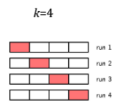
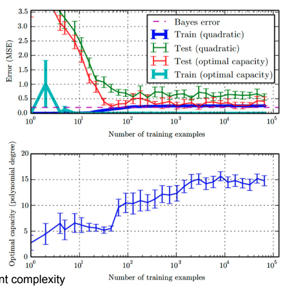
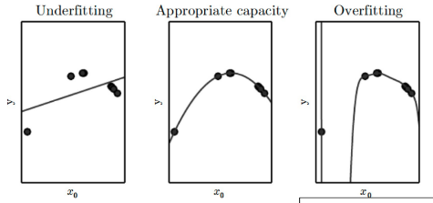

## Error Metrics

Cost/Loss Functions

### Regression

|                  Metric                   |                           Formula                            | Preferred Value | About |
| :---------------------------------------: | :----------------------------------------------------------: | :-------------: |:-------------:|
|       MSE (Mean Squared Error)       |        $\frac{1}{n} \sum_{i=1}^n (\hat y_i - y_i)^2$         |  $\downarrow$   ||
|      MAE (Mean Absolute Error)       |       $\frac{1}{n} \sum_{i=1}^n \| \hat y_i - y_i \|$        |  $\downarrow$   ||
|      MAPE (Mean Absolute Percentage Error)       |       $\frac{1}{n} \sum_{i=1}^n \| \frac{ \hat y_i - y_i }{y_i} \|$        |  $\downarrow$   ||
|      WMAPE (Weighted Mean Absolute Percentage Error)       |       $\frac{1}{n} \frac{ \sum_{i=1}^n \| \hat y_i - y_i \| }{\sum_{i=1}^n \| y_i \|}$        |  $\downarrow$   ||
|    RMSE (Root Mean Square Error)     |     $\sqrt{\frac{1}{n} \sum_{i=1}^n (\hat y_i - y_i)^2}$     |  $\downarrow$   |Penalizes outliers|
|    RAE (Relative Absolute Error)     | $\dfrac{\sum_{i=1}^n \| \hat y_i - y_i \|}{\sum_{i=1}^n \| \bar y - y_i \|}$ |  $\downarrow$   ||
|    RSS (Residual Sum of Squares)     | $\sum_{i=1}^n \left( y_i - \left( \beta_0 + \sum_{j=1}^m \beta_j x_{ij} \right) \right)^2$ |                 ||
|     RSE (Relative Square Error)      | $\dfrac{\sum_{i=1}^n  (\hat y_i - y_i)^2 }{\sum_{i=1}^n (\bar y - y_i)^2 }$ |                 ||
| $R^2$ (Coefficient of Determination) |                       $1 - \text{RSE}$                       |   $\uparrow$    ||
|                   Bayes                   |               Error incurred by an ideal model               |  $\downarrow$   ||
|   SEE (Standard Error of Estimate)   |          $\sqrt{\dfrac{ \sum(\hat y - y)^2}{n-2}}$           |  $\downarrow$   ||

Ideal model is one that making predictions from true distribution $P(x,y)$; even such a model incurs some error due to noise/overlap in the distributions

### Classification

| Metric                                              | Meaning                                                      |                           Formula                            |
| --------------------------------------------------- | ------------------------------------------------------------ | :----------------------------------------------------------: |
| **Accuracy**                                        | $\frac{\text{Correct Predictions}}{\text{No of predictions}}$ |      $\frac{\text{TP + TN}}{\text{TP + FP + TN + FN}}$       |
| **Error**                                           | $\frac{\text{Wrong Predictions}}{\text{No of predictions}}$  | $\begin{aligned} & 1 - \text{Accuracy} \\ &\frac{\text{FP + FN}}{\text{TP + FP + TN + FN}}\end{aligned}$ |
| **Recall** Sensitivity True Positive Rate | How many actual +ve values were correctly predicted as +ve   | $\frac{\textcolor{hotpink}{TP}}{\textcolor{hotpink}{TP} + \text{FN}}$ |
| **Precision** Positive Predictive Value        | Out of actual +ve values, how many were correctly predicted as +ve | $\frac{\textcolor{hotpink}{TP}}{\textcolor{hotpink}{TP} + \text{FP}}$ |
| **Specificity** True Negative Rate             | Out of actual -ve values, how many were correctly predicted as -ve | $\frac{\textcolor{hotpink}{TN}}{\textcolor{hotpink}{TN} + \text{FP}}$ |
| **F Score** F~1~ Score F-Measure          | Harmonic mean between precision and recall Close to lower value | $\frac{2 \times \text{Precision} \times \text{Recall}}{\text{Precision} + \text{Recall}}$ |
| **FP Rate**                                         | Out of the actual -ve, how many were misclassified as Positive | $\begin{aligned}\alpha &= \frac{\textcolor{hotpink}{FP}}{\textcolor{hotpink}{FP} + \text{TN}} \\ &= 1 - \text{Specificity} \end{aligned}$            |                                                              |                                                              |
| **FN Rate**                                         | Out of the actual +ve, how many were misclassified as Negative | $\begin{aligned}\beta &= \frac{\textcolor{hotpink}{FN}}{\textcolor{hotpink}{FN} + \text{TP}} \\ &= 1 - \text{Sensitivity} \end{aligned}$            |                                                              |                                                              |
| **Cross Entropy**/ Log Loss               |                                                              |        $-\sum\limits_{x \in X} P(x) \cdot \log Q(x)$         |

## Model Evaluation

We don’t test the model on the same we trained it with, because it will give high in-sample accuracy, but may give low out-of-sample accuracy(which is really what we want).

Out-of-sample accuracy is the accuracy of the model when tested when never-before-seen data.

|                     | Meaning               |
| ------------------- | --------------------- |
| Training evaluation | In sample testing     |
| Validation          | Out of Sample Testing |
| Testing evaluation  |                       |

### Train-Validation-Test Split

The training, validation, and test sets should be mutually-exclusive, to ensure good out-of-sample accuracy. Usually split it as 60%-20%-20%

Then, after evaluation you should train your model with the testing data afterwards.

The size of test set is important; small test set implies statistical uncertainty around the estimated average test error, and hence cannot claim algo A is better than algo B for given task

However, this will not work well all the time, as this will be dependent; especially for realtime data, where the model is sensitive to the data.

### $k$-Fold Cross Validation

Used when dataset is too small, and hence difficult to divide dataset into a fixed training set, validation, and test sets.

- Split the dataset into $k$ random groups
  - $k$ is most commonly set as 4
  - $k$ is called as decision parameter

- $k-1$ groups are used to train and evaluated on remaining group
- Take average of all performance scores

{ loading:lazy }

## Bias & Variance

We want **low value** of both

|         |              Bias               |                       Variance                        |
| :-----: | :-----------------------------: | :---------------------------------------------------: |
| Meaning | Error rate of the training data |            Error rate of the testing data             |
| Formula |         $E[\hat y] - y$         | $E \Bigg[ \ \Big(\hat y - E[\hat y] \ \Big)^2 \Bigg]$ |

$$
\text{MSE} = \text{Bias}^2 + \text{Variance} + \text{Bayes Error}
$$

## Generalization

The ability of trained model to be able to perform well on unseen inputs. Better validation result $\implies$ Better generalization

### Generalization & Training Size

Generalization improves with size of training set, until a saturation point, after which it stops improving.

|                | More data $\implies$                                        |
| -------------- | ----------------------------------------------------------- |
| Parametric     | asymptote to an error value exceeding Bayes error           |
| Non-Parametric | better generalization until best possible error is achieved |

## Fitting & Capacity

We can control the fitting of a model, by changing hypothesis space, and hence changing its capacity

|                       | Under-fitting                                                | Appropriate-Fitting | Over-Fitting                                                 |
| --------------------- | ------------------------------------------------------------ | ------------------- | ------------------------------------------------------------ |
| Capacity              | Low                                                          | Appropriate         | Low                                                          |
| Bias                  | ⬆️                                                            | ⬇️                   | ⬇️                                                            |
| Variance              | ⬇️                                                            | ⬇️                   | ⬆️                                                            |
| Steps to address | Increase model complexity Increase training data Remove noise from data Inc no of features |                     | Cross-Validation More training data Feature Reduction Early Stopping Regularization |

The capacity of a model increases with increased [degree of polynomial](#degree-of-polynomial)

## Techniques to address fitting

### Regularization

Reduce errors by fitting the function appropriately on the given training set, to help reduce variance, and hence avoid overfitting, while not affecting bias.

This is done by adding a penalty term in the error function.

|                |                   $L_1$                   |                    $L_2$                    | $L_3$                                                        |
| -------------- | :---------------------------------------: | :-----------------------------------------: | ------------------------------------------------------------ |
| Common Name    |                   Lasso                   |                    Rigde                    | Lasso-Ridge                                                  |
|                |     Eliminates feature(s) completely      | Reduce/Normalize the effect of each feature |                                                              |
|                |        Helps in feature selection         |         Scale down the coefficients         |                                                              |
| Error Function | $RSS + \lambda \sum_{j=1}^m \|\beta_i \|$ |   $RSS + \lambda \sum_{j=1}^m \beta_i ^2$   | $RSS + \lambda_1 \sum_{j=1}^m  + \lambda_2 \sum_{j=1}^m \beta_i ^2$ |

### Bias-Variance Tradeoff

### Inc/Dec Capacity

Relationship between error & capacity is usually U-Shaped

## Degree of Polynomial

| Degree  | $\hat y =$                    |
| :-----: | ----------------------------- |
|    1    | $w_0 + w_1 x$                 |
|    2    | $w_0 + w_1 x + w_2 x^2$       |
| $\dots$ |                               |
|   $n$   | $\sum\limits_{i=0}^n w_i x^i$ |

## Nom

$\|\|$ is called as ‘nom’?

$$
||w^2|| = \sum |w^2|
$$
