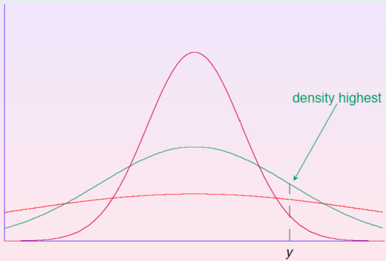
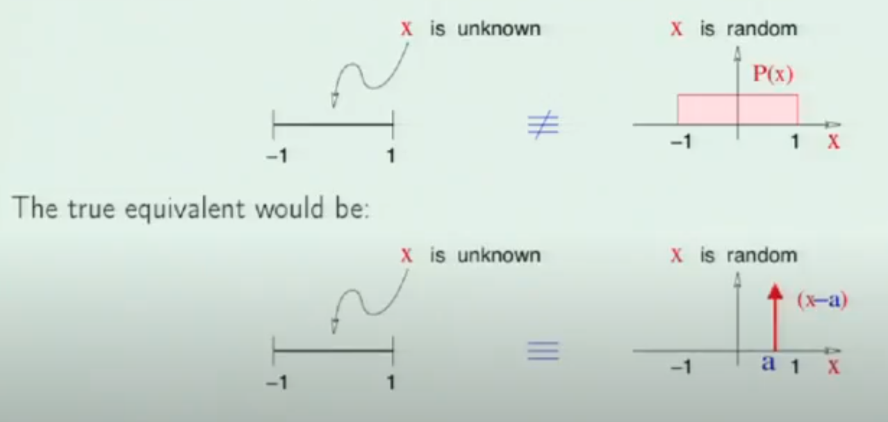
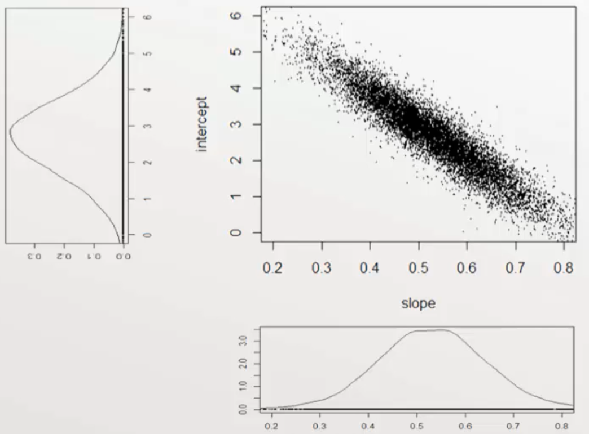

# Estimation

|             | $\theta$ is thought of as        | Maximize                                 |
| ----------- | -------------------------------- | ---------------------------------------- |
| Frequentist | Unknown constant                 | $p(D \vert \hat \theta)$<br />Likelihood |
| Bayesian    | Unknown random variable with PDF | $p(\hat \theta \vert D)$                 |

## MLE

Maximum Likelihood Estimation

1. Predict a probability distribution $\hat p(y \vert x)$
2. Get the likelihood of $\hat p$ wrt the data
3. Update $\hat p$ that maximizes the likelihood
4. Go to step 1

### IDK

To minimize the KL divergence between $\hat p$ and $p$, and we maximize the likelihood of $\hat p$
$$
\begin{aligned}
\arg \min_{\hat p} D_\text{KL}(p \vert \vert \hat p)
&=
\arg \min_{\hat p} E_{D \sim p} \ln \left \vert \dfrac{\hat p(x, y)}{p(x, y)} \right \vert \\
&=
\arg \min_{\hat p} \underbrace{E_{D \sim p} \ln p(x, y)}_{\mathclap {\text{Constant}}} - \underbrace{E_{D \sim p} \ln \hat p(x, y)}_{\approx \ln L(\hat p), \ n \to \infty} \\
& \approx
\arg \min_{\hat p} - L(\hat p)
=
\arg \max_{\hat p}  L(\hat p)
\end{aligned}
$$
Since we do not know $p$, we can estimate $E_{D \sim p} \ln \hat p(x, y)$, using Monte-Carlo estimation and Law of Large numbers
$$
E_{D \sim p} \ln \hat p(x, y) {\approx \ln L(\hat p), \ n \to \infty}
$$

### Likelihood

Probability of observing data $x$ according to pdf $p(x)$

$$
\begin{aligned}
L(p)
&= Pr_q(x) \\
&= \prod_{i=1}^n p(x_i) \\
\implies \ln L(p)
&= \sum_{i=1}^n \ln p(x_i) \\
\end{aligned}
$$

$$
\begin{aligned}
\mathcal{L}
&= P(y_i \vert x_i, \hat \theta) \\
&= p(y_1, y_2, \dots, y_n \vert x_i,  \hat \theta)
\end{aligned}
$$

### Estimation

Chooses a distribution $p(x)$ that maximizes the (log) likelihood function for $x$

Below example shows MLE for a single point



### MLE for Regression

If we assume that the data is normally distributed, and we want unbiased prediction, then $u_i \sim N(0, \sigma^2_i)$
$$
\begin{aligned}
\mathcal{L} &= P(u_1, u_2, \dots, u_n \vert \hat \theta) \\
&= \prod_i^n P(u_i) \\
&= \prod_i^n \dfrac{1}{\sqrt{2 \pi \sigma^2_i}}
\times
\exp \left[\dfrac{-1}{2} \left(\dfrac{u_i-\mu_i}{\sigma_i} \right)^2 \right]\\
&= \prod_i^n \dfrac{1}{\sqrt{2 \pi \sigma^2_i}}
\times
\exp \left[\dfrac{-1}{2} \left(\dfrac{u_i
}{\sigma_i} \right)^2 \right] & (\mu_u=0)
\end{aligned}
$$

$$
\begin{aligned}
\ln \vert \mathcal{L} \vert
&= \dfrac{-1}{2} \Big[
n \ln \vert 2 \pi \sigma^2_i \vert + \chi^2
\Big] \\
\implies
-2 \ln \vert \mathcal{L} \vert
&= n \ln \vert 2 \pi \sigma^2_i \vert + \chi^2 \\

&= n \ln \vert 2 \pi \vert + n \ln \vert \text{MSE} \vert + n + \sum_i^n \ln \vert w_i \vert \\
&\approx n \ln \vert \text{MSE} \vert
\end{aligned}
$$

#### Optimization

$$
\begin{aligned}
\implies
\max(\mathcal{L})
& \propto \min (-2 \ln \mathcal{L}) \\
& \propto \min (\chi^2_{n-k, 0}) \\
\implies \mathcal{L}
& \propto e^{-\chi^2_{n-k, 0}}
\end{aligned}
$$

By setting derivative to 0, we can also use this to derive expression for Matrix Normal Expression

#### Note

$$
\begin{aligned}
E[\chi^2]
&= n-p \\

\implies E[-2 \ln \vert \mathcal{L} \vert]
&= n \ln \vert 2 \pi \sigma^2_i \vert + (n-p)
\end{aligned}
$$

### MLE for Classification

Assume that $y \sim \text{Bernoulli}(p)$
$$
\mathcal L =
$$

### M-Estimation

Minimize some other loss function weighted compare to MLE, such as MAE, Huber, etc

## Bayesian

When is it justified?

- Prior is valid: Better than MLE
- Prior is irrelevant: Just a computational catalyst

$$
\begin{aligned}
\underbrace{P(\hat f = f \vert D)}_{\mathclap{\text{Posterior Distribution} \qquad}}
&= \frac{
	\overbrace{P(D \vert \hat f=f)}^{\mathclap{\text{Likelihood} }}
	\times
	\overbrace{P(\hat f = f)}^{\mathclap{\qquad \quad \text{Prior Distribution}}}
}{
	\underbrace{P(D)}_{\mathclap{\qquad \text{Normalizing constant}}}
}
\\
& \propto
P(D \vert \hat f=f) \times P(\hat f=f)
\end{aligned}
$$

- $D = y \vert x$
- $P(\hat f = f)$ is the prior belief of our understanding of
  - Distribution of model parameters
  - Distribution of residuals

Usually we need to solve Bayes’ equation numerically using MCMC: Markov Chain Monte Carlo sampling. Result is set of points from posterior distribution that we summarize

Disadvantage: We need to calculate a lot of probabilities -> Computationally-expensive

| Hypothesis                       |                                                     |                                                              |
| -------------------------------- | --------------------------------------------------- | ------------------------------------------------------------ |
| Maximum Likelihood               | Model that best explains the training data          | $h_\text{ML} = \underset{h_i \in H}{\arg \max} \ P(D \vert  h_i)$ |
| Maximum A Posteriori Probability | Model that is most probable given the training data | $h_\text{MAP} = something$                                   |

### Steps

1. Pick prior distribution
2. Calculate likelihood function, similar to MLE
3. Calculate posterior distribution, usually numerically
4. Summarize posterior distribution
   1. MAP estimate
   2. Credible interval

### Prior Distribution

$P(\theta) = P(\theta \vert I)$, where $I=$ all info we have before data collection

| Prior                                        |                                                              |
| -------------------------------------------- | ------------------------------------------------------------ |
| Uninformative/<br />Objective/<br />Baseline | If we have no prior knowledge, then $P(\theta \vert I)=$ constant<br /><br />Hence, $P(\hat \theta \vert D) = P(D \vert \hat \theta)$, so might as well perform MLE instead<br /><br />eg: Uniform dist over expected range of possible values |
| Informative/<br />Substantive                | Based on previous data, experiments, knowledge<br /><br />One can assume that the prior for each parameter is independent of others $P(\theta)=P(\beta) P(\sigma^2)$, but usually a joint dist is required<br /><br />Setting prior to delta function fixes parameter independent of data (never done in practice, as it ignores the point of data) |



#### Reparametrization

Helps make prior assignment easy

For eg:
$$
\begin{aligned}
\hat y_i &= \beta_0 + \beta_1 x_i \\
\implies
\hat y_i &= \beta_0' + \beta_1 (x_i - \bar x) \\ \\
\text{Hence } 
\beta_0 &= \hat y_i \vert (x_i=0) \\
\implies
\beta_0' &= \hat y_i \vert (x_i = \bar x)
\end{aligned}
$$

- This makes it easier to specify the prior for the intercept
- We can assume that $\beta_0'$ is independent of $\beta_1$’s prior

#### Conjugate Priors

Special cases of priors only for which analytical solutions of the posterior distribution are possible with given likelihood distribution

For eg:

- iid normal errors
  - conjugate prior for $\beta$ is normal
  - conjugate prior for $\sigma^2_u$ is inverse gamma

### Posterior Distribution

Output of Bayesian estimation is not best fit parameters, it is the posterior distribution: probability distribution for each parameter and $\sigma_e$

We need to summarize the distribution

- Best estimate: Summary statistic such as
  - mode (Maximum a posteriori)
  - mean
  - median
  - etc
- Credible interval: Quantiles

Posterior distribution describes how much the data has changed our prior beliefs



#### Bernstein-von Mises Theorem

For very large $n$, posterior distribution becomes independent of the prior distribution, as long as the prior $\not \in \{0, 1 \}$

Posterior tends towards normal distribution equal to MLE (assuming iid)

### Problems

- Computationally-expensive
- Choosing appropriate prior
- Is it reasonable to treat every parameter as a random variable

## MLE + Bayesian

### Relationship

MLE = Bayesian with Jeffreys Prior

#### Jeffreys Prior

$$
P(\beta, \sigma^2_u) \propto 1/\sigma^2_u
$$

It is improper as it adds upto $\infty$, not $1$

The resulting posterior distribution is $t$ distributed about MLE parameter estimates

### IDK

Taking $-\ln$ of Bayes’ equation
$$
\begin{aligned}
- \ln p(\hat \theta \vert D)
&=
- \ln L
- \ln p(\hat \theta)
+ \underbrace{\ln p(D)}_\text{constant} \\
\min \{ - \ln p(\hat \theta \vert D) \}
&=
\min
\{
- \ln L
- \ln p(\hat \theta)
+ \cancel{\ln p(D)}
\} \\
&=
\min
\{
\chi^2
+ \sum_{j=1}^{k}
\left(
\dfrac{\hat \beta - \mu_{\beta}}{\sigma_\beta}
\right)^2
\} \\
&= \text{Regularized Regression}
\end{aligned}
$$

## Likelihood

```python
def ll(X, y, pred):
    # return log likelihood
    
		mse = np.mean(
      (y - pred)
      **2
    )
    
    n = float(X.shape[0])
    n_2 = n/2
    
    return -n_2*np.log(2*np.pi) - n_2*np.log(mse) - n_2

def aic(X, y, pred):
  	p = X.shape[1]
    
    return -2*ll(X, y, pred) + 2*p

print(aic(X, y, pred))
```

