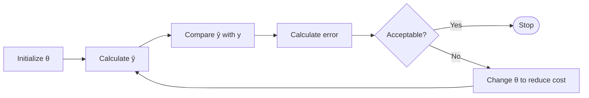

## Training Process

## Popular Optimization Algorithms

|                             | Meaning                     |
| --------------------------- | --------------------------- |
| Gradient Descent            |                             |
| Stochastic Gradient Descent | Randomized Gradient Descent |
| Adam Optimizer              |                             |

## Gradient Descent

Using derivative of cost function

$$
\theta_{\text{new}} =
\theta_{\text{prev}} -
\eta \ 
{\nabla J}
$$

|                       | Meaning                         |
| --------------------- | ------------------------------- |
| $\theta_{\text{new}}$ |                                 |
| $\theta_{\text{old}}$ |                                 |
| $\eta$                | Learning Rate                   |
| $\nabla J$            | Gradient vector of $J (\theta)$ |

$$
\frac{
\partial J(\theta)
}{
\partial Q
} =
\frac{1}{m}
\sum (\hat y - y) x
$$

$$
\begin{aligned}
\nabla J(\theta)
& \approx 1 \\
\begin{bmatrix}
\frac{ \partial J(\theta) }{\partial \theta_1} \\
\frac{ \partial J(\theta) }{\partial \theta_2} \\
\textcolor{orange}{
  \frac{ \partial J(\theta) }{\partial \theta_0}
}
\end{bmatrix}
&\approx 1
\end{aligned}
$$

Using equation

$$
\nabla J(\theta) =
\begin{bmatrix}
\Big(\sigma(\theta^T x) - y \Big) x_1 \\
\Big(\sigma(\theta^T x) - y \Big) x_2 \\
\Big(\sigma(\theta^T x) - y \Big)
\end{bmatrix}
$$

$$
\sigma(\theta^T x) = \sigma(\theta_1 x_1 + \theta_2 x_2 + \theta_0)
$$

Constant is at the end

## Learning Rate $\eta$

$0 < \eta < 1$

- Large value may lead to underfitting/overfitting
- Small value will lead to more time taken