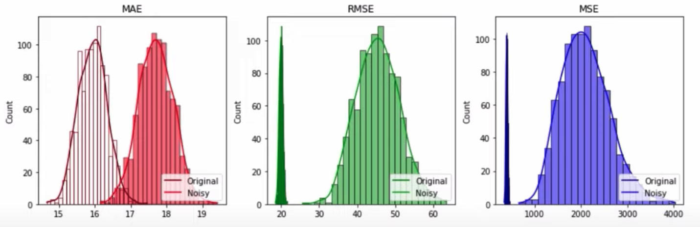
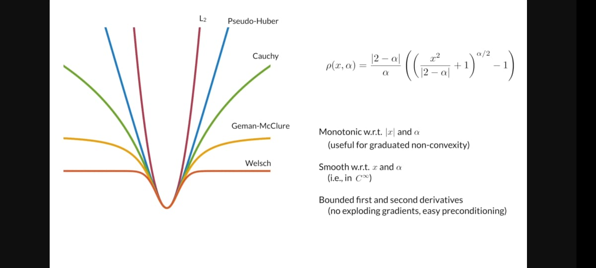

# Cost Function

## Error

Usually, we define error as

$$
u_i = \hat y_i - y_i
$$

Bayes’ Error is the error incurred by an ideal model, which is one that makes predictions from true distribution $P(x,y)$; even such a model incurs some error due to noise/overlap in the distributions

### Deming Regression/Total Least Squares

Useful for when data has noise due to

- Measurement error
- Need for privacy etc, such as when conducting a salary survey.

$$
\begin{aligned}
u_i &= (\hat y_i - y_i)^2  + \lambda (\hat x_i - x_i)^2 \\
\hat y_i &= \hat \beta_0 + \hat \beta_1 x_i \\
\hat x_i &= \dfrac{y_i - \beta_0}{\beta_1} \\
\lambda &= \dfrac{\sigma^2(\text{known measurement error}_x)}{\sigma^2(\text{known measurement error}_y)}
\end{aligned}
$$

| Measurement Error of Regressor | $\lambda$ |            |
| ------------------------------ | --------- | ---------- |
| 0                              | 0         | OLS        |
| Same as Response               | 1         | Orthogonal |

## Loss Functions $L(\theta)$

$$
\text{Loss}_i = L(\theta, u_i)
$$

- Penalty for a single point (absolute value, squared)
- Only error terms

## Regression Loss

| Metric                                                     |                           $L(u_i)$                           | Optimizing gives __ of conditional distribution |                       Preferred Value                        |     Unit      |        Range        | Signifies                                                    | Advantages ✅                                            | Disadvantages ❌                                         | Comment                                                      | $\alpha$ of advanced family |
| :--------------------------------------------------------- | :----------------------------------------------------------: | ----------------------------------------------- | :----------------------------------------------------------: | :-----------: | :-----------------: | ------------------------------------------------------------ | ------------------------------------------------------------ | ------------------------------------------------------------ | :----------------------------------------------------------- | --------------------------- |
| Indicator/ Zero-One/ Misclassification           | $\begin{cases} 0, & u_i = 0 \\ 1, & \text{o.w} \end{cases}$  | Mode                                            |                                                              |               |                     |                                                              |                                                              |                                                              |                                                              |                             |
| BE (Bias Error)                                       |                            $u_i$                             |                                                 | $\begin{cases} 0, & \text{Unbiased} \\ >0, & \text{Over-prediction} \\ <0, & \text{Under-pred} \end{cases}$ |  Unit of $y$  | $(-\infty, \infty)$ | Direction of error bias Tendency to overestimate/underestimate |                                                              | Cannot evaluate accuracy, as equal and opposite errors will cancel each other, which may lead to non-optimal model having error=0 |                                                              |                             |
| L1/ AE (Absolute Error)/ Manhattan distance |                     $\vert  u_i  \vert$                      | Median                                          |                         $\downarrow$                         |  Unit of $y$  |    $[0, \infty)$    |                                                              | Robust to outliers                                           | Not differentiable at origin, which causes problems for some optimization algo There can be multiple optimal fits Does not penalize large deviations |                                                              |                             |
| L2/ SE (Squared Error)/ Euclidean distance       |                          ${u_i}^2$                           | Mean                                            |                         $\downarrow$                         | Unit of $y^2$ |    $[0, \infty)$    | Variance of errors with mean as MDE Maximum log likelihood | Penalizes large deviations                                   | Sensitive to outliers                                        |                                                              | $\approx 2$                 |
| L3/ Smooth L1/ Pseudo-Huber/ Charbonnier    | $\begin{cases} \dfrac{u_i^2}{2 \epsilon}, & \vert u_i \vert < \epsilon \\ \vert u_i \vert - \dfrac{\epsilon}{2}, & \text{o.w} \end{cases}$ |                                                 |                         $\downarrow$                         |               |    $[0, \infty)$    |                                                              | Balance b/w L1 & L2 Prevents exploding gradients Robust to outliers |                                                              | Piece-wise combination of L1&L2                              | 1                           |
| Huber                                                      | $\begin{cases} \dfrac{u_i^2}{2}, & \vert u_i \vert < \epsilon \\ \epsilon \vert u_i \vert - \dfrac{\epsilon^2}{2}, & \text{o.w} \end{cases}$ $(\epsilon_\text{recommended} = 1.345 \sigma_u)$ |                                                 |                         $\downarrow$                         |               |    $[0, \infty)$    |                                                              | Same as Smooth L1                                            | Computationally-expensive for large datasets $\epsilon$ needs to be optimized Only first-derivative is defined | Piece-wise combination of L1&L2 $H = \epsilon \times {L_1}_\text{smooth}$ Solution behaves like a trimmed mean: (conditional) mean of two (conditional) quantiles |                             |
| Log Cosh                                                   | $\Big\{ \log \big( \ \cosh (u_i) \ \big) \Big \} \\ \approx \begin{cases} \dfrac{{u_i}^2}{2}, & \vert u_i \vert \to 0 \\ \vert u_i \vert - \log 2, & \vert u_i \vert \to \infty \end{cases}$ |                                                 |                         $\downarrow$                         |               |                     |                                                              | Same as Smooth L1 Doesn’t require hyperparameter tuning Double differentiable |                                                              |                                                              |                             |
| Cauchy/ Lorentzian                                    | $\dfrac{\epsilon^2}{2} \times \log \Big[ 1 + \left( \dfrac{{u_i}}{\epsilon} \right)^2 \Big]$ |                                                 |                         $\downarrow$                         |               |                     |                                                              | Same as Smooth L1                                            | Not convex                                                   |                                                              | 0                           |
| Log-Barrier                                                | $\begin{cases} - \epsilon^2 \times \log \Big(1- \left(\dfrac{u_i}{\epsilon} \right)^2 \Big) , & \vert u_i \vert \le \epsilon \\ \infty, & \text{o.w} \end{cases}$ |                                                 |                                                              |               |                     |                                                              |                                                              | Solution not guaranteed                                      | Regression loss $< \epsilon$, and classification loss further |                             |
| $\epsilon$-insensitive                                     | $\begin{cases} 0, & \vert u_i \vert \le \epsilon \\ \vert u_i \vert - \epsilon, & \text{otherwise} \end{cases}$ |                                                 |                                                              |               |                     |                                                              |                                                              | Non-differentiable                                           |                                                              |                             |
| Bisquare/ Welsch/ Leclerc                        | $\begin{cases} \dfrac{\epsilon^2}{6 \left(1- \left[1-\left( \dfrac{u_i}{\epsilon} \right)^2 \right]^3 \right)}, & \vert u_i \vert < \epsilon \\ \dfrac{\epsilon^2}{6}, & \text{o.w} \end{cases}$ $\epsilon_\text{recommended} = 4.685 \sigma_u$ |                                                 |                         $\downarrow$                         |               |                     |                                                              | Robust to outliers                                           | Suffers from local minima (Use huber loss output as initial guess) | Ignores values after a certain threshold                     | $\infty$                    |
| Geman-Mclure                                               |                                                              |                                                 |                                                              |               |                     |                                                              |                                                              |                                                              |                                                              | -2                          |
| Quantile/Pinball                                           | $\begin{cases} q \vert u_i \vert , & \hat y_i < y_i \\ (1-q) \vert u_i \vert, & \text{o.w} \end{cases}$ $q = \text{Quantile}$ | Quantile                                        |                         $\downarrow$                         |  Unit of $y$  |                     |                                                              | Robust to outliers                                           | Computationally-expensive                                    |                                                              |                             |
| Expectile                                                  | $\begin{cases} e (u_i)^2 , & \hat y_i < y_i \\ (1-e) (u_i)^2, & \text{o.w} \end{cases}$ $e = \text{Expectile}$ | Expectable                                      |                         $\downarrow$                         | Unit of $y^2$ |                     |                                                              |                                                              |                                                              | Expectiles are a generalization of the expectation in the same way as quantiles are a generalization of the median |                             |
| APE (Absolute Percentage Error)                       |       $\left \lvert  \dfrac{ u_i }{y_i}  \right \vert$       |                                                 |                         $\downarrow$                         |       %       |    $[0, \infty)$    |                                                              | Easy to understand Robust to outliers                   | Explodes when $y_i \approx 0$ Division by 0 error when $y_i=0$ Asymmetric: $\text{APE}(\hat y, y) \ne \text{APE}(y, \hat y) \implies$ Penalizes over-prediction more than under-prediction Sensitive to measurement units |                                                              |                             |
| Symmetric APE                                              | $\left \lvert  \dfrac{ u_i }{\hat y_i + y_i}  \right \vert$  |                                                 |                                                              |               |                     |                                                              |                                                              |                                                              | Denominator is meant to be mean($\hat y, y$), but the 2 is cancelled for appropriate range |                             |
| SSE (Squared Scaled Error)                            |   $\dfrac{ 1 }{\text{SE}(y_\text{naive}, y)} \cdot u_i^2$    |                                                 |                         $\downarrow$                         |       %       |    $[0, \infty)$    |                                                              |                                                              |                                                              |                                                              |                             |
| ASE (Absolute Scaled Error)                           | $\dfrac{ 1 }{\text{AE}(y_\text{naive}, y)} \cdot \vert u_i \vert$ |                                                 |                         $\downarrow$                         |       %       |    $[0, \infty)$    |                                                              |                                                              |                                                              |                                                              |                             |
| ASE Modified                                               | $\left \lvert \dfrac{ u_i }{y_\text{naive} - y_i} \right \vert$ |                                                 |                         $\downarrow$                         |       %       |    $[0, \infty)$    |                                                              |                                                              | Explodes when $\bar y - y_i \approx 0$ Division by 0 error when $\bar y - y_i \approx 0$ |                                                              |                             |
| WMAPE (Weighted Mean Absolute Percentage Error)       | $\dfrac{1}{n} \left(\dfrac{ \sum \vert  u_i \vert  }{\sum \vert  y_i  \vert}\right)$ |                                                 |                         $\downarrow$                         |       %       |    $[0, \infty)$    |                                                              | Avoids the  limitations of MAPE                              | Not as easy to interpret                                     |                                                              |                             |
| MSLE (Mean Squared Log Error)                         | $\dfrac{1}{n} \sum( \log_{1p} \hat y_i - \log_{1p} y_i  )^2$ |                                                 |                         $\downarrow$                         | Unit of $y^2$ |    $[0, \infty)$    | Equivalent of log-transformation before fitting              | - Robust to outliers - Robust to skewness in response distribution - Linearizes relationship | - Penalizes under-prediction more than over-prediction - Penalizes large errors very little, even lesser than  MAE (still larger than small errors, but weight penalty inc very little with error) - Less interpretability |                                                              |                             |
| RMSLE (Root MSLE)                                     |                     $\sqrt{\text{MSLE}}$                     |                                                 |                         Same as MSE                          |  Unit of $y$  |     Same as MSE     |                                                              | Same as MSLE                                                 | Same as MSLE                                                 |                                                              |                             |
| RAE (Relative Absolute Error)                         | $\dfrac{\sum \vert  u_i \vert}{\sum \vert y_\text{naive} - y_i  \vert}$ |                                                 |                         $\downarrow$                         |       %       |    $[0, \infty)$    | Scaled MAE                                                   |                                                              |                                                              |                                                              |                             |
| RSE (Relative Square Error)                           |   $\dfrac{\sum  (u_i)^2 }{\sum (y_\text{naive} - y_i)^2 }$   |                                                 |                         $\downarrow$                         |       %       |    $[0, \infty)$    | Scaled MSE                                                   |                                                              |                                                              |                                                              |                             |
| Peer Loss                                                  | $L(\hat y_i \vert x_i, y_i) - L \Big(y_{\text{rand}_j} \vert x_i, y_{\text{rand}_j} \Big)$ $L(\hat y_i \vert x_i, y_i) - L \Big(\hat y_j \vert x_k, y_j \Big)$ Compare loss of actual prediction with predicting a random value |                                                 |                                                              |               |                     | Actual information gain                                      | Penalize overfitting to noise                                |                                                              |                                                              |                             |
| Winkler score $W_{p, t}$                                   |    $\dfrac{Q_{\alpha/2, t} + Q_{1-\alpha/2, t}}{\alpha}$     |                                                 |                         $\downarrow$                         |               |                     |                                                              |                                                              |                                                              |                                                              |                             |
| CRPS (Continuous Ranked Probability Scores)           |               $\overline Q_{p, t}, \forall p$                |                                                 |                         $\downarrow$                         |               |                     |                                                              |                                                              |                                                              |                                                              |                             |
| CRPS_SS (Skill Scores)                                | $\dfrac{\text{CRPS}_\text{Naive} - \text{CRPS}_\text{Method}}{\text{CRPS}_\text{Naive}}$ |                                                 |                         $\downarrow$                         |               |                     |                                                              |                                                              |                                                              |                                                              |                             |

### Outlier Sensitivity

 

### Advanced Loss

$$
L(u, \alpha, c) = \frac{\vert 2-\alpha \vert}{\alpha} \times \left[
\left(
\dfrac{(x/c)^2}{\vert 2-\alpha \vert} + 1
\right)^{\alpha/2}
-1
\right]
$$

### Adaptive Loss

No hyper-parameter tuning!, as $\alpha$ is optimized for its most optimal value as well

If the selection of $\alpha$ wants to discount the loss for outliers, it needs to increase the loss for inliers

$$
\begin{aligned}
\text{L}'
&= -\log P(u \vert \alpha) \\
&= L(u, \alpha) + \log Z(\alpha)
\end{aligned}
$$

## Classification Loss

Should be tuned to control which type of error we want to minimize

- overall error rate
- false positive rate (FPR)
- false negative rate (FNR)

| Metric                                                       | Formula                                                      |     Range     | Preferred Value | Meaning                                                      | Advantages                      | Disadvantages                                             |
| ------------------------------------------------------------ | :----------------------------------------------------------- | :-----------: | :-------------: | ------------------------------------------------------------ | ------------------------------- | --------------------------------------------------------- |
| Indicator/ Zero-One/ Misclassification             | $\begin{cases} 0, & \hat y = y \\ 1, & \text{o.w} \end{cases}$ |   $[0, 1]$    |       $0$       | Produces a Bayes classifier that maximizes the posterior probability | Easy to interpret               | Treats all error types equally Minimizing is np-hard |
| Modified Indicator                                           | $\begin{cases} 0, & \hat y = y \\ a, & \text{FP} \\ b, & \text{FN} \end{cases}$ |               |       $0$       |                                                              | Control on type of error to min | Harder to interpret                                       |
| **Cross Entropy**/ Log Loss/ Negative Log Likelihood | $-\sum\limits_c^C p_c \cdot \ln \hat p_c$ such that $\sum p_i = \sum q_i$ | $[0, \infty]$ |  $\downarrow$   | Minimizing gives us $p=q$ for $n>>0$ (Proven using Lagrange Multiplier Problem) Information Gain $\propto \dfrac{1}{\text{Entropy}}$ Entropy: How much information gain we have |                                 |                                                           |
| Binary cross entropy/ Logistic                          | $-\log \Big(\sigma(-\hat y \cdot y_i) \Big) = \log(1 + e^{-\hat y \cdot y_i})$ $y, \hat y \in \{-1, 1 \}$ |               |                 |                                                              |                                 |                                                           |
| Gini Index                                                   | $\sum\limits_c^C p_c (1 - \hat p_c)$                         |               |                 |                                                              |                                 |                                                           |
| Exponential                                                  | $\exp (-\hat y \cdot y)$ $y \in \{ -1, 1 \}$            |               |                 |                                                              |                                 |                                                           |
| KL (Kullback-Leibler) Divergence/ Relative entropy/ Cross Entropy - Entropy | $H(p, q) - H(p)$                                             |               |                 |                                                              |                                 |                                                           |
| Hinge                                                        | Maximize the minimum margin                                  |               |                 |                                                              |                                 |                                                           |

## Costs Functions $J(\theta)$

Aggregated penalty for entire set (mean, median) which is calculated once for each epoch, which includes loss function and/or regularization

This is the objective function on for our model to minimize
$$
J(\theta) = f( \ L(\theta) \ )
$$
where $f=$ summary statistic such as mean, etc

For eg:

- Mean(SE) = MSE, ie Mean Squared Error
- $\text{RMSE} = \sqrt{\text{MSE}}$
- Normalized RMSE = $\dfrac{\text{RMSE}}{y}$

### Robustness to outliers

In all the error metrics, we can replace mean with another summary statistic

- Median
- IQR
- Trimmed Mean

### Penalize number of predictors

Correction factor

$$
J'(\theta) = \dfrac{n}{n-k} \times J(\theta)
$$

###  Weighted Loss

$$
J'(\theta) = J(w_i \theta)
$$

where $J(\theta)$ is usual loss function

| Goal: Incorporate       | $w_i$                                                        | Prefer                                                       | Comment                                                      |
| ----------------------- | ------------------------------------------------------------ | ------------------------------------------------------------ | ------------------------------------------------------------ |
| Asymmetry of importance | $\Big( \text{sgn}(u_i) - \alpha \Big)^2 \\ \alpha \in [-1, 1]$ | $\begin{cases} \text{Under-estimation}, & \alpha < 0 \\ \text{Over-estimation}, & \alpha > 0 \end{cases}$ |                                                              |
| Observation Error       | $\dfrac{1}{1 + \sigma^2_{y_i}}$ Where $\sigma^2_{y_i}$ is the uncertainty associated with each observation. | Observations with low uncertainty                            | Maximum likelihood estimation                                |
| Measurement Error       | $\dfrac{1}{1 + \sigma^2_X}$ Where $\sigma^2_X$ is the error covariance matrix | Observations with high input measurement accuracy            |                                                              |
| Heteroskedasticity      | $\dfrac{1}{1 + \sigma^2_{yi}}$ Where $\sigma^2_i$ is the uncertainty associated with each observation. | Observations in regions of low variance                      |                                                              |
| Observation Importance  | Importance                                                   | Observations with high domain-knowledge importance           | For time series data, you can use $w_i = \text{Radial basis function(t)}$ - $\mu = t_\text{max}$ - $\sigma^2 = (t_\text{max} - t_\text{min})/2$ |

