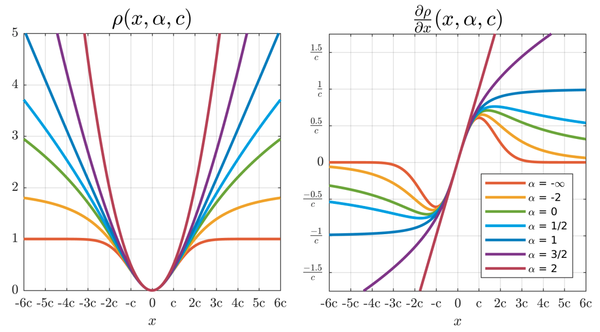
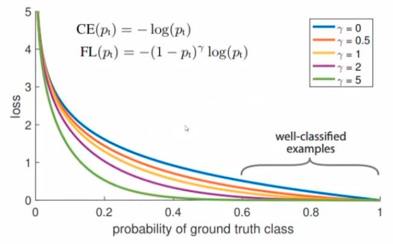

# Cost Function

Choosing an appropriate (or defining custom) error, loss, and cost functions is the most important aspect in Machine Learning, but often overlooked
- Defines "what is bad" for the model to correctly optimize for an appropriate scenario

## Goals

- [ ] Quality of Prediction
	- [ ] Minimize error bias -> accurate model
	- [ ] Minimize error variance -> precise model
- [ ] Sensitivity to data
	- [ ] Minimize model bias
	- [ ] Minimize model variance
- [ ] Generalization aspects
	- [ ] Minimize difference between in-sample and out-of-sample

## Error

Using [MLE](06_MLE.md), we define error as

$$
\begin{aligned}
u_i &= \hat y_i - y_i \\
u_i' &= \dfrac{u_i}{\sigma_{yi}}
\end{aligned}
$$

Usually we expect that $\sigma_{yi}=1$ and without any measurement noise

Bayes’ Error is the error incurred by an ideal model, which is one that makes predictions from true distribution $P(x,y)$; even such a model incurs some error due to noise/overlap in the distributions

### Total Regression

Total Least Squares

Note: TLS is non-convex, and can have multiple solutions
- Workarounds
	- perform OLS first to obtain initial weights
	- perform TLS with regularization

Methods

- Effective Variance
- Deming Regression
- Orthogonal regression
- Geometric mean
- Method of moments
- Full total regression

Useful for when data has noise due to

- Measurement error
- Need for privacy etc, such as when conducting a salary survey.

#### Effective Variance

$$
\begin{aligned}
\sigma^2_{{\text{eff}}_i}
&= \text{Uncertainty due to } y + \text{Uncertainty due to } x
\\
&=
\Big( \sigma^2_{y_{i}} + \sigma^2_{y_{i}, \text{meas}} \Big)
+
\Bigg[
1 + \sum_{j=1}^m \beta_{j}^2
\left( \sigma^2_{x_{ij}} + \sigma^2_{x_{ij}, \text{meas}} \right)
\Bigg]
\end{aligned}
$$

where
- $\sigma^2(\delta_{ij}) =$ measurement error in $x_{ij}$
	- For non-linear regression with $\tilde x_j = g(x_j)$, using delta approach  $\sigma^2(\delta_{ij}) = \sigma^2(\delta_{ij}) \cdot \Big(g'(x_j) \Big)^2$
- $\beta_j = \dfrac{\partial f}{\partial x_j}$
	- applies for linear/non-linear/non-parametric models
- the $1$ comes due to
	- $y = \beta_0 + \beta_1 x$
	- $\beta_0 + \beta_1 x \textcolor{hotpink}{-1}y =0$
	- $\sigma^2_x = \beta_1^2 + 1$

Use uncertainties package to calculate
- Variance of measurement & transformation function -> pass to function -> convert to ufloat -> perform operation -> return as numpy

Total Regression via IRWLS - Iteratively ReWeighted Least Squares

1. Run regression ignoring effective variance $\sigma_{xi}$
2. Use this model fit to calculate $\beta_j = \frac{\partial L}{\partial x_j} \quad \forall j$ 
3. Calculate the effective variance $\sigma^2_{i, \text{eff}} \quad \forall i$
4. Run weighted regression using 1/effective variance to weight the $u_i$
5. Repeated steps 2-4 until parameters converge (usually only 1-2 few iterations)

#### Deming Regression

$$
\begin{aligned}
L &= \left( \dfrac{u_i}{\sigma_{yi}} \right)^2  + \lambda \left( \dfrac{\hat x_i - x_i}{\sigma_{xi}} \right)^2 \\
\lambda &= \dfrac{\sigma^2(\text{known measurement error}_x)}{\sigma^2(\text{known measurement error}_y)} \\
\hat y_i &= \hat \beta_0 + \hat \beta_1 x_i \\
\hat x_i &= \dfrac{y_i - \beta_0}{\beta_1}
\end{aligned}
$$

OLS of $y_i \vert \hat x_i$ produces same fit as Deming of $y_i \vert x_i$

Assumes that there is no model error: all uncertainty in $x$ and $y$ is due to measurement

If Deming Regression and Method of Moments give different estimates, then the model specification may be incorrect

Deming regression is a type of total regression where you penalize error in estimating x, but this is difficult for multi variate: So total regression is better for multivariate

| Measurement Error of Regressor | $\lambda$ |            |
| ------------------------------ | --------- | ---------- |
| 0                              | 0         | OLS        |
| Same as Response               | 1         | Orthogonal |

#### Orthogonal Regression

- $\sigma_x = \sigma_y$
- Applied when you measure the same quantity with 2 different methods: for tool matching, calibration curves
- For straight-line model, $\sigma^2_{y_i, \text{eff}} \propto (1 + {\beta_1}^2)$

$$
\begin{aligned}
\sigma^2_{y_i, \text{eff}}
&= \sigma^2_y \left[
1 + \left(\dfrac{\partial f}{\partial x_i}\right)^2 \\
\right]
\\
\chi^2
&= \sum_{i=1}^n \left[ \dfrac{u_i}{\sqrt{1+{\beta_1}^2}} \right]^2
\end{aligned}
$$

#### Geometric Mean Regression

- Estimate slope as geometric mean of OLS slopes from $y \vert x$  and $x \vert y$
- $\beta_1 = \dfrac{s_y}{s_y}$

#### Method of Moments

If we know measurement error in $x:$ $\sigma_{\delta_x}$

Only good when $n>50$

$$
\begin{aligned}
\beta_1' &= \dfrac{\beta_1}{1 - \left(\dfrac{s_{\delta_x}}{s_x} \right)^2}
\\
\text{SE}(\beta_1') &= \dfrac{\beta_1}{\sqrt{n}} \sqrt{\dfrac{(s_x s_y)^2 + 2 (\beta_1 s^2_{\delta_x})^2}{(s_{xy})^2} - 1}
\end{aligned}
$$

## MSE vs Chi-Squared

- MSE($u_i$) may/may not $= \chi^2_\text{red}$
- MSE($u_i'$) $= \chi^2_\text{red}$

## Loss Functions ${\mathcal L}(\theta)$

$$
\text{Loss}_i = {\mathcal L}(\theta, u_i)
$$

- Penalty for a single point (absolute value, squared, etc)
- Should always be tailor-made for each problem, unless impossible
  - Need not be symmetric
  - Regression: Under-prediction and over-prediction can be penalized differently
  - Classification: False negative and false-positive can be penalized differently

### Properties of Loss Function

| Property                |                                                                                    |                               |
| ----------------------- | ---------------------------------------------------------------------------------- | ----------------------------- |
| Non-negativity          | ${\mathcal L}(u_i) \ge 0, \quad \forall i$                                         |                               |
| No penalty for no error | ${\mathcal L}(0)=0$                                                                |                               |
| Monoticity              | $\vert u_i \vert > \vert u_j \vert \implies {\mathcal L}(u_i) > {\mathcal L}(u_j)$ |                               |
| Differentiable          | Continuous derivative                                                              |                               |
| Symmetry                | ${\mathcal L}(-u_i)={\mathcal L}(+u_i)$                                            | Not necessary for custom loss |

### Combining loss functions

$$
L' = \sum w_i L_i
$$

- For asymmetric loss
	- $w_1 = \mathcal I [u<0], w_2 = \mathcal I[u>0]$
	- If smoothness of combined loss required, $w_1 = \sigma(u), w_2 = 1 - \sigma(u)$
	- Assymmetric MAE loss can be redefined as pinball/expectile loss, ...
		- Redefine $w_i$ such that $\sum w_i = 1$

### Weighted Loss

Related to weighted regression
$$
{\mathcal L}'(\theta) = {\mathcal L}(w_i \theta)
$$

$$
\begin{aligned}
u'_i &= u_i \times \sqrt[a]{w_i} \\
\text{SE}(u')
&= s_{u'} \\
&= \sqrt{\dfrac{\sum_{i=1}^n w_i (u_i)^2}{n-k}} \\
&= \sqrt{\dfrac{\sum_{i=1}^n (u_i')^2}{n-k}}
\end{aligned}
$$

where

- ${\mathcal J}(\theta)$ = usual loss function
- $a=$ exponent of the loss function (square, etc)

| Goal: Address                                                            | $w_i$                                                                                                      | Prefer                                                                                                    | Comment                                                                                                                                                                        |
| ------------------------------------------------------------------------ | ---------------------------------------------------------------------------------------------------------- | --------------------------------------------------------------------------------------------------------- | ------------------------------------------------------------------------------------------------------------------------------------------------------------------------------ |
| Asymmetry of importance                                                  | $\Big( \text{sgn}(u_i) - \alpha \Big)^2 \\ \alpha \in [-1, 1]$                                             | $\begin{cases} \text{Under-estimation}, & \alpha < 0 \\ \text{Over-estimation}, & \alpha > 0 \end{cases}$ | Be careful Biased forecast will reduce trust Instead, Better to balance risk of overforecasting and underforecasting for each product independently using business rules |
| Observation Error Measurement/Process  Heteroskedasticity | $\dfrac{1}{\sigma^2_{yi}}$ where $\sigma^2_{y_i}$ is the uncertainty associated with each observation | Observations with low uncertainty                                                                         | Maximum likelihood estimation                                                                                                                                                  |
| Input Error Measurement/Process                                     | $\dfrac{1}{\sigma^2_{X_i}}$ where $\sigma^2_X$ is the uncertainty associated                          | Observations with high input measurement accuracy                                                         |                                                                                                                                                                                |
| Observation Importance                                                   | Importance                                                                                                 | Observations with high domain-knowledge importance                                                        | For time series data, you can use $w_i = \text{Radial basis function(t)}$ - $\mu = t_\text{max}$ - $\sigma^2 = (t_\text{max} - t_\text{min})/2$                        |

## Regression Loss

| Metric                                                      |                                                                                                                                    ${\mathcal L}(u_i)$                                                                                                                                     | Does not require MAD studentizing | Optimizing gives __ of conditional distribution (not required to be Normal dist) | Optimizing gives                                                                     | Influence $\psi(u_i)$  $\dfrac{dL}{du}$                                                                  | $w_i$ compared to AE  ie, weight for residual | $w_i$ compared to SE                                                                                                                                                                                                   |                                                                             Preferred Value                                                                             |     Unit      |        Range        | Signifies                                                           | Advantages ✅                                                                                      | Disadvantages ❌                                                                                                                                                                                                                                                                                                                                                                                                                   | Comment                                                                                                                                                                     | $\alpha$ of advanced family | Breakdown Point | Efficiency | Tuning factor for 95% efficiency | Scale independent | Insensitive to outliers | Symmetric to over-underforecasting | Symmetric to swapping of true and forecasted | Can handle zeros |
| :---------------------------------------------------------- | :----------------------------------------------------------------------------------------------------------------------------------------------------------------------------------------------------------------------------------------------------------------------------------------: | --------------------------------- | -------------------------------------------------------------------------------- | ------------------------------------------------------------------------------------ | ----------------------------------------------------------------------------------------------------------------- | --------------------------------------------------- | ---------------------------------------------------------------------------------------------------------------------------------------------------------------------------------------------------------------------- | :---------------------------------------------------------------------------------------------------------------------------------------------------------------------: | :-----------: | :-----------------: | ------------------------------------------------------------------- | ------------------------------------------------------------------------------------------------------ | -------------------------------------------------------------------------------------------------------------------------------------------------------------------------------------------------------------------------------------------------------------------------------------------------------------------------------------------------------------------------------------------------------------------------------------- | :-------------------------------------------------------------------------------------------------------------------------------------------------------------------------- | --------------------------- | --------------- | ---------- | -------------------------------- | ----------------- | ----------------------- | ---------------------------------- | -------------------------------------------- | ---------------- |
| Indicator/ Zero-One/ Misclassification            |                                                                                                                $\begin{cases} 0, & u_i = 0 \\ 1, & \text{o.w} \end{cases}$                                                                                                                 |                                   | Mode                                                                             |                                                                                      |                                                                                                                   |                                                     |                                                                                                                                                                                                                        |                                                                                                                                                                         |               |                     |                                                                     |                                                                                                        |                                                                                                                                                                                                                                                                                                                                                                                                                                        |                                                                                                                                                                             |                             |                 |            |                                  |                   |                         |                                    |                                              |                  |
| Differentiable Mode Loss?                                   |                                                                                                                    Bin the continuous values Something with PyTorch                                                                                                                     |                                   | Mode                                                                             |                                                                                      |                                                                                                                   |                                                     |                                                                                                                                                                                                                        |                                                                                                                                                                         |               |                     |                                                                     |                                                                                                        |                                                                                                                                                                                                                                                                                                                                                                                                                                        |                                                                                                                                                                             |                             |                 |            |                                  |                   |                         |                                    |                                              |                  |
| BE (Bias Error)                                        |                                                                                                                                           $u_i$                                                                                                                                            |                                   |                                                                                  |                                                                                      |                                                                                                                   |                                                     |                                                                                                                                                                                                                        |                               $\begin{cases} 0, & \text{Unbiased} \\ >0, & \text{Over-prediction} \\ <0, & \text{Under-pred} \end{cases}$                               |  Unit of $y$  | $(-\infty, \infty)$ | Direction of error bias Tendency to overestimate/underestimate |                                                                                                        | Cannot evaluate accuracy, as equal and opposite errors will cancel each other, which may lead to non-optimal model having error=0                                                                                                                                                                                                                                                                                                      |                                                                                                                                                                             |                             |                 |            |                                  |                   |                         |                                    |                                              |                  |
| L1/ AE (Absolute Error)/ Manhattan distance  |                                                                                                                                    $\vert  u_i  \vert$                                                                                                                                     |                                   | Median                                                                           | Global minimum ignoring small portion                                                | $\text{sgn}(u_i)$                                                                                                 | $1$                                                 | $\dfrac{1}{\vert u_i \vert}$                                                                                                                                                                                           |                                                                              $\downarrow$                                                                               |  Unit of $y$  |    $[0, \infty)$    |                                                                     | Robust to outliers                                                                                     | Not differentiable at origin, which causes problems for some optimization algo There can be multiple optimal fits Does not penalize large deviations                                                                                                                                                                                                                                                                         | MLE for $\chi^2$ for Laplacian dist                                                                                                                                         |                             |                 | $74 \%$??? |                                  |                   |                         |                                    |                                              |                  |
| L2/ SE (Squared Error)/ Euclidean distance        |                                                                                                                                         ${u_i}^2$                                                                                                                                          |                                   | Mean                                                                             | Global minimum affected by whole dataset                                             | $u_i$                                                                                                             | $u_i$                                               | $1$                                                                                                                                                                                                                    |                                                                              $\downarrow$                                                                               | Unit of $y^2$ |    $[0, \infty)$    | Variance of errors with mean as MDE Maximum log likelihood     | Penalizes large deviations                                                                             | Sensitive to outliers                                                                                                                                                                                                                                                                                                                                                                                                                  | MLE for $\chi^2$ for normal dist                                                                                                                                            | $\approx 2$                 | $1/n$           | $100 \%$   |                                  |                   |                         |                                    |                                              |                  |
| Huber                                                       |                                          $\begin{cases} \dfrac{u_i^2}{2}, & \vert u_i \vert < \epsilon \\ \lambda \vert u_i \vert - \dfrac{\lambda^2}{2}, & \text{o.w} \end{cases}$  $(\lambda_\text{rec} = 1.345 \times \text{MAD}_u)$                                          |                                   |                                                                                  |                                                                                      | $\begin{cases} u_i, & \vert u_i \vert \le c \\ c \cdot \text{sgn}(u_i), & \text{o.w.} \end{cases}$                |                                                     | $\begin{cases} 1, & \vert u_i \vert < c \\ c/\vert u_i \vert, & \text{o.w.} \end{cases}$                                                                                                                               |                                                                              $\downarrow$                                                                               |               |    $[0, \infty)$    |                                                                     | Same as Smooth L1                                                                                      | Computationally-expensive for large datasets $\epsilon$ needs to be optimized Only first-derivative is defined                                                                                                                                                                                                                                                                                                               | Piece-wise combination of L1&L2 $H = \epsilon \times {L_1}_\text{smooth}$ Solution behaves like a trimmed mean: (conditional) mean of two (conditional) quantiles |                             |                 | $95 \%$    | $1.345$                          |                   |                         |                                    |                                              |                  |
| L1-L2 Pseudo-Huber/ Smooth L1/ Charbonnier         |                                                                                                    $\delta^2 \Bigg( \sqrt{1 + \dfrac{u_i}{\delta}^2} - 1 \Bigg)$  $\sqrt{1+x^2}$                                                                                                     |                                   |                                                                                  |                                                                                      | $\dfrac{u_i}{\sqrt{1+u_i^2}}$                                                                                     |                                                     | $\dfrac{1}{\sqrt{1+u_i^2}}$                                                                                                                                                                                            |                                                                              $\downarrow$                                                                               |               |    $[0, \infty)$    |                                                                     | Balance b/w L1 & L2 Prevents exploding gradients Robust to outliers Double differentiable | Requires tuning parameter                                                                                                                                                                                                                                                                                                                                                                                                              | Piece-wise combination of L1&L2                                                                                                                                             | 1                           |                 |            |                                  |                   |                         |                                    |                                              |                  |
| Log Cosh                                                    |                                       $\begin{aligned} & \ln \big( \ \cosh (u_i) \ \big) \\ & \approx \begin{cases} \dfrac{{u_i}^2}{2}, & \vert u_i \vert \to 0 \\ \vert u_i \vert - \log 2, & \vert u_i \vert \to \infty \end{cases} \end{aligned}$                                       |                                   |                                                                                  |                                                                                      |                                                                                                                   |                                                     |                                                                                                                                                                                                                        |                                                                              $\downarrow$                                                                               |               |                     |                                                                     | Doesn’t require parameter tuning Double differentiable                                            |                                                                                                                                                                                                                                                                                                                                                                                                                                        | Numerically unstable: Instead, use $u + \text{softplus}(-2u) - \log(2)$                                                                                                     |                             |                 |            |                                  |                   |                         |                                    |                                              |                  |
| Smoother L1?                                                |                                                                                                                                $u_i \cdot \text{erf}(u_i)$                                                                                                                                 |                                   |                                                                                  |                                                                                      |                                                                                                                   |                                                     |                                                                                                                                                                                                                        |                                                                                                                                                                         |               |                     |                                                                     | Doesn’t require parameter tuning Double differentiable                                            |                                                                                                                                                                                                                                                                                                                                                                                                                                        |                                                                                                                                                                             |                             |                 |            |                                  |                   |                         |                                    |                                              |                  |
| Generalized Power Cosh Loss                                 |                                          $\begin{aligned} u'_i = \cosh(u_i) \\ \begin{cases} \log \vert u'_i \vert, & \lambda = 0 \\ \dfrac{\text{sign}(u'_i) \vert u'_i \vert ^\lambda - 1}{\lambda}, & \lambda \ne 0 \end{cases} \end{aligned}$                                          |                                   |                                                                                  |                                                                                      |                                                                                                                   |                                                     |                                                                                                                                                                                                                        |                                                                                                                                                                         |               |                     |                                                                     |                                                                                                        |                                                                                                                                                                                                                                                                                                                                                                                                                                        |                                                                                                                                                                             |                             |                 |            |                                  |                   |                         |                                    |                                              |                  |
| LinEx Varian-Zellner                                     |                                                                                                                 $\dfrac{2}{a^2} \Bigg( \exp \{a u_i\} - 1 - a u_i \Bigg)$                                                                                                                  |                                   |                                                                                  |                                                                                      |                                                                                                                   |                                                     |                                                                                                                                                                                                                        | $a > 0$ penalizes $\begin{cases} \exp \{ u_i \} & <0 \\ u_i & >0 \end{cases}$  $a < 0$ penalizes $\begin{cases} u_i & <0 \\ \exp \{u_i \} & >0 \end{cases}$ |               |                     |                                                                     | Double differentiable                                                                                  |                                                                                                                                                                                                                                                                                                                                                                                                                                        | Assymmetric loss function When $a \to 0$, tends to Squared Error When $u_i \to 0$, regardless of $a$, tends to Squared Error          |                             |                 |            |                                  |                   |                         |                                    |                                              |                  |
| LinSq I tried?                                           |                                                                                                      $\sigma(u_i) \cdot u_i^2 \ + \ (1-\sigma(u_i)) \cdot \ln \Big( \cosh(u_i) \Big)$                                                                                                      | ✅                                 |                                                                                  |                                                                                      |                                                                                                                   |                                                     |                                                                                                                                                                                                                        |                                                                                                                                                                         |               |                     |                                                                     |                                                                                                        |                                                                                                                                                                                                                                                                                                                                                                                                                                        |                                                                                                                                                   |                             |                 |            |                                  |                   |                         |                                    |                                              |                  |
| Tweedie                                                     |                                                                                                                                                                                                                                                                                            |                                   |                                                                                  |                                                                                      |                                                                                                                   |                                                     |                                                                                                                                                                                                                        |                                                                                                                                                                         |               |                     |                                                                     |                                                                                                        |                                                                                                                                                                                                                                                                                                                                                                                                                                        |                                                                                                                                                                             |                             |                 |            |                                  |                   |                         |                                    |                                              |                  |
| Fair                                                        |                                                                                                       $c^2 \Bigg( \vert u_i \vert/c - \log \Big( 1 + \vert u_i \vert/c \Big) \Bigg)$                                                                                                       |                                   |                                                                                  |                                                                                      | $\dfrac{u_i}{1+(\vert u_i \vert/c)}$                                                                              |                                                     | $\dfrac{1}{1+(\vert u_i \vert/c)}$                                                                                                                                                                                     |                                                                                                                                                                         |               |                     |                                                                     | Triple differentiable                                                                                  | Convex                                                                                                                                                                                                                                                                                                                                                                                                                                 |                                                                                                                                                                             |                             |                 |            |                                  |                   |                         |                                    |                                              |                  |
| Cauchy/ Lorentzian                                     |                                                                            $\dfrac{\epsilon^2}{2} \times \log_b \Big[ 1 + \left( \dfrac{{u_i}}{\epsilon} \right)^2 \Big]$  Usually $\epsilon=1$ and $b=e$                                                                            | ✅                                 |                                                                                  |                                                                                      | $\dfrac{u_i}{1+(\vert u_i \vert/c)^2}$                                                                            |                                                     | $\dfrac{1}{1+(\vert u_i \vert/c)^2}$                                                                                                                                                                                   |                                                                              $\downarrow$                                                                               |               |                     |                                                                     | Same as Smooth L1                                                                                      | Not convex                                                                                                                                                                                                                                                                                                                                                                                                                             |                                                                                                                                                  | 0                           |                 |            | $2.385$                          |                   |                         |                                    |                                              |                  |
| Arctan                                                      |                                                                                   $\tan^{-1} (u_i)$  $\dfrac{\epsilon^2}{2} \times \tan^{-1} \Big[ \left( \dfrac{{u_i}}{\epsilon} \right)^2 \Big]$                                                                                   | ✅                                 |                                                                                  | Local minimum fitting small amount of data well, while ignoring large amount of data |                                                                                                                   |                                                     |                                                                                                                                                                                                                        |                                                                                                                                                                         |               |                     |                                                                     |                                                                                                        | Not convex                                                                                                                                                                                                                                                                                                                                                                                                                             |                                                                                                                                                  |                             |                 |            |                                  |                   |                         |                                    |                                              |                  |
| Andrews                                                     |                                                                                                                                       $1 - \cos(u)$                                                                                                                                        |                                   |                                                                                  |                                                                                      | $\begin{cases} u_i \cdot \dfrac{\sin(u_i/c)}{u_i/c}, & \vert u_i \vert \le \pi c \\ 0, & \text{o.w.} \end{cases}$ |                                                     | $\begin{cases} \dfrac{\sin(u_i/c)}{u_i/c}, & \vert u_i \vert \le \pi c \\ 0, & \text{o.w.} \end{cases}$                                                                                                                |                                                                                                                                                                         |               |                     |                                                                     |                                                                                                        |                                                                                                                                                                                                                                                                                                                                                                                                                                        |                                                                                                                                                                             |                             |                 |            | $1.339$                          |                   |                         |                                    |                                              |                  |
| Talworth                                                    |                                                                                                                                                                                                                                                                                            |                                   |                                                                                  |                                                                                      | $\begin{cases} u_i, & \vert u_i \vert < c \\ 0, & \text{o.w.} \end{cases}$                                        |                                                     | $\begin{cases} 1, & \vert u_i \vert < c \\ 0, & \text{o.w.} \end{cases}$                                                                                                                                               |                                                                                                                                                                         |               |                     |                                                                     |                                                                                                        |                                                                                                                                                                                                                                                                                                                                                                                                                                        |                                                                                                                                                                             |                             |                 |            | $2.795$                          |                   |                         |                                    |                                              |                  |
| Hampel                                                      |                                                                                                                                                                                                                                                                                            |                                   |                                                                                  |                                                                                      |                                                                                                                   |                                                     | $\begin{cases} 1, & \vert u_i \vert \le a \\ a/\vert u_i \vert, & \vert u_i \vert \in (a, b] \\ a/\vert u_i \vert \cdot \dfrac{c- \vert u_i \vert}{c-b}, & \vert u_i \vert \in (b, c] \\ 0, & \text{o.w.} \end{cases}$ |                                                                                                                                                                         |               |                     |                                                                     |                                                                                                        |                                                                                                                                                                                                                                                                                                                                                                                                                                        |                                                                                                                                                                             |                             |                 |            | $4, 2, 8$                        |                   |                         |                                    |                                              |                  |
| Logistic                                                    |                                                                                                                                                                                                                                                                                            |                                   |                                                                                  |                                                                                      |                                                                                                                   |                                                     | $\dfrac{\tanh(x/c)}{x/c}$                                                                                                                                                                                              |                                                                                                                                                                         |               |                     |                                                                     |                                                                                                        |                                                                                                                                                                                                                                                                                                                                                                                                                                        |                                                                                                                                                                             |                             |                 |            | $1.205$                          |                   |                         |                                    |                                              |                  |
| Log-Barrier                                                 |                                                             $\begin{cases} - \epsilon^2 \times \log \Big(1- \left(\dfrac{u_i}{\epsilon} \right)^2 \Big) , & \vert u_i \vert \le \epsilon \\ \infty, & \text{o.w} \end{cases}$                                                              | ❌                                 |                                                                                  |                                                                                      |                                                                                                                   |                                                     |                                                                                                                                                                                                                        |                                                                                                                                                                         |               |                     |                                                                     |                                                                                                        | Solution not guaranteed                                                                                                                                                                                                                                                                                                                                                                                                                | Regression loss $< \epsilon$, and classification loss further                                                                                                               |                             |                 |            |                                  |                   |                         |                                    |                                              |                  |
| $\epsilon$-insensitive                                      |                                                                                      $\begin{cases} 0, & \vert u_i \vert \le \epsilon \\ \vert u_i \vert - \epsilon, & \text{otherwise} \end{cases}$                                                                                       | ❌                                 |                                                                                  |                                                                                      |                                                                                                                   |                                                     |                                                                                                                                                                                                                        |                                                                                                                                                                         |               |                     |                                                                     |                                                                                                        | Non-differentiable                                                                                                                                                                                                                                                                                                                                                                                                                     |                                                                                                                                                                             |                             |                 |            |                                  |                   |                         |                                    |                                              |                  |
| Tukey/ Bisquare                                        | $\begin{cases} \dfrac{\lambda^2}{6 \left(1- \left[1-\left( \dfrac{u_i}{\lambda} \right)^2 \right]^3 \right)}, & \vert u_i \vert < \lambda \\ \dfrac{\lambda^2}{6}, & \text{o.w} \end{cases}$ $\lambda_\text{rec} = 4.685 \times \text{MAD}_u$   $\min \{u_i^2, \lambda^2 \}$ | ❌                                 |                                                                                  |                                                                                      | $\begin{cases} u_i \left(1-(u_i/c)^2 \right)^2, & \vert u_i \vert < c \\ 0, & \text{o.w.} \end{cases}$            |                                                     | $\begin{cases} \left(1-(u_i/c)^2 \right)^2, & \vert u_i \vert < c \\ 0, & \text{o.w.} \end{cases}$                                                                                                                     |                                                                              $\downarrow$                                                                               |               |                     |                                                                     | Robust to outliers                                                                                     | Suffers from local minima (Use huber loss output as initial guess)                                                                                                                                                                                                                                                                                                                                                                     | Ignores values after a certain threshold                                                                                                                                    | $\infty$                    |                 |            | $4.685$                          |                   |                         |                                    |                                              |                  |
| Welsch/ Leclerc                                          |                                                                                                               $\dfrac{c^2}{2} \Bigg( 1 - \exp \Big(-(u_i/c)^2 \Big) \Bigg)$                                                                                                                |                                   |                                                                                  |                                                                                      | $u_i \exp \left( \dfrac{-(u_i/c)^2}{c} \right)$                                                                   |                                                     | $\exp \left( \dfrac{-(u_i/c)^2}{c} \right)$                                                                                                                                                                            |                                                                                                                                                                         |               |                     |                                                                     |                                                                                                        |                                                                                                                                                                                                                                                                                                                                                                                                                                        |                                                                                                                                                                             |                             |                 |            | $2.985$                          |                   |                         |                                    |                                              |                  |
| Geman-Mclure                                                |                                                                                                                                  $\dfrac{u_i^2}{1+u_i^2}$                                                                                                                                  |                                   |                                                                                  |                                                                                      | $\dfrac{u_i}{(1+u_i^2)^2}$                                                                                        |                                                     | $\dfrac{1}{(1+u_i^2)^2}$                                                                                                                                                                                               |                                                                                                                                                                         |               |                     |                                                                     |                                                                                                        |                                                                                                                                                                                                                                                                                                                                                                                                                                        |                                                                                                                                                                             | -2                          |                 |            |                                  |                   |                         |                                    |                                              |                  |
| Quantile/Pinball                                            |                                                                             $\begin{cases} q \vert u_i \vert , & \hat y_i < y_i \\ (1-q) \vert u_i \vert, & \text{o.w} \end{cases}$ $q = \text{Quantile}$                                                                             |                                   | Quantile                                                                         |                                                                                      |                                                                                                                   |                                                     |                                                                                                                                                                                                                        |                                                                              $\downarrow$                                                                               |  Unit of $y$  |                     |                                                                     | Robust to outliers                                                                                     | Computationally-expensive                                                                                                                                                                                                                                                                                                                                                                                                              |                                                                                                                                                                             |                             |                 |            |                                  |                   |                         |                                    |                                              |                  |
| Expectile                                                   |                                                                                    $\begin{cases} e (u_i)^2 , & \hat y_i < y_i \\ (1-e) (u_i)^2, & \text{o.w} \end{cases}$ $e = \text{Expectile}$                                                                                     |                                   | Expectile                                                                        |                                                                                      |                                                                                                                   |                                                     |                                                                                                                                                                                                                        |                                                                              $\downarrow$                                                                               | Unit of $y^2$ |                     |                                                                     |                                                                                                        |                                                                                                                                                                                                                                                                                                                                                                                                                                        | Expectiles are a generalization of the expectation in the same way as quantiles are a generalization of the median                                                          |                             |                 |            |                                  |                   |                         |                                    |                                              |                  |
| APE (Absolute Percentage Error)                        |                                                                                                                      $\left \lvert  \dfrac{ u_i }{y_i}  \right \vert$                                                                                                                      |                                   |                                                                                  |                                                                                      |                                                                                                                   | $\dfrac{1}{\vert y_i \vert}$                        |                                                                                                                                                                                                                        |                                                                              $\downarrow$                                                                               |       %       |    $[0, \infty)$    |                                                                     | Easy to understand Robust to outliers                                                             | Gives low weightage to high response values, and high weightage to low response values  Explodes when $y_i \approx 0$ Division by 0 error when $y_i=0$ Asymmetric: $\text{APE}(\hat y, y) \ne \text{APE}(y, \hat y) \implies$ When actuals and predicted are switched, the loss is different  Sensitive to measurement units Can only be used for ratio response variables (Kelvin), not for others (eg: Celcius) |                                                                                                                                                                             |                             |                 |            |                                  |                   |                         |                                    |                                              |                  |
| adjMAPE Adjusted MAPE ~~SMAPE Symmetric MAPE~~ |                                                                                                                $\left \lvert  \dfrac{ u_i }{\hat y_i + y_i}  \right \vert$                                                                                                                 |                                   |                                                                                  |                                                                                      |                                                                                                                   |                                                     |                                                                                                                                                                                                                        |                                                                                                                                                                         |               |                     |                                                                     |                                                                                                        | Asymmetric: Penalizes over-prediction more than under-prediction                                                                                                                                                                                                                                                                                                                                                                       | Denominator is meant to be mean($\hat y, y$), but the 2 is cancelled for appropriate range                                                                                  |                             |                 |            |                                  |                   |                         |                                    |                                              |                  |
| SSE (Squared Scaled Error)                             |                                                                                                                  $\dfrac{ 1 }{\text{SE}(y_\text{naive}, y)} \cdot u_i^2$                                                                                                                   |                                   |                                                                                  |                                                                                      |                                                                                                                   |                                                     |                                                                                                                                                                                                                        |                                                                              $\downarrow$                                                                               |       %       |    $[0, \infty)$    |                                                                     |                                                                                                        |                                                                                                                                                                                                                                                                                                                                                                                                                                        |                                                                                                                                                                             |                             |                 |            |                                  |                   |                         |                                    |                                              |                  |
| ASE (Absolute Scaled Error)                            |                                                                                                             $\dfrac{ 1 }{\text{AE}(y_\text{naive}, y)} \cdot \vert u_i \vert$                                                                                                              |                                   |                                                                                  |                                                                                      |                                                                                                                   |                                                     |                                                                                                                                                                                                                        |                                                                              $\downarrow$                                                                               |       %       |    $[0, \infty)$    |                                                                     |                                                                                                        |                                                                                                                                                                                                                                                                                                                                                                                                                                        |                                                                                                                                                                             |                             |                 |            |                                  |                   |                         |                                    |                                              |                  |
| ASE Modified                                                |                                                                                                              $\left \lvert \dfrac{ u_i }{y_\text{naive} - y_i} \right \vert$                                                                                                               |                                   |                                                                                  |                                                                                      |                                                                                                                   |                                                     |                                                                                                                                                                                                                        |                                                                              $\downarrow$                                                                               |       %       |    $[0, \infty)$    |                                                                     |                                                                                                        | Explodes when $\bar y - y_i \approx 0$ Division by 0 error when $\bar y - y_i \approx 0$                                                                                                                                                                                                                                                                                                                                          |                                                                                                                                                                             |                             |                 |            |                                  |                   |                         |                                    |                                              |                  |
| WMAPE (Weighted Mean Absolute Percentage Error)        |                                                                                 $\dfrac{ \sum \vert  u_i \vert  }{\sum \vert  y_i  \vert}$  $= \dfrac{\text{MAE} }{ \text{mean}(\vert y \vert)}$                                                                                  |                                   |                                                                                  |                                                                                      |                                                                                                                   |                                                     |                                                                                                                                                                                                                        |                                                                              $\downarrow$                                                                               |       %       |    $[0, \infty)$    |                                                                     | Avoids the  limitations of MAPE                                                                        | Not as easy to interpret                                                                                                                                                                                                                                                                                                                                                                                                               |                                                                                                                                                                             |                             |                 |            |                                  |                   |                         |                                    |                                              |                  |
| MALE                                                        |                                                                                                        $\vert \ \log_{1p} \vert \hat y_i \vert - \log_{1p} \vert y_i \vert \ \vert$                                                                                                        |                                   |                                                                                  |                                                                                      |                                                                                                                   | Median??                                            |                                                                                                                                                                                                                        |                                                                                                                                                                         |               |                     |                                                                     |                                                                                                        |                                                                                                                                                                                                                                                                                                                                                                                                                                        |                                                                                                                                                                             |                             |                 |            |                                  |                   |                         |                                    |                                              |                  |
| MSLE (Log Error)                                       |                                                                                                              $(\log_{1p} \vert \hat y_i \vert - \log_{1p} \vert y_i \vert)^2$                                                                                                              |                                   |                                                                                  |                                                                                      |                                                                                                                   | Geometric Mean                                      |                                                                                                                                                                                                                        |                                                                              $\downarrow$                                                                               | Unit of $y^2$ |    $[0, \infty)$    | Equivalent of log-transformation before fitting                     | - Robust to outliers - Robust to skewness in response distribution - Linearizes relationship | - Penalizes under-prediction more than over-prediction - Penalizes large errors very little, even lesser than  MAE (still larger than small errors, but weight penalty inc very little with error) - Less interpretability                                                                                                                                                                                                   |                                                                                                                                                                             |                             |                 |            |                                  |                   |                         |                                    |                                              |                  |
| RAE (Relative Absolute Error)                          |                                                                                                          $\dfrac{\sum \vert  u_i \vert}{\sum \vert y_\text{naive} - y_i  \vert}$                                                                                                           |                                   |                                                                                  |                                                                                      |                                                                                                                   |                                                     |                                                                                                                                                                                                                        |                                                                              $\downarrow$                                                                               |       %       |    $[0, \infty)$    | Scaled MAE                                                          |                                                                                                        |                                                                                                                                                                                                                                                                                                                                                                                                                                        |                                                                                                                                                                             |                             |                 |            |                                  |                   |                         |                                    |                                              |                  |
| RSE (Relative Square Error)                            |                                                                                                                  $\dfrac{\sum  (u_i)^2 }{\sum (y_\text{naive} - y_i)^2 }$                                                                                                                  |                                   |                                                                                  |                                                                                      |                                                                                                                   |                                                     |                                                                                                                                                                                                                        |                                                                              $\downarrow$                                                                               |       %       |    $[0, \infty)$    | Scaled MSE                                                          |                                                                                                        |                                                                                                                                                                                                                                                                                                                                                                                                                                        |                                                                                                                                                                             |                             |                 |            |                                  |                   |                         |                                    |                                              |                  |
| Peer Loss                                                   |              ${\mathcal L}(\hat y_i \vert x_i, y_i) - L \Big(y_{\text{rand}_j} \vert x_i, y_{\text{rand}_j} \Big)$ ${\mathcal L}(\hat y_i \vert x_i, y_i) - L \Big(\hat y_j \vert x_k, y_j \Big)$ Compare loss of actual prediction with predicting a random value               |                                   |                                                                                  |                                                                                      |                                                                                                                   |                                                     |                                                                                                                                                                                                                        |                                                                                                                                                                         |               |                     | Actual information gain                                             | Penalize overfitting to noise                                                                          |                                                                                                                                                                                                                                                                                                                                                                                                                                        |                                                                                                                                                                             |                             |                 |            |                                  |                   |                         |                                    |                                              |                  |
| Winkler score $W_{p, t}$                                    |                                                                                                                   $\dfrac{Q_{\alpha/2, t} + Q_{1-\alpha/2, t}}{\alpha}$                                                                                                                    |                                   |                                                                                  |                                                                                      |                                                                                                                   |                                                     |                                                                                                                                                                                                                        |                                                                              $\downarrow$                                                                               |               |                     |                                                                     |                                                                                                        |                                                                                                                                                                                                                                                                                                                                                                                                                                        |                                                                                                                                                                             |                             |                 |            |                                  |                   |                         |                                    |                                              |                  |
| CRPS (Continuous Ranked Probability Scores)            |                                                                                                                              $\overline Q_{p, t}, \forall p$                                                                                                                               |                                   |                                                                                  |                                                                                      |                                                                                                                   |                                                     |                                                                                                                                                                                                                        |                                                                              $\downarrow$                                                                               |               |                     |                                                                     |                                                                                                        |                                                                                                                                                                                                                                                                                                                                                                                                                                        |                                                                                                                                                                             |                             |                 |            |                                  |                   |                         |                                    |                                              |                  |
| CRPS_SS (Skill Scores)                                 |                                                                                                  $\dfrac{\text{CRPS}_\text{Naive} - \text{CRPS}_\text{Method}}{\text{CRPS}_\text{Naive}}$                                                                                                  |                                   |                                                                                  |                                                                                      |                                                                                                                   |                                                     |                                                                                                                                                                                                                        |                                                                              $\downarrow$                                                                               |               |                     |                                                                     |                                                                                                        |                                                                                                                                                                                                                                                                                                                                                                                                                                        |                                                                                                                                                                             |                             |                 |            |                                  |                   |                         |                                    |                                              |                  |

### Outlier Sensitivity

 

Robust estimators are only robust to non-influential outliers; if outliers have sufficient influence, it is unavoidable

### Advanced Loss

$$
{\mathcal L}(u, \alpha, c) = \frac{\vert \alpha - 2 \vert}{\alpha} \times \left[
\left(
\dfrac{(u/c)^2}{\vert \alpha - 2 \vert} + 1
\right)^{\alpha/2}
-1
\right]
$$

If you don’t want to optimize for $c$, default $c=1$

- Monotonic wrt $\vert u \vert$ and $\alpha$: useful for graduated non-convexity
- Smooth wrt $u$ and $\alpha$
- Bounded first and second derivatives: no exploding gradients, easy preconditioning

### Adaptive Loss

No hyper-parameter tuning!, as $\alpha$ is optimized for its most optimal value as well

If the selection of $\alpha$ wants to discount the loss for outliers, it needs to increase the loss for inliers

$$
\begin{aligned}
\text{L}'
&= -\log P(u \vert \alpha) \\
&= {\mathcal L}(u, \alpha) + \log Z(\alpha)
\end{aligned}
$$

## Classification Loss

Should be tuned to control which type of error we want to minimize

- overall error rate
- false positive rate (FPR)
- false negative rate (FNR)

Imbalanced dataset: Re-weight loss function to ensure equal weightage for each target class

- Sample weight matching the probability of each class in the population data-generating distribution
  - For eg $\sum_{i} w_{ic} = \text{same}, \forall c$
    - $w_i = 1-f_c = 1-\dfrac{n_c}{n}$, where $n_i=$ no of observations of class $c$
  
- Modify loss function
- Under-sampling

| Metric                                                                                | Formula                                                                                                                                                                                                                                                                                                                              |     Range     | Preferred Value |            Expected Initial Value             | Meaning                                                                                                                                                                                   | Advantages                                                | Disadvantages                                                                                                                                  |
| ------------------------------------------------------------------------------------- | :----------------------------------------------------------------------------------------------------------------------------------------------------------------------------------------------------------------------------------------------------------------------------------------------------------------------------------- | :-----------: | :-------------: | :-------------------------------------------: | ----------------------------------------------------------------------------------------------------------------------------------------------------------------------------------------- | --------------------------------------------------------- | ---------------------------------------------------------------------------------------------------------------------------------------------- |
| Indicator/ Zero-One/ Misclassification                                      | $\begin{cases} 0, & \hat y = y \\ 1, & \text{o.w} \end{cases}$                                                                                                                                                                                                                                                                       |   $[0, 1]$    |       $0$       |                                               | Produces a Bayes classifier that maximizes the posterior probability                                                                                                                      | Easy to interpret                                         | Treats all error types equally Minimizing is np-hard Not differentiable                                                              |
| Modified Indicator                                                                    | $\begin{cases} 0, & \hat y = y \\ a, & \text{FP} \\ b, & \text{FN} \end{cases}$                                                                                                                                                                                                                                                      |               |       $0$       |                                               |                                                                                                                                                                                           | Control on type of error to min                           | Harder to interpret                                                                                                                            |
| Smooth F1                                                                             | Instead of accepting 0/1 integer predictions, let's accept probabilities instead. Thus if the ground truth is 1 and the model prediction is 0.4, we calculate it as 0.4 true positive and 0.6 false negative. If the ground truth is 0 and the model prediction is 0.4, we calculate it as 0.6 true negative and 0.4 false positive. |               |                 |                                               |                                                                                                                                                                                           |                                                           |                                                                                                                                                |
| **Cross Entropy**/ Log Loss/ Negative Log Likelihood/ Softmax     | $-\ln L$  $L = \left( \dfrac{\exp(\hat p_i)}{\sum_{c=1}^C \exp(\hat p_c)} \right)$, where $i=$ correct class $- \hat p_i + \ln \sum_{c=1}^C \exp(\hat p_c)$  Logistic Regression (Binary CE) $-\log \Big(\sigma(-\hat y \cdot y_i) \Big) = \log(1 + e^{-\hat y \cdot y_i})$ $y, \hat y \in \{-1, 1 \}$      | $[0, \infty]$ |  $\downarrow$   | $- \ln \vert 1/C \vert$ $C=$ no of classes | Minimizing gives us $p=q$ for $n>>0$ (Proven using Lagrange Multiplier Problem) Information Gain $\propto \dfrac{1}{\text{Entropy}}$ Entropy: How much information gain we have |                                                           |                                                                                                                                                |
| Focal Loss                                                                            | $\alpha (1-L)^\gamma \times -\ln(L)$ $\alpha (1-p_t)^\gamma \times \text{CE}$  $L = \exp(-\text{CE}) =$ likelihood                                                                                                                                                                                                          | $[0, \infty]$ |       $0$       |                                               | Weighted CE                                                                                                                                                                               | Useful for imbalanced datasets                            | For optimal, hyperparameters, domain-knowledge or tuning required                                                                              |
| Random Idea                                                                           |  $-\ln \left( \dfrac{\hat p_i - m}{\sum_{c=1}^C (\hat p_c - m)} \right)$, where $i=$ correct class $m = \arg \min (\hat p_c)$  Will this give the same properties as CE, without the expensive $\exp$ operation                                                                                                        |               |                 |                                               |                                                                                                                                                                                           |                                                           |                                                                                                                                                |
| Gini Index                                                                            | $\sum\limits_c^C p_c (1 - \hat p_c)$                                                                                                                                                                                                                                                                                                 |               |                 |                                               |                                                                                                                                                                                           |                                                           |                                                                                                                                                |
| Hinge                                                                                 | $\max \{ 0, 1 - y_i \hat y_i \}$ $y \in \{ -1, 1 \}$  $\begin{cases} 0, & \hat y = y \\ \sum_{j \ne y_i} \max (0, s_j - s_{y_i} + 1), & \text{o.w} \end{cases}$ (multi-class)                                                                                                                                             | $[0, \infty)$ |       $0$       |          $C-1$ $C=$ no of classes          | Equivalent to $L_1$ loss but only for predicting wrong class Maximize margin                                                                                                         | - Insensitive to outliers: Penalizes errors “that matter” | - Loss is non-differentiable at point - Does not have probabilistic interpretation - Solution not unique; need to use L2 regularization |
| Exponential                                                                           | $\exp (-\hat y \cdot y)$ $y \in \{ -1, 1 \}$                                                                                                                                                                                                                                                                                    |               |                 |                                               | Basic $e^{\text{Cross Entropy}}$                                                                                                                                                          |                                                           | Sensitive to outliers                                                                                                                          |
| KL (Kullback-Leibler) Divergence/ Relative entropy/ Cross Entropy - Entropy | $H(p, q) - H(p)$  $-\sum_{c=1}^C p(y=c \vert x) \log q(y=c \vert x)$                                                                                                                                                                                                                                                           |               |                 |                                               |                                                                                                                                                                                           |                                                           |                                                                                                                                                |
| Symmetric cross entropy                                                               | $H(p, q) + H(p, q)$  $-\sum_{c=1}^C p(y=c \vert x) \log q(y=c \vert x) + -\sum_{c=1}^C q(y=c \vert x) \log p(y=c \vert x)$                                                                                                                                                                                                     |               |                 |                                               |                                                                                                                                                                                           |                                                           |                                                                                                                                                |

Example for $y = 1$

## Clustering Loss

$$
{\mathcal L}(\theta) = D\Big(
x_i,
\text{centroid}(\hat y_i)
\Big)
$$

### Proximity Measures

- Similarity
- Dissimilarity
  - Distance measure (subclass)

#### Range

May be

- $[0, 1], [0, 10], [0, 100]$
- $[0, \infty)$

### Types of Proximity Measures

#### Similarity

For document, sparse data

- Jacard Similarity
- Cosine Similarity

#### Dissimilarity

For continuous data

- Correlation
- Euclidean

### IDK

| Attribute Type | Dissimilarity                                                | Similarity                                                   |
| -------------- | ------------------------------------------------------------ | ------------------------------------------------------------ |
| Nominal        | $\begin{cases} 0, & p=q \\1, &p \ne q \end{cases}$           | $\begin{cases} 1, & p=q \\ 0, &p \ne q \end{cases}$          |
| Ordinal        | $\dfrac{\vert  p-q \vert}{n-1}$ Values mapped to integers: $[0, n-1]$, where $n$ is the no of values | $1- \dfrac{\vert  p-q  \vert}{n-1}$                          |
| Interval/Ratio | $\vert p-q \vert$                                            | $-d$   $\dfrac{1}{1+d}$   $1 - \dfrac{d-d_\text{min}}{d_\text{max}-d_\text{min}}$ |

### Dissimilarity Matrix

**Symmetric** $n \times n$ matrix, which stores a collection of dissimilarities for all pairs of $n$ objects

- $d(2, 1) = d(1, 2)$

It gives the distance from every object to every other object

Something

Example

| Object Identifier | Test 1 | Tets 2 | Test 3 |
| ---------------------- | ------ | ------ | ------ |
|                        |        |        |        |
|                        |        |        |        |
|                        |        |        |        |

Compute for test 2

|       |  1   |  2   |  3   |  4   |
| :---: | :--: | :--: | :--: | :--: |
| **1** |      |      |      |      |
| **2** |      |      |      |      |
| **3** |      |      |      |      |
| **4** |      |      |      |      |

### Distance between data objects

#### Minkowski’s distance

Let

- $a, b$ be data objects
- $n$ be no of attributes
- $r$ be parameter

The distance between $x,y$ is

$$
d(a, b) =
\left(
\sum_{k=1}^n
\vert  a_k - b_k  \vert^r
\right)^{\frac{1}{r}}
$$

| $r$      | Type of Distance                                             |                     $d(x, y)$                     | Gives                  | Magnitude of Distance | Remarks                               |
| -------- | ------------------------------------------------------------ | :-----------------------------------------------: | ---------------------- | --------------------- | ------------------------------------- |
| 1        | City block Manhattan Taxicab $L_1$ Norm       |      $\sum_{k=1}^n \vert  a_k - b_k  \vert$       | Distance along axes    | Maximum               |                                       |
| 2        | Euclidean $L_2$ Norm                                    | $\sqrt{ \sum_{k=1}^n \vert  a_k - b_k  \vert^2 }$ | Perpendicular Distance | Shortest              | We need to standardize the data first |
| $\infty$ | Chebychev Supremum $L_{\max}$ norm $L_\infty$ norm |         $\max (\vert  x_k - y_k  \vert )$         |                        | Medium                |                                       |
|          | Makowski                                                     |                                                   |                        |                       |                                       |

Also, we have squared euclidean distance, which is used sometimes

$$
d(x, y) =
\sum_{k=1}^n |a_k - b_k|^2
$$

### Properties of Distance Metrics

| Property              | Meaning                         |
| --------------------- | ------------------------------- |
| Non-negativity        | $d(a, b) = 0$                   |
| Symmetry              | $d(a, b) = d(b, a)$             |
| Triangular inequality | $d(a, c) \le d(a, b) + d(b, c)$ |

### Similarity between Binary Vector

$M_{00}$ shows how often do they come together; $p, q$ do not have 11 in the same attribute

#### Simple Matching Coefficient

$$
\text{SMC}(p, q) =
\frac{
M_{00} + M_{11} (\text{Total no of matches})
}{
\text{Number of attributes}
}
$$

#### Jaccard Coefficient

We ignore the similarities of $M_{00}$

$$
\text{JC}(p, q) =
\frac{M_{11}}{M_{11} + M_{01} + M_{10}}
$$

### Similarity between Document Vectors

#### Cosine Similarity

$$
\begin{aligned}
\cos(x, y) &= \frac{
xy
}{
\vert  x \vert  \ \ \vert  y  \vert 
}
\sum_{i=1}^n x_i y_i \\
&= x \cdot y \\
\vert  x  \vert &= \sqrt{\sum_{i=1}^n x_i^2}
\end{aligned} 
$$

| $\cos (x, y)$ | Interpretation              |
| ------------- | --------------------------- |
| 1             | Similarity                  |
| 0             | No similarity/Dissimilarity |
| -1            | Dissimilarity               |

#### Document Vector

Frequency of occurance of each term

$$
\cos(d_1, d_2) =
\frac{d_1 d_2}{
||d_1|| \ \ ||d_2||
}
\sum_{i=1}^n d_1 d_2
$$

#### Tanimatto Coefficient/Extended Jaccard Coefficient

$$
T(p, q) =
\frac{
pq
}{
||p||^2 + ||q||^2 - pq
}
$$

## Ranking Loss

|                                               |                                                                                         |
| --------------------------------------------- | --------------------------------------------------------------------------------------- |
| NTCG Normalized Discounted Cumulative Gain | Compares rankings to an ideal order where all relevant items are at the top of the list |

## Costs Functions ${\mathcal J}(\theta)$

Aggregated penalty for entire dataset (mean, median) which is calculated once for each epoch, which includes loss function and/or regularization

This is the objective function on for our model to minimize
$$
{\mathcal J}(\hat y, y) = f( \ {\mathcal L}(\hat y, y) \ )
$$
where $f=$ summary statistic such as mean, etc

You can optimize

- location: mean, median, etc
- scale: variance, MAD, IQR, etc
- Combination of both

For eg:

- Mean(SE) = MSE, ie Mean Squared Error
- $\text{RMSE} = \sqrt{\text{MSE}}$
- Normalized RMSE; not intuitive for multiple groups/hierarchies/SKUs
	- $\dfrac{\text{RMSE}}{\bar y}$
	- $\dfrac{\text{RMSE}}{\sigma^2(y)}$
- Mean Squared Bias $= \dfrac{1}{n} \left( \sum\limits_{u_i > 0} u_i^2 - \sum\limits_{u_i < 0} u_i^2 \right)$

A good regression cost
- $\text{MAE} + \vert \text{MBE} \vert$
- $\text{MedAE} + \vert \text{MedBE} \vert$

### Bessel’s Correction

Penalize number of predictors
$$
\begin{aligned}
\text{Cost}_\text{corrected} &= \text{Cost}_\text{corrected} \times \dfrac{n}{\text{DOF}} \\
\text{DOF} &= n-k-e
\end{aligned}
$$

- where
  - $n=$ no of samples
  - $k=$ no of parameters
  - $e=$ no of intermediate estimates (such as $\bar x$ for variance)

- Modify accordingly for squares/root metrics

### Robustness to Outliers

- Median: Very robust, but very low efficiency
- Trimmed Mean: Does not work well for small sample sizes
- MAD
- IQR

## IDK

- Classification
	- The proportion of target groups should be balanced
		- If not,
			- Batch training
				- use weighted loss
			- Mini-batch training
				- Balanced mini batch training
				- Weighed sampling for batch
				- Weight loss within each batch
- Any
	-  The proportion of input groups/hierarchies should be balanced.
		- If not, use hierarchical models to optimize the loss for each group/hierarchy