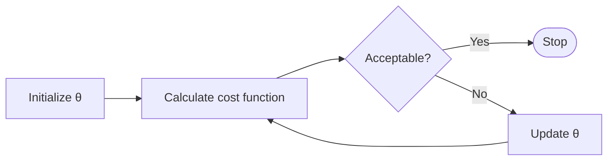

# Optimization

- [ ] https://mmas.github.io/optimization-scipy
- [ ] https://scipy-lectures.org/advanced/mathematical_optimization/
- [ ] https://github.com/rickecon/StructEst_W17/blob/master/Notebooks/MLE/MLest.ipynb

## Training Process

## Optimization Parameters

### Objective Function

An objective function has a unique global minimum if it is

- differentiable
- convex

### Hard Constraints and Bounds

Useful if you know the underlying systematic differential equation

$$
\text{DE} = 0
$$
Refer to PINNs for more information

When it is not possible to use a discontinuous hard constraint/bound (such as $\beta \ge k$), you can add a barrier function to the cost function
$$
J' = J + B
$$
where $B$ can be

- Exponential barrier: $\pm \exp \{ m (\beta - k) \}$
  - where $m=$ barrier coefficient

### Soft Constraints: Regularization

Encourages (not guaranteed) certain parameters to end in range values, through penalizing deviation from prior/preferred values

## Weights Initialization Algorithm

- Zero (bad)
- Random
- Glorot (Xavier)

## Popular Optimization Algorithms

| Optimizer                                   | Meaning                                                      | Comment                                                      | Gradient-Free | Weight Update Rule $w_{t+1}$                            | Advantages                                      | Disadvantages                                                |
| ------------------------------------------- | ------------------------------------------------------------ | ------------------------------------------------------------ | ------------- | ------------------------------------------------------------ | ----------------------------------------------- | ------------------------------------------------------------ |
| L-BGFS                                      | Newton’s method                                              |                                                              | ✅             |                                                              |                                                 |                                                              |
| Nelder-Mead                                 | Simplex method                                               |                                                              | ✅             |                                                              |                                                 |                                                              |
| BGD (Batch Gradient Descent)           | Update weights after viewing the entire dataset: $n$ sample points |                                                              | ❌             |                                                              | Guaranteed convergence to local minimum         | Computationally-expensive for large dataset Prone to getting stuck at non-optimal local minima for non-convex cost functions |
| SGD (Stochastic Gradient Descent)      | Update weights after viewing every sample point              |                                                              | ❌             | $w_t - \eta g(w_t)$                                          | Faster updates Better escapes local minima | May not converge to global minima for non-convex cost functions Noisy/Oscillating/Erratic convergence |
| MBGD (Mini-Batch Gradient Descent)     | Update weights after viewing the $b$ sample points, where $b < n$  Usually $b=32$ | Middle ground between BGD and SGD Generalizes better than Adam | ❌             |                                                              |                                                 |                                                              |
| AdaDelta (GD + Momentum)               |                                                              |                                                              | ❌             | $w_t + v_{t+1}$ $v_{t+1} = \rho v_t - \eta g(w_t)$ or $v_{t+1} = \rho v_t - \eta g(w_t + \rho v_t)$ |                                                 |                                                              |
| AdaGrad (GD + Momentum + Acceleration) | Decreases the momentum for each parameter, based on how much that parameter has made progress Can only decrease the moment |                                                              | ❌             | $w_{i, t+1} = w_{i, t} - \dfrac{\eta}{\epsilon + \sqrt{v_{i, t+1}}} g(w_{i, t})^2$  $v_{i, t+1} = v_{i, t} + g(w_{i, t})^2$ $\epsilon > 0$ |                                                 |                                                              |
| RMSProp                                     | Keeps a memory of previous gradients Can increase/decrease the moment |                                                              | ❌             | $w_{t+1} = w_{i, t} - \dfrac{\eta}{\epsilon + \sqrt{v_{t+1}}} g(w_{t})^2$   $v_{t+1} = \beta v_{t} + (1-\beta) g(w_t)^2$ $\epsilon > 0, \beta \in [0, 1]$ |                                                 |                                                              |
| Adam (Adaptive Moment Estimation)      |                                                              |                                                              | ❌             | $w_{t+1} = w_{t} - \dfrac{\eta}{\epsilon + \sqrt{\hat v_{t+1}}} \hat m_{t+1}$ $\hat m_{t+1} = \dfrac{m_{t+1}}{1-{\beta_1}^{t+1}}$ $m_{t+1} = \beta_1 m_t + (1-\beta_1) g(w_t)$ $\hat v_{t+1} = \dfrac{v_{t+1}}{1-{\beta_2}^{t+1}}$ $v_{t+1} = \beta_2 v_t + (1-\beta_2) g(w_t)^2$  $\epsilon > 0; \beta_1, \beta_2 \in [0, 1]$ |                                                 |                                                              |

## Gradient Descent

Similar to trial and error

1. Start with some $\theta$ vector
2. Keep changing $\theta_0, \theta_1, \dots, \theta_n$ using derivative of cost function, until minimum for $J(\theta)$ is obtained - **Simultaneously**

$$
\theta_{\text{new}} =
\theta_{\text{prev}} -
\eta \ 
{\nabla J}
$$

|                       | Meaning                                                      |
| --------------------- | ------------------------------------------------------------ |
| $\theta_{\text{new}}$ | Coefficients obtained from current iteration (Output of current iteration) |
| $\theta_{\text{old}}$ | Coefficients obtained from previous iteration (Output of previous iteration) |
| $\eta$                | Learning Rate                                                |
| $\nabla J$            | Gradient vector of $J (\theta)$                              |

### Learning Rate $\eta$

$0 < \eta < 1$

- Large value may lead to underfitting/overfitting
- Small value will lead to more time taken

Can be

- constant
- time-based decay

## Iterative vs Normal Equation

|                 |           Iterative           |         Normal Equation         |
| :-------------: | :----------------------------------: | :-----------------------------: |
|    $\alpha$ **not** required    |               ❌               |                ✅                |
| Feature scaling not required |               ❌               |                ✅                |
| Time Complexity | $O(kn^2)$ | $O(n^3)$ |
|   Performance   | Fast even for large $n$ |  Slow if $n > 10^4$  |
| Compatibility |       Works for all algorithms       | Doesn’t work for classification |
| No of features | Works for all algorithms | Doesn't work when $X^TX$ is non-invertible |
| Stop criteria | - $J(\theta) \le \text{Cost Threshold}$ - $n_{\text{iter}} \ge \text{Iter Threshold}$ | None |

Gradient-based methods find min of a function by identifying the direction in which the function’s slope is rising the most steeply, and then moving in the opposite direction.

## Speed Up Training

- Subsetting
- Feature-scaling
- Pruning
- Good Weight initialization
- Good Activation functions
- Transfer learning: Re-use parts of pre-trained network
- Using mini-batch updates
- Learning rate scheduling
- Faster optimization algorithm
- Use GPU/TPU

### Subsetting

1. Sample Size
   - Mini-Batch
   - Stochastic
2. Input Features

You can do either

- drop with both approaches
- Bagging with each sub-model using the subset

### Feature Scaling

Helps to speed up gradient descent by making it easier for the algorithm to reach minimum faster

Get every feature to approx $-1 \le x_i \le 1$ range

Atleast try to get $-3 \le x_i \le 3$ or $-\frac13 \le x_i \le \frac13$

#### Standardization

$$
\begin{aligned}
x'_i
&= z_i \\
&= \frac{ x_i - \bar x }{s}
\end{aligned}
$$

#### Batch Normalization

## Convex Function

Convex function is one where
$$
\begin{aligned}
f(\alpha x + \beta y) &\le \alpha f(x) + \beta f(y) \\
\alpha + \beta &= 1; \alpha, \beta \ge 0
\end{aligned}
$$

## Robust Optimization

### Limitations

- Parameters must be independent
- Cannot handle equality constraints
- Hard to estimate min and max value of parameter
- Method is extremely conservative
