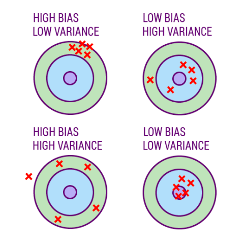
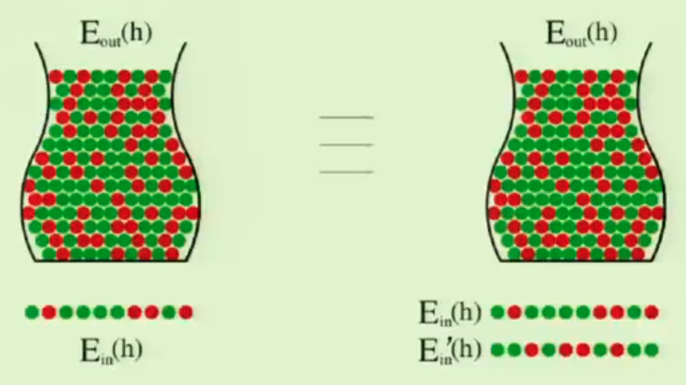
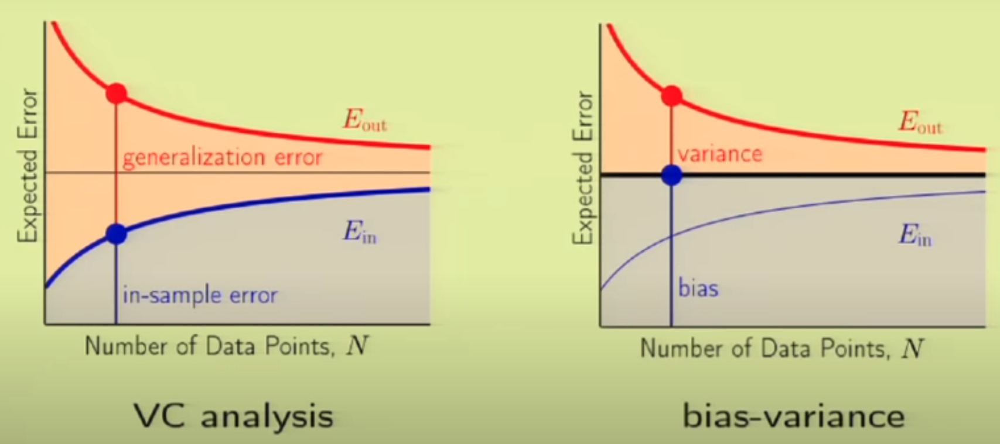
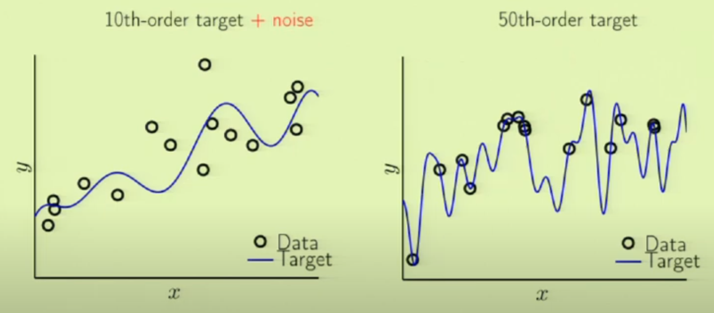
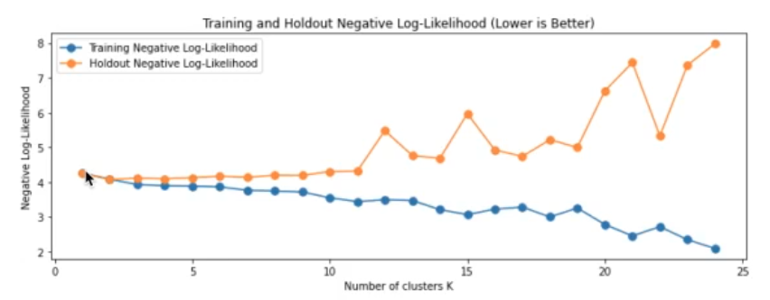

# Generalization

The ability of trained model to be able to perform well on unseen data. Better validation result $\implies$ Better generalization

The generalization gap (error difference b/w seen and unseen data) should be small

The more models you try, the worse your generalization wrt that data due to increase in $\vert H \vert$ as $H = \bigcup_i H_i$ where $H_i$ is the $H$ for each model. This is the essence behind importance of train-dev-val-test split

Note: Always try to overfit with a very small sample and then focus on generalization

$$
E_\text{out} \le E_\text{in} + \dfrac{\Omega}{n}
$$

where

- $\Omega =$ Overfit/Complexity Penalty

Lesson: Match the ‘model complexity’ to the data resources, not to the target complexity, ie, pick a hypothesis set that you can afford to navigate for the given training dataset

## Noise

Part of $y$ we cannot model

### Types

|                       | Stochastic/ Bayes’ Error                                | Deterministic                                                |
| --------------------- | ------------------------------------------------------------ | ------------------------------------------------------------ |
| Given by              | $u$                                                          | $f^* - f$                                                    |
| Meaning               | Observational error                                          | Part of $f$ that $H$ cannot capture, even when there is no stochastic noise |
| Cause                 | $P(y \vert x)$                                               | 1. Complexity of $f$ 2. $H$                             |
| Frequency             | High                                                         | Low                                                          |
| Smooth                | ❌                                                            | ✅                                                            |
| For a given $x$       | Randomly distributed                                         | Fixed constant                                               |
| Comment               |                                                              | No point trying to capture it, as you will learn a false pattern, given limited training dataset |
|                       |                                                              | When teaching a kid, better to use easy-to-understand examples rather than the actual science |
|                       |                                                              |  |
| Effect on overfitting |  |  |

- For a finite $n$, $H$ tends to fit both stochastic and deterministic noise
- Deterministic and Stochastic noise affect the Variance by making the model more susceptible to overfitting
- In presence of stochastic and/or deterministic noise, it is better to prefer smoother/simpler hypotheses, so that the model can avoid fitting the noise
  - For time-series modelling, we can use averaging/smoothing filter a pre-processing step

- For target $f$ of high complexity, train model $\hat f$ with smooth $\tilde y$ (for eg: Moving Average) to reduce effect of deterministic noise

## Error Decomposition

|                       |                   Bias                    |              Variance $\text{Var}(\hat f)$              |    Distribution Mismatch     |
| :-------------------: | :---------------------------------------: | :----------------------------------------------------------: | :--------------------------: |
|       Indicates       |                Inaccuracy                 |                         Imprecision                          |     Data Sampling Issue      |
|        Meaning        | Proximity of prediction is to true values | Amount by which $\hat y$ would change for different training data |                              |
|      Implication      |               Underfitting                |                         Overfitting                          |                              |
|      Denotation       |                $\hat f-f$                 |             $E \Big[ \ (\hat f - f^*)^2 \ \Big]$             |                              |
|   Estimated through   |      Train Error - Acceptable Error       |                   Dev error - Train Error                    | Validation Error - Dev Error |
| Reason for estimation |           In-sample performance           |   Difference between in-sample and out-sample performance    |                              |

$$
\text{E}_\text{out} = \text{Bias}^2 + \text{Variance} + \text{Dist Mis} + \text{DN} + \text{SN}
$$

### Prediction Bias & Variance

We want **low value** of both

If a measurement is biased, the estimate will include a constant systematic error

### Bias-Variance Tradeoff

Usually U-Shaped

Each additional parameter adds the same amount of variance $\sigma^2/n$, regardless of whether its true coefficient is large or small (or zero).

$$
\begin{aligned}
\text{Variance}
&= \sigma^2 \left[
\dfrac{1+k}{n} + 1
\right] \\
& \approx
O(k)
\end{aligned}
$$
Hence, we can reduce variance by shrinking small coefficients to zero

### Tip

When using feature selection/LASSO regularization, stop one standard deviation > the optimal point, as even though bias has increased by a small amount, variance can be decreased a lot

## VC Analysis

Let

- $E_\text{in} =$ error on seen train data
- $E_\text{test} =$ error on unseen test data
- $E_\text{out} =$ theoretical error on the unseen population
- $\vert h \vert =$ size of hypothesis, estimated through the number of Dichotomies
- $\vert H \vert =$ size of hypothesis set, estimated through the number of Dichotomies

For test data, $\vert H \vert = 1$, as it is not biased and we do **not** choose a hypothesis that looks good on it.

### Pictorial Representation

### IDK

#### Dichotomies

Prediction of hypothesis on data

No of dichotomies $\le 2^n$

#### Growth Function

counts the **most** dichotomies on $n$ points
$$
\begin{aligned}
m_H(n) &= \max_{x_i} \vert H(x_i) \vert \qquad \forall i \in [1, n] \\
\implies m_H(n) &\le 2^n
\end{aligned}
$$
The hypothesis set is said to “shatter” $n$ points

#### Break Point

If no dataset of size $n_b$ can be shattered by $H$, then $n_k$ is a break point for $H$, ie Point at which you fail to get all possible dichotomies. This also implies that dataset of $n > n_k$ cannot be shattered as well
$$
m_H(k) = 2^k
$$

#### VC Dimension

$d_\text{VC}(H)$ is the most points $H$ can shatter

$d_\text{VC}(H)$ measures the effective number of parameters
$$
\begin{aligned}
d_\text{VC}(H)
&= \arg \max_n m_H(n) = 2^n \\
&= n_b-1
\end{aligned}
$$

$$
\begin{aligned}
d_\text{vc} (H) &= \sum_i d_\text{vc} (h_i)
\end{aligned}
$$

Independent of

- Learning algorithm
- Input distribution
- Target function

Dependent on

- Final hypothesis $\hat f$
- Training examples
- Hypothesis set

$d_\text{VC}(H)$ is finite $\implies$ $\hat f \in H$ will generalize

Usually, $d_\text{VC} \le$ no of parameters in the model 

### Sauer’s Lemma

$$
\begin{aligned}
d_\text{vc} (H)
< \infty 
\implies m_H(n)
\le \sum_{r=0}^{d_\text{vc}(H)} nCr
\end{aligned}
$$

### Conclusion

|                | $m_H(n)$                                                     |
| -------------- | ------------------------------------------------------------ |
| No break point | $2^n$                                                        |
| Any breakpoint | $\sum_{r=0}^{d_\text{VC}(H)} n C_r$  Polynomial in $n$ |

### Hoeffding’s Inequality

$$
\begin{aligned}
P( \vert E_\text{out} - E_\text{test} \vert > \epsilon)
& \le \sum_{i=1}^{\vert H \vert} P( \vert E_\text{out}(h_i) - E_\text{in}(h_i) \vert > \epsilon) \\
& \le {\vert H \vert} \cdot 2 \exp(-2 n \epsilon^2)
\end{aligned}
$$

But this is a very loose bound (better to loose, than incorrectly tight), as we assume that each hypothesis is disjoint

### Vapnik-Chervonenkis Inequality

$$
\begin{aligned}
P( \vert E_\text{out} - E_\text{test} \vert > \epsilon)
& \le {\textcolor{hotpink}{2} \cdot m_H(\textcolor{hotpink}{2}n)} \cdot \exp \left( -2 n \left( \dfrac{\epsilon}{\textcolor{hotpink}{4}} \right)^2 \right) \\
& \le \underbrace{4 \cdot m_H(2n) \cdot \exp \left( \frac{-1}{8} n \epsilon^2 \right)}_\delta
\end{aligned}
$$

$\delta$ is like the significance level

#### Why difference from Hoeffding’s?

Empirical observation: The bounded quantity has the same monotonicity as the bound

### Generalization

$$
\begin{aligned}
\epsilon
&= \underbrace{\sqrt{
\dfrac{8}{n} \ln
\left \vert \dfrac{4m_H(2n)}{\delta} \right \vert
}}_\Omega 
\\
& = O \left(
\sqrt{\dfrac{d_{vc} \ln n +
\ln \vert 1/\delta \vert
}{n}}
\right)
\\
& = O \left(
\sqrt{d_{vc} \dfrac{ \ln \vert n \vert }{n}}
\right)
\end{aligned}
$$

$$
\text{with prob} \ge 1-\delta,
\quad \vert E_\text{out} - E_\text{in} \vert \le \Omega(n, H, \delta)
$$

## Recommend Test Size

Rule of thumb to get good generalization
$$
n_\text{test} \ge 10 \times d_\text{VC}(H)
$$

## Curse of Dimensionality

When $k$ is very large, then the $\vert H \vert$ gets very large and hence, generalization becomes very poor

## Training Size

Generalization improves with size of training set, until a saturation point, after which it stops improving.

|                | More data $\implies$                                        |
| -------------- | ----------------------------------------------------------- |
| Parametric     | asymptote to an error value exceeding Bayes error           |
| Non-Parametric | better generalization until best possible error is achieved |

## Generalization Bound vs Generalization Gap

|                 | Generalization Gap                | Generalization Bound                                    |
| --------------- | --------------------------------- | ------------------------------------------------------- |
| Associated with | Model - Bias - Variance | Testing method - Test Set Size - No of trials |

## Linear Regression

Consider true $f = \text{Linear} + u; \quad u \sim N(0, \sigma^2_u)$

- Best approximation error $= \sigma^2_u$
- Expected in-sample error $= \sigma^2_u \left[1- \dfrac{k}{n} \right]$
- Expected out-sample error $= \sigma^2_u \left[ 1 + \dfrac{k}{n} \right]$
- Expected generalization gap $= 2 \sigma^2_u \left( \dfrac{k}{n} \right)$

## VC vs Bias-Variance

## Scenarios

| Scenarios                                                    | Conclusion                 |
| ------------------------------------------------------------ | -------------------------- |
| Desired Error < Train Error                                  | Underfitting/ Optimal |
| Train Error $\approx$ Test Error $\approx$ Desired Error Train Error < Test Error < Desired Error | Optimal                    |
| Train Error << Test Error Train Error < Desired Error < Test Error | Overfitting                |

## Fitting & Capacity

We can control the fitting of a model, by changing hypothesis space, and hence changing its capacity

|                                    | Underfitting                                                 | Appropriate-Fitting | Overfitting                                                  |
| ---------------------------------- | ------------------------------------------------------------ | ------------------- | ------------------------------------------------------------ |
| Capacity                           | Low                                                          | Appropriate         | Low                                                          |
| Low Bias (Fitting Signal)     | ❌                                                            | ✅                   | ✅                                                            |
| Low Variance (Avoiding Noise) | ✅                                                            | ✅                   | ❌                                                            |
| Implication                        | Acceptable                                                   | Optimal             | Harmful                                                      |
| Steps to address              | Increase model complexity Increase training data Remove noise from data Inc no of features |                     | Cross-Validation More training data Feature Reduction Early Stopping Regularization |
| Causes                             |                                                              |                     | - Small train set - Stochastic noise - Deterministic noise - Excessive model capacity |

The capacity of a model increases with increased [degree of polynomial](#degree-of-polynomial)

### Interesting Note

Even if the target function is known to be of high complexity, for a **small** training dataset, a low capacity model will generalize better.

## Unsupervised Learning

Harder to quantify than for supervised learning

If model is probabilistic, we can detect overfitting by comparing in-sample and out-sample log-likelihood

Detecting overfitting with larger datasets will be paradoxically harder

### Clustering

Overfitting: Fitting small, local clusters rather than the true global clusters

#### Non-Probabilistic

#### Probabilistic Models

Log likelihood on in-sample and out-sample data

