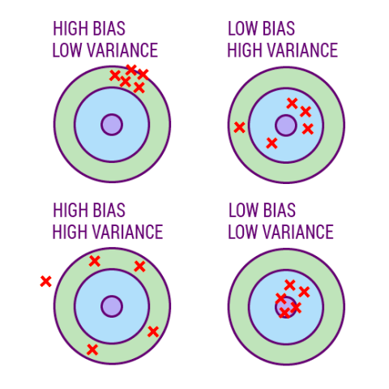
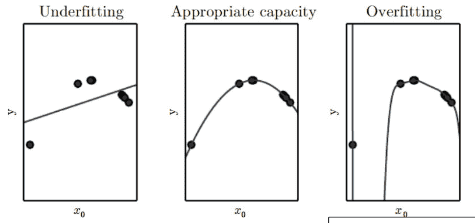
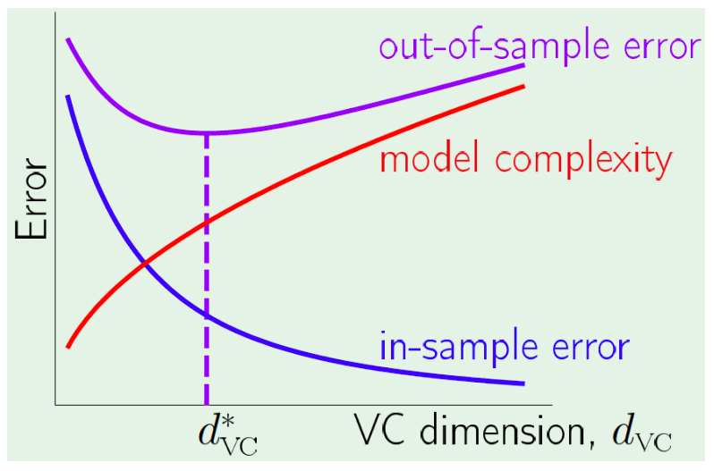
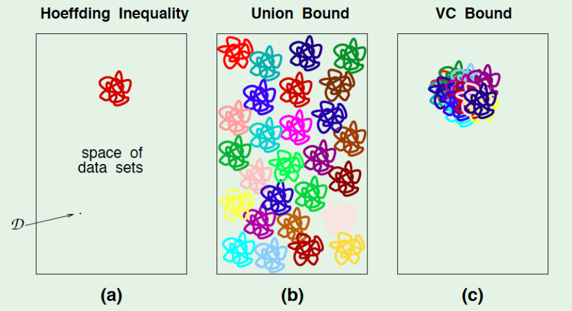
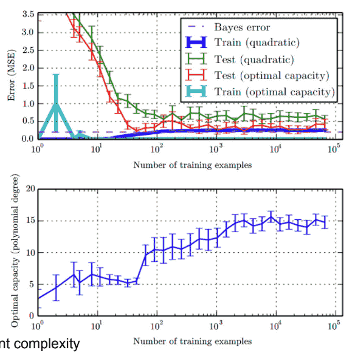
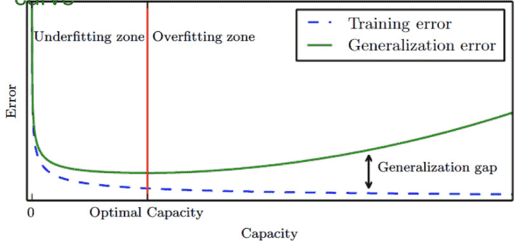
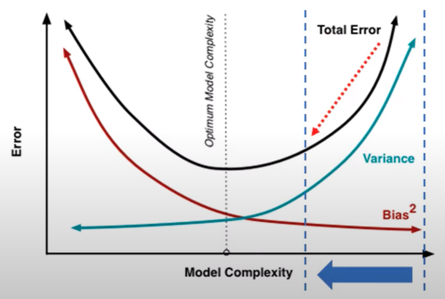
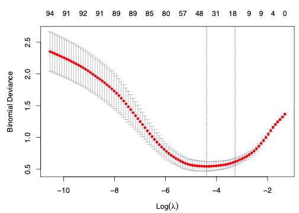

# Generalization

The ability of trained model to be able to perform well on unseen inputs. Better validation result $\implies$ Better generalization

Note: Always try to overfit with a very small sample and then focus on generalization

The more models you try, the worse your generalization wrt that data due to increase in $\vert H \vert$ as $H = \bigcup_i H_i$ where $H_i$ is the $H$ for each model. This is the essence behind importance of train-validation-test split

## Prediction Bias & Variance

We want **low value** of both

If a measurement is biased, the estimate will include a constant systematic error

|                       |                  Bias                  |                           Variance                           |
| :-------------------: | :------------------------------------: | :----------------------------------------------------------: |
|       Indicates       |               Inaccuracy               |                         Imprecision                          |
|        Meaning        | How close prediction is to true values |                  Variability in prediction                   |
|      Implication      |                                        | Amount by which $\hat y$ would change for different training data |
|   Regression Metric   |                  MBE                   |                                                              |
| Classification Metric |                                        |                                                              |
|      Denotation       |            $E[\hat y] - y$             | $\text{Var}(\hat y) = E \Bigg[ \ \Big(E[\hat y] - \hat y \ \Big)^2 \Bigg]$ |

$$
\text{MSE} = \text{Bias}^2 + \text{Variance} + \text{Bayes Error}
$$

## Fitting & Capacity

We can control the fitting of a model, by changing hypothesis space, and hence changing its capacity

|                       | Under-fitting                                                | Appropriate-Fitting | Over-Fitting                                                 |
| --------------------- | ------------------------------------------------------------ | ------------------- | ------------------------------------------------------------ |
| Capacity              | Low                                                          | Appropriate         | Low                                                          |
| Bias                  | ⬆️                                                            | ⬇️                   | ⬇️                                                            |
| Variance              | ⬇️                                                            | ⬇️                   | ⬆️                                                            |
| Steps to address | Increase model complexity Increase training data Remove noise from data Inc no of features |                     | Cross-Validation More training data Feature Reduction Early Stopping Regularization |

The capacity of a model increases with increased [degree of polynomial](#degree-of-polynomial)

## Generalization Bound

Let

- $E_\text{in} =$ error on seen train data
- $E_\text{test} =$ error on unseen test data
- $E_\text{out} =$ theoretical error on the unseen population

For binary predictor $f$
$$
\begin{aligned}
P( \vert E_\text{out} - E_\text{in} \vert > \epsilon) & \le \delta \quad \text{(Vapnik-Chervonenkis Inequality)} \\
\implies
\vert E_\text{out} - E_\text{in} \vert &\le \epsilon \\
\text{ with probability } P( \vert E_\text{out} - E_\text{in} \vert &\le \epsilon) \in [1-\delta, 1] \\
\\
\text{where } \delta &= 4 \cdot m_h(2n) \cdot e^{\frac{-1}{8} \epsilon^2 n} \\
\epsilon &= \sqrt{\dfrac{8}{n} \ln \left \vert \dfrac{4 \cdot m_h(2n)}{\delta} \right \vert
} \\
m_h(n) &\le \begin{cases}
n^{d_{vc}(H)}+1 \\
\left( \dfrac{ne}{d_{vc}(H)}\right) ^{d_{vc}(H)}, & n \ge d_{vc}(H)
\end{cases}
\end{aligned}
$$

$$
\begin{aligned}
P( \vert E_\text{out} - E_\text{test} \vert > \epsilon)
& \le \sum_{i=1}^{\vert H \vert} P( \vert E_\text{out}(h_i) - E_\text{in}(h_i) \vert > \epsilon) \\
& \le {\vert H \vert} \cdot 2 e^{-2 n \epsilon^2} \quad \text{(Hoeffding’s Inequality)} \\
& \le \delta \\
\implies
\vert E_\text{out} - E_\text{in} \vert &\le \epsilon \\
\text{ with probability } P( \vert E_\text{out} - E_\text{in} \vert &\le \epsilon) \in [1-\delta, 1] \\
\\
\text{where }
\delta &= 2 {\vert H \vert} e^{-2 n \epsilon^2} \\
\epsilon &= \sqrt{ \dfrac{1}{2n} \ln \left\vert \dfrac{2{\vert H \vert}}{\delta} \right\vert }
\end{aligned}
$$

Simply put
$$
\text{Generalization Gap} = O \left(
\sqrt{\dfrac{d_{vc}}{n} \ln n}
\right)
$$

For test data, $\vert H \vert = 1$, as it is not biased and we do **not** choose a hypothesis that looks good on it.

### Sauer’s Lemma

$$
d_\text{vc} (H) < \infty
\implies m_H(n)
\le \sum_{i=0}^{d_\text{vc}(H)} \begin{pmatrix} N \\ i \end{pmatrix}
$$

​    

## Generalization & Training Size

Generalization improves with size of training set, until a saturation point, after which it stops improving.

|                | More data $\implies$                                        |
| -------------- | ----------------------------------------------------------- |
| Parametric     | asymptote to an error value exceeding Bayes error           |
| Non-Parametric | better generalization until best possible error is achieved |

## Bias-Variance Tradeoff

Usually U-Shaped

Each additional parameter adds the same amount of variance $\sigma^2/n$, regardless of whether its true coefficient is large or small (or zero).
$$
\begin{aligned}
\text{Variance}
&= \sigma^2 \left[
\dfrac{1+k}{n} + 1
\right] \\
& \approx
O(k)
\end{aligned}
$$
Hence, we can reduce variance by shrinking small coefficients to zero

### Tip

When using feature selection/LASSO regularization, stop one standard deviation > the optimal point, as even though bias has increased by a small amount, variance can be decreased a lot

