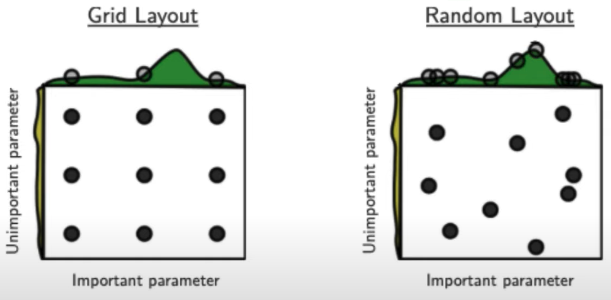

# Hyper-Parameter Tuning

|                |                                                              | Advantage | Disadvantage              |
| -------------- | ------------------------------------------------------------ | --------- | ------------------------- |
| Manual         |                                                              |           | Time-Consuming            |
| Grid Search    |                                                              |           | Computationally-expensive |
| Random Search  |                                                              |           | Non-deterministic         |
| Evolutionary   | Randomization, Natural Selection, Mutation                   |           |                           |
| Bayesian       | Probabilistic model of relationship b/w cost function and hyper-parameters, using information gathered from trials |           |                           |
| Gradient-Based | Treat hyper parameter tuning like parameter fitting          |           |                           |
| Early-Stopping | Focus resources on settings that look promising eg: Successive Halving |           |                           |

## Speed Up

- Add more processors
- Caching
- Random sampling: Won’t work with caching

