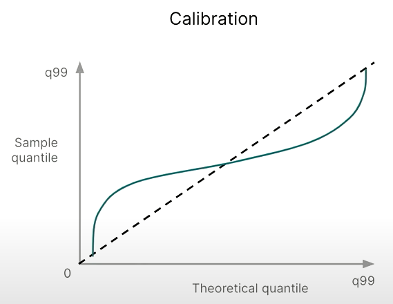
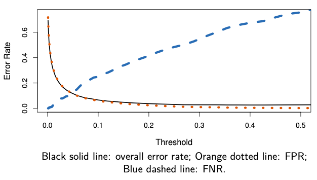
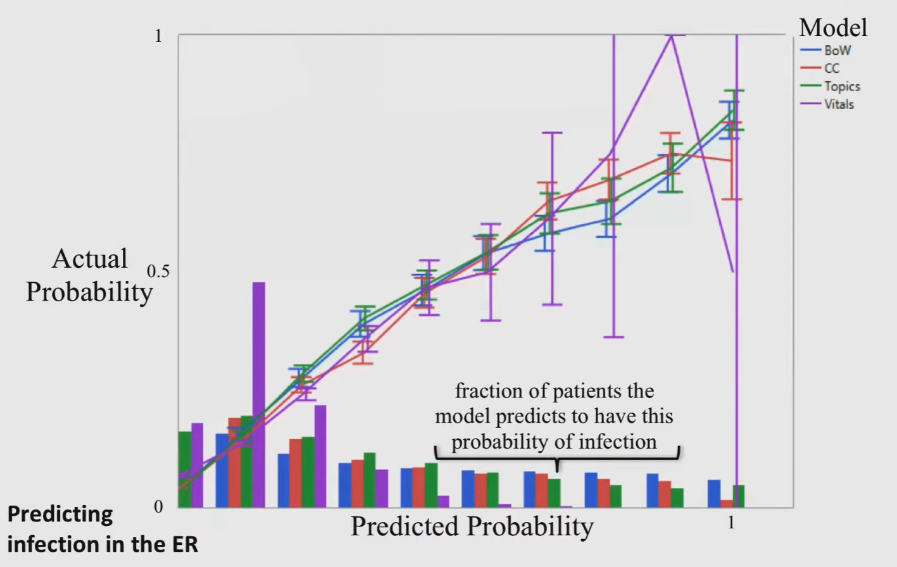
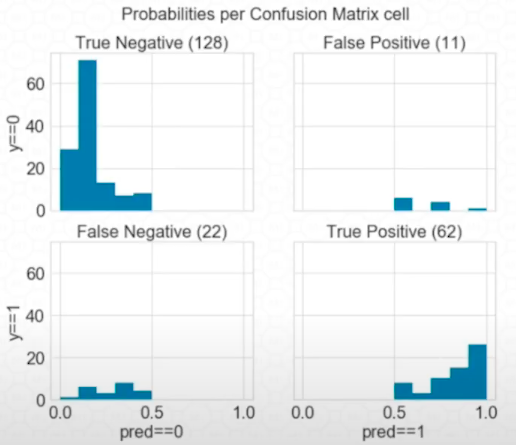
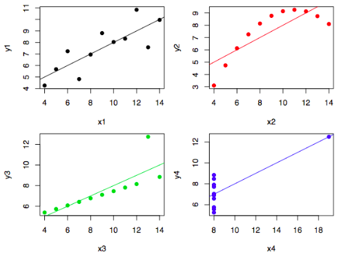
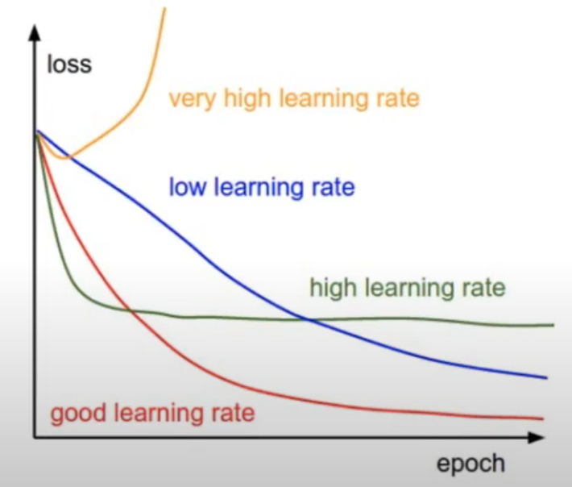
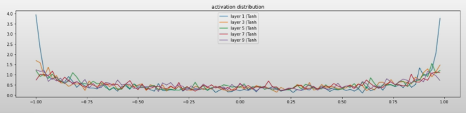

# Model Evaluation

## Goals

Same as [goals of cost minimization](08_Cost.md#Goals)
## Guidelines

- [ ] Backtesting/model validation is not a technique to identify good models: It is a technique to stress test and fail poor models
- [ ] Always check if your model is able to learn from a synthetic dataset where you know the underlying data-generating process
- [ ] Always evaluate any step involving randomness with different random seeds to ensure accurate result
	- [ ] Group by random seed and check for discrepancies
- [ ] Metrics computed from test set may not be representative of the true population
- [ ] Always look at multiple metrics; never trust a single one alone
  - [ ] false positives and false negatives are seldom equivalent
  - [ ] understand the problem to known the right tradeoff
- [ ] Always monitor the worst-case prediction
	- [ ] Maximum loss
	- [ ] 95th percentile loss

## Baseline/Benchark models

Always establish a baseline

- Basic/Naive/Dummy predictions
  - Regression
    - Mean
    - Max
    - Min
    - Random
  - Classification
    - Mode
    - Random
  - Time series specific
    - Persistence
      - $\hat y_{t+h} = y_t$
      - Latest value available
      - Great for short horizons
    - Climatology
      - $\hat y_{t+h} = \bar y_{i \le t}$
      - Average of all observations until present
      - Great for short horizons
    - Combination of Persistence and Climatology
      - $\hat y_{t+h} = \beta_1 y_t + \beta_2 \bar y_{i \le t}$
    - Lag: $\hat y_{t+h} = y_{t-k}$
    - Seasonal Lag: $\hat y_{t+h} = y_{t+h-m}$
    - Moving average
    - Exponential average
- Human Level Performance
- Literature Review
- Performance of older system

### Significance

All the evaluation should be performed relative to the baseline.

For eg: Relative RMSE = RMSE(model)/RMSE(baseline), with “good” threshold as 1

## Core Evaluation

*Mitigating bias, placing guardrails, enhancing reliability, reducing complexity, and ensuring privacy*

| **Category**       | **Data**                                                                                                                                                                                                           | **Model**                                                                                                                                                                                                                                                                                                         | **Prediction**                                                                               |
| ------------------ | ------------------------------------------------------------------------------------------------------------------------------------------------------------------------------------------------------------------ | ----------------------------------------------------------------------------------------------------------------------------------------------------------------------------------------------------------------------------------------------------------------------------------------------------------------- | -------------------------------------------------------------------------------------------- |
| **Fairness**       | - Resampling / Reweighting  - Feature Engineering  - Data Augmentation - Feature Selection  *(Filter, Embedded, Wrapper)*                                                                                 | - Cost-sensitive Learning - Monotonic Constraints - Adversarial Debiasing  - Regularization                                                                                                                                                                                                              | - Calibrating/Equalizing Odds - Prediction Abstention *Fairness Model Certification*   |
| **Accountability** | - *Feature Drift Detection* - Data Augmentation - Adv. Preproc. Defenses - Feature Selection *(Filter, Embedded, Wrapper)* - Feature Engineering - *Data Anonymization* - *Differential Privacy* | - Uncertainty Estimation / Conformal Prediction - Adversarial Robustness - Certified Training & Inference  - Adversarial Training - Regularization *(plus other under fitting tuning)* - Monotonic Constraints - *Federated Learning* - *Other Adversarial Defenses (for espionage attacks)* | - Adv. Postprocessing Def - Calibrating/Equalizing Odds *Privacy-Preserving Inference* |
| **Transparency**   | - Feature Selection (Filter, Embedded, Wrapper) - Feature Engineering                                                                                                                                           | - Regularization *(plus other under fitting tuning)* - Model Constraints - White & Glass-Box Models                                                                                                                                                                                                         | - Local Interpretation                                                                       |

## Probabilistic Evaluation

Now, we need to see if any difference in accuracy across models/hyperparameters is statistically-significant, or just a matter of chance
- Try different seeds and see the range; this range is purely due to randomness

Summary Statistics: Don’t just look at the mean evaluation metric of the multiple splits; also get the uncertainty associated with the validation process.

- It is invalid to use a standard hypothesis test (such as t-test) by taking number of folds as the sample size
	- the runs are not independent
	- using folds incorrectly inflates the sample size
- It is acceptable for a fixed test set
- Std obtained in model performance from cross-validation is standard error of mean estimate
	- hence, you cannot divide by no of folds
	- Std obtained in model performance from cross-validation is standard error of mean estimate
		- True standard deviation is no of folds x SE

Hence, treat the metrics across the folds as a a distribution
- For regression: chi squared
- For classification: binomial

- Standard error of accuracy estimate
- Standard deviation
- Quantiles
- PDF
- VaR

## Bessel’s Correction

$$
\begin{aligned}
\text{Metric}_\text{corrected} &= \text{Metric}_\text{uncorrected} \times \dfrac{n}{\text{DOF}} \\
\text{DOF} &= n-k-e
\end{aligned}
$$

- where
  - $n=$ no of samples
  - $k=$ no of parameters
  - $e=$ no of intermediate estimates (such as $\bar x$ for variance)
- Do not perform this on metrics which are already corrected for degree of freedom (such as $R^2_\text{adj}$)
- Modify accordingly for squares/root metrics

## Transformed Metrics

|                |                                                                                                                                      |
| -------------- | ------------------------------------------------------------------------------------------------------------------------------------ |
| Normalization  | ⁠- Divide by variance?: Chi^2 - ⁠Divide mean: RelMAE - Divide by MAD of benchmark: MASE - ⁠Divide coefficient of variation? |
| Disaggregation | - over & under-prediction - each output class - each input group/hierarchy                                                     |

## Regression Evaluation

| Metric                                                      |                                           Formula                                           |   Unit   |     Range     | Preferred Value | Signifies                                                                                                                                                                                                                                        | Advantages ✅                                                                 | Disadvantages ❌                                                                                                                                                                               | Comment                                                                                                         |
| :---------------------------------------------------------- | :-----------------------------------------------------------------------------------------: | :------: | :-----------: | --------------- | ------------------------------------------------------------------------------------------------------------------------------------------------------------------------------------------------------------------------------------------------ | --------------------------------------------------------------------------------- | -------------------------------------------------------------------------------------------------------------------------------------------------------------------------------------------------- | :-------------------------------------------------------------------------------------------------------------- |
| Normalized Bias                                             |                                                                                             |          |               |                 |                                                                                                                                                                                                                                                  |                                                                                   |                                                                                                                                                                                                    |                                                                                                                 |
| Normalized MAE                                              |                                                                                             |          |               |                 |                                                                                                                                                                                                                                                  |                                                                                   |                                                                                                                                                                                                    |                                                                                                                 |
| $R^2$ (Coefficient of Determination)                   |                                      $1 - \text{RSE}$                                       | Unitless |   $[0, 1]$    | $1$             | Proportion of changes in dependent var explained by regressors.  Proportion of variance in $y$ explained by model wrt variance explained by mean  Demonstrates ___ of regressors - Relevance - Power - Importance |                                                                                   | Cannot use to compare same model on different samples, as it depends on variance of sample  Susceptible to spurious regression, as it increases automatically when increasing predictors |                                                                                                                 |
| Adjusted $R^2$                                              |                      $1 - \left[\dfrac{(n-1)}{(n-k-1)} (1-R^2)\right]$                      | Unitless |   $[0, 1]$    | $1$             |                                                                                                                                                                                                                                                  | Penalizes large number of predictors                                              |                                                                                                                                                                                                    |                                                                                                                 |
| Accuracy                                                    |                                     $100 - \text{MAPE}$                                     |    %     |  $[0, 100]$   | $100 \%$        |                                                                                                                                                                                                                                                  |                                                                                   |                                                                                                                                                                                                    |                                                                                                                 |
| $\chi^2_\text{reduced}$                                     |          $\dfrac{\chi^2}{n-k} = \dfrac{1}{n-k}\sum \left( u_i/\sigma_i \right)^2$           |          | $[0, \infty]$ | $1$             |                                                                                                                                                                                                                                                  |                                                                                   |                                                                                                                                                                                                    | $\approx 1:$ Good fit $\gg 1:$ Underfit/Low variance estimate $\ll 1:$ Overfit/High variance estimate |
| Spearman’s Correlation                                      | $\dfrac{ r(\ rg( \hat y), rg(y) \ ) }{ \sigma(\ rg(\hat y) \ ) \cdot \sigma( \ rg(y) \ ) }$ | Unitless |   $[-1, 1]$   | $1$             |                                                                                                                                                                                                                                                  | Very robust against outliers Invariant under monotone transformations of $y$ |                                                                                                                                                                                                    |                                                                                                                 |
| DW (Durbin-Watson Stat)                                |                                                                                             |          |               | $> 2$           | Confidence of error term being random process                                                                                                                                                                                                    |                                                                                   | Not appropriate when $k>n$                                                                                                                                                                         | Similar to $t$ or $z$ value If $R^2 >$ DW Statistic, there is [Spurious Regression](#Spurious Regression)  |
| AIC Akaike Information Criterion                       |                                       $-2 \ln L + 2k$                                       |          |               | $0$             | Leave-one-out cross validation score                                                                                                                                                                                                             | Penalizes predictors more heavily than $R_\text{adj}^2$                           | For small values of $n$, selects too many predictors  Not appropriate when $k>n$                                                                                                         |                                                                                                                 |
| AIC Corrected                                               |                            $\text{AIC} + \dfrac{2k(k+1)}{n-k-1}$                            |          |               | $0$             |                                                                                                                                                                                                                                                  | Encourages feature selection                                                      |                                                                                                                                                                                                    |                                                                                                                 |
| BIC/SBIC/SC (Schwarz’s Bayesian Information Criterion) |                                    $-2 \ln L + k \ln n$                                     |          |               | $0$             |                                                                                                                                                                                                                                                  | Penalizes predictors more heavily than AIC                                        |                                                                                                                                                                                                    |                                                                                                                 |
| HQIC Hannan-Quinn Information Criterion                |                            $-2 \ln L + 2k \ln \vert \ln n \vert$                            |          |               | $0$             |                                                                                                                                                                                                                                                  |                                                                                   |                                                                                                                                                                                                    |                                                                                                                 |
| Calibration                                                 |                                                 |          |               |                 |                                                                                                                                                                                                                                                  |                                                                                   |                                                                                                                                                                                                    |                                                                                                                 |
| Sharpness                                                   |                                                         |          |               |                 |                                                                                                                                                                                                                                                  |                                                                                   |                                                                                                                                                                                                    |                                                                                                                 |

A good regression metric
- $\text{MAE} + \vert \text{MBE} \vert$, normalized by mean of series
- $\text{MedAE} + \vert \text{MedBE} \vert$, normalized by median of series

### Probabilistic Evaluation

You can model the error such as MAE as a $\chi^2$ distribution with dof = $n-k$

The uncertainty can be obtained from the distribution

### Spurious Regression

Misleading statistical evidence of a relationship that does not truly exist

Occurs when we perform regression between

- 2 independent variables

  and/or

- 2 non-stationary variables

  (Refer econometrics)

You may get high $R^2$ and $t$ values, but $u_t$ is not white noise (it is non-stationary)

$\sigma^2_u$ becomes infinite as we go further in time

## Classification Evaluation

There is always a tradeoff b/w specificity and sensitivity

| Metric                                                          |                                                                           Formula                                                                            | Preferred Value |     Unit     |                            Range                             | Meaning                                                                                       | Limitations                                                                     |
| --------------------------------------------------------------- | :----------------------------------------------------------------------------------------------------------------------------------------------------------: | :-------------: | :----------: | :----------------------------------------------------------: | --------------------------------------------------------------------------------------------- | ------------------------------------------------------------------------------- |
| Entropy of each classification                                  |                                                               $H_i = -\sum \hat y \ln \hat y$                                                                |  $\downarrow$   |              |                        $[0, \infty)$                         | Uncertainty in a single classification                                                        |                                                                                 |
| Mean Entropy                                                    |                                                               $H_i = -\sum \hat y \ln \hat y$                                                                |                 |              |                                                              | Uncertainty in classification of entire dataset                                               |                                                                                 |
| **Accuracy**                                                    |                                          $1 - \text{Error}$ $\dfrac{\text{TP + TN}}{\text{TP + FP + TN + FN}}$                                          |   $\uparrow$    |      %       |                          $[0, 100]$                          | $\dfrac{\text{No of Correct Predictions}}{\text{Total no of predictions}}$                    |                                                                                 |
| **Error**                                                       |                                                      $\dfrac{\text{FP + FN}}{\text{TP + FP + TN + FN}}$                                                      |    $[0, 1]$     | $\downarrow$ | $\dfrac{\text{Wrong Predictions}}{\text{No of predictions}}$ |                                                                                               |                                                                                 |
| **F Score** F~1~ Score F-Measure                      |                                             $\dfrac{2}{\dfrac{1}{\text{Precision}} + \dfrac{1}{\text{Recall}}}$                                              |   $\uparrow$    |   Unitless   |                           $[0, 1]$                           | Harmonic mean between precision and recall Close to lower value                          | - Asymmetric to what is defined as +ve and -ve - Do not take into account TN |
| Custom F1 Score                                                 |                 $\dfrac{2}{\dfrac{1}{\text{Precision}} + \dfrac{1}{\text{Recall}} + \dfrac{1}{\text{Specificity}} + \dfrac{1}{\text{NPV}} }$                 |   $\uparrow$    |   Unitless   |                           $[0, 1]$                           |                                                                                               |                                                                                 |
| ROC-AUC Receiver-Operator Characteristics-Area Under Curve |                                                     Sensitivity vs (1-Specificity) = (1-FNR) vs FPR                                                     |   $\uparrow$    |   Unitless   |                           $[0, 1]$                           | AUC = Probability that algo ranks a +ve over a -ve Robust to unbalanced dataset          |                                                                                 |
| **Precision** PPV/ Positive Predictive Value          |                                     $\dfrac{\textcolor{hotpink}{\text{TP}}}{\textcolor{hotpink}{\text{TP}} + \text{FP}}$                                     |   $\uparrow$    |   Unitless   |                           $[0, 1]$                           | Indicates how many +ve predictions were correct predictions                                   |                                                                                 |
| **Recall** Sensitivity True Positive Rate             |                                     $\dfrac{\textcolor{hotpink}{\text{TP}}}{\textcolor{hotpink}{\text{TP}} + \text{FN}}$                                     |   $\uparrow$    |   Unitless   |                           $[0, 1]$                           | Out of actual +ve values, how many were correctly predicted as +ve                            |                                                                                 |
| **Specificity** True Negative Rate                         |                                     $\dfrac{\textcolor{hotpink}{\text{TN}}}{\textcolor{hotpink}{\text{TN}} + \text{FP}}$                                     |   $\uparrow$    |   Unitless   |                           $[0, 1]$                           | Out of actual -ve values, how many were correctly predicted as -ve                            |                                                                                 |
| NPV Negative Predictive Value                              |                                     $\dfrac{\textcolor{hotpink}{\text{TN}}}{\textcolor{hotpink}{\text{TN}} + \text{FN}}$                                     |                 |   Unitless   |                           $[0, 1]$                           | Out of actual -ve values, how many were correctly predicted as -ve                            |                                                                                 |
| $F_\beta$ Score                                                 |                                             $\dfrac{(1 + \beta^2)}{{\beta^2}} \times \dfrac{P \times R}{P + R}$                                              |   $\uparrow$    |   Unitless   |                            [0, 1]                            | Balance between importance of precision/recall                                                |                                                                                 |
| **FP Rate**                                                     |   $\begin{aligned}\alpha &= \dfrac{\textcolor{hotpink}{\text{FP}}}{\textcolor{hotpink}{\text{FP}} + \text{TN}} \\ &= 1 - \text{Specificity} \end{aligned}$   |  $\downarrow$   |   Unitless   |                           $[0, 1]$                           | Out of the actual -ve, how many were misclassified as Positive                                |                                                                                 |
| **FN Rate**                                                     |   $\begin{aligned}\beta &= \dfrac{\textcolor{hotpink}{\text{FN}}}{\textcolor{hotpink}{\text{FN}} + \text{TP}} \\ &= 1 - \text{Sensitivity} \end{aligned}$    |  $\downarrow$   |   Unitless   |                           $[0, 1]$                           | Out of the actual +ve, how many were misclassified as Negative                                |                                                                                 |
| Balanced Accuracy                                               |                                                         $\frac{\text{Sensitivity + Specificity}}2{}$                                                         |                 |   Unitless   |                                                              |                                                                                               |                                                                                 |
| MCC Mathews Correlation Coefficient                        | $\dfrac{\text{TP} \cdot \text{TN} - \text{FP}\cdot \text{FN} }{\sqrt{(\text{TP}+\text{FP})(\text{TP}+\text{FN})(\text{TN}+\text{FP})(\text{TN}+\text{FN})}}$ |   $\uparrow$    |   Unitless   |                          $[-1, 1]$                           | 1 = perfect classification 0 = random classification -1 = perfect misclassification |                                                                                 |
| Markdedness                                                     |                                                                        PPV + NPV - 1                                                                         |                 |              |                                                              |                                                                                               |                                                                                 |
| Brier Score Scaled                                              |                                                                                                                                                              |                 |              |                                                              |                                                                                               |                                                                                 |
| Nagelkerke’s $R^2$                                              |                                                                                                                                                              |                 |              |                                                              |                                                                                               |                                                                                 |
| Hosmer-Lemeshow Test                                            |                                                                                                                                                              |                 |              |                                                              | Calibration: agreement b/w obs and predicted                                                  |                                                                                 |

### Graphs

| Graph                   |                                                              |                                                              | Preferred                                     |
| ----------------------- | ------------------------------------------------------------ | ------------------------------------------------------------ | --------------------------------------------- |
| Error Rate              |  |                                                              |                                               |
| ROC Curve               |  | How does the classifier compare to a classifier that predicts randomly with $p=\text{TPR}$ How well model can discriminate between $y=0$ and $y=1$ | Top-Left At least higher than 45deg line |
| Calibration Graph       |  | Create bins of different predicted probabilities Calculate the fraction of $y=1$ for each bin Confidence intervals (more uncertainty for bins with fewer samples) Histogram showing fraction of samples in each bin | Along 45deg line                              |
| Confusion Probabilities |  |                                                              |                                               |

### Tradeoff for Threshold

### Probabilistic Evaluation

For simple metrics that rely on counting successes, such as accuracy, sensitivity, PPV, NPV
- the sampling distribution can be deduced from a binomial law
- uncertainty via [Proportion Testing](../../Tools/AI%20&%20Data/Scipy/01.md#Proportion)

- $n=$ Validation set size
	- = $\sum \limits_i^k n_\text{fold}$
- $\hat p =$ Average Accuracy of classifier = Estimated proportion
	- $= \dfrac{1}{k} \sum \limits_i^k \text{Accuracy}_\text{fold}$

### Decision Boundary

Plot random distribution of values

For eg:

### Confusion Matrix

$n \times n$ matrix, where $n$ is the number of classes

#### Binary Classification

{ loading=lazy }

#### Multi-Class Classification

Confusion Matrix with respect to A

|      | A    | B    | C    |
| ---- | ---- | ---- | ---- |
| A    | TP   | FN   | FN   |
| B    | FP   | TN   | TN   |
| C    | FP   | TN   | TN   |

### Classification Accuracy Measures

#### Jacquard Index

$$
\begin{aligned}
J(y, \hat y)
&= \frac{|y \cap \hat y|}{|y \cup \hat y|} \\
&= \frac{|y \cap \hat y|}{|y| + |\hat y| - |y \cap \hat y|}
\end{aligned}
$$

### Multi-Class Averaging

|                  |                                                             |                                                     |
| ---------------- | ----------------------------------------------------------- | --------------------------------------------------- |
| Micro-Average    | All samples equally contribute to average                   | $\dfrac{1}{C}\sum_{c=1}^C \dfrac{\dots}{\dots}$     |
| Macro-Average    | All classes equally contribute to average                   | $\dfrac{\sum_{c=1}^C \dots}{\sum_{c=1}^C \dots}$    |
| Weighted-Average | Each class’ contribution to average is weighted by its size | $\sum_{c=1}^C \dfrac{n_c}{n}  \dfrac{\dots}{\dots}$ |

## Inspection

| Inspection             | Identify          |
| ---------------------- | ----------------- |
| Error Analysis         | Systematic errors |
| Bias-Variance Analysis | General errors    |

## Error Analysis

Residual Inspection

Perform all the inspection on

- train and dev data
- externally-studentized residuals, to correct for leverage

There should be no explainable unsystematic component

- Symmetric distribution for values of error terms **for a given value $x$**
- **Not** over time/different values of $x$
- This means that
  1. you have used up all the possible factors
  2. $u_i$ only contains the non-systematic component

| Ensure                                                       | Meaning                                                                                                                                                                                                                                          | Numerical                                                                                                                                                                                                                                                                                                                                                                                                                         | Graphical                                                     | Implication if violated                                                                                                                                                                                                                                                                                                  | Action if violated                                                                                                 |
| ------------------------------------------------------------ | ------------------------------------------------------------------------------------------------------------------------------------------------------------------------------------------------------------------------------------------------ | --------------------------------------------------------------------------------------------------------------------------------------------------------------------------------------------------------------------------------------------------------------------------------------------------------------------------------------------------------------------------------------------------------------------------------- | ------------------------------------------------------------- | ------------------------------------------------------------------------------------------------------------------------------------------------------------------------------------------------------------------------------------------------------------------------------------------------------------------------ | ------------------------------------------------------------------------------------------------------------------ |
| Random residuals                                             | - No relationship between error and independent variables - No relationship between error and predictions - If there is correlation, $\exists$ unexplained system component                                                             | Normality test  Unexplained components $r(a, b) = 0$ $\text{MI}(a, b) = 0$  Moments $E(a \vert b) = 0$ $\sigma^2(a \vert b) = 1$ $\gamma_3(a \vert b) = 0$ $\gamma_4(a \vert b) \le 3$  $a \in [u, \vert u \vert , u^2, \sqrt {\vert u \vert}, \log \vert u \vert, e^u]$  $b \in [ c, \vert c \vert , c^2, \sqrt {\vert c \vert}, \log \vert c \vert, e^c]$ $c \in [x_j, y, \hat y]$ | Q-Q Plot Histogram Parallel coordinates plot      | ❌ Unbiased parameters                                                                                                                                                                                                                                                                                                    | Fix model misspecification                                                                                         |
| No autocorrelation                                           | - Random sequence of residuals should bounce between +ve and -ve according to a binomial distribution - Too many/few bounces may mean that sequence is not random  No [autocorrelation](#Autocorrelation) between $u_i$ and $u_j$ | $r(u_i, u_j \vert x_i, x_j )=0$ Runs test DW Test                                                                                                                                                                                                                                                                                                                                                                       | Sequence Plot of $u_i$ vs $t$ Lag Plot of $u_i$ vs $u_j$ | ✅ Parameters remain unbiased ❌ MSE estimate will be lower than true residual variance  Properties of error terms in presence of $AR(1)$ autocorrelation   - $E[u_i]=0$ - $\text{var}(u_i)= \sigma^2/(1-\rho^2)$ - $r(u_i, u_{i-p}) = \rho^p \text{var}(u_i) = \rho^p \sigma^2/(1-\rho^2)$ | Fix model misspecification Incorporate trend Incorporate lag (last resort) Autocorrelation analysis |
| No effect of outliers                                        |                                                                                                                                                                                                                                                  |                                                                                                                                                                                                                                                                                                                                                                                                                                   |                                                               |                                                                                                                                                                                                                                                                                                                          | Outlier removal/adjustment                                                                                         |
| Low leverage & influence of each point                       |                                                                                                                                                                                                                                                  |                                                                                                                                                                                                                                                                                                                                                                                                                                   |                                                               |                                                                                                                                                                                                                                                                                                                          | Data transformation                                                                                                |
| Homoscedasticity (Constant variance)                    | $\sigma^2 (u_i \vert x_i) = \text{constant}$ should be same $\forall i$                                                                                                                                                                          |                                                                                                                                                                                                                                                                                                                                                                                                                                   |                                                               |                                                                                                                                                                                                                                                                                                                          | Weighted regression                                                                                                |
| Error in input variables                                     |                                                                                                                                                                                                                                                  |                                                                                                                                                                                                                                                                                                                                                                                                                                   |                                                               |                                                                                                                                                                                                                                                                                                                          | Total regression                                                                                                   |
| Correct model specification                                  |                                                                                                                                                                                                                                                  |                                                                                                                                                                                                                                                                                                                                                                                                                                   |                                                               |                                                                                                                                                                                                                                                                                                                          | Model building                                                                                                     |
| Goodness of fit                                              |                                                                                                                                                                                                                                                  | - MLE Percentiles - Kolmogorov Smirnov                                                                                                                                                                                                                                                                                                                                                                                        |                                                               |                                                                                                                                                                                                                                                                                                                          |                                                                                                                    |
| Significance in difference in residuals for models/baselines | Ensure that all the models are truly different, or is the conclusion that one model is performing better than another due to chance                                                                                                              | [Comparing Samples](../../1_Core/Probability_&_Statistics/10_Comparing_Samples.md)                                                                                                                                                                                                                                                                                                                                                |                                                               |                                                                                                                                                                                                                                                                                                                          |                                                                                                                    |

More points
- Parallel coordinates plot
- Clustering - hdbscan
- Group-wise analysis

### Why is this important?

For eg: Running OLS on Anscombe’s quartet gives

- same curve fit for all
- Same $R^2$, RMSE, standard errors for coefficients for all

But clearly the fit is not equally optimal

1. Only the first one is acceptable
2. Model misspecification
3. Outlier
4. Leverage

which is shown in the residual plot

### Aggregated Inspection

- Aggregate the data based on metadata
- Evaluate metrics on groups

$$
u_i \vert g(x_i) \\
u_i \vert g(y_i)
$$

where $g()$ is the group, which can be $x_{ij}, y_i$ or combination of these

- Image blurry/flipped/mislabelled
- Gender
- Age
- Age & Gender

Always bin by current information

When evaluating

- Do not use true value as input (x-axis in graph) due to look-ahead-bias
- Do not bucket by true value for classification calibration plot or regression

Either
- bins from predicted y
- ⁠or bins from y_train only
- ⁠or bins from X

Never use test set cuz it's information that's not seen

### Diebold-Mariano Test

Determine whether predictions of 2 models are significantly different

Basically the same as [Comparing Samples](../../1_Core/Probability_&_Statistics/10_Comparing_Samples.md) for residuals

## Bias-Variance Analysis

### Evaluation Curves

Related to [Interpretation](#Interpretation)

- Always look at all curves with **uncertainties** wrt each epoch, train, hyper-parameter value.
- The uncertainty in-sample and out-sample should also be similar
  - If train set metric uncertainty is small and test set metric uncertainty is large, this is bad even if the average loss metric is same

|                      | Learning Curve                                                                     | Loss Curve                                                                                                                                                   | Validation Curve                              |
| -------------------- | ---------------------------------------------------------------------------------- | ------------------------------------------------------------------------------------------------------------------------------------------------------------ | --------------------------------------------- |
| Loss vs              | Train Size                                                                         | Epochs                                                                                                                                                       | Hyper-parameter value                         |
| Comment              | Train Error increases with train size, because model overfits small train datasets |                                                                                                                                                              |                                               |
| Purpose: Detect      | Bias Variance Utility of adding more data                                | Optimization problems Undertraining Overtraining                                                                                                   | Model Complexity Optimal Hyperparameters |
| No retraining        | ❌                                                                                  | ✅                                                                                                                                                            | ❌                                             |
| No extra computation | ❌                                                                                  | ✅                                                                                                                                                            | ❌                                             |
| Speed up             |                                                                                    | If this takes too long, don't evaluate loss/accuracy every epoch - `train_eval_every`: saving results - `dev_eval_every`: forward pass, saving results |                                               |

### Learning Curve

Based on the slope of the curves, determine if adding more data will help

|                                                              | Conclusion                       |
| ------------------------------------------------------------ | -------------------------------- |
|  | High Bias (Underfitting)    |
|  | High Variance (Overfitting) |
|  | High Bias High Variance     |

### Loss Curve

#### Same Model, Variable Learning Rate

### Validation Curve

## Neural Network Distributions 

|                                              | Recommended Value |      |
| -------------------------------------------- | ----------------- | ---- |
| Activation forward-pass distributions        | $N(0, 1)$         |      |
| Activation gradient distributions            | $N(0, 1)$         |      |
| Parameter forward-pass weight distributions  | $N(0, 1)$         |      |
| Parameter gradient distributions             | $N(0, 1)$         |      |
| Parameter gradient std:weights magnitude std | $1$               |      |
| Parameter update std:weights magnitude std   | $10^{-3}$         |      |

Avoids

- Saturation
- Exploding

### Example Plot 

## Object Detection

| Metric                         |                                                                                                                     | Range    | Preferred Value                                               |
| ------------------------------ | ------------------------------------------------------------------------------------------------------------------- | -------- | ------------------------------------------------------------- |
| mAP mean Average Precision  | Mean of Average precision across each class                                                                         | $[0, 1]$ | $1$                                                           |
| IOU Intersection Over Union | $\frac{\text{Area}(T \cap P)}{\text{Area}(T \cup P)}$ - True bounding box = $T$ - Proposed bounding box = $P$ | $[0, 1]$ | $1$  $> 0.9$ Excellent $> 0.7$ Good o.w: Poor  |

## IDK

## Clustering

| Evaluation Metric       |                              | Comment   |
| ----------------------- | ---------------------------- | --------- |
| WCSS                    | within-cluster-sum-of-square | Not ideal |
| Silhouette Coefficient  |                              | Good      |
| Calinski-Harabasz Index |                              |           |
