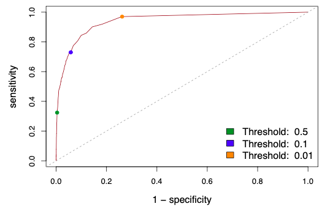
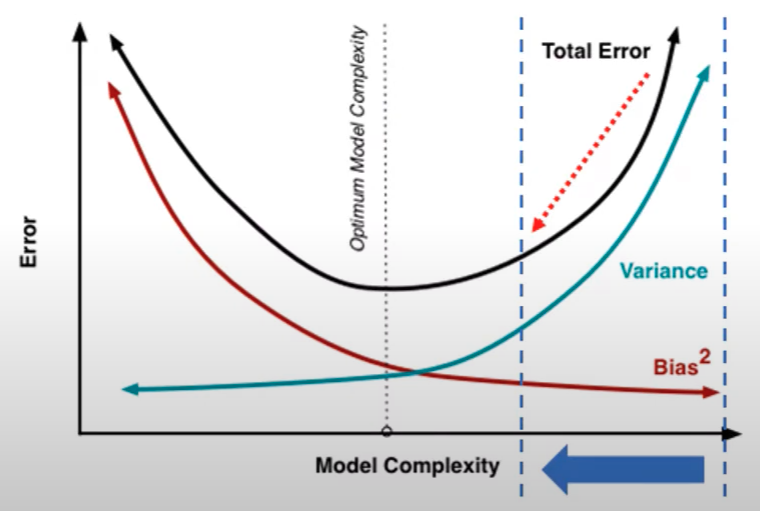

# Model Evaluation

## Goals

1. Minimize bias
2. Minimize variance
3. Minimize generalization gap

## Guidelines

- Metrics computed from validation set may not be representative of the true population
- Never trust a single summary metric
- Always look at all the individual metrics
  - false positives and false negatives are seldom equivalent
  - understand the problem to known the right tradeoff

## Model Selection

1. Fit multiple models $g_i$ on the training data
2. Use interval validation data for hyper parameter tuning of each model $g_i$
3. Use external validation data for model selection and obtain $g^*$
4. Combine the training and validation data. Refit $g^*$ on this set to obtain $g^{**}$
5. Assess the performance of $g^{**}$ on the test data

Finally, train $g^{**}$ on the entire data to obtain $\hat f$

## Baseline

Always establish a baseline

- Basic/Naive/Dummy predictions
  - Regression
    - Mean
    - Max
    - Min

  - Classification
    - Most frequent value
    - Random

  - Time series specific
    - Lag/Seasonal Lag
    - Last value available

- Human Level Performance
- Literature Review
- Performance of older system

### Significance

All the evaluation should be performed relative to the baseline.

For eg: Relative RMSE = RMSE(model)/RMSE(baseline), with “good” threshold as 1

## Probabilistic Evaluation

Now, we need to see if any increase or decrease in accuracy due to hyper-parameter tuning is statistically-significant, or just a matter of chance.

## Regression Evaluation

| Metric                                                      |                           Formula                            |   Unit   |   Range    | Preferred Value | Signifies                                                    | Advantages<br />✅                                            | Disadvantages<br />❌                                         | Comment                                                      |
| :---------------------------------------------------------- | :----------------------------------------------------------: | :------: | :--------: | --------------- | ------------------------------------------------------------ | ------------------------------------------------------------ | ------------------------------------------------------------ | :----------------------------------------------------------- |
| $R^2$<br />(Coefficient of Determination)                   |                       $1 - \text{RSE}$                       | Unitless |  $[0, 1]$  | $1$             | Proportion of changes in dependent var explained by regressors.<br /><br />Proportion of variance in $y$ explained by model wrt variance explained by mean<br /><br/>Demonstrates ___ of regressors<br/>- Relevance<br/>- Power<br/>- Importance |                                                              | Cannot use to compare same model on different samples, as it depends on variance of sample<br /><br />Susceptible to spurious regression, as it increases automatically when increasing predictors |                                                              |
| Adjusted $R^2$                                              |       $1 - \left[\dfrac{(1-R^2)(n-1)}{(n-k-1)}\right]$       | Unitless |  $[0, 1]$  | $1$             |                                                              | Penalizes large number of predictors                         |                                                              |                                                              |
| Accuracy                                                    |                     $100 - \text{MAPE}$                      |    %     | $[0, 100]$ | $100 \%$        |                                                              |                                                              |                                                              |                                                              |
| Chi-Squared<br />$\chi^2$                                   |       $\sum \left( \dfrac{u_i}{\sigma_i^2} \right)^2$        |          |            | $0$             |                                                              |                                                              |                                                              |                                                              |
| Spearman’s Correlation                                      | $\dfrac{ \text{Cov}(\ rg( \hat y), rg(y) \ ) }{ \sigma(\ rg(\hat y) \ ) \cdot \sigma( \ rg(y) \ ) }$ | Unitless | $[-1, 1]$  | $1$             |                                                              | Very robust against outliers<br />Invariant under monotone transformations of $y$ |                                                              |                                                              |
| DW<br />(Durbin-Watson Stat)                                |                                                              |          |            | $> 2$           | Confidence of error term being random process                |                                                              | Not appropriate when $k>n$                                   | Similar to $t$ or $z$ value<br />If $R^2 >$ DW Statistic, there is [Spurious Regression](#Spurious Regression) |
| AIC<br />Akaike Information Criterion                       |                       $-2 \ln L + 2k$                        |          |            | $0$             | Leave-one-out cross validation score                         | Penalizes predictors more heavily than $R_\text{adj}^2$      | For small values of $n$, selects too many predictors<br /><br />Not appropriate when $k>n$ |                                                              |
| AIC Corrected                                               |            $\text{AIC} + \dfrac{2k(k+1)}{n-k-1}$             |          |            | $0$             |                                                              | Encourages feature selection                                 |                                                              |                                                              |
| BIC/SBIC/SC<br />(Schwarz’s Bayesian Information Criterion) |                     $-2 \ln L + k \ln n$                     |          |            | $0$             |                                                              | Penalizes predictors more heavily than AIC                   |                                                              |                                                              |
| HQIC<br />Hannan-Quinn Information Criterion                |            $-2 \ln L + 2k \ln \vert \ln n \vert$             |          |            | $0$             |                                                              |                                                              |                                                              |                                                              |

$$
\begin{aligned}
-2 \ln L
&= n + n \ln(\text{MSE}) + n \ln (2 \pi) + \sum \ln w_i \\
&\approx n \ln(\text{MSE})
\end{aligned}
$$

| $\chi^2_\text{reduced} = \dfrac{\chi^2}{n-k}$ | Meaning       |
| --------------------------------------------- | ------------- |
| $\approx 1$                                   | Good Fit      |
| $>>1$                                         | Under-fitting |
| $<<1$                                         | Over-fitting  |

The reason this works is because, here $\chi^2$ is just sum of normally-distributed error terms

### Probabilistic Evaluation

You can model the error such as MAE as a $\chi^2$ distribution with dof = $n-k$

The uncertainty can be obtained from the distribution

### Spurious Regression

Misleading statistical evidence of a relationship that does not truly exist

Occurs when we perform regression between

- 2 independent variables

  and/or

- 2 non-stationary variables

  (Refer econometrics)

You may get high $R^2$ and $t$ values, but $u_t$ is not white noise (it is non-stationary)

Variance of error term becomes infinite as we go further in time

## Classification Evaluation

| Metric                                                       |                           Formula                            |                       Preferred Value                        |     Unit     |                            Range                             | Meaning                                                      |
| ------------------------------------------------------------ | :----------------------------------------------------------: | :----------------------------------------------------------: | :----------: | :----------------------------------------------------------: | ------------------------------------------------------------ |
| Entropy of each classification                               |               $H_i = -\sum \hat y \ln \hat y$                |                         $\downarrow$                         |              |                        $[0, \infty)$                         | Uncertainty in a single classification                       |
| Mean Entropy                                                 |               $H_i = -\sum \hat y \ln \hat y$                |                                                              |              |                                                              | Uncertainty in classification of entire dataset              |
| **Accuracy**                                                 | $1 - \text{Error}$<br />$\dfrac{\text{TP + TN}}{\text{TP + FP + TN + FN}}$ |                          $\uparrow$                          |      %       |                          $[0, 100]$                          | $\dfrac{\text{Correct Predictions}}{\text{No of predictions}}$ |
| **Error**                                                    |      $\dfrac{\text{FP + FN}}{\text{TP + FP + TN + FN}}$      |                           $[0, 1]$                           | $\downarrow$ | $\dfrac{\text{Wrong Predictions}}{\text{No of predictions}}$ |                                                              |
| **F Score**<br />F~1~ Score<br />F-Measure                   |             $2 \times \dfrac{P \times R}{P + R}$             |                          $\uparrow$                          |   Unitless   |                           $[0, 1]$                           | Harmonic mean between precision and recall<br />Close to lower value |
| ROC-AUC<br />Receiver-Operator Characteristics-Area Under Curve |     Sensitivity vs (1-Specificity)<br />= (1-FNR) vs FPR     | Larger AUC<br />Curve hugs the top left corner<br />High sensitivity, high specificity |   Unitless   |                           $[0, 1]$                           | How does the classifier compare to a classifier that predicts randomly<br />How well model can discriminate between $y=0$ and $y=1$ |
| **Recall**<br />Sensitivity<br />True Positive Rate          | $\dfrac{\textcolor{hotpink}{\text{TP}}}{\textcolor{hotpink}{\text{TP}} + \text{FN}}$ |                          $\uparrow$                          |   Unitless   |                           $[0, 1]$                           | How many actual +ve values were correctly predicted as +ve   |
| **Precision**<br />PPV/<br />Positive Predictive Value       | $\dfrac{\textcolor{hotpink}{\text{TP}}}{\textcolor{hotpink}{\text{TP}} + \text{FP}}$ |                          $\uparrow$                          |   Unitless   |                           $[0, 1]$                           | Out of actual +ve values, how many were correctly predicted as +ve |
| **Specificity**<br />True Negative Rate                      | $\dfrac{\textcolor{hotpink}{\text{TN}}}{\textcolor{hotpink}{\text{TN}} + \text{FP}}$ |                          $\uparrow$                          |   Unitless   |                           $[0, 1]$                           | Out of actual -ve values, how many were correctly predicted as -ve |
| NPV<br />Negative Predictive Value                           | $\dfrac{\textcolor{hotpink}{\text{TN}}}{\textcolor{hotpink}{\text{TN}} + \text{FN}}$ |                                                              |   Unitless   |                           $[0, 1]$                           | Out of actual -ve values, how many were correctly predicted as -ve |
| $F_\beta$ Score                                              | $\dfrac{(1 + \beta^2)}{{\beta^2}} \times \dfrac{P \times R}{P + R}$ |                          $\uparrow$                          |   Unitless   |                            [0, 1]                            | Balance between importance of precision/recall               |
| **FP Rate**                                                  | $\begin{aligned}\alpha &= \dfrac{\textcolor{hotpink}{\text{FP}}}{\textcolor{hotpink}{\text{FP}} + \text{TN}} \\ &= 1 - \text{Specificity} \end{aligned}$ |                         $\downarrow$                         |   Unitless   |                           $[0, 1]$                           | Out of the actual -ve, how many were misclassified as Positive |
| **FN Rate**                                                  | $\begin{aligned}\beta &= \dfrac{\textcolor{hotpink}{\text{FN}}}{\textcolor{hotpink}{\text{FN}} + \text{TP}} \\ &= 1 - \text{Sensitivity} \end{aligned}$ |                         $\downarrow$                         |   Unitless   |                           $[0, 1]$                           | Out of the actual +ve, how many were misclassified as Negative |
| Balance Accuracy                                             |         $\frac{\text{Sensitivity + Specificity}}2{}$         |                                                              |   Unitless   |                                                              |                                                              |
| MCC<br />Mathews Correlation Coefficient                     | $\dfrac{\text{TP} \cdot \text{TN} - \text{FP}\cdot \text{FN} }{\sqrt{(\text{TP}+\text{FP})(\text{TP}+\text{FN})(\text{TN}+\text{FP})(\text{TN}+\text{FN})}}$ |                          $\uparrow$                          |   Unitless   |                          $[-1, 1]$                           | 1 = perfect classification<br />0 = random classification<br />-1 = perfect misclassification |
| Markdedness                                                  |                        PPV + NPV - 1                         |                                                              |              |                                                              |                                                              |
| Brier Score Scaled                                           |                                                              |                                                              |              |                                                              |                                                              |
| Nagelkerke’s $R^2$                                           |                                                              |                                                              |              |                                                              |                                                              |
| Hosmer-Lemeshow Test                                         |                                                              |                                                              |              |                                                              | Calibration: agreement b/w obs and predicted                 |

### Graphs

| Graph             |                                                              | Preferred                                                |
| ----------------- | ------------------------------------------------------------ | -------------------------------------------------------- |
|                   |  |                                                          |
| ROC Curve         |                          | As high as possible<br />At least higher than 45deg line |
| Calibration Graph |  | Along 45deg line                                         |

### Probabilistic Evaluation

You can model accuracy as a binomial distribution with

- $n=$ Validation set size
  - = No of predictions
  - = No of k folds * Validation Set Size
- $p=$ Obtained Accuracy of classifier

The uncertainty can be obtained from the distribution


```python
for n in [100, 1_000, 10_000, 100_000]:
  dist = stats.binom(n, 0.7)
  
  alpha = 0.025
  
  interval_width = dist.isf(alpha) - dist.isf(1-0.975)
  print(f"Size: {interval_width/n * 100}")
  # returns alpha % of observed accuracy that fall outside the inverval --> This is the maximum further accuracy that is theoretically achievable
```

### Confusion Matrix

$n \times n$ matrix, where $n$ is the number of classes

#### Binary Classification

{ loading=lazy }

#### Multi-Class Classification

Confusion Matrix with respect to A

|      | A    | B    | C    |
| ---- | ---- | ---- | ---- |
| A    | TP   | FN   | FN   |
| B    | FP   | TN   | TN   |
| C    | FP   | TN   | TN   |

### Classifcation Accuracy Measures

#### Jacquard Index

$$
\begin{aligned}
J(y, \hat y)
&= \frac{|y \cap \hat y|}{|y \cup \hat y|} \\
&= \frac{|y \cap \hat y|}{|y| + |\hat y| - |y \cap \hat y|}
\end{aligned}
$$

#### F1 Score


|                  |                                                             |
| ---------------- | ----------------------------------------------------------- |
| Micro-Average    | All samples equally contribute to average                   |
| Macro-Average    | All classes equally contribute to average                   |
| Weighted-Average | Each class’ contribution to average is weighted by its size |


#### Macro Average

$$
\begin{aligned}
\text{Total Macro Average (Recall)}
&= \frac{\sum \text{Recall of each class}}{\text{No of classes}} \\
\text{Macro Average of each class (Recall)}
&= \text{Recall of that class}
\end{aligned}
$$

$$
\begin{aligned}
\text{Total Macro Average (Precision)}
&= \frac{\sum \text{Precision of each class}}{\text{No of classes}} \\
\text{Macro Average of each class (Precision)}
&= \text{Precision of that class}
\end{aligned}
$$

$$
\begin{aligned}
\text{Total Macro Average (F1 Score)}
&= \frac{\sum \text{F1 Score of each class}}{\text{No of classes}} \\
\text{Macro Average of each class (F1 Score)}
&= \text{F1 Score of that class}
\end{aligned}
$$

#### Weighted Average

$$
\begin{aligned}
&\text{Weighted Average (Recall)} \\
&= \frac{
\sum \Big( \text{Recall of each class} \times \text{Support of each class} \Big)
}{\text{Size of sample}}
\end{aligned}
$$

$$
\begin{aligned}
&\text{Weighted Average (Precision)} \\
&= \frac{
\sum \Big( \text{Precision of each class} \times \text{Support of each class} \Big)
}{\text{Size of sample}}
\end{aligned}
$$

$$
\begin{aligned}
&\text{Weighted Average (F1 Score)} \\
&= \frac{
\sum \Big( \text{F1 Score of each class} \times \text{Support of each class} \Big)
}{\text{Size of sample}}
\end{aligned}
$$

## Summary Statistics

Don’t just look at the mean evaluation metric of the multiple splits

Also use standard deviation & standard error to also get the uncertainty associated with the validation process.

## Residual Analysis

|                                   |                                                              | Numerical                                                    | Graphical Plots                                              |
| --------------------------------- | ------------------------------------------------------------ | ------------------------------------------------------------ | ------------------------------------------------------------ |
| Random residuals                  |                                                              | Normality test                                               | Q-Q Plot of $u_i$<br />Histogram for $u_i$                   |
| No explained systematic component | - No relationship between error and independent variables<br/>- If there is correlation, $\exists$ unexplained system component | $\text{Cov}(u_i, x_i) = 0; \text{Cov}(u_i^2, x_i) = 0$ : No covariance/correlation between $u_i$ and $x_i$<br/>, and $u_i^2$ and $x_i$ | Line graph: $u_i$ vs $x_i$<br />Line graph: $u_i^2$ vs $x_i$<br/>Line graph: $u_i$ vs $y_i$<br />Line graph: $u_i^2$ vs $y_i$ |
| Goodness of fit                   |                                                              | - MLE Percentiles<br/>- Kolmogorov Smirnov                   |                                                              |

Perform all the plots for train and validation data

### Numeric

- Series of $u_i$ are random

  1. $E(u_i | x_i) = 0$

    2. Symmetric distribution for values of error terms **for a given value $x$**
    3. **Not** over time/different values of $x$
    4. This means that
       1. you have used up all the possible factors
       2. $u_i$ only contains the non-systematic component

  5. Homoscedascity of variance

    6. $\text{var}(u_i | x_i) = \sigma^2 (u_i|x_i) = \text{constant}$ should be same $\forall i$
    7. For the Variance of distribution of potential outcomes, the range of distribution stays same over time
    8. $\sigma^2 (x) = \sigma^2(x-\bar x)$

    else, the variable is **volatile**; hard to predict; **we cannot use OLS**

    - if variance decreases, value of $y$ is more reliable as training data
    - if variance increases, value of $y$ is less reliable as training data
    - We use volatility modelling (calculating variance) to predict the pattern in variance

### Why is this important?

For eg: Running OLS on Anscombe’s quartet gives

- same curve fit for all
- Same $R^2$ for all

But clearly it is not optimal


which is shown in the residual plot


## Log Likelihood

```python
def ll(X, y, pred):
    # return log likelihood
    
		mse = np.mean(
      (y - pred)
      **2
    )
    
    n = float(X.shape[0])
    n_2 = n/2
    
    return -n_2*np.log(2*np.pi) - n_2*np.log(mse) - n_2

def aic(X, y, pred):
  	p = X.shape[1]
    
    return -2*ll(X, y, pred) + 2*p

print(aic(X, y, pred))
```

## Evaluation Curves

Related to [Interpretation](#Interpretation)

Always look at all curves with **uncertainties** wrt each epoch, train, hyper-parameter value. The uncertainty of the train set and test set should also be similar. If train set metric uncertainty is small and test set metric uncertainty is large, this is bad even if the average loss metric is same

|                      | Learning                                                     | Loss                                                       | Validation                                    |
| -------------------- | ------------------------------------------------------------ | ---------------------------------------------------------- | --------------------------------------------- |
| Loss vs              | Train Size                                                   | Epochs                                                     | Hyper-parameter value                         |
| Comment              | Train Error increases with train size, because model overfits small train datasets |                                                            |                                               |
| Purpose: Detect      | Bias<br />Variance<br />Utility of adding more data          | Optimization problems<br />Undertraining<br />Overtraining | Model Complexity<br />Optimal Hyperparameters |
| No retraining        | ❌                                                            | ✅                                                          | ❌                                             |
| No extra computation | ❌                                                            | ✅                                                          | ❌                                             |

### Learning Curve

|                                                              | Conclusion                       | Adding more data will help | Comment                         |
| ------------------------------------------------------------ | -------------------------------- | -------------------------- | ------------------------------- |
|  | High Bias<br />(Underfitting)    | ❌                          | Model can’t fit larger datasets |
|  | High Variance<br />(Overfitting) | ✅                          |                                 |
|  | High Bias<br />High Variance     |                            |                                 |

### Loss Curve




#### Same Model, Variable Learning Rate


## IDK


| Phase | Hessian | Mode Connectivity | Model Similarity | Treatment             |
| ----- | ------- | ----------------- | ---------------- | --------------------- |
| 1     | Large   | -ve               | Low              | Larger network        |
| 2     | Large   | +ve               | Low              | Smaller learning rate |
| 3     | Small   | -ve               | Low              | Larger network        |
| 4-A   | Small   | $\approx 0$       | Low              | Increase train size   |
| 4-B   | Small   | $\approx 0$       | High             | ✅                     |

