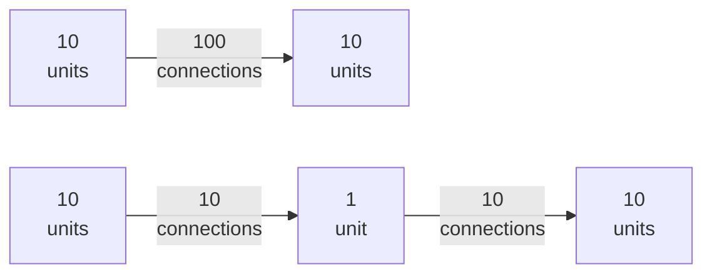
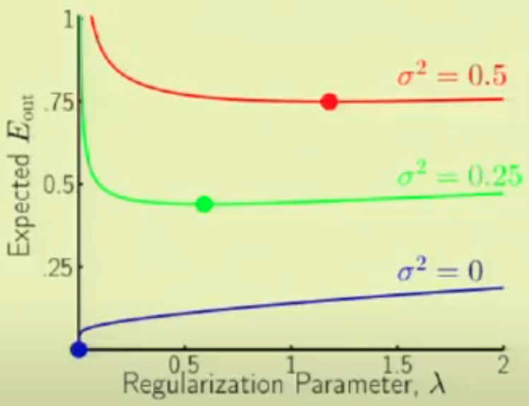
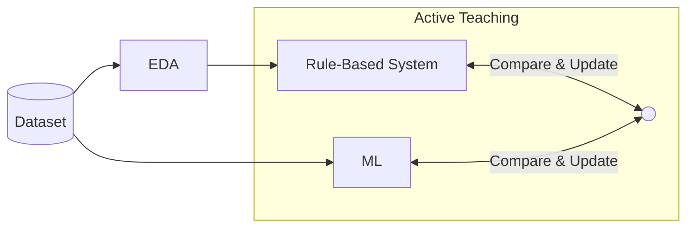

# Model Tuning

Be data-driven with model tuning, by closely-examining actual performance

- Sometimes you need to decide if it is worth fixing certain type of error

## Regularization

Methods that constrain the complexity of a model

- Goal: Improve out-of-sample error by reducing overfitting & variance
- Tradeoff: Compromising on an increased bias

Regularization allows a continuous spectrum of model complexity, rather than discrete jumps

## Reducing Capacity

Reduce the number of

- parameters (weights)
- layers (neural net)
- units per layers (neural net)
- Bottle neck layers (neural net)

### Bottleneck Layer(s) for neural nets

Let

- Let layer $i$ and layer $j$ be adjacent layers
- $w_i$ be weights of layer $i$
- $\vert w_i \vert$ be the number of units in a layer $i$
- $w_b$ be the bottleneck layer
  - effective only if $\vert w_b \vert < \arg \min(\vert w_i \vert, \vert w_j \vert)$

$$
\begin{aligned}
\text{Before: } & \vert w_i \vert \cdot \vert w_j \vert \\
\text{After: } & \vert w_i \vert \cdot \vert w_b \vert + \vert w_b \vert \cdot \vert w_j \vert
\end{aligned}
$$

Example

## Increase DOF

- Reduce $k$

  - Feature Selection

  - Dimensionality Reduction

- Increase $n$
  - Data augmentation

## Subsampling at each iteration

- columns
- rows

## Weight Decay

Also called as

- Shrinkage Term
- Regularization Penalty

Reduce errors by fitting the function appropriately on the given training set, to help reduce variance, and hence avoid overfitting, while minimally affecting bias.

This is done by adding a penalty term in the cost function.

Note:

- All input features must be ==**standardized**==
- Intercept should not be penalized
- You can use different penalty for each term
  - You can perform different regularizer and norm based on expected knowledge of **distribution** of parameter
  
$$
\begin{aligned}
J'(\theta)
&= J(\theta) + \dfrac{\lambda}{n} 
\underbrace{\textcolor{hotpink}{R(\theta)}}_
{\mathclap {\qquad \text{Reg Penalty}}}
\end{aligned}
$$

where

- $\sigma_u =$ Random Standard Deviation: Stochastic Noise
- $Q_f =$ Target Complexity: Deterministic Noise

This is similar to
$$
\begin{aligned}
E_\text{aug}
&= E_\text{in} + \dfrac{\Omega}{n} \\
&\updownarrow
\\
E_\text{out}
&\le E_\text{in} + \dfrac{\Omega}{n}
\end{aligned}
$$

Hence, $E_\text{aug}$ is a better proxy for $E_\text{out}$ than $E_\text{in}$

| Regularizer | Penalty| Effect                                      | Robust to outliers | Unique solution? | Comments | $\hat \beta$ | Limitations | Bayesian Interpretation |
|---                      | ---| ---                                         | ---                                   |---                      |---                      |---                      |---                      |---                      |
| $L_0$ | $\sum \limits_{j=1}^k (\beta_j \ne 0)$ Number of non-zero coefficients | Enforces sparsity (Feature selection) |  |  | Computationally-expensive Not Convex No closed-form soln (requires grad descent) |  |  |  |
|$L_1$ (Lasso: Least Absolute Shrinkage & Selection Operator)       | $\sum \limits_{j=1}^k \gamma_j {\left \vert \dfrac{{\beta_j - \mu_{\beta^*_j} } }{\sigma_{\beta^*_j}} \right \vert}$ | Encourages sparsity (Feature selection) Eliminates low effect features completely | ✅                   | ❌ | Convex No closed-form soln (requires grad descent) | $\begin{cases} \text{sign}({\hat \beta}_\text{OLS}) \times \left( \vert {\hat \beta}_\text{OLS} \vert - \lambda/2 \right) , & \vert {\hat \beta}_\text{OLS} \vert > \lambda/2, \\ 0, & \text{otherwise} \end{cases}$ | when $\exists$ highly-correlated features - Results can be random/arbitrary and unstable  - Multiple solutions | Laplace prior |
|$L_2$ (Rigde)       | $\sum \limits_{j=1}^k \gamma_j \left( \dfrac{\beta_j - \mu_{\beta^*_j}}{\sigma_{\beta_j^*}} \right)^2$ | Scale down parameters Reduces multi-collinearity | ❌ | ✅ | Convex Closed-form soln exists | $\dfrac{{\hat \beta}_\text{OLS}}{1 + \lambda}$ |  | Normal prior |
|$L_q$ | $\sum \limits_{j=1}^k \gamma_j {\left \vert \dfrac{{\beta_j - \mu_{\beta^*_j} } }{\sigma_{\beta^*_j}} \right \vert^q}$ | |  |  | | |  |  |
|$L_3$ (Elastic Net) | $\alpha L_1 + (1-\alpha) L_2$|                                             | Not very | ✅ | |  |  |  |
|Entropy                  | $\sum \limits_{j=1}^k - P(\beta_j) \ln P(\beta_j)$ | Encourage parameters to be different Encourages sparsity Cause high variation in between parameters |  |  | |  |  |  |
|SR3 (Sparse Relaxed) |  |  |  |  | |  |  |  |

where

- $\mu_{\beta^*_j}$ is the prior-known most probable value of $\beta_j$
- $\sigma_{\beta^*_j}$ is the prior-known standard deviation of $\beta_j$
- $\gamma_j$: Weightage of weight decay
  - Penalize some parameters more than others
  - Useful to penalize higher order terms with $\gamma_j = 2^q$, where $q=$ complexity of term

$\mu_{\beta^*_j}$ and $\sigma_{\beta^*_j}$ incorporate desirable Bayesian aspects in our model.

### Bayesian Interpretation

Regularization amounts to the use of informative priors, where we introduce our knowledge or belief about the target function in the form of priors, and use them to “regulate” the behavior of the hypothesis we choose

Incorporating $\hat \beta$ into the regularization incorporates maximum likelihood estimate of the coefficients.

Didn’t understand: The standard deviation of the prior distribution corresponds to regularization strength $\lambda$

Example

|    $y$    | $\hat \beta$ |
| :-------: | :----------: |
| $\beta x$ |      0       |
| $x^\beta$ |      1       |

### IDK

### Contours of Regularizers

### Limitations

Magnitude of parameters may not always be the best estimate of complexity, especially for Deep Neural Networks

### Why is standardization required?

- magnitudes of parameters need to be comparable
- Penalized estimates are **not** scale equivariant: multiplying $x_j$ by a constant $c$ can cause a significant change in $\hat \beta$ when using regularization

### Feature Selection Paths

### Penalty Coefficient Magnitude

### Penalty Coefficient vs Noise

| Stochastic Noise                                             | Deterministic Noise                                          |
| ------------------------------------------------------------ | ------------------------------------------------------------ |
|  |  |

$$
\begin{aligned}
\lambda^* &\propto \sigma^2_u \\
\lambda^* &\propto Q_f^2
\end{aligned}
$$

where $\lambda^* =$ Optimal $\lambda$

### Frequentist Interpretation

$\lambda$ regulates the smoothness of the spline that solves
$$
\min_h \left \{
J(\theta, x_i, y_i) + \lambda \int [h''(t)]^2 \cdot dt
\right \}
$$
Penalizing the squared $k$th derivative leads to a natural spline of
degree $2k − 1$

| $\lambda$ | Reduces  | Comment                           |
| --------- | -------- | --------------------------------- |
| 0         | Bias     | Interpolates every $(x_i, y_i)$   |
| $\infty$  | Variance | Becomes linear least squares line |

### IDK

$$
\begin{aligned}
&\arg \min J(\theta) \\
&\text{subject to: } \sum_{j=1}^k (\beta_j)^2 \le C
\end{aligned}
$$

$$
\lambda \propto \dfrac{1}{C}
$$

### Optimization Equivalent

This is equivalent to:

At each iteration, shrink the weights by the gradient of the regularization penalty before taking the gradient step

For L2: $(1-\nu \lambda)$
$$
\begin{aligned}
w_{t+1}
&= w_{t} - \nu \Big[ \nabla w_t + \nabla R(w_t) \Big] \\
&= \Big[ 1 - \nu \ \nabla R(w_t) \Big] w_{t} - \nu \ \nabla w_t \\

\implies \text{With L2}
&= (1- \nu \lambda) w_{t} - \nu g(t)
\end{aligned}
$$

Most deep learning libraries incorporate weight decay in the optimizer; however, this isn’t the most conceptually best way to approach weight decay - better to incorporate in the loss function

## Hinted Regularization

Penalize deviation from [Model Hints](03_Model.md#Model-Hints) 

## Multi-Stage Regularization

| Stage | Goal               |            |
| ----- | ------------------ | ---------- |
| 1     | variable selection | LASSO      |
| 2     | estimation         | Any method |

Intuition: Since vars in 2nd stage have less "competition" from noise variables, estimating using selected variables could give better results

## System Equation Penalty

Useful if you know the underlying systematic differential equation

$$
J'(\theta) = J(\theta) + \text{DE} \\
\text{RHS(DE)} = 0
$$
Refer to PINNs for more information

## IDK

## Early Stopping

- This applies to all [evaluation curves](12_Evaluation.md#Evaluation-Curves) 
- Stopping criteria
  - In-Sample error < Out-Sample error
  - Evaluation metric
    - RMSE $\le \sigma_u$
    - MAPE $\le 1-\text{Accuracy}_\text{req}$
- Stop few iterations/value before the optimal point, to reduce variance further: $e_\text{stop} < e^*$

## Dropout

Dropout is applied on the output of hidden fully-connected layers

- Makes networks “robust” to missing activations
- Stochastic approximation

### Training

Stochastically drop out units with probability $p_\text{drop}$ and keep with $p_\text{keep}=1-p_\text{drop}$

$$
(w'_t)_j = \begin{cases}
0, & \text{with prob } p \\
(w_t)_j, & \text{o.w}
\end{cases}
$$

Annealed dropout

### Evaluation/Production

At inference time, dropout is inactive, as we should not predict stochastically

| Approach                           | Time  |                                     | Advantages                                                   | Disadvantage                                                 |
| ---------------------------------- | ----- | ----------------------------------- | ------------------------------------------------------------ | ------------------------------------------------------------ |
| Naive approach                     | Test  | Simply not use dropout              |                                                              | All units receive $(1/p_\text{drop})$ times as many incoming signals compared to training, so responses will be different |
| Test-Time Rescaling                | Test  | Multiply weights by $p_\text{keep}$ |                                                              | Comparing  similar architectures w/ and w/o dropout requires implementing 2 different networks at test time |
| Dropout Inversion (preferred) | Train | Divide weights by $p_\text{keep}$   | Overcome limitations of Test-Time Rescaling Allows for annealed dropout |                                                              |

## Ensembling

Reduces variance from high-variance models, such as trees

## Noise Injection

- Add noise to inputs
- Add noise to outputs

Behaves similar to L2 regularization

## Label Smoothing

The output of $\sigma, \tanh$ never actually really output the maximum/minimum range values. So the model will keep trying to make the predictions go to exact $0/1$ (which is never attainable), making it prone to overfitting

Using label smoothing, model becomes less confident with extremely confident labels (which we want to avoid). Now, the penalty given to a model due to an incorrect prediction will be slightly lower than using hard labels which would result in smaller gradients

| Modify |                                                              |
| ------ | ------------------------------------------------------------ |
| Target | $y' = \begin{cases} y - \epsilon, & y = y_\text{true} \\ y + \dfrac{\epsilon}{C-1}, & \text{o.w} \end{cases}$ |
| Loss   | $L' = (1-\epsilon) L_i + \dfrac{\epsilon}{C-1} \sum_j L_j$   |

where

- $y_\text{true}$ is the true label
- $C=$ total number of classes/labels
- $\epsilon \approx 0$

Extreme cases for $\epsilon$

- $\epsilon=0$: original
- $\epsilon=1$: uniform

## Active Teaching

## Neural Network

| Phase | Hessian | Mode Connectivity | Model Similarity | Treatment             |
| ----- | ------- | ----------------- | ---------------- | --------------------- |
| 1     | Large   | -ve               | Low              | Larger network        |
| 2     | Large   | +ve               | Low              | Smaller learning rate |
| 3     | Small   | -ve               | Low              | Larger network        |
| 4-A   | Small   | $\approx 0$       | Low              | Increase train size   |
| 4-B   | Small   | $\approx 0$       | High             | ✅                     |

