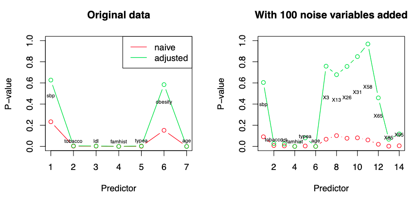

## Statistical Inference

Deals with the problem of uncertainty in estimates due to sample variability

Does not deal with

- Whether model specification is correct
- Whether $x$ has causal effect on $y$
- Whether model is good for describing causal effect of $x$ on $y$

## Hypotheses Testing

## Selective Inference

Assessing strength of evidence after obtaining the ‘best model’ through searching from a large number of models

If not taken into account, the effects of selection can greatly exaggerate the apparent strengths of relationships.

Also called as Post-Selection Inference

### Context

To conduct statistical inference for procedures that involve model selection, such as forward stepwise regression or the lasso, it is tempting to look only at the final selected model. However, such inference is generally invalid

The problem is essentially the same as those of specification search and data-snooping: an observed correlation of 0.9 between x and y may be noteworthy. However, if x is found by searching over 100 variables looking for the one with the highest observed correlation with y, then the finding is no longer as impressive and could well be due to chance

### Solution: Conditional Coverage

Make the inference conditional on the model selected

Construct CI for $\beta_{j, M}$ conditional on model $M$ being selected:
$$
P(\beta_{j, M} \in C_{j,m} \vert M \text{ selected}) \ge 1 - \alpha
$$