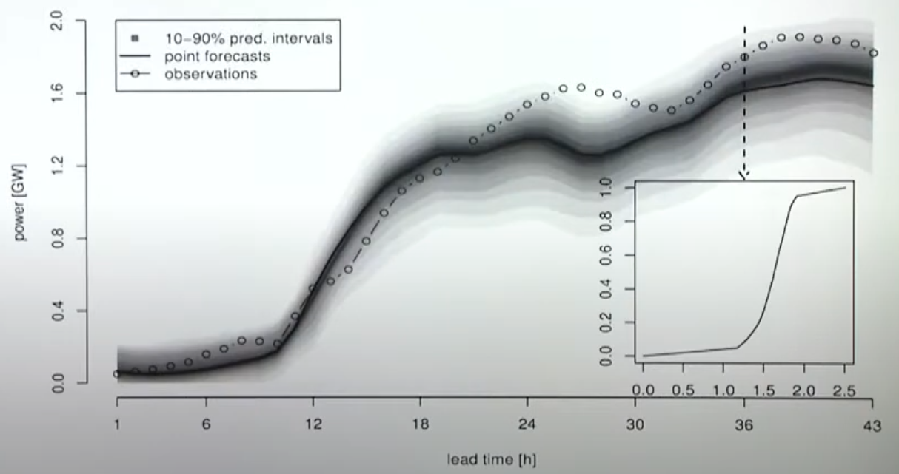
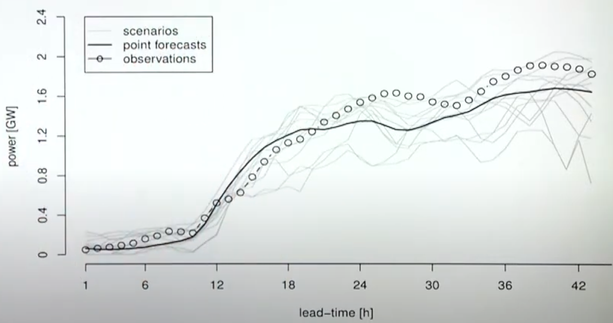

# Uncertainty

## Types of Uncertainty

| Others’ knowledge  Our knowledge | Known                                                     | Unknown                                                      |
| ------------------------------------------------------------ | --------------------------------------------------------- | ------------------------------------------------------------ |
| Known                                                        | Things we are certain of                                  | We know there are things we can’t predict eg: Random Process |
| Unknown                                                      | Others know but you don’t know eg: Insufficient data | Completely unexpected/unforeseeable events eg: Unknown distribution |

|                                      | Aleatoric                                | Epistemic             |
| ------------------------------------ | ---------------------------------------- | --------------------- |
| Uncertainty in                       | Data                                     | Model                 |
| Cause                                | Noisy input data Measurement errors | Missing training data |
| Describes confidence in              | Input data                               | Prediction            |
| Reducible through more training data | ❌                                        | ✅                     |
| Can be learnt by model               | ✅                                        | ❌                     |
| Solution                             | Better instruments/measurements          | Get more data         |

## Uncertainty Intervals

You can obtain uncertainty using

|                                | Concept                          | Limitations                                                  |
| ------------------------------ | -------------------------------- | ------------------------------------------------------------ |
| Asymptotic approach            | Central limit theorem            | - Requires large sample size to satisfy asymptotic condition - Assumes normal distribution of errors - Assumes homoscedascity - Requires appropriate formula for calculating standard error (not possible for complex models) |
| Bootstrapping (preferred) | Random sampling with replacement | Higher computation cost                                      |

$$
\hat y \pm t_{\alpha/2} \times \text{SE}
$$

|                                                                                  | Coefficient Confidence Interval                                     | Response Confidence Interval                                                                                                          | Response Prediction Interval                                                                                                                         |
| -------------------------------------------------------------------------------- | ------------------------------------------------------------------- | ------------------------------------------------------------------------------------------------------------------------------------- | ---------------------------------------------------------------------------------------------------------------------------------------------------- |
| Denotation                                                                       | $\sigma_{\hat \beta}$                                               | $\sigma\Big(\hat \mu(y \vert x) \Big)$                                                                                                | $\sigma\Big( \hat y \vert x \Big)$                                                                                                                   |
| The upper and lower bound for estimated __ at a given level of significance      | $\hat \beta$                                                        | $\hat \mu(y \vert x)$                                                                                                                 | $\hat y \vert x$                                                                                                                                     |
| SE (Standard Error) for Univariate Regression  (Asymptotic Approach)   | $\dfrac{\text{RMSE}}{\sqrt{\sum (x_{\text{pred}_\text{cent}} )^2}}$ | $\text{RMSE} \times \sqrt{ \dfrac{1}{n} + \dfrac{(x_{\text{pred}_\text{cent}} )^2}{n \sigma_x^2}}$                                    | $\text{RMSE}  \times \sqrt{ \textcolor{hotpink}{1 +} \dfrac{1}{n} + \dfrac{(x_{\text{pred}_\text{cent}})^2}{n \sigma_x^2}}$                          |
| SE (Standard Error) for Multivariate Regression  (Asymptotic Approach) | ${\text{CovMatrix}_\beta}_{ii}$                                     | $\text{RMSE} \times \sqrt{\dfrac{1}{n} + J'_{{x_\text{pred}}_\text{cent}} \ \text{CovMatrix}_{X} \ J'_{{x_\text{pred}}_\text{cent}}}$ | $\text{RMSE} \times \sqrt{\textcolor{hotpink}{1+} \dfrac{1}{n} + x'_{\text{pred}_\text{cent}} \ \text{CovMatrix}_{X} \ x_{\text{pred}_\text{cent}}}$ |

$$
\begin{aligned}
x'_{\text{pred}_\text{cent}} &= x_\text{pred} - \bar X \\
X_\text{cent} &= X - \bar X \\
\\
\text{CovMatrix}_{\beta} &= \text{RMSE} \times \sqrt{\text{CovMatrix}_{X}} \\
\text{CovMatrix}_{X} &= H^{-1} \\
H^{-1} &\approx (J' J)^{-1} \\
J &= X \text{ for degree 1}
\end{aligned}
$$

Where

- $J$: Jacobean matrix
- $H$: Hessian matrix

High values for non-diagonal elements of $\text{Cov}_\beta$ means that the errors of $\beta$ are correlated with each other.

Degree of freedom $= n - k - 1$, where

- $n =$ sample size
- $k=$ no of input variables

Confidence and prediction intervals are narrowest at $X = \bar X$, and get wider further from this point.

Under homoskedasticity,
$$
\begin{aligned}
\hat V(\hat \beta)
&= (X' X)^{-1} \hat \sigma^2 \\
&=\dfrac{\hat \sigma^2}{\hat u_j' \hat u_j}
\end{aligned}
$$

### Note

- RMSE = RMSE of validation data
- If your validation error distribution is not normal, or you have a lot of data, you can use the quantiles of validation error distribution for the confidence intervals

### Intervals using Models’ Prediction

For each data point, take __ of multiple models

- average
- 5th quantile
- 95th quantile

## Predictive Density

Describes the full probabilistic distribution $\forall x$

## Trajectories/Scena rios

Equally-likely samples of multivariate predictive densities

## Uncertainty Propagation

| Function                    | Variance                                                                                                                                   |
| --------------------------- | ------------------------------------------------------------------------------------------------------------------------------------------ |
| $aA$                        | $= a^2\sigma_A^2$                                                                                                                          |
| $aA + bB$                   | $= a^2\sigma_A^2 + b^2\sigma_B^2 + 2ab\,\text{Cov(A, B)}$                                                                                  |
| $aA - bB$                   | $= a^2\sigma_A^2 + b^2\sigma_B^2 - 2ab\,\text{Cov(A, B)}$                                                                                  |
| $AB$                        | $\approx f^2 \left[\left(\frac{\sigma_A}{A}\right)^2 + \left(\frac{\sigma_B}{B}\right)^2 + 2\frac{\text{Cov(A, B)}}{AB} \right]$           |
| $\frac{A}{B}$               | $\approx f^2 \left[\left(\frac{\sigma_A}{A}\right)^2 + \left(\frac{\sigma_B}{B}\right)^2 - 2\frac{\text{Cov(A, B)}}{AB} \right]$           |
| $\frac{A}{A+B}$             | $\approx \frac{f^2}{\left(A+B\right)^2} \left(\frac{B^2}{A^2}\sigma_A^2  +\sigma_B^2 - 2\frac{B}{A} \text{Cov(A, B)} \right)$              |
| $a A^{b}$                   | $\approx \left( {a}{b}{A}^{b-1}{\sigma_A} \right)^2 = \left( \frac{{f}{b}{\sigma_A}}{A} \right)^2$                                         |
| $a \ln(bA)$                 | $\approx \left(a \frac{\sigma_A}{A} \right)^2$[^4]                                                                                         |
| $a \log_{10}(bA)$           | $\approx \left(a \frac{\sigma_A}{A \ln(10)} \right)^2$[^5]                                                                                 |
| $a e^{bA}$                  | $\approx f^2 \left( b\sigma_A \right)^2$[^6]                                                                                               |
| $a^{bA}$                    | $\approx f^2 (b\ln(a)\sigma_A)^2$                                                                                                          |
| $a \sin(bA)$                | $\approx \left[ a b \cos(b A) \sigma_A \right]^2$                                                                                          |
| $a \cos \left( b A \right)$ | $\approx \left[ a b \sin(b A) \sigma_A \right]^2$                                                                                          |
| $a \tan \left( b A \right)$ | $\left[ a b \sec^2(b A) \sigma_A \right]^2$                                                                                                |
| $A^B$                       | $\approx f^2 \left[ \left( \frac{B}{A}\sigma_A \right)^2 +\left( \ln(A)\sigma_B \right)^2 + 2 \frac{B \ln(A)}{A} \text{Cov(A, B)} \right]$ |
| $\sqrt{aA^2 \pm bB^2}$      | $\approx \left(\frac{A}{f}\right)^2 a^2\sigma_A^2 + \left(\frac{B}{f}\right)^2 b^2\sigma_B^2 \pm 2ab\frac{AB}{f^2}\,\text{Cov(A, B)}$      |

For uncorrelated variables ($\rho_{AB}=0$, $\text{Cov(A, B)}=0$) expressions
for more complicated functions can be derived by combining simpler
functions. For example, repeated multiplication, assuming no
correlation, gives
$f = ABC; \qquad \left(\frac{\sigma_f}{f}\right)^2 \approx \left(\frac{\sigma_A}{A}\right)^2 + \left(\frac{\sigma_B}{B}\right)^2+ \left(\frac{\sigma_C}{C}\right)^2.$

For the case $f = AB$ we also have Goodman's expression[^7] for the
exact variance: for the uncorrelated case it is
$V(XY)= E(X)^2 V(Y) + E(Y)^2 V(X) + E((X-E(X))^2 (Y-E(Y))^2)$ and
therefore we have:
$\sigma_f^2 = A^2\sigma_B^2 + B^2\sigma_A^2 +  \sigma_A^2\sigma_B^2$

## Effect of correlation on differences

If *A* and *B* are uncorrelated, their difference *A-B* will have more
variance than either of them. An increasing positive correlation
($\rho_{AB}\to 1$) will decrease the variance of the difference,
converging to zero variance for perfectly correlated variables with the
[same variance](homoscedastic "wikilink"). On the other hand, a negative
correlation ($\rho_{AB}\to -1$) will further increase the variance of
the difference, compared to the uncorrelated case.

For example, the self-subtraction *f=A-A* has zero variance
$\sigma_f^2=0$ only if the variate is perfectly
[autocorrelated](autocorrelation "wikilink") ($\rho_A=1$). If *A* is
uncorrelated, $\rho_A=0$, then the output variance is twice the input
variance, $\sigma_f^2=2\sigma^2_A$. And if *A* is perfectly
anticorrelated, $\rho_A=-1$, then the input variance is quadrupled in
the output, $\sigma_f^2=4\sigma^2_A$ (notice $1-\rho_A=2$ for *f* = *aA*
− *aA* in the table above).

## Value at Risk Models

- Derive the risk profile of the firm
- Protect firm against unacceptably large concentrations
- Quantify potential losses

1. Collect data
2. Graph the data to inspect data quality
3. Transform prices data into returns form (percentage diff of prices)
4. Look at the frequency distribution
5. Obtain the standard deviation (volatility)
6. Multiply volatility with one-sided $Z_1$ to estimate 99% worst-case loss

## Classification

$$
[\text{Bin}(n, p)_{1-\alpha/2}, \text{Bin}(n, p)_{\alpha/2}]
$$

