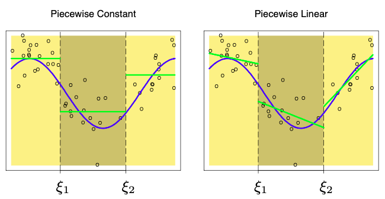
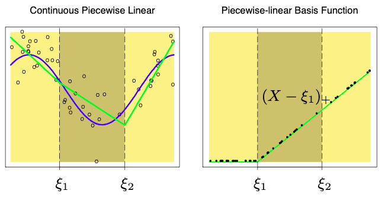
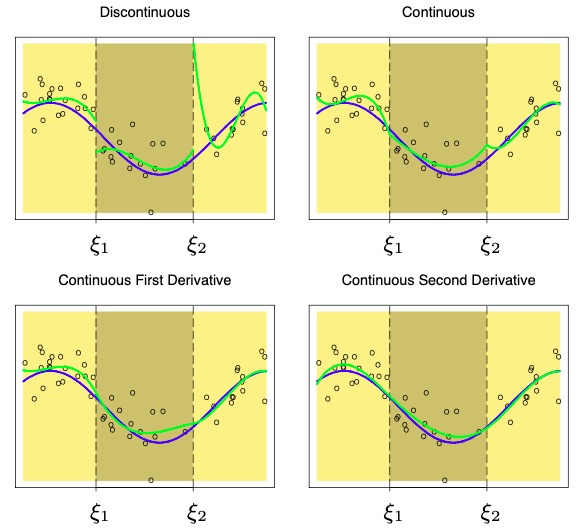

# Piecewise Regression

Breaks input space into distinct regions and fits different relationship for each region.

## Linear Basis Function Models

$$
\begin{aligned}
\hat y
&= \sum_{m=1}^M \hat \beta_m \phi_m + u \\
&= \beta' \Phi + u \\
&= (\Phi' \Phi)^{-1} \Phi' Y
\end{aligned}
$$

where $\phi(x) =$ basis function

## Piecewise Constant Regression

For every $x \in R_m$, we make the same prediction, which is simply the
mean of the response values for the training observations in $R_m$

- Divide range of $x$ into $m$ regions by creating $(m-1)$ knots (cut-points) $\epsilon_1, \dots, \epsilon_{M-1}$
- Construct dummy variables: $\phi_m(x) = I(\epsilon_{m-1} \le x < \epsilon_m), \forall m \in M$
- Fit model $\hat y = \sum_{m=1}^M \hat \beta_m \phi_m + u$
  - $\hat y = \sum_{m=1}^M \hat \beta_m \phi_m$ is called as step function/piece-wise constant function
  - $\hat \beta_m = \bar y_m = \dfrac{\sum_{x_i \in R_m} y_i}{n_m}$

## Piecewise Polynomial Regression

## Splines

So we specify $\alpha_{10} + \alpha_{11} \epsilon = \alpha_{20}$

Spline with one knot
$$
\hat y = \beta_0 + \beta_1 x + \beta(x- \epsilon)_+ + u
$$
where

- $\beta_0 = \alpha_{10}, \beta_1 = \alpha_{11}, \beta_2 = \alpha_{21}-\alpha_{11}$
- $(x-\epsilon)_+ = (x-\epsilon) I (x \ge \epsilon)$

|                |                                                              |                                               | Limitation                |
| -------------- | ------------------------------------------------------------ | --------------------------------------------- | ------------------------- |
| Spline         | Degree $d$ spline is a piece-wise degree $d$ polynomial with continuity in derivatives up to degree $(d-1)$ at each knot - Continuous - Smooth | $(d+m)$ degrees of freedom $(m-1)$ knots | High variance at boundary |
| Natural Spline | Function is linear beyond the boundary knots, to produce more stable estimates |                                               |                           |

## Generalized Additive Models

$$
\begin{aligned}
\hat y
&= w_0 + \sum_{i=1}^k w_i(x_i) + u \\
w_j(x_j) &= \sum_{m=1}^{M_j} \beta_{jm} \phi_{jm} (x_j)
\end{aligned}
$$

Allow for flexible nonlinear relationships in each dimension of the input space while maintaining additive structure of linear models

Can be fit using least squares, as it is a linear basis function model