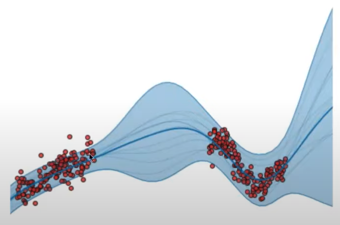

# Bayesian Learning

Focus marginalization rather than optimization

Rather than use a single setting of parameters $w$, use all settings weighted by their posterior probabilities in a Bayesian model average

## Advantages

Automatically calibrated complexity even with highly flexible models

## Limitations

Computationally-expensive for high dimensions

## Bayes Optimal Classifier

Given new instance $x$

Consider $v=\{v_1, v_2 \}=\{\oplus, \ominus \}$

The optimal classifier is given by

$$
\underset{v_j \in V}{\arg \max}
\sum_{h_i \in H} \textcolor{hotpink}{P(v_j | h_i)} \ P(h_i | D)
$$

### Disadvantage

Very costly to implement. We need to calculate a lot of probabilities

## Gibbs Algorithm

Consider we have multiple independent hypotheses

1. Choose one hypothesis at random, according to $P(h|D)$
1. Use this to classify new instance

### Disadvantage

Lower accuracy

One more point in slide

## Naive Bayes

## Bayesian Belief Network

## Bayesian NN

## Bayesian Classifier

Called as ‘Naive’ classifier, due to following assumptions

- Empirically-proven
- Scales very well

## Naive Bayes Classification

Calculate posterior probability, based on assumption that all input attributes are conditionally-independent

### Drawbacks

1. Doesn’t work for continuous independent variable
   1. We need to use Gaussian Classifier
2. Violation of Independence Assumption
3. Zero outlook
