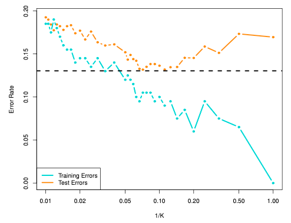

# $k$ Nearest Neighbor

Represents each record as a datapoint with $m$ dimensional space, where $m$ is the number of attributes

## Requirements

- Set of labelled records
- **Normalized** Proximity/Distance metric
  - Min-Max normalization
  - $Z$-normalization
- Odd value of $k$

## Choosing $k$

Similar to bias-variance tradeoff
$$
\begin{aligned}
\text{Flexibility} &\propto \dfrac{1}{k} \\

\implies \text{Bias} &\propto k \\
\text{Variance} &\propto \dfrac{1}{k}
\end{aligned}
$$

### Value of $k$

| $k$       | Problems                                                                                         | Low Bias | Low Variance |
| --------- | ------------------------------------------------------------------------------------------------ | -------- | ------------ |
| too small | Overfitting Susceptible to noise                                                            | ✅        | ❌            |
| too large | Underfitting Susceptible to far-off points: Neighborhood includes points from other classes | ❌        | ✅            |

Finding optimal $k$
1. Use a test set
2. Let $k = 3$
3. Record error rate of regressor/classifier
4. $k = k+2$
5. Repeat steps 3 and 4, until value of $k$ for which
   1. error is min
   2. accuracy is maximum

## Types

|        | Classification                                                                                                                                                                                                | Regression                                                                            |
| ------ | ------------------------------------------------------------------------------------------------------------------------------------------------------------------------------------------------------------- | ------------------------------------------------------------------------------------- |
| Output | Class label is the majority label of $k$ nearest neighbors                                                                                                                                                    | Predicted value will be the average of the continuous labels of $k$-nearest neighbors |
| Steps  | - Compute distance between test record and all train records - Identify $k$ neighbors of test records   (Low distance=high similarity) - Use majority voiting to find the class label of test sample |                                                                                       |
|        |                                                                                                                                                                                       |                                                                                       |

## Distance-Weighted KNN

Closer points are given larger weights for the majority voting scheme

## Efficient KNN LOOCV

- Tie-breaking condition
	- For all i, j = 1, . . . , n with i ̸= j, we have xi ̸= xj and dX (xℓ, xi) ̸= dX (xℓ, xj ) for all ℓ = 1, . . . , n.
- Under the tie-breaking condition, the LOOCV estimate of the mean square error for $k$-NN regression is identical to the mean square error of $(k+1)$-NN regression evaluated on the training data, multiplied by the scaling factor $\dfrac{(k+1)^2}{k^2}$
- Therefore, to compute the LOOCV score, one only needs to fit $(k+1)$-NN regression only once, and does not need to repeat training-validation of $k$-NN regression for the number of training data
- https://openreview.net/forum?id=SBE2q9qwZj