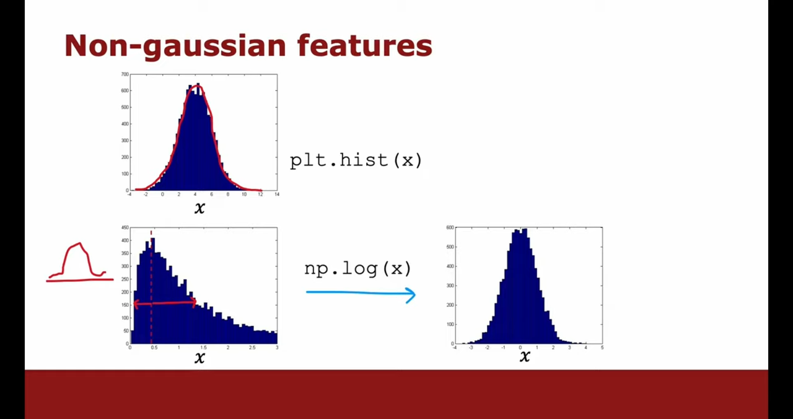

# Anomaly Detection

- Outliers/Leverage: training data contamination
- Novelty: new data different from training data

Check out [Anomalous Points](../Data_Mining/03_Anomalous_Points.md)

Residual technique
- Perform **robust** regression, then inspect residuals wrt MAD of all residuals
	- Will not work if the model is not robust
- IDK
	- For identifying high leverage (X outliers)
		- Perform non-linear regression of $x_j$ on all other cols: ineffective for more than 1 outlier
			- $\hat x_j = f(X_{-j}, y)$
			- If anomaly, then remove
			- Perform for each $j$
	- For identifying X novelties
		- Perform non-linear regression of $x_j$ on all other available cols
			- $\hat x_j = f(X_{-j})$, as usually $y$ will not be available
			- If anomaly, then remove
			- Perform for each $j$

## Limitations

- False positives are a problem
- No temporal coherence: several anomalous events in sequence do not get priority over the same events randomly sampled in time

## Note

- When using AD as a secondary model to filter data for the primary model, you need not use the same input features for both
- Anomaly detection could be used on variables that are not directly to the output
	- Even if variable $w$ does not affect $y$, the change in $Z$ could mean that
		- $Z$ is a cause of $y$, with unknown relationship with $y$: obviously important to detect change in system
		- $Z$ is an effect modifier, but unknown relationship: the structural relationship between $X$ and $y$ could change
		- the structural relationship governing the entire system including $X$ and $y$ could have changed

Let

- $\mathcal{X}, \mathcal{y} \in \mathcal{D}$ be all the data you have
- $\mathcal{X}_a$ be used for primary model
- $X_b$ be used for anomaly detection

Then, all these perfectly reasonable
- $\vert \mathcal{X}_a \vert  = \vert \mathcal{X}_b \vert$
- $\vert \mathcal{X}_a \vert > \vert \mathcal{X}_b \vert$
- $\vert \mathcal{X}_a \vert < \vert \mathcal{X}_b \vert$

## Univariate

- IQR
- MAD

## Density Estimation

## Procedure Methodology

|            |                                                                |
| ---------- | -------------------------------------------------------------- |
| Training   | Only non-anomalous samples                                     |
| Validation | Verify with known values, then validate, and then update model |
| Testing    | Verify with known values and then test                         |

## Anomaly Detection vs Classification

|                                            | Anomaly Detection                    | Classification                           |
| ------------------------------------------ | ------------------------------------ | ---------------------------------------- |
| Anomalous training samples requirement     | None (only required for tuning) | Large                                    |
| Non-anomalous training samples requirement | Large                                | Large                                    |
| Can handle novelties                       | ✅                                    | ❌                                        |
| Example                                    | Unseen defects Fraud            | Known defects (scratches) Spam mail |

## Feature Engineering

Include features that have very small/large values for anomalies

If anomalies don’t have such values, then try to find a combination of features such as $x_1 \cdot x_2$ to achieve it

## Dealing with Non-Gaussian Features

Transformation of training, validation, and test set.

If you have x values as 0, then $\log(x)$ as $\log(0)$ is undefined. So you use $\log(x+c)$, where $c>0$

## Categorical Events

Challenge: No metric space allowing comparison

Solution: Self-supervised learning

## IDK

- Clustering
	- Dimensionality reduction using local retention algorithm: UMAP, t-SNE
	- Clustering using hierarchical and density-based: HDBScan
- Dimensionality reduction reconstruction loss
	- Kernel PCA
	- UMAP
	- Auto-encoder
- Clustering in Dimensionality reduction embedding space
- Take in all features
	- For every col and multiplicative and divisive interaction, calculate min and max

## IDK

Iterative outlier detection
1. Detect outliers
2. Handle them - remove/winsorize
3. Go to step 1