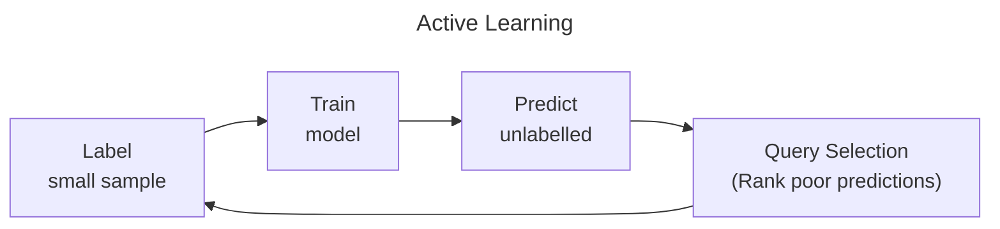

# Active Learning

## Query Selection Strategies

| Type                  | Strategy                    | Measure                                                   | Advantage        |
| --------------------- | --------------------------- | --------------------------------------------------------- | ---------------- |
| Heuristic             | Uncertainty Sampling        | Least confident Smallest margin Highest entropy |                  |
|                       | QBC (Query By Committee)    | Vote entropy of enseble models                            |                  |
|                       | Expected Model Change       | Gradient of loss function wrt parameters                  |                  |
|                       | Expected Error Reduction    |                                                           |                  |
|                       | Variance Reduction          |                                                           |                  |
|                       | Density Weighted Methods    | Average similarity to entire unlabelled pool of examples  | Outliers ignored |
| Approximate Posterior | Monte-Carlo Dropout         |                                                           |                  |
|                       | Stochastic Weight Modelling |                                                           |                  |

