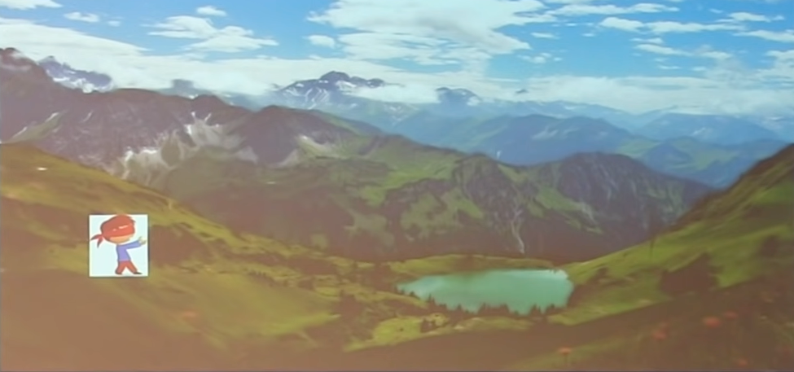
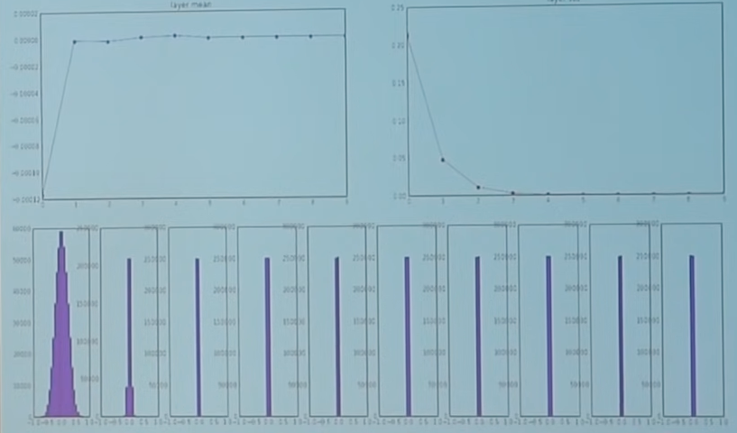
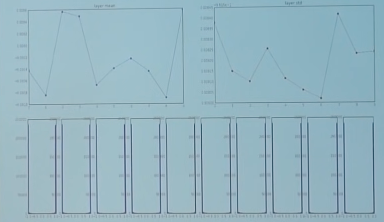
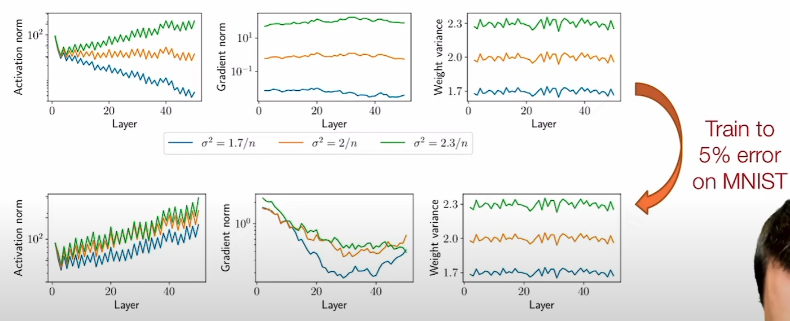

# Optimization

Find a set of parameters that minimizes the loss function for the given data and algorithm

$$
\underset{\theta}{\arg \min} \ L( \ y, \hat f_\theta(D) \ )
$$

## IDK

Always test optimization procedure on known solution

## Training Process

### Steps

- Forward pass
- Backward pass
- Weights update

## Optimization Parameters

### Objective Function

An objective function has a unique global minimum if it is

- differentiable
- convex

### Hard Constraints and Bounds

Useful if you know the underlying systematic differential equation

$$
\text{DE} = 0
$$
Refer to PINNs for more information

When it is not possible to use a discontinuous hard constraint/bound (such as $\beta \ge k$), you can add a barrier function to the cost function
$$
J' = J + B
$$
where $B$ can be

- Exponential barrier: $\pm \exp \{ m (\beta - k) \}$
  - where $m=$ barrier coefficient

### Soft Constraints: Regularization

Encourages (not guaranteed) certain parameters to end in range values, through penalizing deviation from prior/preferred values

## Weights Initialization Algorithm

- Zero (bad)
- Random
- Glorot (Xavier)

## Optimization Algorithms

[Optimization Algorithms](./../Optimization_Algorithms)

## Batch Size

| Optimizer                               | Meaning                                                      | Comment                                                      | Gradient-Free | Weight Update Rule $w_{t+1}$ | Advantages                                                   | Disadvantages                                                |
| --------------------------------------- | ------------------------------------------------------------ | ------------------------------------------------------------ | ------------- | --------------------------------- | ------------------------------------------------------------ | ------------------------------------------------------------ |
| BGD (Batch Gradient Descent)       | Update weights after viewing the entire dataset: $n$ sample points |                                                              | ❌             |                                   | Guaranteed convergence to local minimum                      | Computationally-expensive for large dataset Prone to getting stuck at non-optimal local minima for non-convex cost functions |
| SGD (Stochastic Gradient Descent)  | Update weights after viewing every sample point              |                                                              | ❌             | $w_t - \eta g(w_t)$               | Cheaper computation Faster updates Randomization helps escape ‘shallow’ local minima | May not converge to global minima for non-convex cost functions Noisy/Oscillating/Erratic convergence |
| MBGD (Mini-Batch Gradient Descent) | Update weights after viewing the $b$ sample points, where $b < n$  Usually $b=32$ | Middle ground between BGD and SGD Generalizes better than Adam | ❌             |                                   |                                                              |                                                              |

## Speed Up Training

- Subsetting
- Feature-scaling
- Pruning
- Good Weight initialization
- Good Activation functions
- Transfer learning: Re-use parts of pre-trained network
- Using mini-batch updates
- Learning rate scheduling
- Faster optimization algorithm
- Use GPU/TPU

### Subsetting

1. Sample Size
   - Mini-Batch
   - Stochastic
2. Input Features

You can do either

- drop with both approaches
- Bagging with each sub-model using the subset

### Feature Scaling

Helps to speed up gradient descent by making it easier for the algorithm to reach minimum faster

Get every feature to approx $-1 \le x_i \le 1$ range

Atleast try to get $-3 \le x_i \le 3$ or $-\frac13 \le x_i \le \frac13$

#### Standardization

$$
\begin{aligned}
x'_i
&= z_i \\
&= \frac{ x_i - \bar x }{s}
\end{aligned}
$$

## Learning Rate

## Convex Function

Convex function is one where
$$
\begin{aligned}
f(\alpha x + \beta y) &\le \alpha f(x) + \beta f(y) \\
\alpha + \beta &= 1; \alpha, \beta \ge 0
\end{aligned}
$$

## Robust Optimization

### Limitations

- Parameters must be independent
- Cannot handle equality constraints
- Hard to estimate min and max value of parameter
- Method is extremely conservative

## Batch Size

### Resources

Let $b=$ batch size
$$
\begin{aligned}
\text{Space Requirement} &\propto \dfrac{1}{b} \\
\text{Time Requirement} &\propto b
\end{aligned}
$$

- Larger batch size means larger memory required to train a single batch at one time
- Larger batch size means fewer updates per epoch

### Generalization

The following is only empirically-proven
$$
\begin{aligned}
\text{Generalization} &\propto \dfrac{1}{b}
\end{aligned}
$$
The noise from smaller batch size helps escape suboptimal local minimum

### Learning Rate

Should be scaled according to batch size
$$
\text{LR}' = \text{LR} \times (b/32)
$$

## Batching

When training a neural network, we usually divide our data in mini-batches and go through them one by one. The network predicts batch labels, which are used to compute the loss with respect to the actual targets. Next, we perform backward pass to compute gradients and update model weights in the direction of those gradients.

- Full dataset does not fit in memory
- Faster convergence due to stochasticity

## Approaches to obtain gradient

- Exact: Use matrix differential calculus, Jacobians, Kronecker products, & vectorization
- Approximation
  1. Pretend everything everything is a scalar
  2. use typical chain rule
  3. rearrange/transpose matrices/vectors to make the sizes work
  4. verify result numerically 

## Initialization

Initialization is very important: Weights don’t move “that much”, so weights tend often stay much closer to initial points than to the “final” point after optimization from different initial point

If you initialize all the weights as 0, ANN will not learn anything
- all your gradients will be the same
- all the parameter updates will be the same
Ideally this is what we want

$$
W_{t=0} = N(0, \sigma^2 I)
$$

Kaiming Normal Initialization: based on central limit theorem, we want the entire distribution to become $N(0, 1)$

Poor initialization can lead to vanishing gradients

| Problem   | Visualization                              |
| --------- | ------------------------------------------ |
| Vanishing |  |
| Exploding |  |

The choice of $\sigma^2$ will affect

1. Magnitude/Norm of forward activations
2. Magnitude/Norm of gradients

| $\sigma^2$ | Norms     |
| ---------- | --------- |
| Too low    | Vanishing |
| Optimal    | Right     |
| Too high   | Exploding |

Here $n=$ no of neurons

|         | $\sigma = \sqrt{\dfrac{\text{Gain}}{n}}$ Gain = |                                                              |
| ------- | ---------------------------------------------------- | ------------------------------------------------------------ |
| Linear  | $1$                                                  |                                                              |
| Sigmoid | $1$                                                  |                                                              |
| Tanh    | $5/3$                                                |                                                              |
| RELU    | $\sqrt{2}$                                           | Because ReLU will cause half the components of the activations to be set to 0, so we need twice the variance to achieve the same final variance |

Even when trained successfully, the effects/scales present at initialization persist throughout training

### Solution
Normalization just before activation function 

|                          | Batch Normalization                                                                                                                                                                                                                                   | Layer Normalization                                                                         | Group Normalization |
| ------------------------ | ---------------------------------------------------------------------------------------------------------------------------------------------------------------------------------------------------------------------------------------------------------- | ------------------------------------------------------------------------------------------------ | ------------------------ |
| Normalize activations of | each feature across all inputs at a layer in a mini-batch                                                                                                                                                                                                  | each input across all features at a layer in a mini-batch                                        |                          |
| $\hat w_{i}$             | $\tilde w_i = \dfrac{w_{i} - E_b[w_{i}]}{\sqrt{\sigma^2_b(w_{i}) + \epsilon}}$ $\gamma_i \tilde w_i + \beta_i$: allows network to learn optimal distribution for activation function, and/or undo batch norm                                          | $\dfrac{w_{i} - E_i[w_{i}]}{\sqrt{\sigma^2_i(w_{i}) + \epsilon}}$                                |                          |
| Visualization            |                                                                                                                                                                                            |                                  |                          |
|                          |                                                                                                                                                                                                                                                            |                                  |                          |
| Advantages               | - Improves gradient flow through network - Allows for higher learning rates - Reduces strong dependence on initialization - Acts as a form of regularization due to stochastic inter-dependence of samples, and slightly reduces need for dropout |                                                                                                  |                          |
| Limitation               | Inter-dependence of training samples causes unwanted effects (Soln: below)                                                                                                                                                                                 | Harder to train standard FCN to low loss, because the relative sizes between activations is lost |                          |

Where

- $i=$ layer number
- $\epsilon={10}^{-5}$

### Soln

1. Training: Compute running average of mean $\hat \mu_{i+1}$ & variance $\hat \sigma^2_{i+1}$ for all features at each layer
2. Inference: Normalize by these quantities

$$
(w'_{i+1})_j = \dfrac{(w_{i+1})_j - (\hat \mu_{i+1})_j}{(\hat \sigma_{i+1})_j + \epsilon}
$$

## Stopping Criteria

Use an `or` combination of the following

- $J(\theta) \le$  Cost Threshold
- $\vert J(\theta)_e - J(\theta)_{e-1} \vert \le$ Convergence threshold
  - where $e=$ epochs
  - Moving average of the previous 5?

- Evaluation metric $\le$ Evaluation threshold
  - This may be different from the cost function
  - MSE for cost; MAPE for evaluation
- $n_{\text{iter}} \ge$ Iter Threshold
- Time taken $\ge$  Duration threshold

## IDK

For each epoch, you can subsample the training set and then create batches

- Cheaper epochs
- More stochastic

## Hyperparameters

- Batch size
- Initialization
- Optimizer algorithm
- Learning rate
- No of epochs
