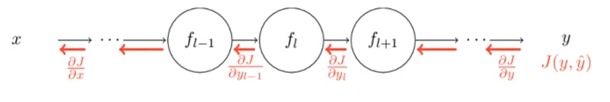

# Gradient Estimation
## Types

|                        |                                                                                                                                                                                                                             | Error           | Disadvantage                                              | Accurate Estimate | Low Computational-Cost | Easy to write |
| ---------------------- | --------------------------------------------------------------------------------------------------------------------------------------------------------------------------------------------------------------------------- | --------------- | --------------------------------------------------------- | ----------------- | ---------------------- | ------------- |
| Numerical              | $\lim \limits_{\epsilon \to 0} \dfrac{f(x + \epsilon) - f(x)}{\epsilon}$                                                                                                                                                    | $O(\epsilon)$   | Less accurate                                             | ❌                 | ❌                      | ✅             |
| Numerical Type 2  | $\lim \limits_{\epsilon \to 0} \dfrac{f(x + \epsilon) - f(x-\epsilon)}{2\epsilon}$                                                                                                                                          | $O(\epsilon^2)$ | Numerical error                                           | ❌                 | ❌                      | ✅             |
| Manual Analytic        | Derive gradient by sum, product, chain rules                                                                                                                                                                                |                 | Tedious                                                   | ✅                 | ❌                      | ❌             |
| Backpropagation        | Run backward operations the same forward graph                                                                                                                                                                              |                 |                                                           | ✅                 | ✅                      |               |
| Forward mode automatic | Output: Computational graph   Define $\dot v_i = \dfrac{\partial v_i}{\partial x_j}$ where $v_i$ is an intermediate result                                                                              |                 | $n$ forward passes required to get gradient of each input | ✅                 | ❌                      |               |
| Reverse mode automatic | Output: Computational graph  Define adjoint $\bar v_i = \dfrac{\partial y}{\partial v_i}$ where $v_i$ is an  intermediate result $\overline{v_{k \to i}} = \bar v_i \dfrac{\partial v_i}{\partial v_k}$ |                 |                                                           |                   |                        |               |

### Numerical gradient checking
Always use analytic gradient, but check implementation with numeric gradient

$$
\Delta^T \nabla_x f(x) = \dfrac{f(x + \epsilon \delta) - f(x - \epsilon \delta)}{2 \epsilon} + O(\epsilon^2)
$$

Pick $\delta$ from unit ball

## Backpropagation

### Steps

1. Forward pass
	1. Compute result of operations
	2. Save intermediates required for gradient computation
2. Calculate loss
3. Backward pass
	1. Compute gradient of loss function wrt inputs, using chain rule recursively

### IDK

- Gradients accumulate at branches
	- Gradients are accumulated as the same node may be referenced multiple times in the forward pass
- Clear gradients before backward pass
- Sum and broadcasting are duals of each other in terms of forward and backward pass
- IDK
	- add/sum: gradient distributor
	- max: gradient router
		- very rare for multiple values to be max
	- mul: gradient swapper

### IDK

Basically just chain rule + intelligent caching of intermediate results

Computationally-cheap, but large storage required for caching intermediate results

Each layer needs to be able to perform vector Jacobian product: multiply the “incoming backward gradient” by its derivatives

$$
\begin{aligned}
\dfrac{\partial J}{\partial \theta_l}
&=
\dfrac{\partial J}{\partial y_L}
\left(
\prod_{i=l}^L
\dfrac{\partial y_i}{\partial y_{i-1}}
\right)
\dfrac{\partial y_l}{\partial \theta_l}
\end{aligned}
$$

