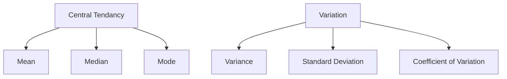

# Why Python?

- Open source, poweful, free
- Good for datascraping
- has a lot of libraries

# Intro

I already know the basics of Pandas, so I haven’t explained here.

# Variable Types

|           | Qualitative                                                  | Quantitative                                |
| --------- | ------------------------------------------------------------ | ------------------------------------------- |
| Data Type | Categorical                                                  | Numerical                                   |
| Example   | Gender - M, F<br />Country<br />Sport - Football, Basketball<br />League - NFL, NBA | Number of goals, Points, Age, Salary        |
|           |                                                              | Can be discrete/continuous random variables |

## Convert categorical to dummy variable

One-Hot Encoding

```python
dummy = (
  pd
  .get_dummies(
		df,
  	columns = ['WL']
	)
  .rename(columns={
    "WL_W": "Win"
  })
)

df = (
  df
  .concat(
    [df, dummy['Win']],
    axis = 1
  )
)
```

# Summary Statistics



## Coefficient of variation

- $CV = \frac{\sigma}{\mu}$
- $0 \le CV \le 1$
- useful for comparing variations of different measurement scale

# Correlation Analyses

Helps understand relationship between 2 variables

Correlation $\ne$ causal relationship.

## Covariance

Measure of the joint variability of 2 random variables.
$$
\sigma_{xy} =
\text{cov}(x, y) =
E\Bigg[
	\Big( x-E(x) \Big)
	\Big( y-E(y) \Big)
\Bigg]
$$
The sign of the covariance shows the tendency of the linear relationship between the variables. We do not analyze the magnitude of covariance, as it depends on the unit of measurement.

## Correlation coefficient

Summarizes the relationship between 2 variables. But doesn’t show the exact value change.
$$
r = \frac{
\sigma_{x y}
}{
	\sigma_x \sigma_y
} \\

-1 \le r \le 1
$$

| $\sigma_{xy}$ or $r$ | Conclusion                                                   |
| -------------------- | ------------------------------------------------------------ |
| 0                    | linear-relationship non-existent<br />some other relationship may/may not exist |
| >0                   | $x \propto y$                                                |
| <0                   | $x \propto \frac{1}{y}$                                      |

# Notebooks

<iframe src="nb/02.01.html" />

<iframe src="nb/02.02.html" />

<iframe src="nb/02.03.html" />