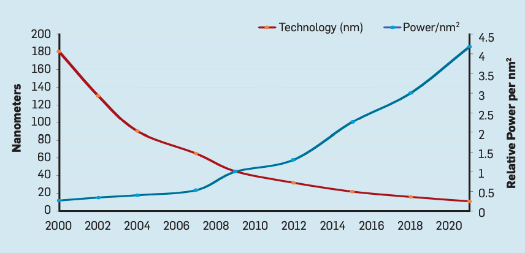

# Introduction

Hardware and systems are essential for the progress of deep learning.

## Importance of Optimization

### Hardware

No more “free lunch” from material science improvements

|                 | Comment                                                      |                                                              |
| --------------- | ------------------------------------------------------------ | ------------------------------------------------------------ |
| Moore’s law     | Slowing down In 1970-2010, we were able to put more transistors on a chip and get exponentially more performance; but now this is ending |  |
| Dennard scaling | essential stopped                                            |  |

Costly for companies to use cloud-based systems; would prefer edge-computing to reduce their energy consumption

Can’t rely on material technology for performance: After a point in shrinking size of transistors to fit more on a single chip, side-effects (such as electrons shoot in unwanted directions) cause higher power usage. Hence, domain-specific H/W architectures (GPUs, TPUs) are important

### Model

DNN Compression reduces the FLOPS, Model size

### Software

Domain-specific compilation

### Systems

