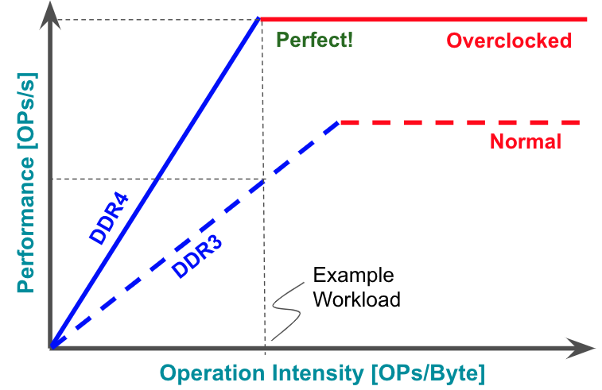
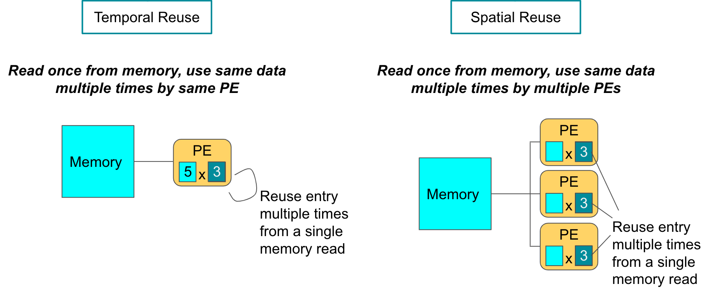

# Efficiency

All elements on a single layer of a network are parallelizable

## CPU Chip Area

## Hardware Types

| Purpose     |                                                              |                                |
| ----------- | ------------------------------------------------------------ | ------------------------------ |
| General     | CPU (Central Processing Unit)                                | Low Latency Control Flow  |
|             | GPU (Graphics Processing Unit)                               | High throughput Data flow |
|             | TPU (Tensor Processing Unit) NPU (Neural Processing Unit) |                                |
| Specialized | FPGA (Field Programmable Gate Assembly)                      | Re-Programmable Logic          |
|             | ASIC (Application Specific Integrated Circuit)               | Fixed logic                    |

## Performance Metrics

|          | Metric                |                                                  |              | Common Units | Affected by Hardware | Affected by DNN |
| -------- | --------------------- | ------------------------------------------------ | ------------ | ------------ | -------------------- | --------------- |
| Compute  | FLOPs/s               | **F**loating-point **op**erations per **s**econd |              |              | ✅                    | ❌               |
|          | OPs/s                 | Non floating-point **op**erations per **s**econd |              |              | ✅                    | ❌               |
|          | MACs/s                | Multipy-Accumulate Ops/s                         | Half FLOPs/s |              | ✅                    | ✅               |
|          | Latency               | No of sec per operation                          |              | s            | ✅                    | ✅               |
|          | Throughput            | No of operations per second                      |              | Ops/s        | ✅                    | ✅               |
| Memory   | Capacity              |                                                  |              | GB           | ❌                    | ❌               |
|          | Bandwidth             |                                                  |              | GB/s         | ❌                    | ❌               |
| Workload | Operational intensity |                                                  |              | Op/B         | ❌                    | ✅               |
|          | HW Utilization        |                                                  |              |              | ✅                    | ✅               |

### OPs

$$
\begin{aligned}
&\text{OPs} \\
&= \text{Ops/sec} \\
&=
\underbrace{
\dfrac{1}{\text{Cycles/Op}}
\times
\text{Cycles/sec}
}_\text{for single PE}
\times
\text{No of PEs}
\end{aligned}
$$

PE = Processing Element

### Roofline Plot

Characterize performance of given hardware device across different workloads, to help identify if a workload is memory-bound or compute-bound

| Speed up      | Technique                                       |                                                              |
| ------------- | ----------------------------------------------- | ------------------------------------------------------------ |
| Memory-bound  | Algorithmic improvement (reduce precision) |  |
|               | Faster memory chip                              |  |
| Compute-Bound | Faster PE (Overclocking)                   |  |

### Operational Intensity

$$
\begin{aligned}
\text{Operational Intensity} &= \dfrac{\text{No of Ops}}{\text{Mem Footprint}} \\
\text{No of Ops} &= \text{Multiplications} + \text{Additions} \\
\text{Mem Footprint} &= \text{Size of parameters} + \text{Size of activations}
\end{aligned}
$$

Quantifies the ratio of computations to memory footprint of a DNN

The same DNN can have different operational intensity on different hardware, if each device supports different numerical precision (Size of data affects operational intensity)

### IDK

## Performance Bottlenecks

- Memory access efficiency
  - Uncoalesced reads
- Compute utilization
  - Overhead of control logic
- Complex DNN topologies
  - Control flow and data hazards may stall execution even if hardware is available

## Hardware Efficiency

### Energy breakdown

## Hardware Efficiency Approaches

| Approach                                                     | Technique                                          |                                                              |                                                              |
| ------------------------------------------------------------ | -------------------------------------------------- | ------------------------------------------------------------ | ------------------------------------------------------------ |
| Arithmetic                                                   | Specialized instructions                           | Amortize overhead Reduce overhead fraction  Perform complex/fused operations with the same data fetch SIMD  Matrix Multiple Unit  HFMA HDP4A HMMA |  |
|                                                              | Quantization                                       | Lower numerical precision                                    |  |
| Memory                                                       | Locality                                           | Move data to inexpensive on-chip memory                      |   |
|                                                              | Re-use                                             | Avoid expensive memory fetches  Temporal: Read once, use same data multiple times by same PE SIMD, SIMT  Spatial: Read once, use data multiple times by multiple PEs Dataflow processing  Weights stationary (CNNs) Input stationary (Fully-Connected Layers) Output stationary |    |
| Operations                                                   | Sparsity                                           | Skip ineffectual operations  Activation Sparsity (Sparse Activation Functions: ReLU) Weight Sparsity (Regularization/Pruning) Block Sparsity  Coarse-grained Fine-grained - Overhead |                                                              |
|                                                              | Interleaving                                       |                                                              |                                                              |
| Model storage                                                | CSC Representation (Compressed Sparse Column) |                                                              |                                                              |
| Model Optim: Change DNN arch (and hence workload) to better fit HW | Compression                                        |                                                              |                                                              |
|                                                              | Distillation                                       |                                                              |                                                              |
|                                                              | AutoML                                             |                                                              |                                                              |

Floating-point `add` is more expensive relative to `integer`, compared to multiplication , due to shifting operations

## Guidelines for DSAs

Domain-Specific Architectures

- Dedicated memory to minimize distance of data transfer
- Invest resources saved from dropping advanced micro-architectural optimizations into more arithmetic units/larger memories
- Use easiest form of parallelism that matches the domain
- Reduce data size and type to simplest needed for the domain
- Use domain-specific programming language to port code to DSA
