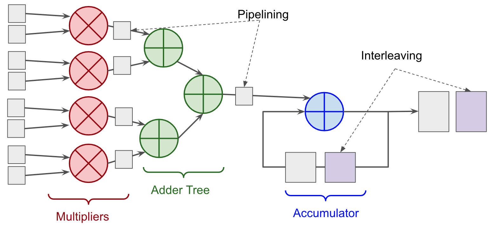
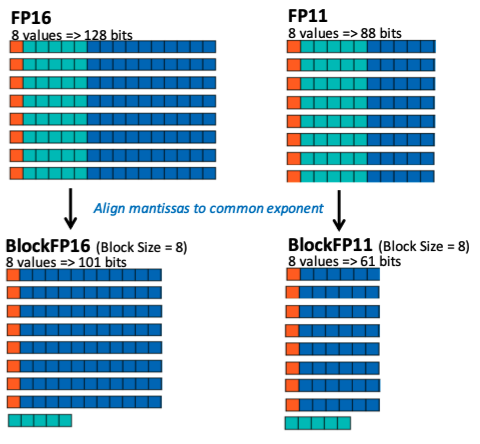

# Microarchitecture

 - Arithmetic unit design
 - Memory organization

## Processing Element

Should support dot product

- Multiplier with 2 elements
- Accumulator with 2 elements

Accumulator: Adder that keeps result in storage

Inference in INT8 precision => Multipliers are INT8, because adders and accumulators need wide range to perform accurate accumulation of many numbers

### Sequential

| Step |                                                              |
| ---- | ------------------------------------------------------------ |
| 1    |  |
| 2    |  |

### Paralllel/Vectorized

| Step |                                                              |
| ---- | ------------------------------------------------------------ |
| 1    |  |
| 2    |  |

### Pipelined

Initiation interval: How often we can start computation of a new element in a loop

Break down computation into multiple steps with intermediate registers

### Interleaved

## Precision

Block Floating Point

- One exponent for each exponent

## On-Chip Memory

Bit-width of address = no of data entries

Connecting RAM to MAC

|                                       |                                                              |                                                              |
| ------------------------------------- | ------------------------------------------------------------ | ------------------------------------------------------------ |
| Simple | |  |
| Use separate memories for 2 operands |                                                              |  |
| Increase no of read ports | Problems with adding many read ports to SRAM  1. Large size 2. Inc power consumption 3. Slow 4. In FPGA, you need to duplicate your memorie |  |
| Banking                               | Use multiple small memories |  |

## Computing Paradigms

| Processing                         |                                                              | Why?                                                         |
| ---------------------------------- | ------------------------------------------------------------ | ------------------------------------------------------------ |
| In-Sensor                          |  | Data movement from sensor to processor is costly  For eg, if you only need class label as output, why unnecessarily transfer 8MP image to processor |
| Near-Memory                        |  |                                                              |
| In-Memory (Analog Processing) |  | - Weights stored as charges - Activations delivered as analog voltages - By activating pre-charge circuity on the word & bit lines, we can perform multiplication between input activation voltage & stored weights |

