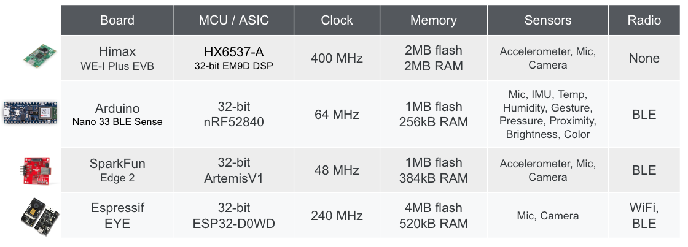
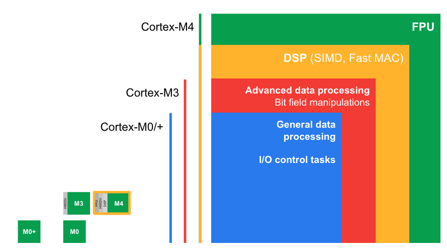
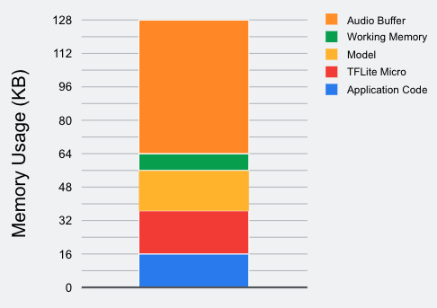

# TinyML

ML on embedded systems

Often overlooked

## Embedded System

Sensor, Processor, Output all in one small device

### Sensors

IMU: Inertial Measurement Unit

- Accelerometer
- Gyroscope
- Magnetometer

Challenges with IMU sensors

- Interpretability
- Sensor drift: Sensors need to recalibrated regularly

### Processor

MCU: MicroController Unit

Advantages

- Small size
- Low power
- Low cost

## Existing Systems

Nano 33 BLE Sense: AI-enabled ARM-based developmental microcontroller board

OV 7675 Camera module

TinyML Shield: Alternative to Breadboard

## ARM Cortex Processor Profiles

- ARM designs the processor core & ISA, but they don’t fabricate the chips
- The company (Qualcomm, Apple) bundles it with other design for system-on-chip
- The company (Google, Samsung, etc) places order to fabrication company (TSMC)

### Cortex-M ISA

## Embedded Systems OS

- RTOS
- Arm MBED OS

## IDK

## Memory Usage

- Need to be resource-aware
- Less compute
- Less memory
- Use quantization

## TFL Micro

Tensorflow Lite Micro

Built to fit ML on embedded systems

- Very small binary footprint
- No dynamic memory allocation
- No dependencies on complex parts of the standard C/C++ libraries
- No operating system dependencies, can run on bare metal
- Designed to be portable across a wide variety of systems

### `g_model`

- Array of bytes
  - Acts as equivalent of a file on disk
- Holds all info about
  - model
  - operators
  - connections
  - trained weights

## Conversion using TFL Micro

- ONIX
- Does not matter if you use PyTorch/Tensorflow

## Hardware & Software Constraints

- OS support
- Compute
- Memory

- Long-Running
  - Products are expected to run for months/years which pose challenges for memory allocation
  - Need to guarantee that memory allocation will not end up fragmented
    - Contiguous memory cannot be allocated even if there is enough memory overall

### How TFL micro solves these challenges

- Ask developers to supply a contiguous array of memory ton interpreter
  - The framework avoids any other memory allocations
- Framework guarantees that it won’t allocate from this “arena” after initialization, so long-running applications won’t fail due to to fragmentation
- Ensures
  - clear budget for the memory used by ML
  - framework has no dependency on OS facilities needed by `malloc` or `new`

Size of tensor arena

- Operator variables
- Interpreter state
- Operator I/O

Finding ideal size of arena

- Trial and error
- Create as large an arena as possible
- Use `arena_used_bytes()` to find actual size used
- Resize arena to this length and rebuild
- Best to do this for every deployment platform, since different op implementations may need varying scratch buffer sizes

Ops specification

## Workflow

## Example

