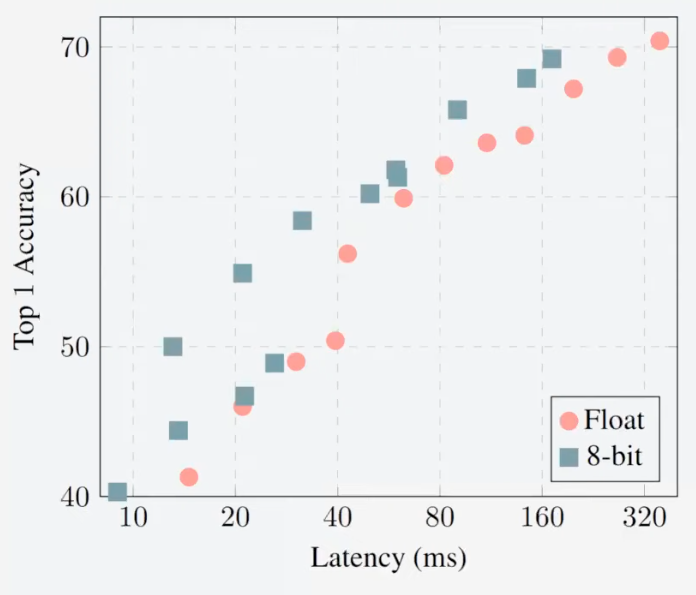
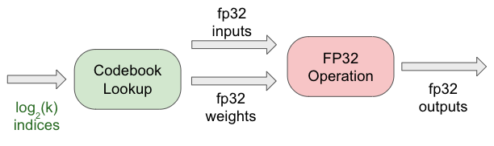
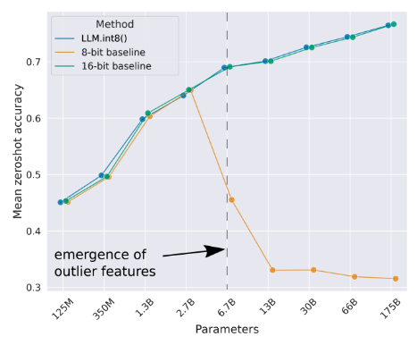
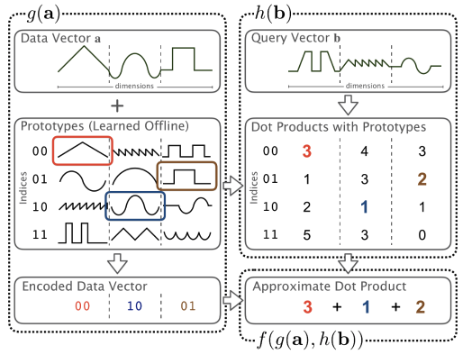

# Quantization

Mapping input values from a large set (often continuous) to output values in a (countable) smaller set (often discrete)

## Advantages

1. Faster operations
2. Lower memory usage
3. Lower power consumption
4. Lower latency
5. Smaller chip area (no need of FP hardware)

## Disadvantages
- Loss in accuracy
	- 
- Decompressing back to FP32
	- Loss in resolution of weights
	- Loss in accuracy of weights

## Types

- What to quantize
	- Weights & Biases
	- Activations
	- Inputs
- How
	- Linear/Non-linear
	- Symmetric/Assymmetric
	- Quantization-aware training
- Training/Inference
- Error
  Tradeoff between 2 types
  - Clipping
    - To reduce, you need to inc the range: dec $r_\min$ and inc $r_\max$
  - Rounding
    - To reduce, you need to reduce the range: inc $r_\min$ and dec $r_\max$
- Per-tensor, per-channel

## Rounding

|                                    | Speed   | Accuracy                                 |
| ---------------------------------- | ------- | ---------------------------------------- |
| Nearest                            |         | Good                                     |
| Ceil                               |         | Poor                                     |
| Floor                              | Fastest | Poor                                     |
| Stochastic (Randomly up/down) |         | Good (but large standard deviation) |
| Logarithmic                        |         |                                          |
| Adaptive rounding                  |         |                                          |

## Linear Quantization

$$
\begin{aligned}
q
&= \text{clip} \{
\
\text{round}(r/s) + z,
0,
2^b - 1
\
\} \\
s &= \dfrac{r_\max - r_\min}{2^b - 1}
\end{aligned}
$$

where

- $S =$ scale factor
- $z =$ zero point
  - If $z=0:$ symmetric quantization
  - If $z \ne 0:$ asymmetric quantization
- $r_\min$ and $r_\max$ is usually 10th and 90th percentile
- Clip function works on any values outside the range

Dequantization
$$
r = S(q - Z)
$$

$$
\begin{aligned}
\hat y
&= W X \\
& \approx S_W (W_q - Z_w) S_X (X_q -Z_x) \\
& \approx S_W W_q S_X Z_x & (\text{Symmetric}) \\
& \approx S_W W_q S_X (W_q X_q) \\ & \quad + \underbrace{S_w Z_w S_x Z_x + S_x Z_x S_w W_q}_{\text{precomputed offline } \& \\ \text{ folded into bias addition}}
\\ & \qquad  +
\underbrace{S_w Z_w S_x X_q}_\text{Online overhead} & \text{(Assymmetric)}
\end{aligned}
$$

- $W_q =$ constant during inference
- $X_q =$ new data

Online overhead is roughly equivalent to cost of adding 1 channel

- for multiple channels, it is insignificant overhead
- for single channels, it is significant overhead

Solution

- Use symmetric quantization for weights
- Use asymmetric quantization for activations

## Scale Value

|                     | Per-Tensor                                        | Per-Channel                                  |
| ------------------- | ------------------------------------------------- | -------------------------------------------- |
| Meaning             | Single scale/zero for entire tensor               | Single scale/zero for each channel in tensor |
| Accuracy            | Poor (as channels can have different ranges) | Good                                         |
| Support in hardware | Good                                              | Decent?                                      |

## Types

### Post Training

- Training –> Quantization
- Weights
  - Frozen & do not change
  - Can precompute scale & zero point
- Activations
  - scale & zero-points can be calibrated using a mini batch of data
- Inputs also can be quantized to enforce int x int operations

How to find scale and zero-point

- Run ‘representative’ mini-batches of data through DNN & capture $r_\max$ and $r_\min$

### Quantization-Aware Training

Emulate inference-time quantization during training to improve model robustness, and then use Post Training Quantization

“Fake quantization” nodes

- Input: float
- Output: float
- Operation:
  - Quantize
  - Dequantize
- Result
  - Floats that are clip and rounded like ints

## Non-Linear Quantization

K-means clustering

- Represent each group of numbers by a single “centroid”
- Choose how many clusters you want
- For $k$ Clusters, you need $\log_2 k$ bits to represent centroids

De-quantization function: Lookup table

| Cluster Index | Centroid Value |
| ------------- | -------------- |
| 0             | 0.153          |
| 1             | 0.223          |
| …             | …              |

Advantages

- No effect on operation itself - still full precision
- Storage footprint reduced drastically
- Accuracy [typically] well preserved

Disadvantages

- Only applicable to weights

Outliers in LLM quantization

### Product Quantization

Quantize group of numbers into a ‘prototype’

Steps

1. Prototype learning
   - In an initial, offline training phase, cluster the rows of $A$ (or training set $\tilde A$) using $k$ means to create prototypes
   - A separate $k$ means is run in each of the $C$ disjoint subspaces to produce $C$ sets of $k$ prototypes
2. Encoding function
   - Determine the most similar prototype to $a$ in each subspace
   - Store these assignments as integer indices using $C \log_2 (k)$ bits
3. Table construction
   - Precompute the dot products between $b$ and each prototype in each subspace
   - Store these partial dot products in $C$ lookup tables of size $k$
4. Aggregation
   - Use the indices and tables to lookup the estimated partial $a^T b$ in each subspace
   - Sum the results across all $C$ subspaces

