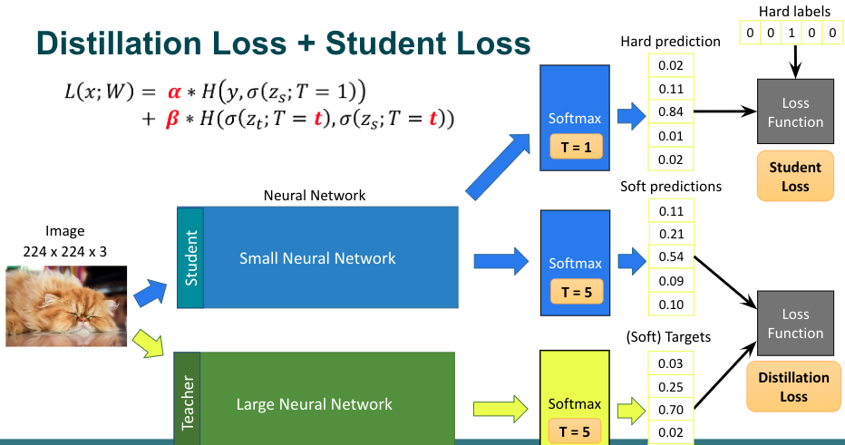

# Knowledge Distillation

Distill “knowledge” from large ANN to small ANN

- Larger DNNs are easier to train
- Smaller DNNs are easier to deploy

Targets

- Hard targets: No info about wrong classes
- Soft targets: Have info about wrong classes
  - Get using expert annotation
  - From a trained NN

- Training
  - Use softmax with temperature, usually $T=5$ 
  - Loss function: Distillation loss + Student loss
- Inference
  - T=1

Teacher target can be from an ensemble of

- multiple initializations
- multiple teacher architectures
- Specialists & generalists

## Distillation Types

| Type                          |                                          |                                                              |
| ----------------------------- | ---------------------------------------- | ------------------------------------------------------------ |
| Offline                       | Pre-trained teacher network              |  |
| Collaborative/mutual learning | Teacher & student trained simultaneously |  |
| Self-distillation             | Eg: Progressive hierarchical inference   |  |

## Distillation Algorithms

|                 |                                                              |      |
| --------------- | ------------------------------------------------------------ | ---- |
| Adversarial     | Teacher also acts as discriminator in GAN to supplement training data to “teach” true data distribution |      |
| Multi-Teacher   |                                                              |      |
| Cross-Modal     | Teacher trained on RGB distills info to student learning on heat maps. Unlabeled image pairs needed |      |
| Graph-Based     |                                                              |      |
| Attention-Based |                                                              |      |
| Data-Free       |                                                              |      |
| Quantized       | Use full-precision network to transfer knowledge to quantized network |      |
| Lifelong        |                                                              |      |
| NAS-Based       |                                                              |      |

## Knowledge Types

|                |                                                              |             |
| -------------- | ------------------------------------------------------------ | ----------- |
| Response-based | Output probs as soft targets                                 | Most common |
| Feature-based  | - Output/weights of 1 or more “hint layers” and minimize MSE loss  or  - Minimize difference in attention maps between student & teacher |             |
| Relation-based | Correlations between feature maps; eg: Gramian               |             |

