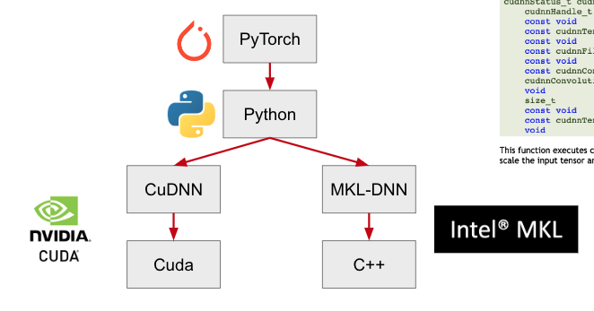
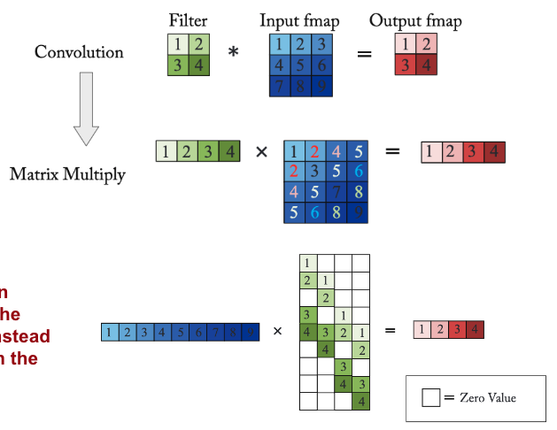

# Kernel Computation

### Machine Learning Software Stack

PyTorch is just a wrapper for writing CuDNN/MKL-DNN code

## Kernel Implementations

|                               |                                                              |                                                              | Limitation                                                   |
| ----------------------------- | ------------------------------------------------------------ | ------------------------------------------------------------ | ------------------------------------------------------------ |
| Im2col                        | Convert image windows to columns of matrix  or  Replicate weights instead and flatten image  Use to implement convolution as matrix multiplication |  | Data replication at algorithmic level may increase demand for external memory bandwidth |
| Strassen’s MM transform       | Reduce no of multiplications in MM through reorganizing operations and offline computation |                                                              | Transform limitation                                         |
| Winograd Conversion transform | Reduce no of multiplications in Conv through reorganizing operations and offline computation  Specific to - supported filter size - tile size of input |                                                              | Transform limitation                                         |
| Alpha Tensor                  |                                                              |                                                              |                                                              |
| FFT-Transform                 | Conv becomes multiplication Filter needs to zero-pad to ensure same size as output  Only useful for filter size >= log of output size for effectiveness, else IFFT overhead exceeds the gain |                                                              | Transform limitation IFFT is costly overhead            |
| Log-domain multiplication     | $ab = 2^x 2^y = 2^{x+y} = 2^z$ Only convert magnitude of numbers Compute sign using small circuit $s_c = s_a \oplus s_b$ |                                                              | Finding log & exponents at high precision is expensive No straightforward add operation in log domain |

Transform limitation: Requires transform to be performed at high precision to avoid accuracy detoriation

## Low-Rank Approximation

|                                   |                                                       |
| --------------------------------- | ----------------------------------------------------- |
| SVD: Singular Value Decomposition | $M = U \Sigma V$ Speedup = $\dfrac{mn}{k (m+n)}$ |
| Tensor decomposition              | Tucker Decomposition Canonical Polyadic          |
