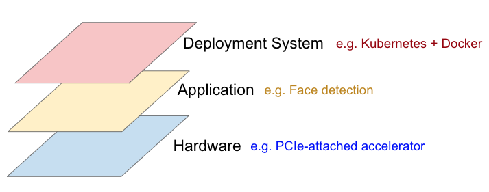
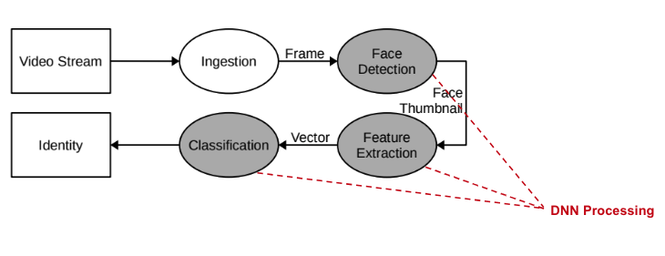
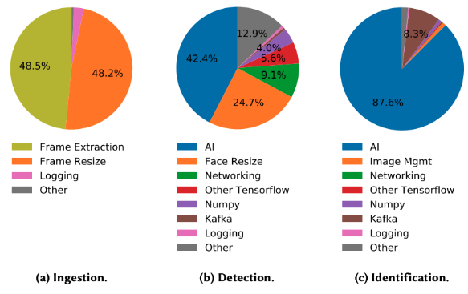
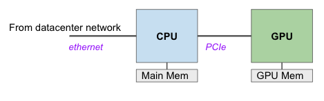
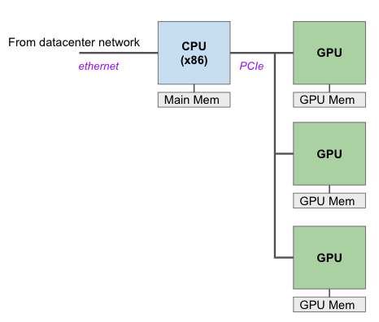
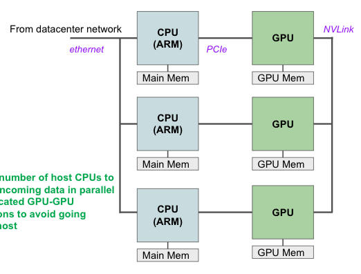
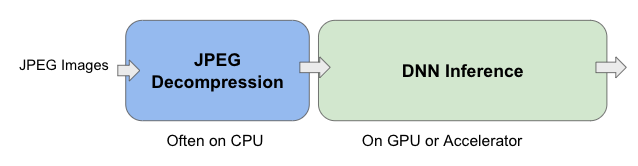
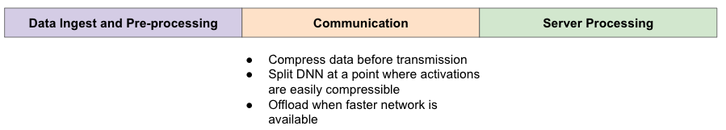

# Pre/Post Processing

Amdahl’s Law

## Layers of Overhead for DNN

At the application level, “overheads” can take more time than the DNN itself

Example: Face Recognition

## Host + Accelerator

- Model

  - Sits in CPU main memory

  - Transferred over PCIe to GPU mem

- Input data

  - Arrives over ethernet to CPU
  - Transferred over PCIe to CPU
  - Inference/Training
  - Result send back to CPU over PCIe

Latency impacted by data transfers

### Solution 1: Multiple GPU Cores

### Solution 2: Multiple CPU Cores

### Solution 3: Dedicated GPU-GPU connections

NVLink

### Dedicated FPGA for Packet Processing

## Algorithm Codesign Opportunities

## On-Device Deployment

CPU, GPU, NPU share the same memory on the SOC (System On Chip)

## Mobile-Cloud Inference

