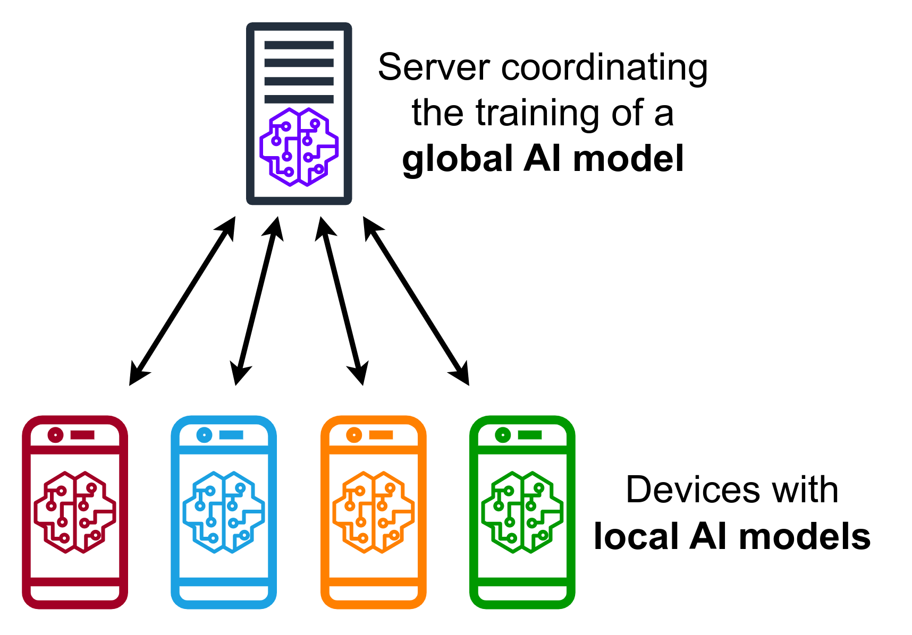
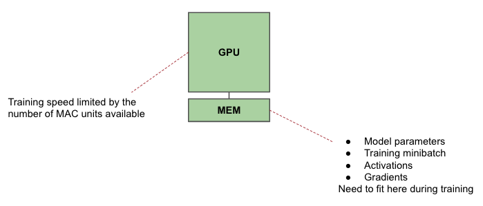
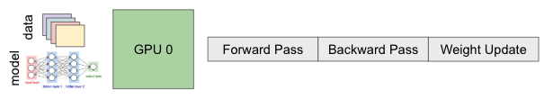
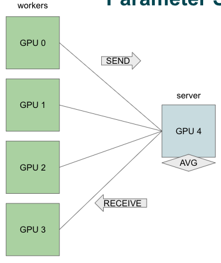
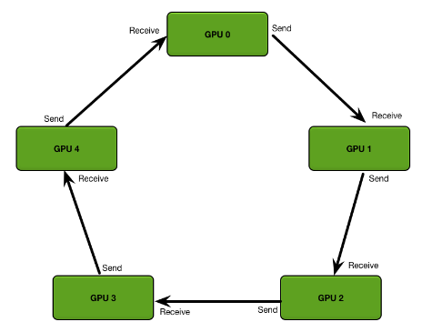

# Decentralized Learning

## Types

|                      | Distributed         | Offloading                                                   | Federated                                                    | Collaborative Learning                                       |
| -------------------- | ------------------- | ------------------------------------------------------------ | ------------------------------------------------------------ | ------------------------------------------------------------ |
|                      |                     | Send data to central server for training Device only used as sensor | - Data never stored in data center - Encrypt data and only decrypt after averaging 1000 updates | Each device maintains functional model                       |
| Model Location       | Servers             | Servers                                                      | Device Aggregated on Cloud                              | Device                                                       |
| Data Location        | Device Servers | Device Servers                                          | Device                                                       | Device                                                       |
| Design goals         | Speed               |                                                              | Privacy Online learning Security Scale        |                                                              |
| Device Types         | Same                |                                                              | Different                                                    |                                                              |
| Device Compute Power | High                |                                                              | Low                                                          |                                                              |
| Training             | Complex             |                                                              | Simple                                                       |                                                              |
|                      |                     |                                                              | Run training when phone charging Transmit updates when WiFi available |                                                              |
| Training examples    |                     |                                                              | Next-word prediction                                         |                                                              |
| Number of devices    | 10-1k               |                                                              | 100k+                                                        |                                                              |
| Network speed        | Fast                |                                                              | Slow                                                         |                                                              |
| Network reliability  | Reliable            |                                                              | Intermittent                                                 |                                                              |
| Data Distribution    | IID                 |                                                              | Non-IID (Each device has own data distribution) Not representative of training data |                                                              |
| Applications         |                     |                                                              | - Privacy   - Personal data from devices   - Health data from hospitals - Continuous data   - Smart home/city   - Autonomous vehicles |                                                              |
| Advantages           |                     | - Save device battery - No need to support on-device training - Better accuracy? |                                                              | - Most secure: Data never aggregated to a central server that could be compromised - Most scalable: No central server with bandwidth limitations |
| Limitations          |                     | - poor privacy - worse scalability                       | Not fully private: ==You can recover data from model parameters/gradient updates== Consumes higher total energy |                                                              |
| Challenges           |                     |                                                              | Poor network                                                 | All challenges of FL                                         |
| Example              |                     | Google Photos                                                |                                                              |                                                              |
|                      |                     |                                                              |  |                                                              |

### Terms

|                |                                                              |
| -------------- | ------------------------------------------------------------ |
| Straggler      | Device that doesn’t return data on time                      |
| Data Imbalance | One devices has 10k samples, while 10k devices have 1 sample each |

## Terms

### Compression

- Gradient
- Data

### Quantization

Quantization to gradients before transmission

Communication cost drops linearly with bit width

### Pruning

Prune gradients based magnitude and compress zeroes

## Distributed Training

- Model Parallelism: Fully-Connected layers
- Data Parallelism: Convolutional layers

### Single GPU-system

### Model Parallelism

All workers train on same batch

Workers communicate as frequently as network allows

Necessary for models that do not fit on a single GPU

No method to hide synchronization latency

- Have to wait for data to be sent from upstream model split
- Need to think about how pipelining would work for model-parallel training

Types

- Inter-layer
- Intra-layer

Limitations

- Overhead due to
  - moving data from one GPU to another via CPU
  - Synchronization
- Pipelining not easy

### Data Parallelism

Each worker trains the same convolutional layers on a different data batch

Workers communicate as frequently as network allows

|                           |                                                                  |                                                                                                     | Communication Overhead                | Advantage                                           | Limitation|
|---                        | ---                                                              | ---                                                                                                 | ---                                   | ---                                                 | ---|
|Single-GPU                 |  |                                                                                                     |                                       |                                                     | |
|Multiple GPU               |  | Average gradients across minibatch on all GPUs Over PCIe, ethernet, NVLink depending on system | $kn(n-1)$                             |                                                     | High communication overhead|
|Parameter Server           |  |                                                                                                     |                                       |                                                     | |
|Parallel Parameter Sharing |  |                                                                                                     | $k$ per worker $kn/s$ for server |                                                     | |
|Ring Allreduce             |  | Each GPU has different chunks of the mini-batch | $2k\dfrac{n-1}{n}$                    | Scalable Communication cost independent of $n$ | |

where
- $n=$ no of client GPUs
- $k =$ no of gradients
- $s=$ no of server GPUs

#### Ring-Allreduce

##### Step 1: Reduce-Scatter

##### Step 2: Allgather

### Weight Updates Types

|                      | Synchronous | Asynchronous                                                 |
| -------------------- | ----------- | ------------------------------------------------------------ |
| Working              |             | - Before forward pass, fetch latest parameters from server - Compute loss on each GPU using these latest parmeters - Gradients sent back to server to update model |
| Speed per epoch      | Slow        | Fast                                                         |
| Training convergence | Fast        | Slow                                                         |
| Accuracy             | Better      | Worse                                                        |
|                      |             |  |

### Pipeline Parallelism

## Federated Learning

“Federated”: Distributed but “report to” one central entity

Conventional learning

- Data collection
- Data Labeling (if supervised)
- Data cleaning
- Model training

But new data is generated very frequently

### Steps

1. Download model from cloud to devices
2. Personalization: Each device trains model on its own local data
3. Devices send their model updates back to server
4. Update global model
5. Repeat steps 1-4

Each iteration of this loop is called “round” of learning

### Algorithms

|             |                                                              | Handling Stragglers | Handling Data Imbalance                                      |                                                              |
| ----------- | ------------------------------------------------------------ | ------------------- | ------------------------------------------------------------ | ------------------------------------------------------------ |
| FedAvg      | The more data points a device has, the higher weight of device in updating global model | Drop                | Poor                                                         |  |
| FedProx     |                                                              | Use partial results | Discourage large weight updates through regularization $\lambda {\vert \vert w' - w \vert \vert}^2$ $w=$ Weight of single device |                                                              |
| q-fed-avg   |                                                              |                     | Discourage large weight updates for any single device        |                                                              |
| per-per-avg |                                                              |                     |                                                              |                                                              |

### Data Labelling

How to get labels

- Sometimes explicit labeling not required: Next-work prediction
- Need to incentivize users to label own data: Google Photos
- Use data for unsupervised learning

### Types

|            |                                                              |
| ---------- | ------------------------------------------------------------ |
| Horizontal |     |
| Vertical   |  |
| Transfer   |  |
