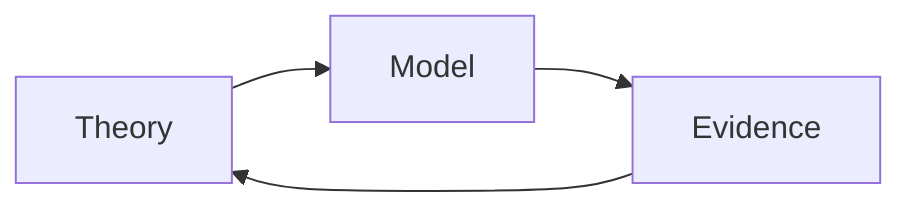

# Causal Learning

## Types

| Causal Effect Learning                                       | Causal Mechanism Learning                                   | Causal Inference Learning                                    |
| ------------------------------------------------------------ | ----------------------------------------------------------- | ------------------------------------------------------------ |
| Does $x$ have a causal effect on y? If yes, how large is the *effect* | If causal effect exists, what is the *mechanism* behind it? | Understand rational decisions that can be taken, built on causal mechanism learning and prior causal inference |
| - What - How much                                       | - Why - How                                             | - What can we do?                                            |
| - discovering patterns - making predictions             | - understanding                                             | - decison-making                                             |
| “Effects of causes”                                          | “Causes of effects”                                         |                                                              |

## Manipulation of $x$

Being able to manipulate $x$ to see its effect on $y$ is essential to understanding causality. If there is no way to manipulate $x$, then it is difficult to understand causality. 

Morever, according to the instructor, it is pointless to causal inference as if we cannot change it (even theoretically), then we can’t really make better decisions, you know? So many questions we analyze when doing research is basically useless.

For eg, analyzing “what is the causal effect of height on your income”. This is kinda pointless, because it’s not like we can change our height. Atleast “what is the causal effect of democracy on economic growth” is an acceptable analysic, because theoretically we can change the democracy level.

I have an example. Analysing the ‘causal effect of unemployment on economic growth’ is not very useful, because even though we can hypothetically manipulate unemployment indirectly, we can’t exactly control it directly.

### Type of Manipulation

The mechanism with which you ‘do’ $x$ will have different results. Hence, it is important to have a clear mechanism for ‘do’-ing $x$ before starting your analysis.

For eg, for the theoretical democracy example, are you going to forcefully implement a democracy? or will the citizens peacefully request?

## Experimentational Causal Analysis

once the experiment is over, the correlation is mathematically equal to the causation

#### Steps

1. manually set $x=1$
2. observe the value of $y$
3. repeat
4. take average value of y

#### Disadvantages

1. not always feasible (especially in economics), and it is not possible to perform the experiment
2. everyone is different, the experiment might not give an accurate inference

#### Example

RCT (Randomized Control Testing)

- test group is do(x=1) - taking drug
- control group is do(x=0) - not taking drug

## Causal Inference in AI

1. how should a robot acquire causual information through interaction with its environment
2. how should a robot receive causal information from humans

According to the lecturer, a lot of modern-day AI is **not** ‘intelligence’. Just because the algorithm can recognize images by trained data is not exactly ‘intelligence’.

> True hallmark of intelligence is the ability to make causal inference, from looking at statistical patterns.

## Causal Inference Models

There are 2 types of models

1. Rubin Model
2. Judea Pearl Model
   The instructor says that this is better, in his opinion

## Identifiability

$\theta(M)$ is if it can be uniquely determined based on observations of $v$.

I didn’t really understand this.

## IDK

Requires prior knowledge regarding the data-generating causal mechanism.

Such knowledge can only exist as a result of previously-observed information and conducted studies.

Hence, causal inference builds on past causal inference

## Source of Associations

Reasons why $x$ and $y$ can be associated

- $x$ causes $y$ directly
- $x$ causes $y$ indirectly
- $x$ and $y$ have common cause(s)
- Analysis is conditioned on their common descendant(s)

## Aggregate Reversal

Same as Simpson's Paradox?

Any statistical relationship between two variables may be reversed by including additional factors in the analysis

If you just look at statistical data, it might be misleading.

Once we divide the population into sub-population based on categories such as sex, then it becomes clearer. This is because why try understanding the underlying mechanism. This phenomenon is called as **aggregate reversal**.

## Time-Varying Treatments

- Time-varying confounding
- 