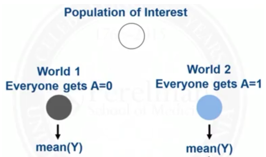
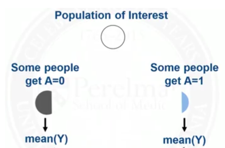
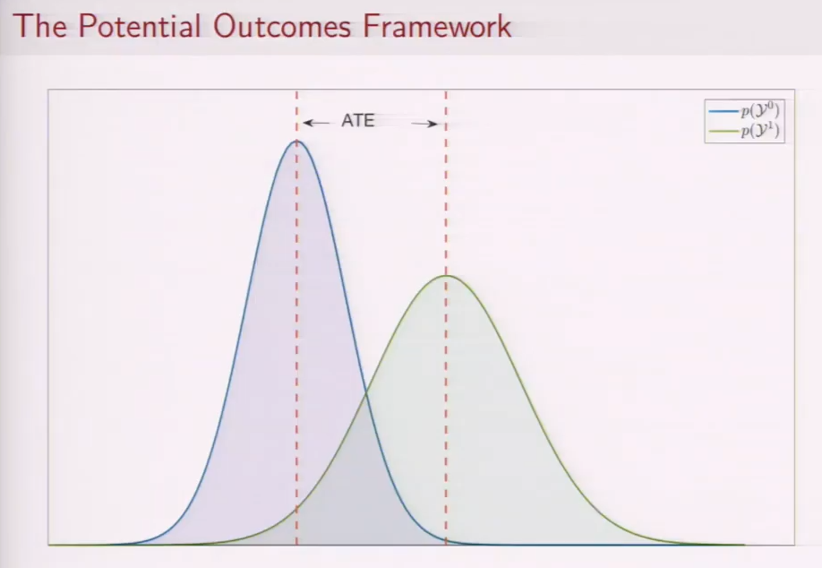

# Treatment Effect

## Effects

Let $\tau = y^1 - y^0$.

$\tau$ will have a distribution because it is a random variable ($\tau_1, \tau_2, \dots, \tau_i$)

| Term |                                                                                                                                                                                                                                                    | Meaning                                                                                          |
| ---- | -------------------------------------------------------------------------------------------------------------------------------------------------------------------------------------------------------------------------------------------------- | ------------------------------------------------------------------------------------------------ |
| ITE  | $\tau_i$                                                                                                                                                                                                                                           | Individual Treament Effect it is never observed, because we only observe $y_i^0$ or $y_i^1$ |
| ATE  | $E[\tau]$                                                                                                                                                                                                                                          | Average Treatment Effect                                                                         |
| CATE | $E[\tau \vert Z=z]$                                                                                                                                                                                                                                | Conditional ATE                                                                                  |
| LATE | $E[\tau \vert Z \in z]$                                                                                                                                                                                                                            | Local ATE                                                                                        |
| ATT  | $E[\tau \vert x = 1]$                                                                                                                                                                                                                              | Average Treatment effect on Treated                                                              |
| ATU  | $E[\tau \vert x = 0]$                                                                                                                                                                                                                              | Average Treatment effect on Untreated                                                            |
|      | $E(y^1)$                                                                                                                                                                                                                                           | Expectation of outcome 1 of the entire population (hypothetical, counterfactual)                 |
|      | $E(y^1 \vert x = 1)$                                                                                                                                                                                                                               | Expectation of outcome 1 of the **treated sample**                                               |
| ITT  | $E[y \vert \text{Treatment group}] - E[y \vert \text{Control group}]$  $\pi_C \text{CACE} + \pi_A \text{ATACE} + \pi_N \text{NTACE} + \pi_D \text{DACE}$ $=\pi_C \text{CACE} + \pi_A 0 + \pi_N 0 + 0 \text{DACE}$ $=\pi_C \text{CACE}$ | Intent to treat Effect of assignment to treatment group (not actual treatment)                |
| CACE | $E[\tau \vert \text{Complier}]$ $\dfrac{\text{ITT}}{\pi_C}$                                                                                                                                                                                     | Complier Average Causal Effect LATE for Compliers                                             |

$$
\begin{aligned}
\pi_C + \pi_A
&= p(T=1 \vert \text{Treatment group}) \\
\pi_A + \pi_D
&= p(T=1 \vert \text{Control group}) \\
\pi_N + \pi_D
&= p(T=0 \vert \text{Treatment group}) \\
\pi_N + \pi_C
&= p(T=0 \vert \text{Control group})
\end{aligned}
$$
Usually, we assume that $\pi_D=0$

Why are there 3 different average variables?
The people in each group is different. So, $\tau$ for the entire group, treated and untreated groups are different, due to ‘selection effect’. This is like people who go to uni vs don’t.
$$
\begin{aligned}
y &= y^0 \cdot I(x=0) \times y^1 \cdot I(x=1)\\
&\text{where $I$ means if}\\

\implies y &= f(x, y^0, y^1)
\end{aligned}
$$
### ATE

- ATE = difference of the mean = mean of the difference
$$
\begin{aligned}
\text{ATE}
=& E[y^1] - E[y^0] \\
=& E[y^1 - y^0]
\end{aligned}
$$
- ATE = weighted average of ATT and ATU
$$
\begin{aligned}
\text{ATE}
=& \text{ATT}  \cdot P(x=1) + \text{ATU} \cdot P(x=0) \\
=&
E(y^1 - y^0 | x = 1) \cdot P(x=1) \\
&+
E(y^1 - y^0 | x = 0) \cdot P(x=0) \\
=& \int E[y^1 - y^0 \vert s] \cdot p(s) \cdot ds
\end{aligned}
$$
This reminds me of the total probability like in Bayes’ conditional probability. But here, we are taking expectation $E$ (mean), because it’ll more accurate than taking one value from the PDF, as $\tau$ is a random variable
- ATE = Weighted average of CATE, given unconfoundedness: proving that treatment randomly assigned **within** each group $z_i$

$$
\widehat{\text{ATE}}
= \sum_i
\widehat{\text{CATE}}_i  \cdot P(Z=z_i)
$$
- ATE = ATT + Selection Bias
	- Randomization makes selection bias 0

ATE = Causal Effect
$$
\begin{aligned}
E(y \vert \text{do}(x), s)
&= E(y \vert x, s) \\
\implies \widehat{\text{ATE}}(x, s)
&=\dfrac{d}{dx} \hat E[y \vert \text{do}(x)] \\
&=\dfrac{d}{dx} \hat E[y \vert \text{do}(x), s] \\
&= \dfrac{d}{dx} E_s \Big[ \hat E[y \vert \text{do}(x), s] \Big] \\
&= \dfrac{d}{dx} E_s \Big[ \hat E[y \vert x, s] \Big] \\
&= E_s \left[ \dfrac{\partial}{\partial x} \hat E[y \vert x, s] \right]
\end{aligned}
$$

HTE = Heterogeneous Treatment Effect = ATE with high dimensional $s$ 

If $x$ is binary
$$
\begin{aligned}
x &\in \{ 0, 1 \} \\
\implies \text{ATE}(x, s)
&= E[ y \vert \text{do}(x=1) ] \ - \ E[ y \vert \text{do}(x=0) ] \\
&= E_s \Bigg[ E[y \vert x=1, s ] \  - \ E[ y \vert x=0, s] \Bigg] \\
\end{aligned}
$$

| Treatment                    | Model                                                   | $\widehat{\text{ATE}}(x)$ |
| ---------------------------- | ------------------------------------------------------- | ------------------------- |
| Binary                       | Linear $\hat \beta_0 + \hat \beta_1 x + \hat \beta_2 s$ | Constant $\hat \beta_1$   |
| Multi-Level/ Continuous | Non-linear                                              | Functional                |

### IDK

|                                                                              | $E[y^1 - y^0]$                                                   | $E[y \vert x=1] - E[y \vert x=0]$|
|---                                                                           | ---                                                              | ---|
|Compares what would happen if the __ sample receives treatment $x=1$ vs $x=0$ | same                                                             | 2 different|
|Provides | Average causal effect | Average difference in outcome b/w sub populations defined by treatment group |
|  |  |  |

### IDK

$$
\begin{aligned}

\text{ATT}
&= E(y^1 - y^0 | x = 1) \\
&= \underbrace{E(y^1 | x = 1)}_{E(y | x = 1)} -
\underbrace{E(y^0 | x = 1)}_{\text{Cannot be estimated}}
\\
\text{ATU}
&= E(y^1 - y^0 | x = 0) \\
&= \underbrace{E(y^1 | x = 0)}_{\text{Cannot be estimated}} -
\underbrace{E(y^0 | x = 0)}_{E(y | x = 0)}
\\
%{
%%\text{Similarly,} &\\
%%\text{ATE}
%%&= \underbrace{E(y^1 | x = 0)}_{\text{Cannot be estimated}} -
%%\underbrace{E(y^0 | x = 0)}_{E(y | x = 0)}
%}
\end{aligned}
$$

Solution: Randomized Treatment

## PDF Graph

$$
\begin{aligned}
\text{ATE}(x) &=
\int \tau(x, y) P(y) \ dy \\
&= \frac{
	dE[y| \text{ do}(x)]
}{dx} \\

T(x, y) &=
\frac{
	\partial P(y | \text{do}(x))
}{
	\partial x
} \\
\end{aligned}
$$

We could also interpret this entire distribution as a 3 variable joint PDF of the form $P(x, y^0, y^1)$

## IDK

| Treatment $x$ | Observed Outcome $y$ | Potential Outcome $y^0$ | Potential Outcome $y^1$ | ITE   |
| ------------------ | ------------------------- | ---------------------------- | ---------------------------- | ----- |
| 0                  | -0.34                     | -0.34                        | 3.46                         | 3.8   |
| 0                  | 1.67                      | 1.67                         | 4.03                         | 2.36  |
| 0                  | -0.77                     | -0.77                        | 3.08                         | 3.85  |
| 0                  | 2.64                      | 2.64                         | 0.90                         | -1.74 |
| 0                  | -0.02                     | -0.02                        | 0.96                         | 0.98  |
| 1                  | 2.31                      | -1.52                        | 2.31                         | 3.83  |
| 1                  | 2.79                      | 1.05                         | 2.79                         | 1.74  |
| 1                  | 1.53                      | -0.13                        | 1.53                         | 1.65  |
| 1                  | 3.61                      | -1.41                        | 3.61                         | 5.02  |
| 1                  | 3.36                      | 0.60                         | 3.36                         | 2.76  |

Here

- Modelling the ITE is correct
- Modelling $y$ vs $x$ is incorrect

## Probabilistic

Causal effect of a treatment is a probability distribution: it is not the same for every individual.

- Learning the individual-level is nearly impossible
- Learning the pdf of the effect is hard

Usually, the Average Treatment Effect is used

But better to compare the distributions of the treatment and control group

## Heterogeneous Treatment Effects

If we consider effect modifier $s$
$$
\begin{aligned}
\text{ATE}
&= \dfrac{\partial}{\partial x} E[ y \vert \text{do}(x), s] \\
&= \int \limits_s E[y^1 - y^0 \ | \ s] \cdot P(s) \cdot ds \\
\end{aligned}
$$

where $P(s)$ is the distribution of effect modifier.

Then, the result of the randomized test actually gives us $E[\tilde \tau]$, which may **not** be equal to $E[\tau]$

#### Example

For example, the yield depends on the season and the crop for which was grown previous year. Let’s take the example of a a randomized test of a fertilizer used  in the summer.

If no crop was grown the previous year, then we 

| Crop Grown in Field Last Year | Result of Randomized Test $E[\tilde \tau]$                   |
| ----------------------------- | ------------------------------------------------------------ |
| No crop                       | $E[\tau | \text{Summer, No crop}]$                           |
| Rice only                     | $E[\tau | \text{Summer, Rice}]$                              |
| 50% Barley, 50% Rice          | $0.5 \cdot E[\tau |\text{Summer, Barley}] + 0.5 \cdot E[\tau |\text{Summer, Rice}]$ |

