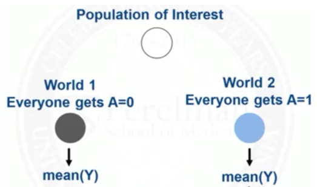
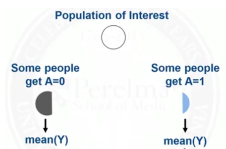
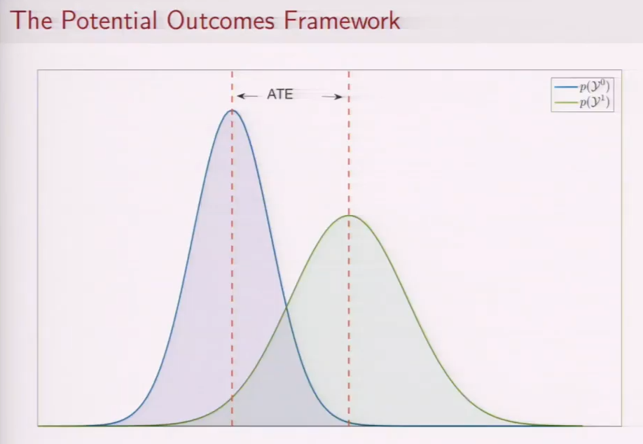
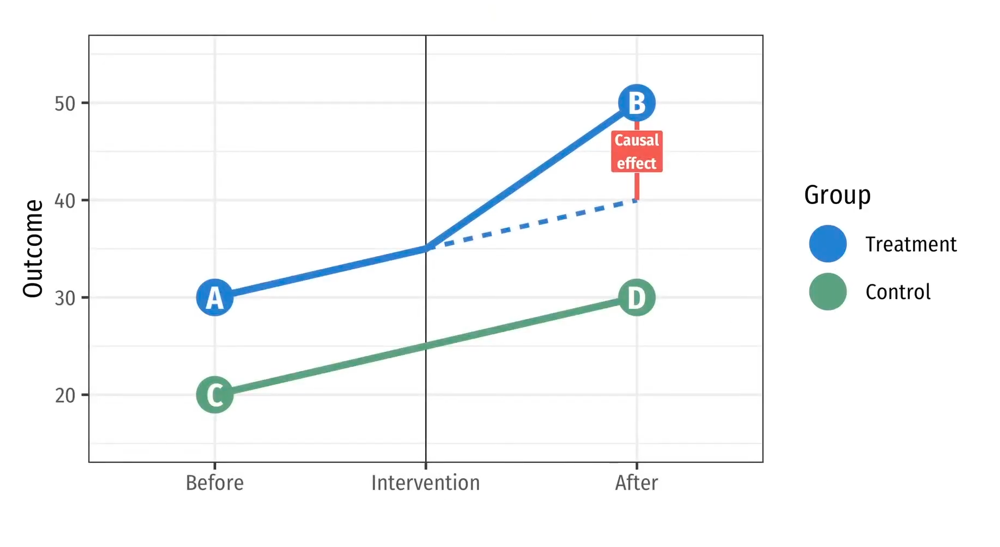
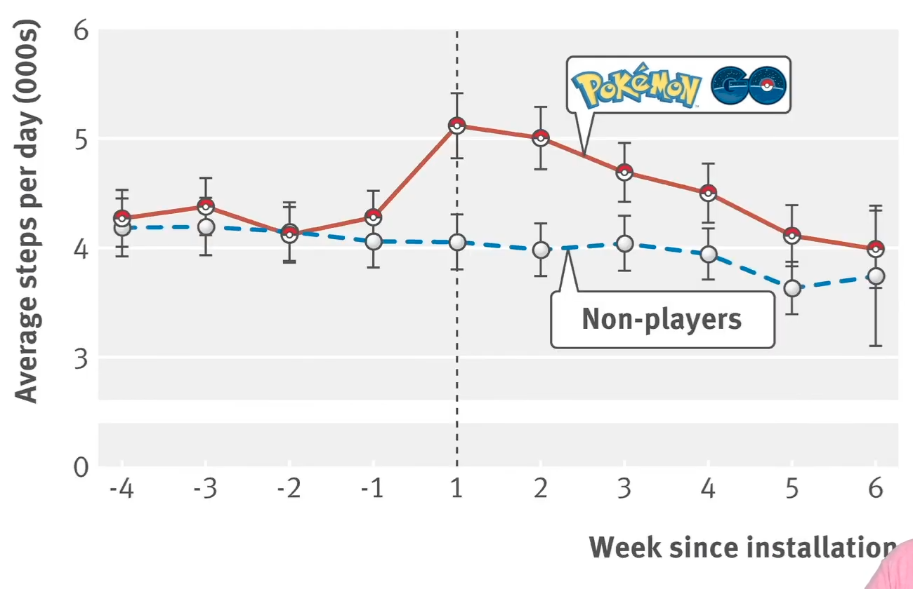
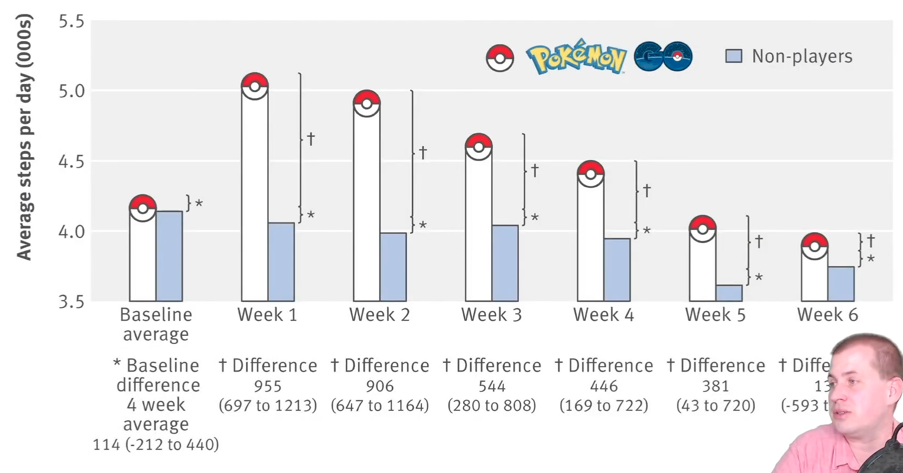

# Treatment Effect

## Effects

Let $\tau = y^1 - y^0$.

$\tau$ will have a distribution because it is a random variable ($\tau_1, \tau_2, \dots, \tau_i$)

| Term |                       | Meaning                                                                                          |
| ---- | --------------------- | ------------------------------------------------------------------------------------------------ |
| ITE  | $\tau_i$              | Individual Treament Effect it is never observed, because we only observe $y_i^0$ or $y_i^1$ |
| ATE  | $E[\tau]$             | Average Treatment Effect                                                                         |
| CATE | $E[\tau \vert Z=z]$   | Conditional Average Treatment Effect                                                             |
| ATT  | $E[\tau \vert x = 1]$ | Average Treatment effect on Treated                                                              |
| ATU  | $E[\tau \vert x = 0]$ | Average Treatment effect on Untreated                                                            |
|      | $E(y^1)$              | Expectation of outcome 1 of the entire population (hypothetical, counterfactual)                 |
|      | $E(y^1 \vert x = 1)$  | Expectation of outcome 1 of the **treated sample**                                               |

Why are there 3 different average variables?
The people in each group is different. So, $\tau$ for the entire group, treated and untreated groups are different, due to ‘selection effect’. This is like people who go to uni vs don’t.
$$
\begin{aligned}
y &= y^0 \cdot I(x=0) \times y^1 \cdot I(x=1)\\
&\text{where $I$ means if}\\

\implies y &= f(x, y^0, y^1)
\end{aligned}
$$
### ATE

- ATE = difference of the mean = mean of the difference
$$
\begin{aligned}
\text{ATE}
=& E[y^1] - E[y^0] \\
=& E[y^1 - y^0]
\end{aligned}
$$
- ATE = weighted average of ATT and ATU
$$
\begin{aligned}
\text{ATE}
=& \text{ATT}  \cdot P(x=1) + \text{ATU} \cdot P(x=0) \\
=&
E(y^1 - y^0 | x = 1) \cdot P(x=1) \\
&+
E(y^1 - y^0 | x = 0) \cdot P(x=0) \\
=& \int E[y^1 - y^0 \vert s] \cdot p(s) \cdot ds
\end{aligned}
$$
This reminds me of the total probability like in Bayes’ conditional probability. But here, we are taking expectation $E$ (mean), because it’ll more accurate than taking one value from the PDF, as $\tau$ is a random variable
- ATE = Weighted average of CATE, given unconfoundedness: proving that treatment randomly assigned **within** each group $z_i$

$$
\widehat{\text{ATE}}
= \sum_i
\widehat{\text{CATE}}_i  \cdot P(Z=z_i)
$$
- ATE = ATT + Selection Bias
	- Randomization makes selection bias 0

ATE = Causal Effect
$$
\begin{aligned}
E(y \vert \text{do}(x), s)
&= E(y \vert x, s) \\
\implies \widehat{\text{ATE}}(x, s)
&=\dfrac{d}{dx} \hat E[y \vert \text{do}(x)] \\
&=\dfrac{d}{dx} \hat E[y \vert \text{do}(x), s] \\
&= \dfrac{d}{dx} E_s \Big[ \hat E[y \vert \text{do}(x), s] \Big] \\
&= \dfrac{d}{dx} E_s \Big[ \hat E[y \vert x, s] \Big] \\
&= E_s \left[ \dfrac{\partial}{\partial x} \hat E[y \vert x, s] \right]
\end{aligned}
$$

HTE = Heterogeneous Treatment Effect = ATE with high dimensional $s$ 

If $x$ is binary
$$
\begin{aligned}
x &\in \{ 0, 1 \} \\
\implies \text{ATE}(x, s)
&= E[ y \vert \text{do}(x=1) ] \ - \ E[ y \vert \text{do}(x=0) ] \\
&= E_s \Bigg[ E[y \vert x=1, s ] \  - \ E[ y \vert x=0, s] \Bigg] \\
\end{aligned}
$$

| Treatment                    | Model                                                   | $\widehat{\text{ATE}}(x)$ |
| ---------------------------- | ------------------------------------------------------- | ------------------------- |
| Binary                       | Linear $\hat \beta_0 + \hat \beta_1 x + \hat \beta_2 s$ | Constant $\hat \beta_1$   |
| Multi-Level/ Continuous | Non-linear                                              | Functional                |

### IDK

|                                                                              | $E[y^1 - y^0]$                                                   | $E[y \vert x=1] - E[y \vert x=0]$|
|---                                                                           | ---                                                              | ---|
|Compares what would happen if the __ sample receives treatment $x=1$ vs $x=0$ | same                                                             | 2 different|
|Provides | Average causal effect | Average difference in outcome b/w sub populations defined by treatment group |
|  |  |  |

### IDK

$$
\begin{aligned}

\text{ATT}
&= E(y^1 - y^0 | x = 1) \\
&= \underbrace{E(y^1 | x = 1)}_{E(y | x = 1)} -
\underbrace{E(y^0 | x = 1)}_{\text{Cannot be estimated}}
\\
\text{ATU}
&= E(y^1 - y^0 | x = 0) \\
&= \underbrace{E(y^1 | x = 0)}_{\text{Cannot be estimated}} -
\underbrace{E(y^0 | x = 0)}_{E(y | x = 0)}
\\
%{
%%\text{Similarly,} &\\
%%\text{ATE}
%%&= \underbrace{E(y^1 | x = 0)}_{\text{Cannot be estimated}} -
%%\underbrace{E(y^0 | x = 0)}_{E(y | x = 0)}
%}
\end{aligned}
$$

Solution: Randomized Treatment

## PDF Graph

$$
\begin{aligned}
\text{ATE}(x) &=
\int \tau(x, y) P(y) \ dy \\
&= \frac{
	dE[y| \text{ do}(x)]
}{dx} \\

T(x, y) &=
\frac{
	\partial P(y | \text{do}(x))
}{
	\partial x
} \\
\end{aligned}
$$

We could also interpret this entire distribution as a 3 variable joint PDF of the form $P(x, y^0, y^1)$

## IDK

| Treatment $x$ | Observed Outcome $y$ | Potential Outcome $y^0$ | Potential Outcome $y^1$ | ITE   |
| ------------------ | ------------------------- | ---------------------------- | ---------------------------- | ----- |
| 0                  | -0.34                     | -0.34                        | 3.46                         | 3.8   |
| 0                  | 1.67                      | 1.67                         | 4.03                         | 2.36  |
| 0                  | -0.77                     | -0.77                        | 3.08                         | 3.85  |
| 0                  | 2.64                      | 2.64                         | 0.90                         | -1.74 |
| 0                  | -0.02                     | -0.02                        | 0.96                         | 0.98  |
| 1                  | 2.31                      | -1.52                        | 2.31                         | 3.83  |
| 1                  | 2.79                      | 1.05                         | 2.79                         | 1.74  |
| 1                  | 1.53                      | -0.13                        | 1.53                         | 1.65  |
| 1                  | 3.61                      | -1.41                        | 3.61                         | 5.02  |
| 1                  | 3.36                      | 0.60                         | 3.36                         | 2.76  |

Here

- Modelling the ITE is correct
- Modelling $y$ vs $x$ is incorrect

## Probabilistic

Causal effect of a treatment is a probability distribution: it is not the same for every individual.

- Learning the individual-level is nearly impossible
- Learning the pdf of the effect is hard

Usually, the Average Treatment Effect is used

But better to compare the distributions of the treatment and control group

## Heterogeneous Treatment Effects

If we consider effect modifier $s$
$$
\begin{aligned}
\text{ATE}
&= \dfrac{\partial}{\partial x} E[ y \vert \text{do}(x), s] \\
&= \int \limits_s E[y^1 - y^0 \ | \ s] \cdot P(s) \cdot ds \\
\end{aligned}
$$

where $P(s)$ is the distribution of effect modifier.

Then, the result of the randomized test actually gives us $E[\tilde \tau]$, which may **not** be equal to $E[\tau]$

#### Example

For example, the yield depends on the season and the crop for which was grown previous year. Let’s take the example of a a randomized test of a fertilizer used  in the summer.

If no crop was grown the previous year, then we 

| Crop Grown in Field Last Year | Result of Randomized Test $E[\tilde \tau]$                   |
| ----------------------------- | ------------------------------------------------------------ |
| No crop                       | $E[\tau | \text{Summer, No crop}]$                           |
| Rice only                     | $E[\tau | \text{Summer, Rice}]$                              |
| 50% Barley, 50% Rice          | $0.5 \cdot E[\tau |\text{Summer, Barley}] + 0.5 \cdot E[\tau |\text{Summer, Rice}]$ |

## Regression Discontinuity Design

Causal effect cannot be obtained directly due to lack of overlap for different $s$, hence we take the neighborhood

When a quasi-experiment partially determines the
treatment status, the “as if” randomness can be used as an instrument for identifying the causal effect of interest

$$
\begin{aligned}
\widehat {\text{LATE}}
&= \lim_{z \to {z_0}^+} E[ y \vert x=1, z ] \ - \lim_{z \to {z_0}^-} E[ y \vert x=0, z ] \\
&= \lim_{z \to {z_0}^+} E[ y \vert z ] \ - \lim_{z \to {z_0}^-} E[ y \vert z ]
\end{aligned}
$$

Eg: Evaluating the treatment effect of college on students in the neighborhood of college acceptance cutoff, where the selection of students is random

Limitations

- Poor generalizability: The validity of the results is usually restricted to this region
- Throws away the lot of information in the non-random parts
- Doesn’t allow building structural causal model

## Differences-in-Differences

$$
y_{it} = \beta_0 + \beta_1 T + \beta_3 t + \beta_4 (T \times t)
$$

$$
\begin{aligned}
E[\Delta D] &= 
\Big( E[y_{1 \ t}] - E[y_{0 \ t}] \Big) - \Big( E[y_{1 \ t_0}] - E[y_{0 \ t_0}] \Big) \\
&= \hat \beta_1(x=1) \\
&= E(y \vert x=1) - E(y \vert x=1) \\
\implies
\text{ATE}
&= \widehat {\text{ATE}}\\
&\approx 1 \cdot \text{ATT} + 0 \cdot \text{ATU} \\
&\approx \text{ATT} \\
&= E[\Delta D]
\end{aligned}
$$

Technically, $\hat \beta_1$ is an "estimate" of ATE via ATT, because the parallel trend assumption assumes what the treated series would be like in the absence of the treatment, not what the control series would be like given the treatment

