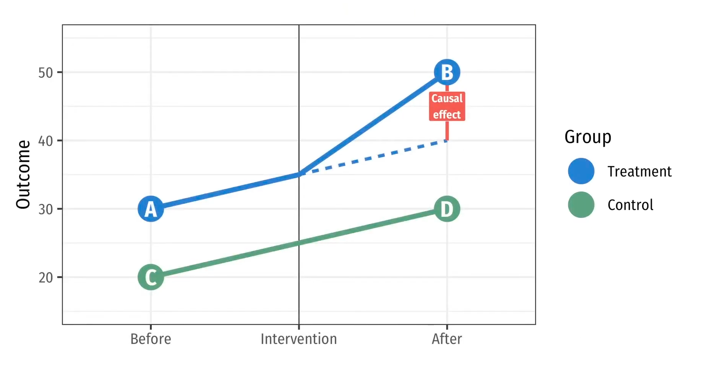
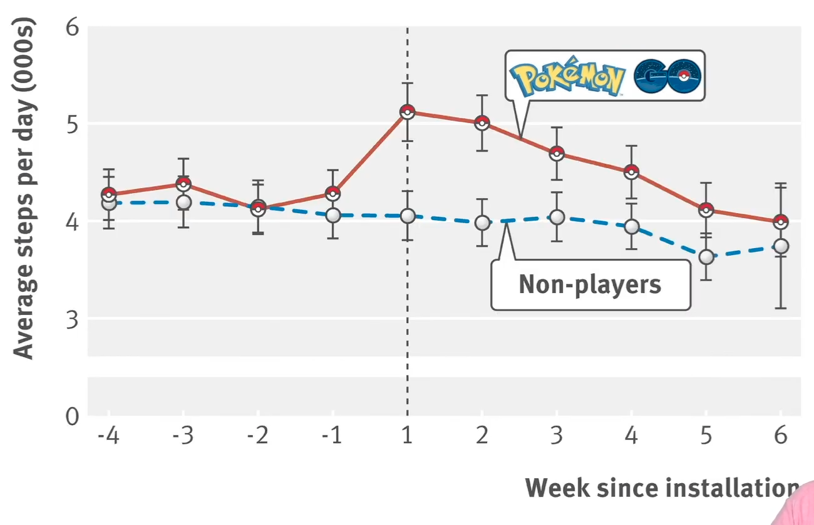
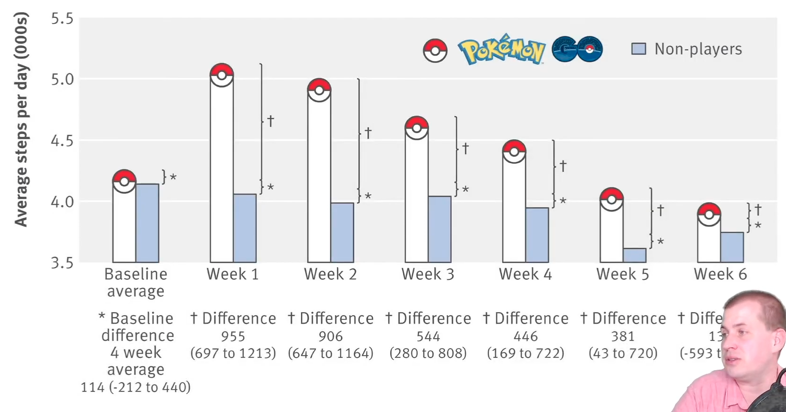
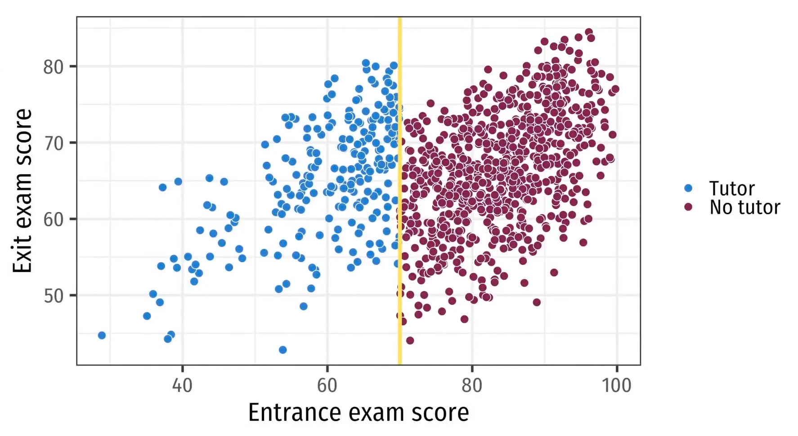
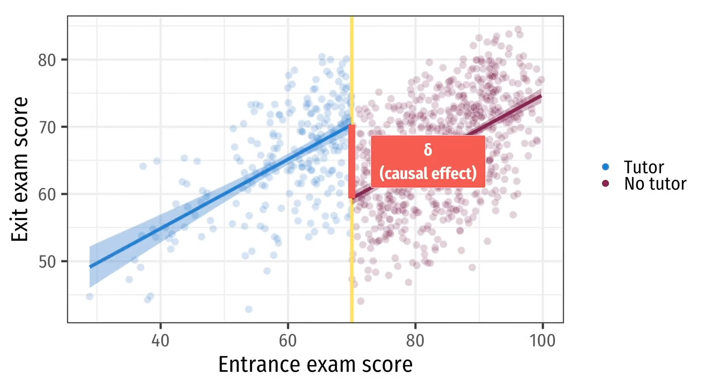
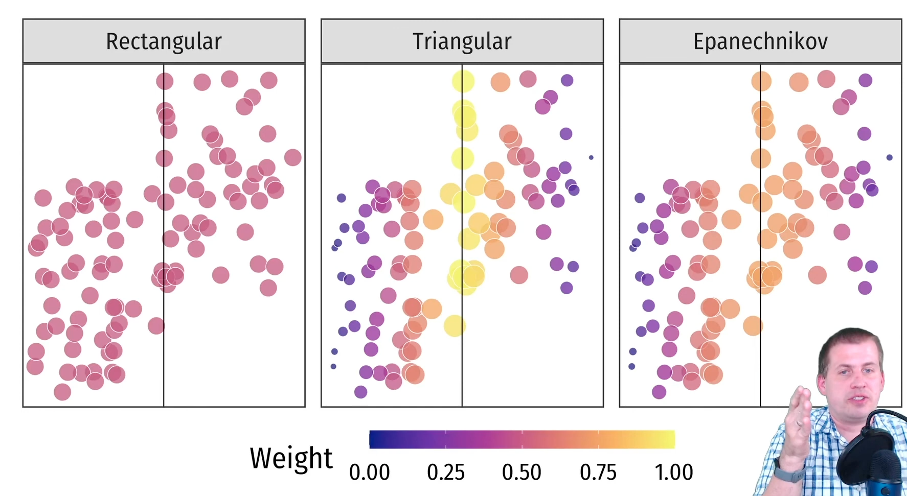

# Causal Effect Estimation

| Method             | Control Variables                  | Minimum Model                                                         |
| ------------------ | ---------------------------------- | --------------------------------------------------------------------- |
| Observational Data | Follow DAG                         |                                                                       |
| Matching/ IPW   | Matching Propensity scores      | `outcome ~ treatment, matched_data` `outcome ~ treatment, weights` |
| RCT                | Not necessary                      | `outcome ~ treatment`                                                 |
| Diff-in-Diff       | Not necessary, unless DAG requires | `outcome ~ before_after + T + T*before_after`                         |
| RDD                | Not necessary                      | `outcome ~ z + cutoff` Won't it be this `outcome ~ z + T + T*z`    |
| IV                 | Not necessary, unless DAG requires | `treatment_hat ~ instrument + w` `outcome ~ treatment_hat + w`     |

## RCT

CACE: Use 'assignment to treatment' as an instrument

## Differences-in-Differences

$$
y_{it} = \beta_0 + \beta_1 T + \beta_3 t + \beta_4 (T \times t)
$$
$$
\begin{aligned}
E[\Delta D] &= 
\Big( E[y_{1 \ t}] - E[y_{0 \ t}] \Big) - \Big( E[y_{1 \ t_0}] - E[y_{0 \ t_0}] \Big) \\
&= \hat \beta_1(x=1) \\
&= E(y \vert x=1) - E(y \vert x=1) \\
\implies
\text{ATE}
&= \widehat {\text{ATE}}\\
&\approx 1 \cdot \text{ATT} + 0 \cdot \text{ATU} \\
&\approx \text{ATT} \\
&= E[\Delta D]
\end{aligned}
$$

Technically, $\hat \beta_1$ is an "estimate" of ATE via ATT, because the parallel trend assumption assumes what the treated series would be like in the absence of the treatment, not what the control series would be like given the treatment

## Regression Discontinuity Design

Causal effect cannot be obtained directly due to lack of overlap for different $s$, hence we take the neighborhood

Eg: Evaluating the treatment effect of college on students in the neighborhood of college acceptance cutoff, where the selection of students is random

When a quasi-experiment partially determines the treatment status, the “as if” randomness can be used as an instrument for identifying the causal effect of interest

$$
\begin{aligned}
\widehat {\text{LATE}}
&= \lim_{z \to {z_0}^+} E[ y \vert x=1, z ] \ - \lim_{z \to {z_0}^-} E[ y \vert x=0, z ] \\
&= \lim_{z \to {z_0}^+} E[ y \vert z ] \ - \lim_{z \to {z_0}^-} E[ y \vert z ]
\end{aligned}
$$
LATE = Local ATE
- **Not** population-level treatment effect
- The treatment effect for the people in the neighborhood of the cutoff

Measuring the gap
- Center the threshold $z$ variable
- Add indicator & interaction terms
$$
y = \beta_0 + \beta_1 z_\text{cent} + \beta_2 T + \beta_3 T z_\text{cent}
$$

Hyperparameters
- Parametric/Non-Parametric models
- Bandwidth: Size of neighborhood; far-off observations do not matter very much
	- 
	- Check sensitivity of causal effect to bandwidth
		- double & halve the bandwidth
- Kernels: Sample importance wrt distance from cutoff
	- 
	- Check sensitivity of causal effect to kernels

When reporting causal effect, do all possible hyperparameters and then the report the distribution

### Fuzzy RDD

with instrumental variabes

Use an IV to estimate which side of the cutoff people should have been on
## Instrumental Variables

Isolate endogenous component of treatment using an "instrument"

$$
\begin{aligned}
y
&= f(T, w, u) \\
&= f(T_\text{exog}, T_\text{endo}, w, u) \\
\implies
y
&= f(T_\text{exog}, w, u') \\
T_\text{exog} &= g(I)
\end{aligned}
$$

|           | $\hat T$                                                               | $\hat y$                                                                | $\text{ATE}$                |
| --------- | ---------------------------------------------------------------------- | ----------------------------------------------------------------------- | --------------------------- |
| IV Method | $\alpha_0 + \textcolor{hotpink}{\alpha_1 I} + \sum_j \alpha_j w_j + v$ | $\beta_0 + \textcolor{hotpink}{\beta_1 I} + \sum_j \beta_j w_j + u$     | $\dfrac{\beta_1}{\alpha_1}$ |
| 2SLS      | $\alpha_0 + \textcolor{hotpink}{\alpha_1 I} + \sum_j \alpha_j w_j + v$ | $\beta_0 + \textcolor{orange}{\beta_1 \hat T} + \sum_j \beta_j w_j + u$ | $\beta_1$                   |

Note: any confounders $w$ must be the same in both the stages
