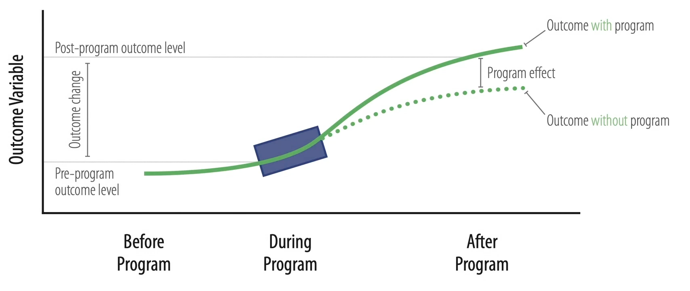
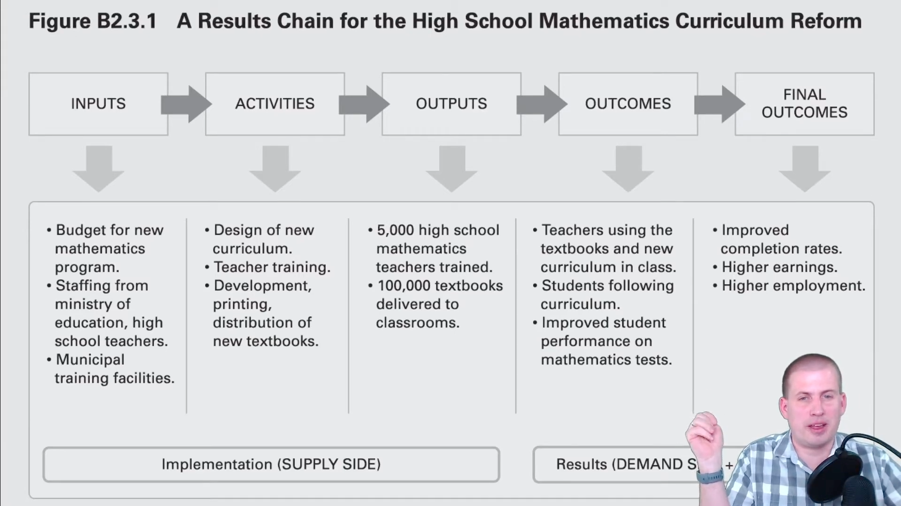
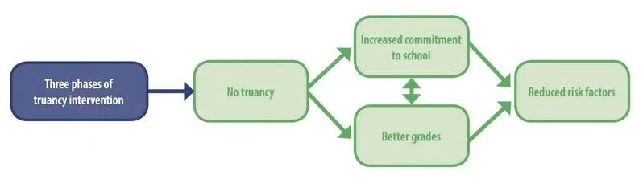

# Program Evaluation

Measuring the effect of a treatment
- Data Science
- Causal Inference

## Elements of Program

| Element                | Meaning                                                                         | Controllable | Measurable |                         |
| ---------------------- | ------------------------------------------------------------------------------- | ------------ | ---------- | ----------------------- |
| Inputs                 | Things that go into an activity                                                 | ✅            | ✅          | Money People Time |
| Activities (Causes) | Actions that convert inputs to outputs Things that the program does          | ✅            | ✅          |                         |
| Output                 | Tangible goods & services produced by activities You have control over these | ✅            | ✅          |                         |
| Outcome (Effects)   | What happens when the target population uses the outputs                     | ❌            | ❌          |                         |

## Program Theory

- How and why an intervention causes change
- Theory for the sequence of events that connects inputs to activities to outputs to outcomes

### Steps

|               |                                 |                               |
| ------------- | ------------------------------- | ----------------------------- |
| Results Chain |                                 |  |
| Impact Theory | How activities link to outcomes |         |
| Logic Model   |                                 |    |

## Types of Program Evaluation

|                                               | What                                                                                                                            | When   | How                                       |
| --------------------------------------------- | ------------------------------------------------------------------------------------------------------------------------------- | ------ | ----------------------------------------- |
| Formative Evaluation/ Needs Evaluation     | Is the program needed? What inputs & activities does it need? What outcomes does it need to cause?                        | Before | Interviews Surveys                     |
| Economic evaluation/ Cost-Benefit Analysis | Is the program worth it? Do the benefits of helping the target population outweigh the costs of running the program?         | Before | Net Present Value                         |
| Process evaluation/ Program monitoring     | Are inputs going to the right places? Are activities working correctly? Are activities producing right levels of outputs? | During | KPI Dashboards                            |
| Outcome Evaluation                            | Are activities and outputs leading to initial outcomes (short-term impact evaluation)                                        | During | Causal inference Surveys Interviews |
| Impact Evaluation                             | Does the program cause lasting change in the outcome                                                                            | After  | Causal inference                          |

## Types of Impact Evaluation

| Types                                                                                                           | Validity | Requires structural model | Example                   |
| --------------------------------------------------------------------------------------------------------------- | -------- | ------------------------- | ------------------------- |
| Evaluating the impacts of historical programs on outcomes in the same population/environment                    | Internal | ⚠️                        | Policy in same country    |
| Forecasting the impacts of programs implemented in one population/environment in other populations/environments | External | ✅                         | Policy in another country |
| Forecasting the impacts of programs never historically experienced.                                             | External | ✅                         | Effect of tax             |

For all three types of problems, if we want to evaluate welfare impact, we need a structural model.

## Ethics

- In order to evaluate programs, control groups are essential
	- Dilemma: People who could benefit from the program would not be assigned to it
	- "Groups should not be excluded from an intervention that is known to be beneficial, solely for the purpose of evaluation" ~ World Bank Impact Evaluation in Practice
- Follow IRB (Institutional Review Board) guidelines
	- Respect for people: Make sure participants give informed consent
	- Beneficence: Don't lie
		- Minimize potential harm
		- Maximize potential benefit
	- Justice: Benefits & burdens of research are equitably-shared by different groups
- Maintain privacy: Any published data should be de-identified